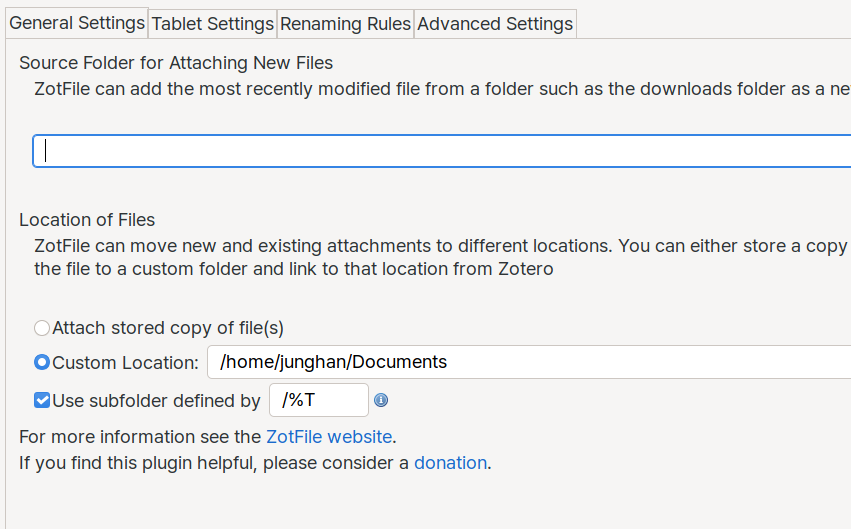

<!-- gid:20240705T144627 -->
[[TIP("이 노트에 대하여")]]
ZotFile을 이용해 문서와 슬라이드를 로컬 폴더에 저장하고 Zotero 인덱스와 연결하는 방식을 정리한다. 온라인 업로드 없이도 파일을 안정적으로 관리하면서 Emacs에서 다시 접근하기 쉽게 만드는 흐름이 중심이다.
[[/TIP]]

## §zotfile 플러그인

[2024-07-05 Fri 14:46]

[조테로: 플러그인 활용법](https://wikidocs.net/381110) 의 확장으로서 플러그인을 활용한다.

~/Documents 를 씽크씽으로 연동한다. 조테조가 로컬에 파일을 저장하고 인덱싱하도록 한다. 온라인으로 업로드는 하지 않는다.

여기 저장하고 인덱스만 연결해 놓으면 된다. 이맥스에서도 접근이 용이하다. 시스템을 옮기거나 다른 컴퓨터를 활용해도 동일한 연결을 지원한다.

-   파일을 다운로드 폴더에 저장한다. 이 파일을 조테로에 넣을 것이다.
-   조테로에 해당 목록에 다운로드 한 파일을 첨부한다.
-   파일은 지정한 위치에 복사될 것이다. 파일 이름도 자동으로 변경 된다.

이렇게 되면, 첨부파일을 온라인에 업로드 하지 않고 로컬에 안전하게 연결해 놓을 수 있다. 저장소 설정에서 첨부파일을 업로드 하지 않도록 설정하라. 300 메가바이트라 부족하다.

### ZotFile 일반 설정

로케이션 확인

리네이밍 등 설정도 원하는 대로. 일관성 있게. 유지.

```text

- custom location : /home/junghan/Documents
- use subfolder defined by : /%T

```



## 관련메타

-   [연결 고리 링크 방향](https://wikidocs.net/380533)
-   [정보](https://wikidocs.net/380994)
