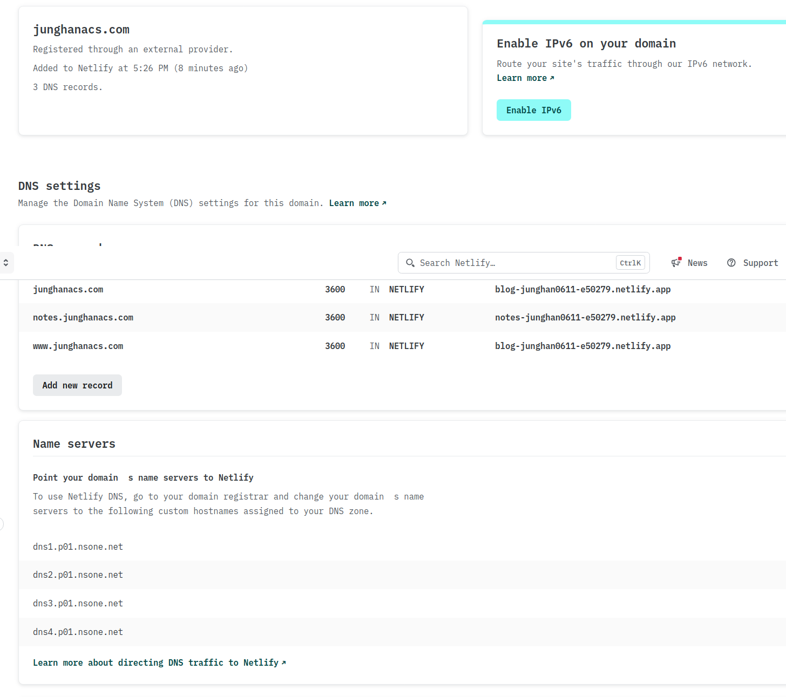
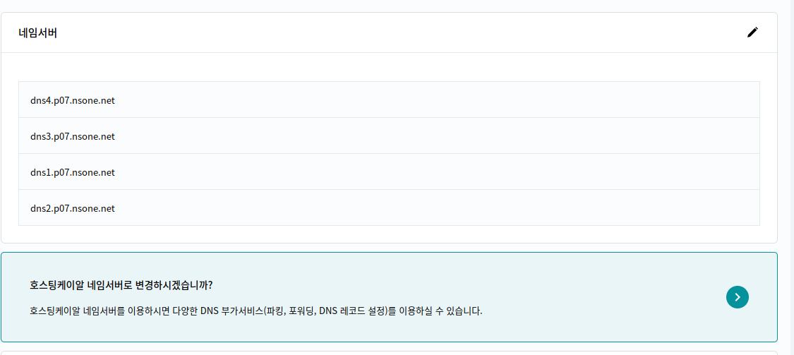
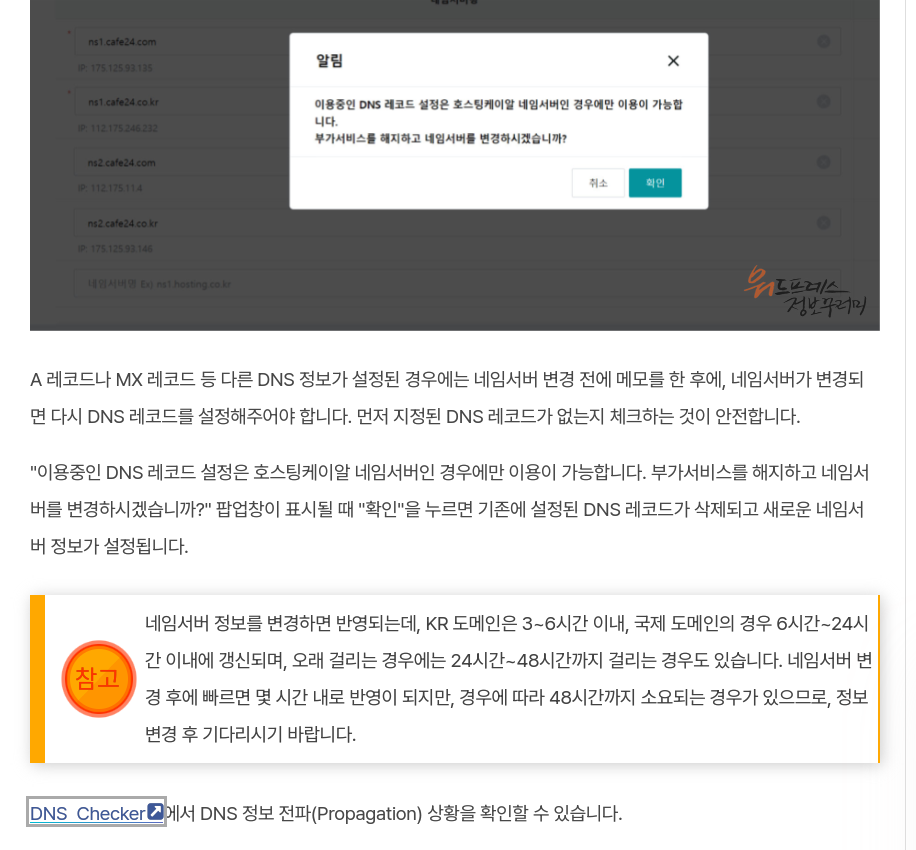
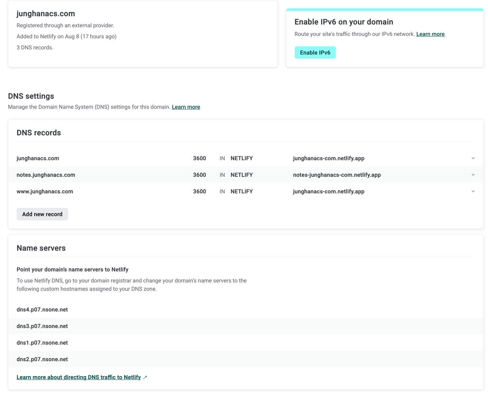

<!-- gid:20240814T152821 -->
[TOC]

[[TIP("이 노트에 대하여")]]
hosting.kr 도메인과 Netlify를 연결해 서브도메인을 운영하는 절차를 실제 주소와 함께 기록한다. 다시 설정해야 할 때 귀찮지 않도록 핵심 단계와 확인 지점을 남겨 둔 실전 노트다.
[[/TIP]]

## BIBLIOGRAPHY

  “Git Hosting.” n.d. Accessed July 2, 2024. [https://depp.brause.cc/](https://depp.brause.cc/).

## 관련노트

-   [notes/ 호스팅: DNS 레코드 - type cname value - 넷리파이 '2025-04-04 2025-04-04](https://wikidocs.net/381652)
-   [office/ 사내 네트워크 dns 설정 '2025-09-09]

## 히스토리

[2025-04-04 Fri 09:59]

-   <https://junghanacs.com/>
-   <https://notes.junghanacs.com/>

## 2024 뉴 도메인 연결 작업

### <span class="org-todo todo TODO">TODO</span> 도메인 / 서브도메인 연결

[2024-11-25 Mon 12:17]

이게 핵심이기도 하다.

다시 하려니까 귀찮네. 이거 참. 단계별로 본다면 먼저. 넷리파이에 둘다 배포 걸어라.

### github 연동 둘다 배포를 넷리파이로 바꿈.

[2024-11-25 Mon 12:46]

junghanacs.github.io 로 배포중인. 메인페이지를 넷리파이로 옮김. 동작함. 둘다 동작함.

### 넷리파이 도메인 설정

[2024-11-25 Mon 12:51]

```text
dns1.p06.nsone.net
dns2.p06.nsone.net
dns3.p06.nsone.net
dns4.p06.nsone.net
```

### 호스팅케이알 - 타사 서비스 사용 설정

[2024-11-25 Mon 12:57]

### 동작 확인 잘 된다.

[2024-11-25 Mon 12:59]

눈물 뚝뚝. 간단하다. 핵심을 정리해서 다시는 안보게 하자.

## <span class="org-todo done DONE">DONE</span> 2024 도메인 설정 관련 작업

[2024-08-14 Wed 17:42]

-   2024-04-29 도메인 재구매

[junghanacs/notes.junghanacs.com - github.com](https://github.com/junghanacs/notes.junghanacs.com)

도메인 연장하고 한참 내비 두다가 8월에 블로그 노트를 호스팅했다.

이 문서를 확인하면 될 것 같다. 보아하니 듀얼 호스팅하려면 작년에 했던 방법으로 해야 한다. 그렇다면, 먼저 둘다 설정하는데 무리가 없는지 보자. 그리고 노트는 비공개로 가져가려고 한다. 문제가 없는가? 예전에 했던 방식이다.

쿼츠는 좀 손을 봐야겠다. 최신 버전으로 올리려면 잠시만 홈페이지만 올리려는데? 아니다 둘다 확인해서 한번에 가야 한다.

서브 도메인만 알면 된다. 그러기 위해서는 일단 쿼츠로 페이지를 새로 만들어보라. 쿼츠 동작한다.

잠시만, 호스팅케이알로 연동하게 한다. 해당 템플릿이 넷리파이를 적용하는지 파악해봐라.

```text
Push your code to your Git repository (GitHub, GitLab, etc.)
Import the project to Netlify
If you are not using [hextra-starter-template][hextra-starter-template], configure the following manually:
Configure the Build command to
hugo --gc --minify
Specify the Publish directory to public
Add Environment variable HUGO_VERSION and set to 0.119.0
Deploy!
Check Hugo on Netlify for more details.
```

아. netlify.toml 파일에 설정이 되어 있어서 별도로 필요는 없다.

어떻게 테마를 업데이트 하는가? 필요 없다. go module 로 동작하니까 도메인 연동만 하면 된다.

-   호스팅케이알 네임서버 대신 넷리파이로 맞춘다. 그러면 서브 도메인도 한번에 된다.
-   [My Site - imfing.github.io](https://imfing.github.io/hextra-starter-template/) 참고

### 호스팅케이알

<https://app.hosting.kr/domains/portfolio/details/junghanacs.com/dns>

여기가서 봐라.

### 넷리파이 도메인 설정

별거 없다. 잘된다.



## <span class="org-todo done DONE">DONE</span> 2023 도메인 설정 관련 기록

[2023-07-27 Thu 09:30]

[{GitHub Blog} 깃허브 블로그 도메인 설정 (호스팅케이알) (2021) | :: BIN\_ ::](https://habijung.github.io/github%20blog/blog-custom-domain/)

junghanacs.com 등록 완료 14,960 원 1 년에 괜찮다. junghanacs.com 마음에 든다.

2023-08-09 현재 상황은 아래 방법대로 메인과 노트를 분리해서 운영한다. 넷플리파이가 쉽게 잘 동작하니 충분하다.

### <span class="org-todo done DONE">DONE</span> Github + Netlify + 호스팅케이알 도메인 호스팅

[2023-08-08 Tue 17:59]

먼저 호스팅케이알의 네임서버 기능을 사용하지 않는다. 왜 이런 선택을 했는가? 넷플리파이로 다 통합하기 위해서다. 서브도메인도 마찬가지고 한 번에 다 하려면 이게 편하다.

이 자료를 보고 참고했다. <https://heropy.blog/2018/01/10/netlify/>

#### 먼저 호스팅 케이알로 가서 설정한다

호스팅케이알 네임서버 대신 위에 넷플리파이를 사용한다. 이렇게 되면 레코드 설정 등을 호스팅케이알을 사용 못한다. 넷플리파이로 해야 한다.



<https://avada.tistory.com/2538>



#### 그리고 위의 문서대로 넷플리파이로 가서 정보를 추가한다.



3 HTTPS 관련 문서에 보면 인증서를 갱신하는 이야기가 나온다. 그렇게 하면 된다.

### <span class="org-todo done DONT">DONT</span> notes -- 호스팅케이알 DNS 서비스를 사용하는 경우

## <span class="org-hashtag">#관련링크</span>

[2024-11-25 Mon 19:46]

[Network Tools: DNS,IP,Email - mxtoolbox.com](https://mxtoolbox.com/SuperTool.aspx?action=a%3anotes.junghanacs.com&run=toolpage)

### Git hosting

(“Git Hosting” n.d.)
