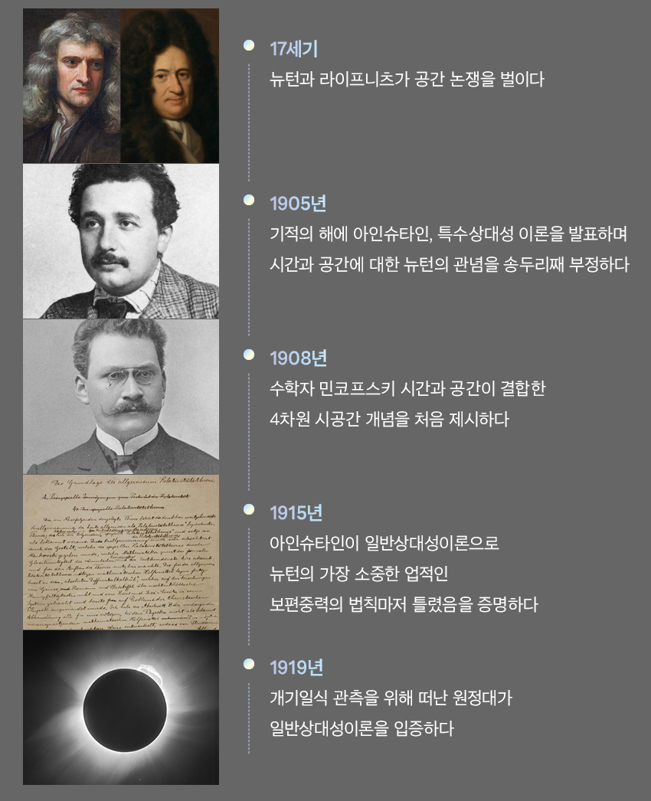

<!-- gid:20240908T161022 -->
<!-- provenance:source:start -->
[[TIP("원본·최신본")]]
이 페이지는 한국어 검색과 읽기를 위한 WikiDocs 미러입니다. [원본·최신본은 가든](https://notes.junghanacs.com/notes/20240908T161022/)에 있습니다. 최신 수정 내용·백링크·태그·히스토리·댓글·출처 정보는 원본 가든에서 확인하세요.

- 작성: `2024-09-08T16:10:00+09:00`
- 최근 수정: `2025-04-01T00:00:00+09:00`
[[/TIP]]
<!-- provenance:source:end -->

[TOC]

## 히스토리

-   [2025-06-01 Sun 15:39] 유튜브 링크 - ofm youtube enable
-   [2025-04-17 Thu 16:10] 정확하지 않은 정보가 많네.

## 내부링크 - TOC

-   [2025-06-11 Wed 12:03] 아래 문서 참고 - ', .  ' 불가!

-   쿼츠는 내부링크를 자동으로 생성한다. 형식은 헤딩에 있는 텍스트다. 자동생성을 고려하여 헤딩의 텍스트를 적어야 한다.
-   언더바, 쉼표, 점 안됨

-   [링크 조직모드: 하이퍼링크 커스텀링크 내부링크](https://wikidocs.net/381223)

### 링크 테스트

#### 테스트 '살부' 작은따옴표

#### 테스트 Unit 1 유닛1

#### 테스트 링크 언더바

#### 테스트 Unit 1. 매일 지나쳤던

#### 테스트 Unit 1. 점

## 유튜브 내보내기

[2025-06-01 Sun 15:39]


## 온라인 이미지(external images)

[2025-06-01 Sun 15:59]


fix width


## 동영상

![[../images/Screen_Recording_20250430_045044.mp4|320]]

## <span class="org-todo done DONT">DONT</span> 2025 위키링크 지원 - 노우!

[2025-04-01 Tue 17:35]

-   [2025-04-17 Thu 16:10] 위키링크 지원한다.

기존 휴고에서 이미지를 내보낼 때 현재는 figure src 로 만든다.

```text

```

아예 위키링크 처럼 만드는 것도 방법이다. ox-hugo 에서 변경해야 할 것 같은데?! 아니다. 그냥 두자.

```text
![[/images/20250401T164022--screenshot.png|300]]
```

### 쿼츠 위키링크 지원

Wikilinks were pioneered by earlier internet wikis to make it easier to write links across pages without needing to write Markdown or HTML links each time.

Quartz supports Wikilinks by default and these links are resolved by Quartz using the CrawlLinks plugin. See the [Obsidian Help page on Internal Links](https://help.obsidian.md/Linking+notes+and+files/Internal+links) for more information on Wikilink syntax.

### Syntax

## <span class="org-hashtag">#해결</span> <span class="org-hashtag">#브레인덤프</span> citation 이 문제구나.

[2024-10-09 Wed 13:27]

옵시디언을 생각하면 그냥 편하게 하는게 좋다.

일단 다음과 같이 하면 간단하게 된다.

.dir-locals.el 파일에 추가하라. 이렇게 하면 어떻게 되는가?

```text
(org-cite-export-processors . '(t basic)) ; for quartz
```

간단하게 나온다. 뭐 어떤가.

-   [#타입스크립트 #정규식 quartz csl-entry]

### <span class="org-hashtag">#쿼츠</span> 커스텀

-   [Contacts::Eilleen Zhang](https://wikidocs.net/380486.md#h-762609f8-ad7d-4d09-94ac-f4c3b00b500b/)

## <span class="org-hashtag">#해결</span> <span class="org-hashtag">#이미지</span> <span class="org-hashtag">#스크린샷</span>

[2024-12-03 Tue 13:28]

screenshot/2024-09-06_07-30-46_screenshot.png

### 다시 테스트 : 어떻게 한 것인가?

[2024-10-07 Mon 11:19]

이거 어떻게 한 것인가? 분명히 수정한게 있다면 버려야 한다. 왜? 방법을 찾았으니까.

마크다운 형식으로 내보내야 한다.

### <span class="org-todo done DONT">DONT</span> oxhugo 내보내기 정책 충돌

### <span class="org-todo done DONE">DONE</span> 캡션 없는 파일링크

내보내기 할 때 여기 보면 마크다운 형식으로 내보내야 된다. 그러니까 캡션 없을 경우에 말이다.



```text
냅두면 이렇게 나가는데 여기에 static 을 넣어줘야 한다.
```

### <span class="org-todo done DONT">DONT</span> 캡션 있는 파일링크 지원 불가


## 관련메타

-   [쿼츠 디지털가든 마크다운 정적사이트생성기](https://wikidocs.net/380700)

## BIBLIOGRAPHY
