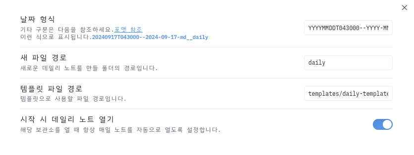

<!-- gid:20240917T161254 -->
[[TIP("이 노트에 대하여")]]
Obsidian의 데일리 노트를 Denote 파일명 규칙과 어떻게 맞출지 간단한 템플릿 형식으로 정리한다. 짧은 설정이지만 두 노트 생태계를 한 흐름으로 연결하려는 실용적 문제의식이 뚜렷하다.
[[/TIP]]

<!-- provenance:source:start -->
[[TIP("원본·최신본")]]
이 페이지는 한국어 검색과 읽기를 위한 WikiDocs 미러입니다. [원본·최신본은 가든](https://notes.junghanacs.com/notes/20240917T161254/)에 있습니다. 최신 수정 내용·백링크·태그·히스토리·댓글·출처 정보는 원본 가든에서 확인하세요.

- 작성: `2024-09-17T16:12:00+09:00`
- 최근 수정: `2024-12-01T06:30:00+09:00`
[[/TIP]]
<!-- provenance:source:end -->

## 옵시디언 데일리 노트 자동 연동

설정



```text

YYYYMMDDT043000--YYYY-MM-DD-\m\d__\d\a\i\l\y

```

## Related-Notes

## BIBLIOGRAPHY
