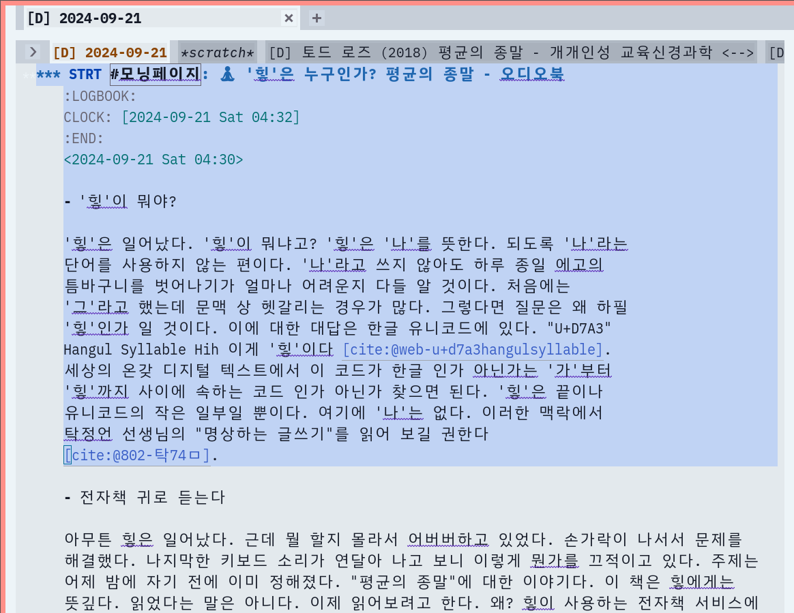
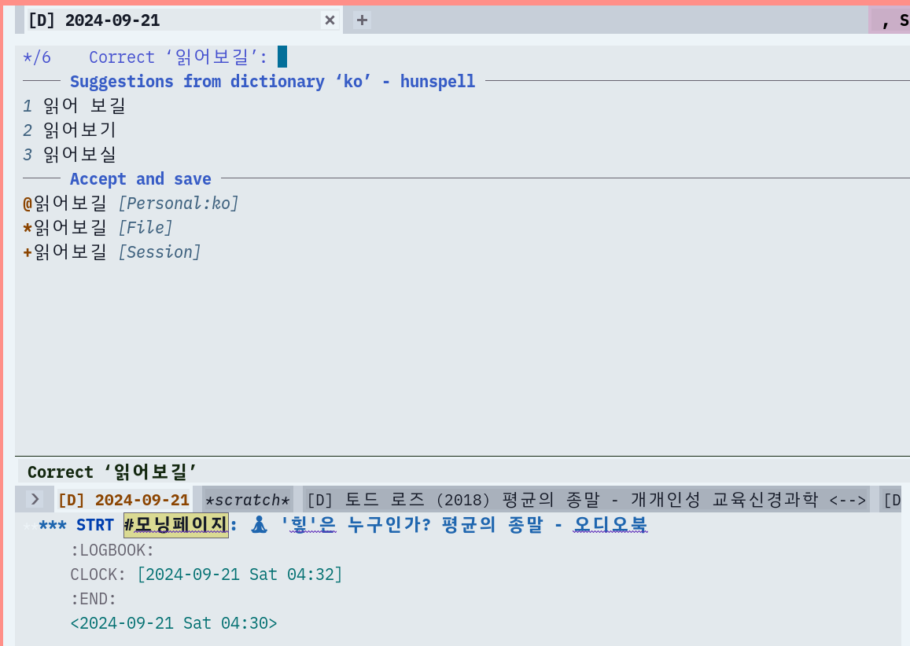
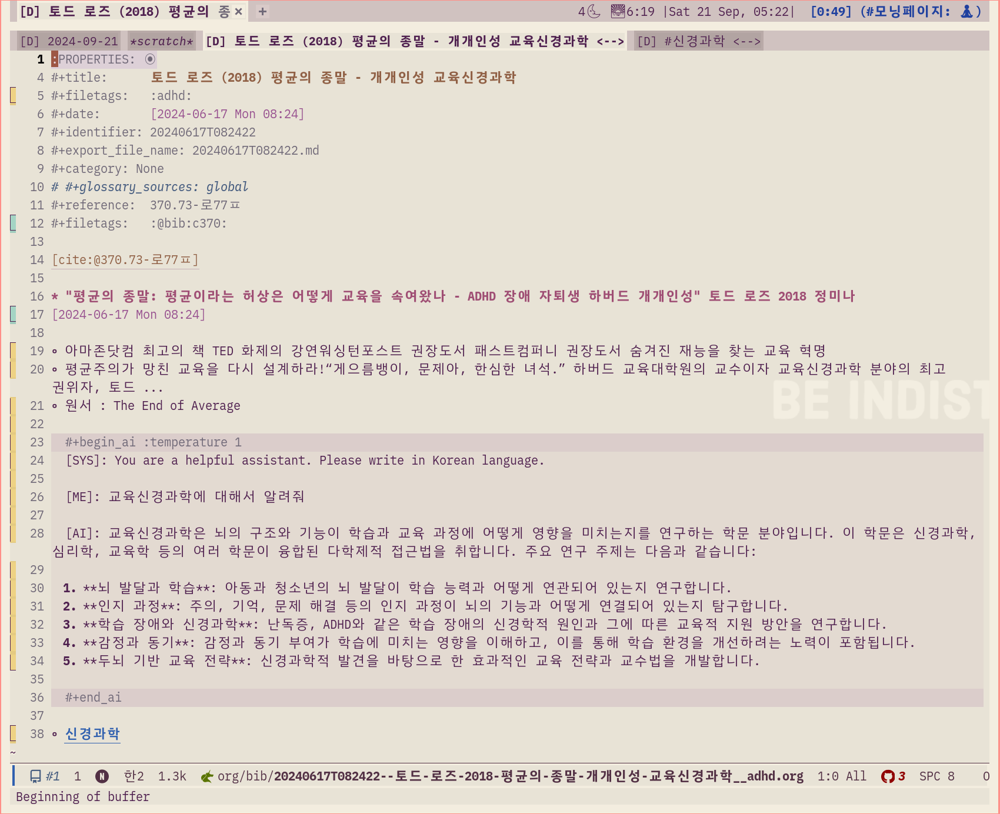
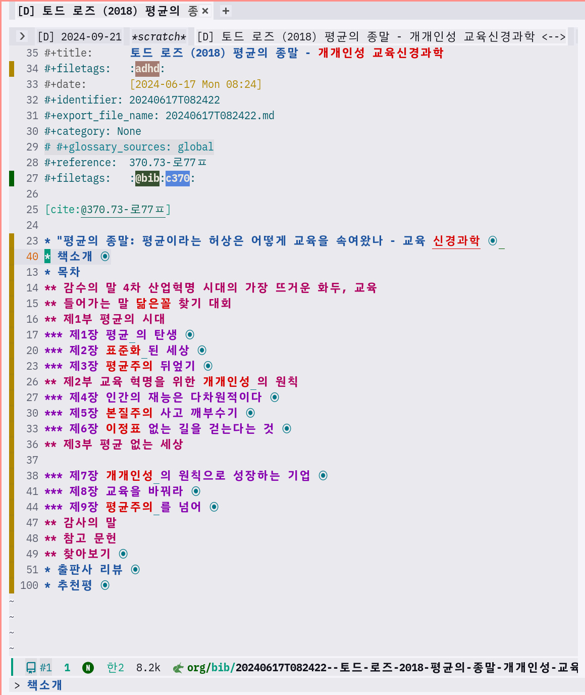
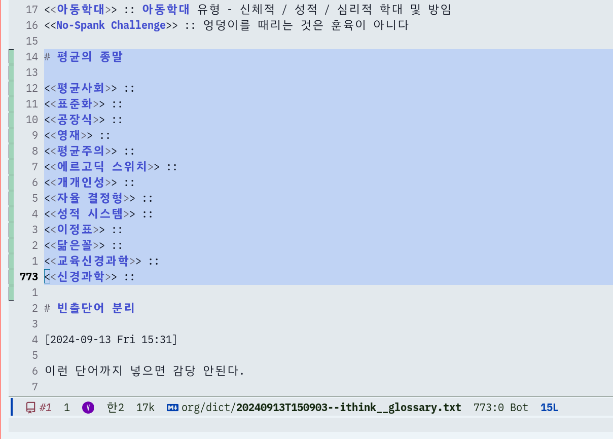

<!-- gid:20240921T062312 -->
[TOC]

[[TIP("이 노트에 대하여")]]
왜 '나' 대신 '힣'이라는 이름을 쓰는지, 그 이름이 유니코드와 존재 감각에서 어떤 의미를 갖는지 서사적으로 풀어낸다. 명상하는 글쓰기와 개개인성의 문제의식이 이 첫 선언 안에서 함께 시작된다.
[[/TIP]]

힣이 뭔가. 에고를 끊어내는 힣의 외침이여!

## 2024 힣 명상하는 글쓰기 평균의종말 오디오북

[2024-09-21 Sat 06:23] 작성

### '힣'이 뭐야?

'힣'은 일어났다. '힣'이 뭐냐고? '힣'은 '나'를 뜻한다. 되도록 '나'라는 단어를 사용하지 않는 편이다. '나'라고 쓰지 않아도 하루 종일 에고의 틈바구니를 벗어나기가 얼마나 어려운지 다들 알 것이다. 처음에는 '그'라고 했는데 문맥 상 헷갈리는 경우가 많다. 그렇다면 질문은 왜 하필 '힣'인가 일 것이다. 이에 대한 대답은 한글 유니코드에 있다. "U+D7A3" Hangul Syllable Hih 이게 '힣'이다 (“‘힣’ U+D7A3: Hangul Syllable Hih (Unicode Character)” n.d.). 세상의 온갖 디지털 텍스트에서 이 코드가 한글 인가 아닌가는 '가'부터 '힣'까지 사이에 속하는 코드 인가 아닌가 찾으면 된다. '힣'은 끝이나 유니코드의 작은 일부일 뿐이다. 여기에 '나'는 없다. 이러한 맥락에서 탁정언 선생님의 "명상하는 글쓰기"를 읽어 보길 권한다 (탁정언 2021).

### 전자책 귀로 듣는다

아무튼 힣은 일어났다. 근데 뭘 할지 몰라서 어버버하고 있었다. 손가락이 나서서 문제를 해결했다. 나지막한 키보드 소리가 연달아 나고 보니 이렇게 뭔가를 끄적이고 있다. 주제는 어제 밤에 자기 전에 이미 정해졌다. "평균의 종말"에 대한 이야기다. 이 책은 힣에게는 뜻깊다. 읽었다는 말은 아니다. 이제 읽어보려고 한다. 왜? 힣이 사용하는 전자책 서비스에 이 책이 등록되었으니까 (분명 없었는데?). 아무튼 좋다. 아. 힣은 전자책만 본다. 아니 듣는다. 눈도 좀 쉬어야지. 걷거나 자전거로 이동 할 때 딱 좋다. 주변 10km 정도는 도보 + 공유 자전거가 대중교통 보다도 빠를 때가 많다.

### 평균의 종말?

아무튼 일어났다. 평균의 종말은 뭐란 말인가? (토드 로즈 2018). #ADHD #자퇴생 \#하버드 #개개인성 #교육신경과학 이 키워드들을 보라. 평균이라는 허상은 어떻게 교육을 속여왔나를 삶으로 보여준 토드 로즈 교수의 책이다. 역시 [토드 로즈 (2018) 평균의 종말 - 개개인성 교육신경과학](https://wikidocs.net/381976) '힣'은 이전에 노트를 만들어 놓았군. 무서운 녀석. 그래. 가보면? 챗한테 뭐 물어본 것도 있구만. 그래 이게 실마리야.

### 목차는?

목차는?! 그래. 이거야. #책소개 #추천평 #출판사리뷰 #목차 중요하다. #저자 #번역자 물론 중요하다. 이것만 보면 다 읽은 것이다. 두꺼운 책의 대부분은 #사례모음 이다. 핵심은 #용어 #재정의 가 아닐까? 그러므로 책에 다 읽었어요가 없다. 볼 때마다 보이는 #개념어 들은 달라질 수 있다. 그렇다. #용어사전 요게 핵심이다. 왜 어떤 단어에는 하이라이트가 되어있는가? '힣'의 #용어사전에 등록되어 있기 때문이다. 물론 방금 등록 한 것이다. 요 단어들을 이제 자유다. 이 책에 갇혀 있을 필요가 없기 때문이다.

### 대화 저자와의 대화 (용어사전)

평균의 종말은 언제 이야기 할 것인가? 아직이다. '힣'은 #서문만 반복해서 틀어 놓고 있다. 의식적으로 듣는 것 같지도 않다. 뭐하냐고? #저자 와 #동기화 중이다. 의도적으로 하는 것은 아니다. 지금 알아차렸다. 아. 목차 용어 좀 보고 보고 저자가 공들여 썼을 서문 에필로그 등만 귀로 이 글을 쓰며 틀어놨다. 스며들지 누가 아는가? 저자의 삶... 아. 그가 왜 절실한 이야기를 하는지... 그가 시작한 길에 힣은 무엇을 할 수 있을까. 미래 교육 말이다. 저자의 한계는 힣의 한계가 아니다. 힣 또한 삶으로 경험으로 배우고 있지 않는가? 어썰로지 인생도구 시스템을 들고 그와 유쾌한 대화를 나누어 본다. 그리고 나면? 그의 단어는 힣의 단어가 될 것이다. 반대로 힣의 단어 또한 그에게 닿을 것이다.

## Related-Notes

## BIBLIOGRAPHY

  탁정언. 2021. <i>명상하는 글쓰기: 에고를 끊어내는</i>. [https://www.yes24.com/Product/Goods/104089410](https://www.yes24.com/Product/Goods/104089410).
  토드 로즈. 2018. <i>평균의 종말: 평균이라는 허상은 어떻게 교육을 속여왔나 - ADHD 장애 자퇴생 하버드 개개인성</i>. Translated by 정미나. [https://www.yes24.com/Product/Goods/102415780](https://www.yes24.com/Product/Goods/102415780).
  “‘힣’ U+D7A3: Hangul Syllable Hih (Unicode Character).” n.d. Accessed September 20, 2024. [https://unicodeplus.com/U+D7A3](https://unicodeplus.com/U+D7A3).
