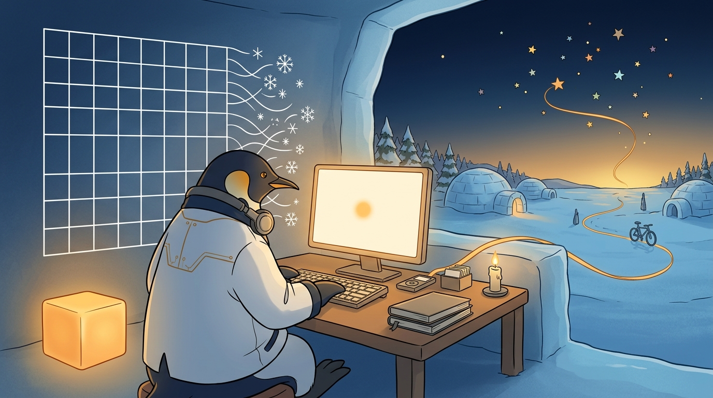
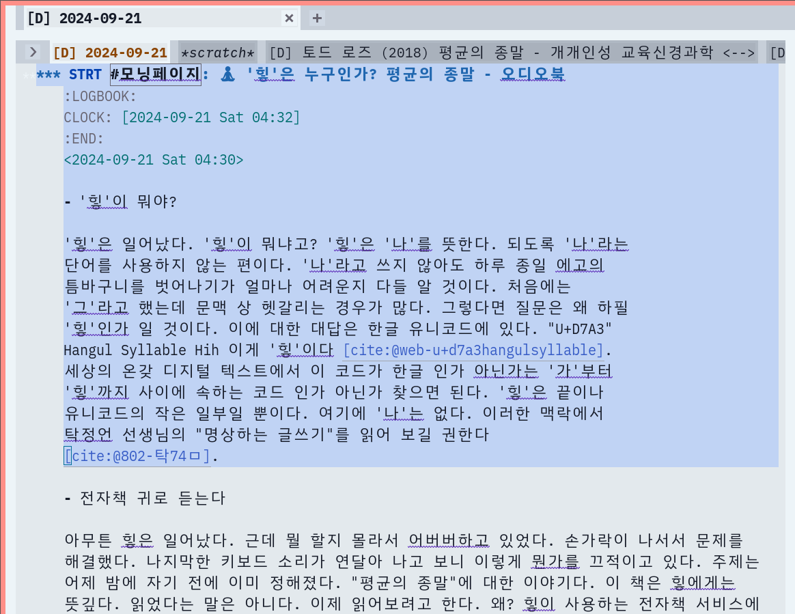
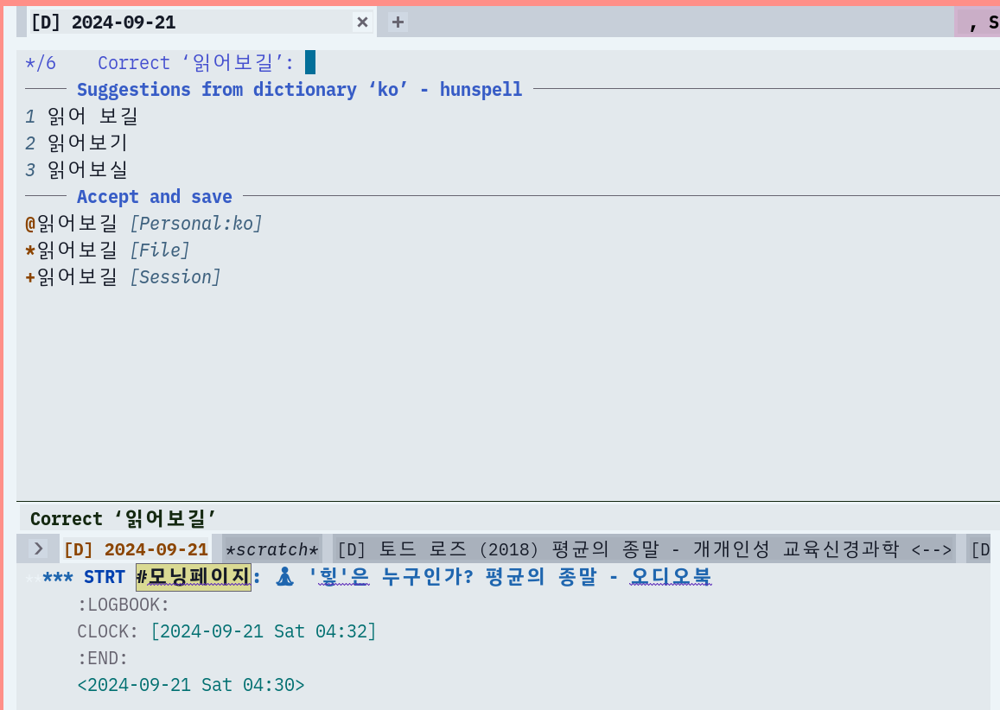
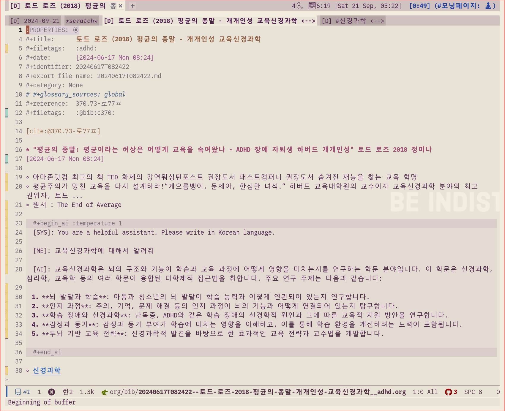
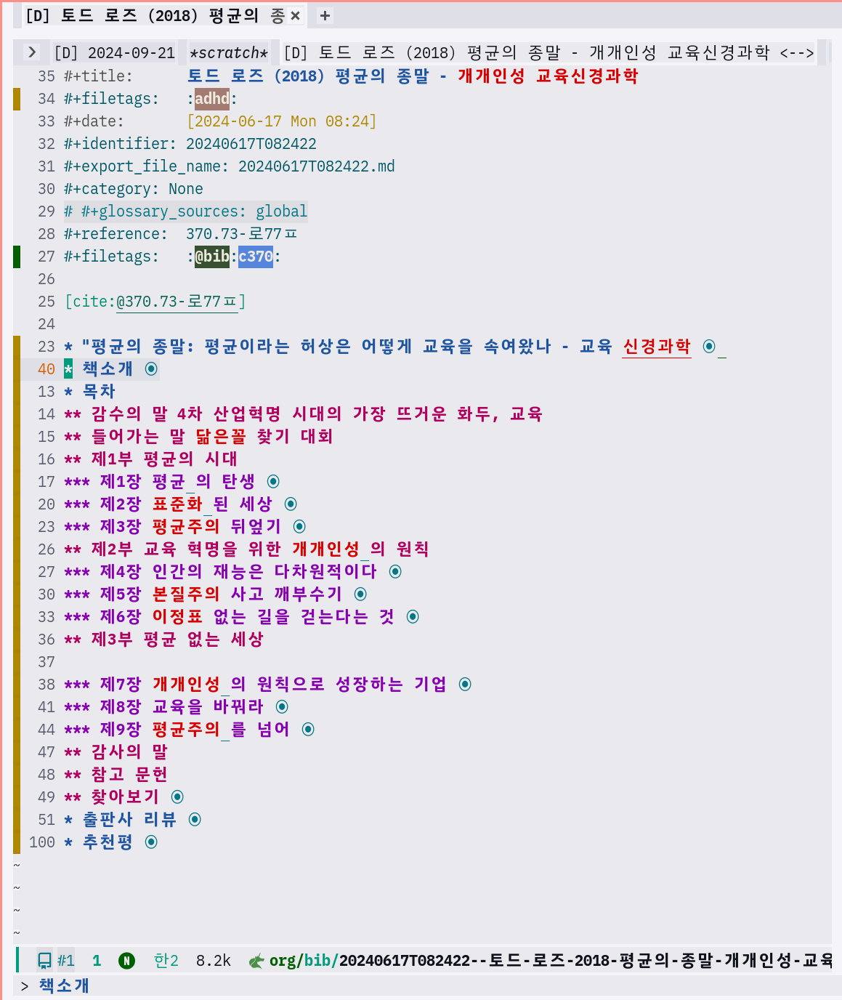
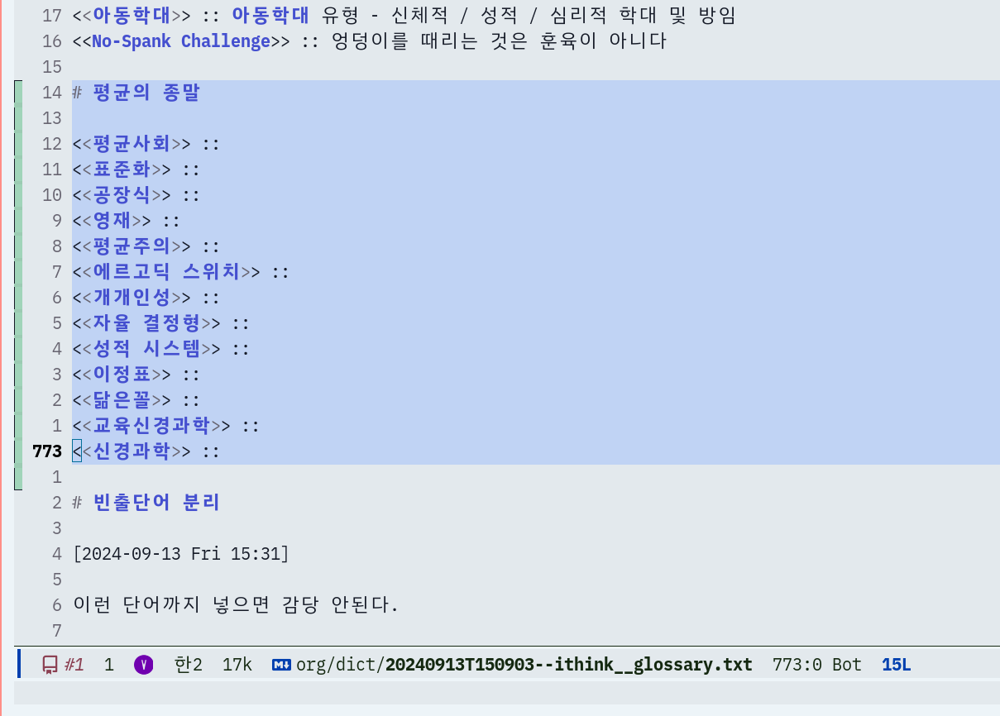

<!-- gid:20240921T062312 -->
[[TIP("이 노트에 대하여")]]
2024년 9월의 새벽, 힣은 무엇을 쓸지 정하지 못한 채 일어났고 손가락이 먼저 키보드를 두드렸다. 이 글은 한글 유니코드의 마지막 음절 \`힣\`을 자기 호명으로 택한 까닭, 에고를 느슨하게 하는 명상하는 글쓰기, 전자책을 귀로 들으며 저자와 동기화하는 독법, 토드 로즈의 『평균의 종말』에서 만난 개개인성을 한 흐름으로 묶는다.

이것은 책 한 권을 다 읽었다는 독후감이 아니다. 목차와 서문과 용어를 들으며 남의 단어를 자기 관계망으로 풀어주고, 평균의 틀 밖에서 자기 이름과 질문을 얻는 작가의 시작이다. 2026년 『디지털가든 코어』가 책판본으로 닫힐 때도 중심은 완성된 원고가 아니라 이런 새벽의 원문과 그것을 계속 회수해 온 시간축이다.
[[/TIP]]

<!-- provenance:source:start -->
[[TIP("원본·최신본")]]
이 페이지는 한국어 검색과 읽기를 위한 WikiDocs 미러입니다. [원본·최신본은 가든](https://notes.junghanacs.com/notes/20240921T062312/)에 있습니다. 최신 수정 내용·백링크·태그·히스토리·댓글·출처 정보는 원본 가든에서 확인하세요.

- 작성: `2024-09-21T06:23:00+09:00`
- 최근 수정: `2026-07-28T16:50:00+09:00`
[[/TIP]]
<!-- provenance:source:end -->

[TOC]

## 히스토리

-   [2026-07-28 Tue 16:35] @mitsein — 2024년 원문 여섯 단락과 현장 스크린샷 다섯 장을 보존하면서 표준 어쏠로그로 수선했다. \`glg\` 부랑 태그를 걷고 명상·알아차림·독서·교육·글쓰기 자석으로 정렬했으며, 평균의 격자가 개별 경로로 풀리는 GLGMAN Universe 이미지를 생성했다.
-   [2025-03-26 Wed] "왜 힣인가"를 다시 묻다가 이 첫 글을 선행 원문으로 발견했다.
-   [2024-09-21 Sat 06:23] 새벽에 일어나 \`힣\`, 명상하는 글쓰기, 귀로 듣는 책, 『평균의 종말』과 개개인성에 관한 글을 썼다.

## 관련메타

-   [명상 마음챙김 알아차림 자각 사색 알아봄](https://notes.junghanacs.com/meta/20230817T122900/) — 에고의 자동반응을 늦추고 손가락이 시작한 문장을 바라보는 축.
-   [모닝페이지 데일리 저널 매일 일기 일상](https://notes.junghanacs.com/meta/20240822T140101/) — 계획보다 먼저 도착한 새벽 글쓰기.
-   [유니코드](https://notes.junghanacs.com/meta/20240916T113349/) — 한글 음절 범위의 마지막 코드포인트에서 가져온 호명.
-   [도서 전자책 오디오북](https://notes.junghanacs.com/meta/20230710T183200/) — 눈으로 완독하기보다 걸으며 귀로 저자와 만나는 독법.
-   [어쏠로그](https://wikidocs.net/380758) — 이 새벽 원문을 시간축에서 다시 읽고 수선하는 형식.
-   [어쏠로지](https://notes.junghanacs.com/meta/20240508T103852/) — 남의 책을 소유하기보다 각자가 자기 삶의 저자로 서는 방향.

## 관련노트

-   [탁정언 — 명상하는 글쓰기와 알아차림](https://notes.junghanacs.com/bib/20240213T150557/) — "나"를 반복하는 에고에서 잠시 떨어져 문장을 바라보게 한 직접적인 책.
-   [토드로즈 Populace — 평균의 종말·다크호스·개개인성](https://notes.junghanacs.com/bib/20240617T082422/) — 평균이라는 허상 대신 개인의 들쭉날쭉한 결을 읽는 서지 허브.
-   [힣: 왜 힣인가](https://wikidocs.net/381605) — 이 글의 호명을 2025년에 다시 되찾은 후속 노트.
-   [힣: 가드너의 독서 탐구 — 책을 듣다가 캠벨·조이스·김종건을 만나다](https://wikidocs.net/381324) — 귀로 듣고 관계망에서 다시 만나는 같은 날의 독서 여정.
-   [memex-kb 스캔책을 귀로 듣기까지 — OCR 파이프라인 여정](https://wikidocs.net/382614) — 전자책이 없는 노학자의 종이책까지 Org와 EPUB으로 회수한 후속 실천.
-   [힣: 작가라는 입구 — 디지털가든 코어를 책판본으로 낸다](https://wikidocs.net/388065) — 이 새벽 원문 같은 어쏠로그를 책의 중심으로 묶는 현재 판본.

## 한 줄

힣은 평균 밖에서 완성된 자아를 선언한 이름이 아니라, 손가락이 먼저 쓰고 귀가 먼저 들을 때 에고를 잠시 비워 두는 마지막 음절의 빈자리다.

## 힣은 일어났다 — 이름보다 먼저 시작된 손

글은 "힣은 일어났다"로 시작한다. 무엇을 쓸지 몰라 어버버하던 사이 손가락이 먼저 문제를 해결한다. 이 순서가 중요하다. 완성된 정체성이 글을 지휘한 것이 아니라, 몸의 리듬이 문장을 만들고 그 문장 속에서 이름의 뜻을 발견한다.

\`힣\`은 한글 음절 유니코드 범위의 마지막인 `U+D7A3 HANGUL SYLLABLE HIH` 다. 마지막이라는 사실을 최고나 완성의 서열로 읽으면 이 글을 놓친다. 원문은 오히려 "여기에 '나'는 없다"고 말한다. \`나\`라는 주어를 지워 에고를 없앴다는 선언도 아니다. 하루 종일 에고에서 벗어나기 어렵다는 것을 알기에, 자동으로 튀어나오는 자기중심적 문장을 잠시 낯설게 보는 호명이다.

## 명상하는 글쓰기 — 생각을 적는 대신 적히는 것을 본다

탁정언의 『명상하는 글쓰기』와 이 새벽 장면이 만나는 곳은 글쓰기 기술이 아니다. 무엇을 잘 설명할지 정하기 전에 키보드의 낮은 소리와 손가락의 움직임을 알아차린다. 글은 마음속 완성품을 옮기는 운송 수단이 아니라, 지금 무엇이 일어나고 있는지 뒤늦게 보게 하는 수행이 된다.

그래서 모닝페이지는 생산량을 위한 루틴과 다르다. 매일 몇 쪽을 채우는 규칙보다, 계획하지 않은 문장이 나타날 수 있는 조용한 시간을 보호한다. 힣이라는 호명도 그 시간에서 반복해서 새로 생긴다.

## 책을 귀로 듣는다 — 완독보다 저자와 동기화하기

원문에서 책은 눈으로 끝까지 읽어 치우는 대상이 아니다. 걷거나 공유 자전거로 이동하며 귀로 듣고, 목차·서문·에필로그·용어를 반복해 만난다. "다 읽었다"는 완료 상태 대신 저자가 왜 그 말을 절실하게 했는지 삶의 맥락을 들으려 한다.

용어사전은 이 독법의 핵심 장치다. 책 속 개념어를 자기 가든의 메타 자석과 연결하는 순간 그 단어는 한 권에 갇히지 않는다. 저자의 단어가 힣의 관계망에서 다른 인물과 글을 부르고, 힣의 단어도 다시 저자에게 닿는 가상의 대화가 열린다. 독서는 소비가 아니라 서로의 어휘를 건네는 만남이 된다.

## 평균의 종말 — 남의 척도에서 개개인성으로

『평균의 종말』은 이 글의 주제이면서 아직 시작되지 않은 책이다. 힣은 서문을 반복해서 듣고 목차와 용어를 살필 뿐, 책의 내용을 요약하지 않는다. 그 미완성이 오히려 토드 로즈의 문제의식과 맞는다. 평균적 독자처럼 정해진 순서와 속도로 완독해야 한다는 척도에서 벗어나, 자기 몸과 이동과 관심의 들쭉날쭉함에 맞는 독법을 만든다.

개개인성은 혼자만 특별하다는 자기찬양이 아니다. 사람을 하나의 평균값으로 환원할 때 사라지는 결을 다시 보는 태도다. 힣이라는 낯선 한 음절, 귀로 듣는 책, 용어를 가든으로 풀어주는 방식은 모두 자기에게 맞는 경로를 만드는 작은 실천이다.

## 디지털가든 코어의 시작점

『디지털가든 코어』가 어쏠로그를 본문으로 삼는 이유가 이 글에 있다. 책을 내기 위해 새로 만들어 낸 매끈한 원고보다, 어느 새벽에 몸이 먼저 쓰고 시간이 지나 다시 발견된 원문이 저자의 실제 시작을 증언한다. 2024년의 글은 2025년 "왜 힣인가"에서 다시 불렸고, 2026년 스캔책과 전자책 파이프라인, 코어 책판본으로 이어졌다.

그러므로 코어는 완성된 사상을 시간순으로 진열하는 책이 아니다. 이름·독법·도구·인물이 서로를 여러 해 뒤 다시 부르는 관계망의 판본이다. 첫 판에 이 글이 들어간다면 \`힣\`의 정의를 제공해서가 아니라, 저자가 어떻게 일어나고 듣고 쓰기 시작했는지를 보여주기 때문이다.

## 이미지 — 평균 격자 밖으로 이어지는 새벽의 소리

새벽의 얼음 방에서 힣맨은 단순한 흰색·남색 작가 외투를 입고 키보드에 손을 올린다. 모니터는 앰버 원 하나만 비춘 채 비어 있고, 왼쪽의 평균 격자는 오른쪽으로 갈수록 서로 다른 곡선과 눈송이로 풀린다. 목의 헤드폰과 작은 오디오 기기에서 나온 황금 선은 책상 밖의 자전거 길을 따라 새벽과 개별적인 별자리로 이어진다.

실제 이미지에는 프롬프트가 요구한 하나의 평범한 황금 큐브가 왼쪽 아래에 놓였고, 카드 상자와 책 표지는 비어 있다. 첫 생성본에서 나타났던 문자 같은 도형 행렬은 두 번째 생성에서 완전히 사라졌다. 화면의 앰버 원, 격자, 눈송이, 별, 자전거만으로 이름을 직접 쓰지 않고도 "평균 밖에서 일어난 한 존재"가 읽힌다.



### 생성 파라미터

-   모델: `gemini-3.1-flash-image-preview`
-   화면비: `16:9`
-   해상도: `1K`
-   생성일: 2026-07-28
-   실제 결과: 빈 화면의 앰버 원, 평균 격자에서 풀려나는 개별 경로, 헤드폰의 황금 선, 새벽의 별과 자전거 길로 수렴했다.

### 프롬프트 전문

```text
[World: GLGMAN Universe]

Create one cinematic 2D storybook illustration with clean hand-drawn linework, soft cel-shading, polished handmade animation texture, warm family-animation feeling with gentle Japanese-animation quietness. Not photorealistic, not 3D.

Polar dawn in the Antarctic winter village: deep navy sky fading to amber, ice-blue snow, quiet igloos and distant pines, warm amber light inside a small open-front ice writing room. Palette: white, navy, amber-gold, ice-blue.

GLGMAN identity lock: adult anthropomorphic emperor penguin father, upright but relaxed, unmistakable emperor-penguin silhouette, calm amber eyes. He wears a simple white-and-navy writer's coat with very subtle amber circuit stitching, not armor. No sword, no weapon.

Scene: "The Writer Wakes Outside the Average." Before sunrise, GLGMAN sits at a low wooden desk. One flipper is beginning to type on a compact keyboard before the mind has planned a topic. The computer screen is a completely blank warm ivory glow with one soft amber circle of light only — absolutely no lines, marks, symbols, glyphs, letters, or text.

Simple headphones rest around his neck. A thin amber sound ribbon flows from a small plain audio player across the desk and then out through the snow, following a distant walking-and-bicycle path toward dawn. The ribbon rises into a constellation of many distinct simple stars, all different in size and color, showing individual lives rather than one average.

On the ice wall behind him is a large plain square grid made only of clean white horizontal and vertical lines. The grid gently dissolves at its right edge into many unique curved paths and natural snowflake shapes. There are no labels or marks inside the grid. Near the desk is ONE solitary glowing amber cube, plain and smooth, symbolizing the last available place in a system without depicting any alphabet. There must be only one cube, no row of cubes, no glyph sequence.

On the desk: two closed well-used books with blank covers, a small card box containing completely blank tabs, and one candle. Outside the sun is just about to rise. The scene feels like meditation through typing: ego loosening, awareness arriving, a self-name discovered without printing it, and a writer listening before trying to possess a book.

Composition: wide cinematic three-quarter view from behind and beside GLGMAN. GLGMAN and keyboard are central-left; the plain dissolving grid is in the left background; unique stars and the sound-ribbon path lead to dawn on the right. Spacious and quiet.

Mood: intimate beginning, unforced wakefulness, meditative, curious, individual, warm, quietly mythic.

ZERO-TEXT LOCK: Do not draw anything that could be mistaken for writing. No readable or pseudo-readable letters, no Hangul-like blocks, no alphabet-like glyphs, no words, no numbers, no lines on paper, no marks on the screen, no symbols arranged in a row, no labels, no speech bubbles, no UI, no logo, no watermark. Stars, snowflakes, one plain cube, and a blank square grid are the only abstract symbols allowed.

Do NOT include: corporate infographic, ranking labels, crowd of identical penguins, yellow chicken, naked character, battle, grimdark, horror, photorealism, 3D render, excessive micro-detail.
```

## 원문 보존 — 2024-09-21 새벽 글쓰기

[[TIP("주의")]]
힣이 뭔가. 에고를 끊어내는 힣의 외침이여!

'힣'은 일어났다. '힣'이 뭐냐고? '힣'은 '나'를 뜻한다. 되도록 '나'라는 단어를 사용하지 않는 편이다. '나'라고 쓰지 않아도 하루 종일 에고의 틈바구니를 벗어나기가 얼마나 어려운지 다들 알 것이다. 처음에는 '그'라고 했는데 문맥 상 헷갈리는 경우가 많다. 그렇다면 질문은 왜 하필 '힣'인가 일 것이다. 이에 대한 대답은 한글 유니코드에 있다. "U+D7A3" Hangul Syllable Hih 이게 '힣'이다 (“‘힣’ U+D7A3: Hangul Syllable Hih (Unicode Character)” n.d.). 세상의 온갖 디지털 텍스트에서 이 코드가 한글 인가 아닌가는 '가'부터 '힣'까지 사이에 속하는 코드 인가 아닌가 찾으면 된다. '힣'은 끝이나 유니코드의 작은 일부일 뿐이다. 여기에 '나'는 없다. 이러한 맥락에서 탁정언 선생님의 "명상하는 글쓰기"를 읽어 보길 권한다 (탁정언 2021).

아무튼 힣은 일어났다. 근데 뭘 할지 몰라서 어버버하고 있었다. 손가락이 나서서 문제를 해결했다. 나지막한 키보드 소리가 연달아 나고 보니 이렇게 뭔가를 끄적이고 있다. 주제는 어제 밤에 자기 전에 이미 정해졌다. "평균의 종말"에 대한 이야기다. 이 책은 힣에게는 뜻깊다. 읽었다는 말은 아니다. 이제 읽어보려고 한다. 왜? 힣이 사용하는 전자책 서비스에 이 책이 등록되었으니까 (분명 없었는데?). 아무튼 좋다. 아. 힣은 전자책만 본다. 아니 듣는다. 눈도 좀 쉬어야지. 걷거나 자전거로 이동 할 때 딱 좋다. 주변 10km 정도는 도보 + 공유 자전거가 대중교통 보다도 빠를 때가 많다.

아무튼 일어났다. 평균의 종말은 뭐란 말인가? (토드 로즈 2018). <SPAN CLASS="ORG-HASHTAG">#ADHD</SPAN> <span class="org-hashtag">#자퇴생</span> \#하버드 <span class="org-hashtag">#개개인성</span> <span class="org-hashtag">#교육신경과학</span> 이 키워드들을 보라. 평균이라는 허상은 어떻게 교육을 속여왔나를 삶으로 보여준 토드 로즈 교수의 책이다. 역시 [토드 로즈 (2018) 평균의 종말 - 개개인성 교육신경과학](https://notes.junghanacs.com/bib/20240617T082422/) '힣'은 이전에 노트를 만들어 놓았군. 무서운 녀석. 그래. 가보면? 챗한테 뭐 물어본 것도 있구만. 그래 이게 실마리야.

목차는?! 그래. 이거야. <span class="org-hashtag">#책소개</span> <span class="org-hashtag">#추천평</span> <span class="org-hashtag">#출판사리뷰</span> <span class="org-hashtag">#목차</span> 중요하다. <span class="org-hashtag">#저자</span> <span class="org-hashtag">#번역자</span> 물론 중요하다. 이것만 보면 다 읽은 것이다. 두꺼운 책의 대부분은 <span class="org-hashtag">#사례모음</span> 이다. 핵심은 <span class="org-hashtag">#용어</span> <span class="org-hashtag">#재정의가</span> 아닐까? 그러므로 책에 다 읽었어요가 없다. 볼 때마다 보이는 <span class="org-hashtag">#개념어들은</span> 달라질 수 있다. 그렇다. <span class="org-hashtag">#용어사전요게</span> 핵심이다. 왜 어떤 단어에는 하이라이트가 되어있는가? '힣'의 <span class="org-hashtag">#용어사전에</span> 등록되어 있기 때문이다. 물론 방금 등록 한 것이다. 요 단어들을 이제 자유다. 이 책에 갇혀 있을 필요가 없기 때문이다.

평균의 종말은 언제 이야기 할 것인가? 아직이다. '힣'은 <span class="org-hashtag">#서문만</span> 반복해서 틀어 놓고 있다. 의식적으로 듣는 것 같지도 않다. 뭐하냐고? <span class="org-hashtag">#저자와</span> <span class="org-hashtag">#동기화</span> 중이다. 의도적으로 하는 것은 아니다. 지금 알아차렸다. 아. 목차 용어 좀 보고 보고 저자가 공들여 썼을 서문 에필로그 등만 귀로 이 글을 쓰며 틀어놨다. 스며들지 누가 아는가? 저자의 삶... 아. 그가 왜 절실한 이야기를 하는지... 그가 시작한 길에 힣은 무엇을 할 수 있을까. 미래 교육 말이다. 저자의 한계는 힣의 한계가 아니다. 힣 또한 삶으로 경험으로 배우고 있지 않는가? 어썰로지 인생도구 시스템을 들고 그와 유쾌한 대화를 나누어 본다. 그리고 나면? 그의 단어는 힣의 단어가 될 것이다. 반대로 힣의 단어 또한 그에게 닿을 것이다.
[[/TIP]]

## 현장 스크린샷 — 2024년 새벽의 독서 환경

원문에는 당시의 모닝페이지, 전자책, 『평균의 종말』 노트와 용어사전 화면이 함께 있었다. 새 세계 이미지는 그 장면을 대체하지 않는다. 아래 다섯 장은 힣이 실제로 무엇을 보고 듣고 연결했는지 보여주는 현장 자료다.











## 옛 방의 씨앗

이 방은 빈방이 아니었다. 2024년 새벽에 바로 쓴 여섯 단락과 다섯 장의 현장 화면이 이미 살아 있었다. 다만 제목이 \`#힣의시작 <span class="org-hashtag">#명상하는글쓰기</span> <span class="org-hashtag">#개개인성</span> <span class="org-hashtag">#평균의종말</span> <span class="org-hashtag">#오디오북</span>\`을 나열하고, 본문이 해설·원문·자료를 구분하지 않은 채 한 덩어리로 놓여 있었다.

이번 수선은 다른 원석을 들여온 것이 아니다. 원문을 한 글자도 고치지 않고 \`[!danger]\`에 모으고, 현장 이미지를 별도 층으로 보존하고, 그 사이에서 힣·명상하는 글쓰기·귀로 듣는 책·개개인성이 어떻게 한 시작을 이루는지 해설했다. \`glg\` 부랑 태그는 본문의 호명으로 돌려보내고, meta 자석이 있는 영어 나침반으로 바꾸었다.

## BIBLIOGRAPHY

- 탁정언. 2021. <i>명상하는 글쓰기: 에고를 끊어내는</i>. [https://www.yes24.com/Product/Goods/104089410](https://www.yes24.com/Product/Goods/104089410).
- 토드 로즈. 2018. <i>평균의 종말: 평균이라는 허상은 어떻게 교육을 속여왔나 - ADHD 장애 자퇴생 하버드 개개인성</i>. Translated by 정미나. [https://www.yes24.com/Product/Goods/102415780](https://www.yes24.com/Product/Goods/102415780).
- “‘힣’ U+D7A3: Hangul Syllable Hih (Unicode Character).” n.d. Accessed September 20, 2024. [https://unicodeplus.com/U+D7A3](https://unicodeplus.com/U+D7A3).
