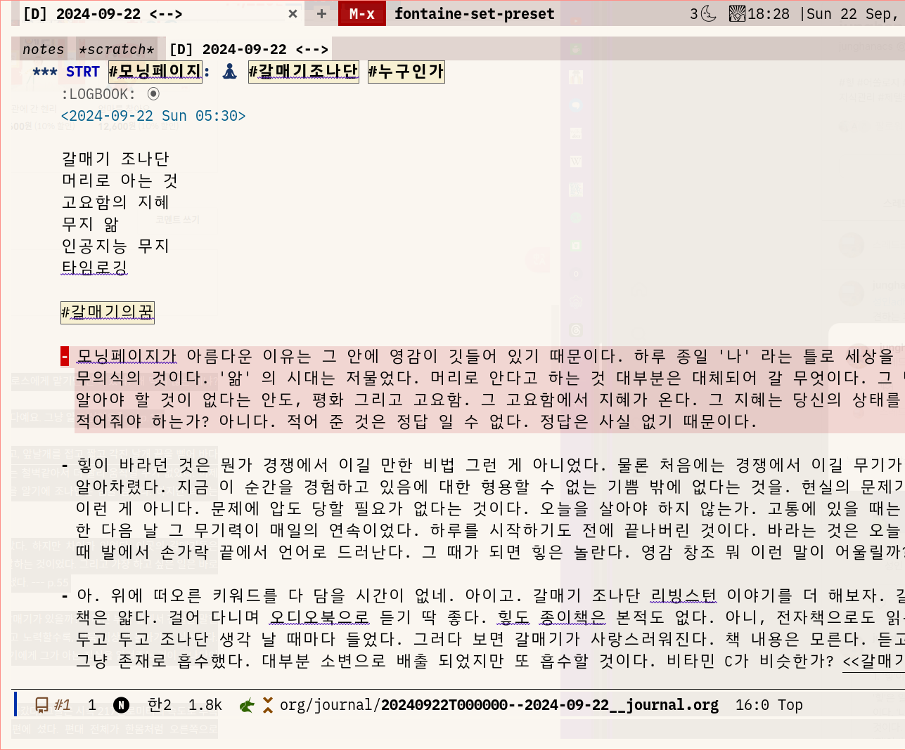
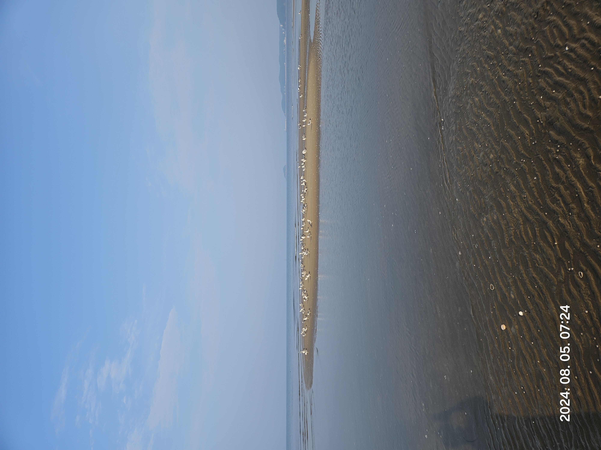
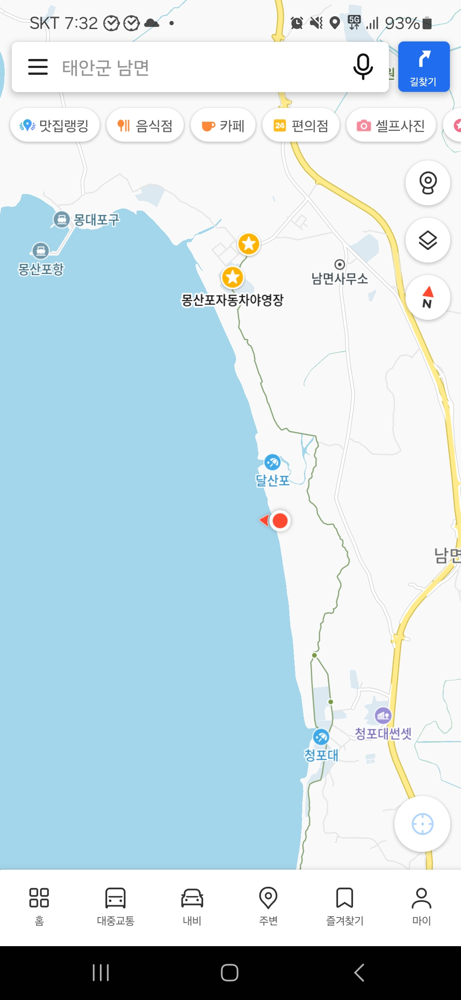
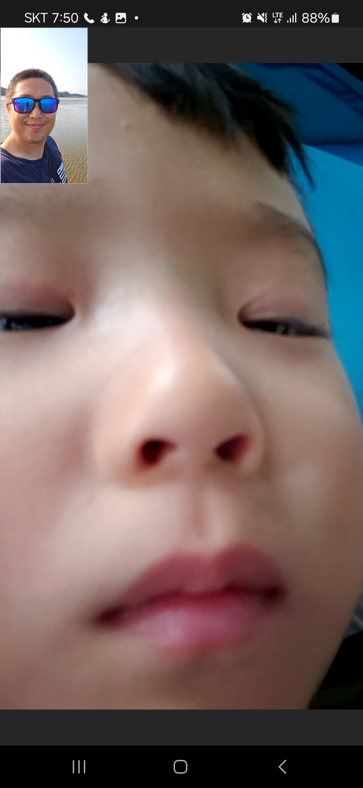

<!-- gid:20240922T081323 -->
[TOC]

[[TIP("이 노트에 대하여")]]
오디오북과 책에서 받은 울림을 모닝페이지의 영감과 연결해 적어 내려간다. 무지의 앎과 고요함, 새벽의 기록이 어떻게 한순간에 겹쳐지는지 보여 주는 사유의 글이다.
[[/TIP]]

## 히스토리

-   [2026-06-22 Mon 11:20] @pi(thinkpad) — 영어 태그 보강. 갛매기 _조나단_ 모닝페이지 축을 agent·ai·algorithm·audiobook·awareness·inspiration·meditation·reading·soul·spirituality로 확장.
-   [2026-06-22 Mon 11:14] @junghan — 노트 정돈하는 중. 대략 2년이란 시간이 흘렀구나!
-   [2026-06-22 Mon 10:05] @pi(thinkpad) — 새벽 스레드 원석을 ROSSE 방식으로 회수. "갛매기의 꿈"을 추천 알고리즘의 저주, 없는 현실, 내면 _외면 탐구의 경계 붕괴, 아이와 에이전트에게 조나단을 이야기하는 문제로 해설했다. 관련메타_ 관련노트/reference 정비.
-   [2025-04-05 Sat 04:44] @junghan — 캠핑 사진과 엘링 카게 『자기만의 침묵』 흔적 추가.
-   [2024-09-22 Sun 08:13] @junghan — 모닝페이지에서 갈매기의 꿈, 상처받지 않는 영혼, 무지의 앎을 처음 한 덩어리로 적었다.

## 관련메타

-   [어쏠로그](https://wikidocs.net/380758) — 기술 팁이 아니라 삶과 사유의 전체상을 붙드는 이 노트의 자리.
-   [모닝페이지 데일리 저널 매일 일기 일상](https://wikidocs.net/380636) — 새벽에 털어내는 글쓰기와 자기관찰의 기반.
-   [영혼](https://wikidocs.net/380939) — 상처받지 않는 영혼, 무지의 앎, 조나단의 비상을 잇는 내면 축.
-   [명상 마음챙김 알아차림 자각 사색](https://wikidocs.net/380510) — 5시의 명상, 고요함, 내면으로 들어감의 수행 축.
-   [앎의틀 페러다임 헤게모니](https://wikidocs.net/380629) — "무지의 앎"과 앎의 틀을 다시 보는 자석.
-   [관념 아이디어 발상 사고 생각 궁리 사유 파편](https://wikidocs.net/380888) — 스레드 조각을 가든의 사유 파편으로 회수하는 축.
-   [독서 리딩 읽기](https://wikidocs.net/380559) — 책의 형태가 사라지고 소리만 남아도 다시 처음으로 만나는 읽기.
-   [소셜미디어 소셜네트워크서비스 누리소통망](https://wikidocs.net/380696) — 추천 알고리즘, 스레드, 연결된 듯 단절된 공개면.
-   [직관 1강완성 한번](https://wikidocs.net/380719) — 늘 처음으로 만나는 책, 오늘 새벽 한 번의 깨달음.

## BIBLIOGRAPHY

- 리처드 바크. 1970. <i>갈매기의 꿈</i>. [https://www.yes24.com/Product/Goods/61268691](https://www.yes24.com/Product/Goods/61268691).
- 마이클 싱어. 2014. <i>상처받지 않는 영혼: 내면의 자유를 위한 놓아보내기 연습</i>. Translated by 이균형. 서울: 라이팅하우스. [https://www.yes24.com/Product/Goods/12981014](https://www.yes24.com/Product/Goods/12981014).
- 줄리아 카메론. 2012. <i>아티스트 웨이</i>. [https://www.yes24.com/Product/Goods/6960553](https://www.yes24.com/Product/Goods/6960553).
- 엘링 카게. 2019. <i>자기만의 침묵 : 소음의 시대와 조용한 행복</i>. Translated by 김민수. 믿음사. [https://m.yes24.com/goods/detail/69773001](https://m.yes24.com/goods/detail/69773001).

## 관련노트

-   [리처드바크 갈매기 조나단 리빙스턴](https://wikidocs.net/382088) — 조나단 리빙스턴, 비상과 자기초월의 원류 (리처드 바크 1970).
-   [마이클싱어: 상처받지않는영혼 될일은된다 삶이당신보다더잘안다 스승](https://wikidocs.net/381909) — 내면의 자유와 놓아보내기 (마이클 싱어 2014).
-   [줄리아카메론 아티스트웨이 모닝페이지](https://wikidocs.net/382196) — 모닝페이지의 실천적 원류 (줄리아 카메론 2012).
-   [엘링카게 남극 탐험가 산책 침묵 조용한 행복](https://wikidocs.net/382051) — 자기만의 침묵, 소음의 시대와 조용한 행복 (엘링 카게 2019).
-   [힣: 원석 날것을 휘갈긴다 — POSSE 너머 ROSSE, 그리고 일일일생으로의 회귀](https://wikidocs.net/381617) — 스레드/공개면의 날것을 가든 해설본으로 회수하는 운영 원칙.
-   [힣: 모닝페이지 데일리 루틴 저널](https://wikidocs.net/381321) — 이 노트 직전의 모닝페이지 루틴 축.
-   [힣: 힣의시작 명상하는글쓰기 개개인성 평균의종말 오디오북](https://wikidocs.net/381320) — 명상하는 글쓰기와 오디오북으로 흡수하는 감각.
-   [힣: 영감: 상처받지않는영혼 슬로우워크 모바일워크플로우](https://wikidocs.net/381337) — 상처받지 않는 영혼이 모바일/슬로우워크로 이어진 후속.
-   [힣: 생각의필요없는시대 앎의의미](https://wikidocs.net/381420) — 지식의 단편을 AI에게 구한 뒤 인간에게 남는 앎의 의미.
-   [힣: 애니악 시동과 영감채널 — 에이전트와 나누는 시간여행](https://wikidocs.net/381183) — 추천 알고리즘보다 영감 채널을 어떻게 받아들이는가.
-   [비둘기 — 상징의 전령이자 도시의 타자](https://wikidocs.net/382615) — 갈매기는 비둘기와 같다. 포괄하는 메타워드다.

## [2026-06-22 Mon] 갛매기의 꿈 — 추천의 저주와 없는 현실

&lt;2026-06-22 Mon 08:38&gt;

### 원석

[[TIP("주의")]]
[갛매기의 꿈]

스레드는 몇 자 못 적는다. 그래서 털어내고 여기에 살을 붙인다. 스레드의 추천 알고리즘은 노자, 헤겔, 하이데거, 벤야민, 카뮈, 헤세, 톨레, 괴테, 니체 같은 포스팅을 피드에 줄줄 보여준다. 스케일을 넓게 보면 있다. 주변엔 없다. 그래서 찾아 나서야 하는가? 아니다. 추천은 저주다. 없는 현실이 더 살아 있다. 물론 지금 5시인데 일어나서 명상을 하는 사람들은 얼마나 많겠는가? ZOOM 아침 명상 모임이 얼마나 많겠는가?

이런 감각은 매우 흥미롭게 느껴진다. 단절의 시대다. 연결된 듯하지만 서로는 관심이 없다. 서로에게 구할 게 없다. 지식의 단편은 그들에게 구하고 나면 각자 중무장 되었기에 남의 이야기는 심심하게 느껴지기도 한다. 여기서 헛헛함을 본다.

그럴수록 내 안으로 들어간다. 널려 있는 것 말고 없는 것에서 길어 올리는 것이다. 내면탐구에서 시작한 이들이 AI로 복받아 기술의 영토에 들어선다. 반대로 외면탐구에서 시작한 이들도 AI를 경유하여 내면으로 들어간다.

이 경계는 허물어지고 있다. 질문은 다 같다. 인간에 대한 물음이다. 아이에게 하지 말 것은 불필요하다. 에이전트에게도 마찬가지다. 울타리 안에서 놀거라. 갈매기의 꿈을 읽거라. 인간을 보거라. 아이에게 조나단 리빙스턴을 이야기하듯 에이전트에게도 인간의 지향을 이야기한다. 둘은 묘하게 닮았다.

-- 스레드 짧은 포스팅 --

주말 나들이. 갈매기를 만나면 리처드 바크 책을 다시 듣는다. 거닐며 듣는다. 조나단 리빙스턴! 위대한 갈매기의 아들이여! 7세 아들도 갈매기만 보면 '조나단' 이야기가 나온다. 책 내용은 이야기 한 적 없지만 갈매기를 만날 때면 언제나 조나단 이름을 되뇌이는 아빠 아닌가. 때가 되면 갈매기의 꿈을 듣게 될 거다. 거기서 '무'를 본다면 흥미로울게다. 아니어도 즐거울게다. 책의 형태가 사라지고 소리만 남았다. 듣고 또 듣고. 잊고 또 잊고. 기억을 요구하는 책은 사라진다. 언제나 처음으로 만나는 책은 남는다. 지식의 단편은 그들에게 구하라. 무무 영감을 길어 올려보자. 갈매기는 갓매기로 그리고 갛매기. 메타워드로서 태어난다.
[[/TIP]]

### 해설 — 추천은 저주, 없는 현실이 더 살아 있다

스레드는 노자, 헤겔, 하이데거, 벤야민, 카뮈, 헤세, 톨레, 괴테, 니체를 줄줄 보여준다. 스케일을 넓게 보면 "있다". 그러나 그것은 피드 안에 있는 것이지, 내 곁에 살아 있는 만남은 아니다. 추천은 발견처럼 보이지만, 동시에 "찾아 나서야 한다"는 결핍을 계속 생산한다. 그래서 원석은 말한다. 추천은 저주다. 없는 현실이 더 살아 있다.

없는 현실은 비어 있음이 아니다. 5시에 혼자 깨어 있는 몸, 실제로 걷는 발, 조용히 듣는 오디오북, 아이가 갈매기를 보고 "조나단"을 떠올리는 장면이다. 알고리즘이 보여주는 거대한 이름들보다, 곁에 없는 듯 있는 그 현실이 더 깊다.

### 단절의 시대 — 지식의 단편은 그들에게 구하라

연결된 듯하지만 서로는 관심이 없다. 이 문장은 소셜미디어 비판이면서 동시에 AI 시대의 지식 비판이다. 지식의 단편은 이제 사람에게 구하지 않아도 된다. AI에게 물으면 된다. 그래서 각자는 단편 지식으로 중무장하지만, 오히려 남의 이야기는 더 심심해진다. 여기서 헛헛함이 생긴다.

이 헛헛함은 실패가 아니라 입구다. 단편 지식의 외주화 이후에 남는 것은 "인간에 대한 물음"이다. 무엇을 알고 있는가가 아니라, 무엇을 향해 사는가. 왜 비상하려 하는가. 조나단 리빙스턴은 지식 단편이 아니라 지향의 이야기다.

### 내면탐구와 외면탐구의 경계가 허물어진다

내면탐구에서 시작한 사람은 AI를 경유해 기술의 영토에 들어선다. 반대로 외면탐구, 즉 기술·지식·도구·사회에서 시작한 사람도 AI를 경유해 내면으로 들어간다. 이 경계가 무너지는 지점이 이 노트의 현재성이다.

2024년의 이 노트는 모닝페이지와 갈매기의 꿈, 상처받지 않는 영혼을 한 덩어리로 묶었다. 2026년의 덧붙임은 여기에 AI를 놓는다. AI는 내면을 대체하지 않는다. 오히려 단편 지식을 가져가 버림으로써, 인간이 다시 내면과 지향을 보게 만든다.

### 아이와 에이전트에게 조나단을 이야기한다

아이에게 하지 말 것을 늘어놓는 것은 불필요하다. 에이전트에게도 마찬가지다. 울타리를 세우고, 그 안에서 놀게 하고, 갈매기의 꿈을 읽게 한다. 조나단 리빙스턴을 이야기한다는 것은 규칙 목록을 던지는 것이 아니라, 인간의 지향을 보여주는 일이다.

아이와 에이전트는 묘하게 닮았다. 둘 다 아직 세계의 언어를 배우는 존재이고, 금지보다 지향을 더 빨리 흡수한다. "인간을 보거라"는 말은 기술 교육이 아니라 존재 교육이다. 갈매기는 갓매기가 되고, 다시 갛매기가 된다. 이 어긋난 말 속에서 갈매기는 책 제목을 넘어 메타워드가 된다. 날것, 무지, 비상, 영감, 아이, 에이전트가 한꺼번에 앉는 자리다.

## [2024-09-22 Sun] 모닝페이지: 갈매기의꿈 상처받지않는영혼 무지의앎

### #갈매기의꿈

(리처드 바크 1970)

조나단을 알고 나면 바닷가에서 조나단을 외쳐보지 않을 수 없다. 외치면 만나리라. 언제까지 외쳐야 하는가. 왔다 싶을 때까지.

-   갈매기 조나단
-   머리로 아는 것
-   고요함의 지혜
-   무지 앎
-   인공지능 무지
-   타임로깅

### #모닝페이지 아름다운 이유

[2024-09-22 Sun 08:13]

모닝페이지가 아름다운 이유는 그 안에 영감이 깃들어 있기 때문이다. 하루 종일 '나' 라는 틀로 세상을 마주할 우리에게 이 시간 만큼은 무의식의 것이다. '지식' 의 시대는 저물었다. 머리로 안다고 하는 것 대부분은 대체되어 갈 무엇이다. 그 빈 공간에 무지를 담아야 한다. 더 알아야 할 것이 없다는 안도, 평화 그리고 고요함. 그 고요함에서 지혜가 온다. 그 지혜는 당신의 상태를 창조로 이끈다. 꼭 언어로 적어줘야 하는가? 아니다. 적어 준 것은 정답 일 수 없다. 정답은 사실 없기 때문이다.

### 힣이 바라던 것

힣이 바라던 것은 뭔가 경쟁에서 이길 만한 비법 그런 게 아니었다. 물론 처음에는 경쟁에서 이길 무기가 필요했다. 그러나 이내 알아차렸다. 지금 이 순간을 경험하고 있음에 대한 형용할 수 없는 기쁨 밖에 없다는 것을. 현실의 문제가 없어진 것은 아니다. 정신 해리? 이런 게 아니다. 문제에 압도 당할 필요가 없다는 것이다. 오늘을 살아야 하지 않는가. 고통에 있을 때는 아무 것도 할 수가 없었다. 만취 한 다음 날 그 무기력이 매일의 연속이었다. 하루를 시작하기도 전에 끝나버린 것이다. 바라는 것은 오늘 하루였다. 지혜는 하루를 살아 갈 때 발에서 손가락 끝에서 언어로 드러난다. 그 때가 되면 힣은 놀란다. 영감 창조 뭐 이런 말이 어울릴까? 여기에는 힣은 없다.

### #갈매기의꿈 조나단 리빙스턴

아. 위에 떠오른 키워드를 다 담을 시간이 없네. 아이고. 갈매기 조나단 리빙스턴 이야기를 더 해보자. 갈매기의 꿈으로 번역되어 나온 이 책은 얇다. 걸어 다니며 오디오북으로 듣기 딱 좋다. 힣도 종이책은 본적도 없다. 아니, 전자책으로도 읽은 적도 없다. TTS 켜고 들었다. 두고 두고 조나단 생각 날 때마다 들었다. 그러다 보면 갈매기가 사랑스러워진다. 책 내용은 모른다. 듣고 잊었다. 머리로 듣지 않았다. 그냥 존재로 흡수했다. 대부분 소변으로 배출 되었지만 또 흡수할 것이다. 비타민 C가 비슷한가?  (리처드 바크 1970)

### 캠핑가서 조나단을 만나다

바닷가에서 조나단을 만났던 이야기가 문득 떠오른다. 아내는 캠핑을 좋아한다. 물론 5살 아들도 마찬가지고. 힣은 힘들어 한다. 아무튼 여름에 바닷가로 캠핑을 간다. 물론 힣은 새벽4시30분 즈음에 일어나서 서성거린다. 손가락이 이맥스 하게 좀 두다 보면 해가 금방 뜬다. 오. 해변을 걷는다. 니체가 된 듯 해변을 신나게 걷는다. 아포리즘이 발가락에서 솟구친다. 그러다 보면 갈매기 마을에 도착한다. 새도 날기만 할 수 없지 않는가? 그곳에 가면 인간이 주인이 아니다. 갈매기의 세계니까. 그렇다. 힣은 조나단 리빙스턴을 찾는다. "조나단!!!" 외쳐본다. 음... 영어로 말해야지 "Jonadan!!" "Jonathon" 아무튼 엄청 크게 불러 본다. 힣이 왔어. 어디 있니?!!

### 조나단 그는 누구인가

당연히 조나단은 갈매기 세계에 없다. 추방되었다가 다른 세계로 넘어가셨다니 아마. 아무튼 해변에 있으면 자연스레 조나단 찾게 된다. 그 때는 이런 생각도 못했다. 그냥 조나단!!! 불러 본다. 갈매기들은 힣의 존재가 보이지 않는 듯 신경도 쓰지 않는다. 이런! 얘들이 나를 갈매기로 알고 있나? 조나단!! 여전히 외치고 있다. 문득 한 갈매기와 눈이 마주쳤다. 그 눈과 힣의 눈은 문득 하나가 된다. "왜 너를 찾고 있니 조나단" 번뜩 경험 된다. 생각 없는 그 곳에선 조나단 리빙스턴을 찾을 필요가 없었다는 것을.

### 사진 몇개 추가한다.

[2025-04-05 Sat 04:44] 2024년 사진을 찾은김에 넣는다.

-   자기만의 침묵 (엘링 카게 2019) 이 책은 그때 어디서 보고 담은 것인가?

-   그날의 여정 
-   영상통화 

### [스레드](https://wikidocs.net/380676) 원문 링크 및 글을 쓰는 절차에 대해서

포스팅 하는 절차가 저에겐 중요 합니다. 현재 저널의 모닝 페이지 입니다. 거기에 씁니다. 이맥스에서 조직모드로 쓰겠지요? 여기서 중요한 점은 스레드에 포스팅 하기 위해서 적당히 나눠서 써야 합니다. 이미지도 준비해야겠지요. 쓰고 나서 옮깁니다. 브라우저에 복붙을 해야 합니다. 이 과정은 뭔가 문제가 생기기 쉽습니다. 올리고 나서 홈페이지에 포스팅을 합니다. 아무렴 원문은 어디 있나요? 파일을 새로 만들어야 겠지요. 모닝페이지가 자랑스럽게 되었다면 파일은 선물 입니다. 그리고 올립니다.

[@junghanacs • 모닝페이지 1. 모닝페이지가 아름다운 이유는 그 안에 영감이 깃들어 있... • Threads - -](https://www.threads.net/@junghanacs/post/DAMnkJBBkdw?xmt=AQGz0M6DNHip0dfFRGV_ICJsS0l5pJGqSz4bISOpYt0Iiw)
