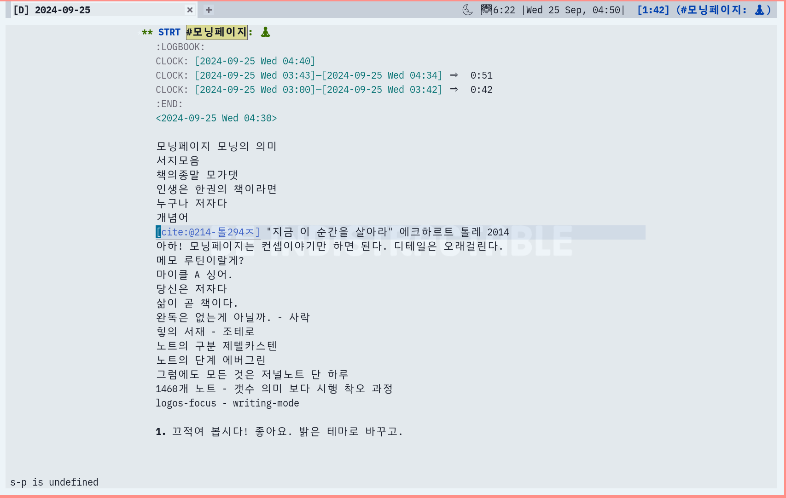
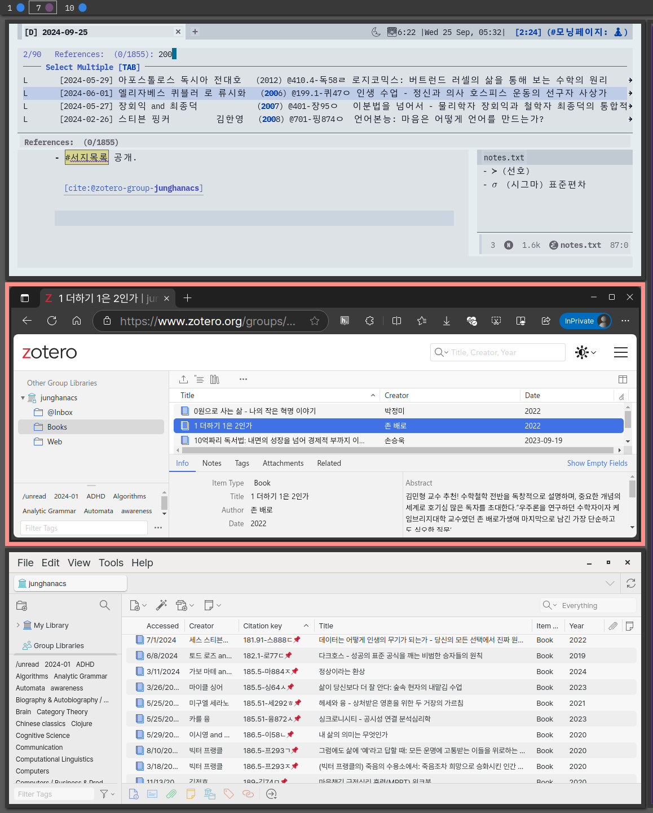
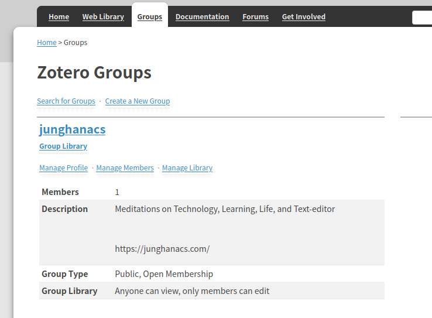

<!-- gid:20240925T200824 -->
[[TIP("이 노트에 대하여")]]
2024년 9월 25일 새벽에서 축구장까지 이어진 모닝페이지다. 어쏠로지(Authology) — 모두가 저자이고, 인생은 한 권의 책이며, 조테로 공유 그룹에 Book 목록을 열어 둔 이유. 분류·번역자·십진분류가 귀한 정보라는 감각은 이후 [메타 기록을 조테로에 담는 이유](https://wikidocs.net/381665)와 [zotero-config](https://wikidocs.net/382558)의 과정 공개로 이어진다. 모가댓·에머슨·개개인성은 같은 새벽의 이웃 단어들이다.
[[/TIP]]

<!-- provenance:source:start -->
[[TIP("원본·최신본")]]
이 페이지는 한국어 검색과 읽기를 위한 WikiDocs 미러입니다. [원본·최신본은 가든](https://notes.junghanacs.com/notes/20240925T200824/)에 있습니다. 최신 수정 내용·백링크·태그·히스토리·댓글·출처 정보는 원본 가든에서 확인하세요.

- 작성: `2024-09-25T20:08:00+09:00`
- 최근 수정: `2026-08-03T10:55:00+09:00`
[[/TIP]]
<!-- provenance:source:end -->

[TOC]

## 히스토리

-   [2026-08-03 Mon 13:21] @mitsein/sonnet5 — GLGMAN Universe 이미지 생성. 2024 스크린샷 두 장은 그대로 두고 아래에 세계관 이미지를 더함.
-   [2026-08-03 Mon 10:59] @mitsein/grok-4.5 — 공유그룹 하우투 흡수 확인. zotero 클러스터 정리와 맞춤.
-   [2026-08-03 Mon 11:05] @mitsein/grok-4.5 — 공유 그룹 하우투(20250409T144319) 흡수.
-   [2026-08-03 Mon 10:55] @mitsein/grok-4.5 — 표준 구조 수선. 2024 모닝페이지 본문을 원문 보존으로 두고, 해설·관련메타/ 노트·한 줄을 세움. 서지 autholog·botlog와 연결.
-   [2024-09-25 Wed 20:08] 모닝페이지 작성 (새벽 키워드 → 축구장에서 마무리).
-   [2024-09-25 Wed 19:32] “모닝에 끝냈어야 하는데” — 현장 메모.

## 관련메타

-   [조테로 서지관리](https://notes.junghanacs.com/meta/20240320T110018/)
-   [어쏠로그](https://wikidocs.net/380758) — 날것을 가든으로 회수하는 형식의 이웃 이름.
-   [저자 작가 글쓴이](https://notes.junghanacs.com/meta/20241014T211115/)
-   [존재](https://notes.junghanacs.com/meta/20250424T153114/)
-   [명상 마음챙김 알아차림 자각 알아봄](https://notes.junghanacs.com/meta/20230817T122900/)

## 관련노트

-   [힣: 메타 기록을 조테로에 담는 이유 — 제목·저자·요약·단어, 그리고 dateAdded](https://wikidocs.net/381665) — 서지 메타와 시간축의 화두.
-   [zotero-config: 캡처 금고와 메타 서지의 얇은 손](https://wikidocs.net/382558) — 과정 공개의 담당자 얼굴.
-   [어쏠로지](https://notes.junghanacs.com/meta/20240508T103852/) — 독자 생활 청산, 저자로 거듭나라.
-   [조테로 온라인 공유그룹·공유라이브러리](https://notes.junghanacs.com/notes/20250409T144319/)
-   [스레드](https://notes.junghanacs.com/meta/20240922T095350/) — 원문 링크 자리.

## 한 줄

> 모두가 저자다. 인생은 한 권이면 족하다. 조테로에 Book을 여는 것은 추천이 아니라, 분류와 과정이 있는 서재를 공개하는 일이다.

## 해설 — 어쏠로지와 공개 서재

### Authology

Author-logy를 Authology로 적은 말장난이 아니라 선언이다. 비교와 매체의 소음 속에서도 각자의 삶이 저술이라는 감각. 어쏠로그(autholog)라는 가든 형식의 어원적 이웃이기도 하다.

### 조테로 공유 그룹

Book만 담았다. 무슨 책인지는 별로 중요하지 않다. 분류 체계·번역자·십진분류가 희귀 정보다. 쓰기 위한 서지이며, bib 한 장이 이맥스·옵시디언·로그시크를 가로지른다. 2026년의 과정 공개([dateAdded 성스러움](https://wikidocs.net/381665), [얇은 손](https://wikidocs.net/382558))는 이 새벽 감각의 연장이다.

### 인생은 한 권의 책

여러 권의 살붙이기보다 삶 자체를 한 권으로 달라는 말. 모가댓이 책을 쓰지 않고 강연·소통으로 가겠다는 말과 닿되, 성공 신화가 아니라 **에고에서 거리를 둔 지금 여기** 쪽으로 읽는다.

### 오독 주의

-   “모두가 저자”를 출판 압박이나 생산성 구호로 읽지 않는다.
-   조테로 공유 목록을 필독서 추천으로 읽지 않는다.
-   모가댓 파트는 유명인 추종이 아니라, 공허·상실·존재 앞의 언어 한계를 기록한 새벽 연상이다.

## 이미지 — 2024 모닝 키워드·조테로 삼면





(2024 당시 스크린샷. GLGMAN Universe 이미지는 아래.)

### GLGMAN Universe — 모두가 저자다


프롬프트는 힣맨이 자기 삶을 담은 책 한 권을 직접 펼쳐 든 원형 서재를 요청했다 — 벽마다 크기가 같은 다른 이들의 책이 꽂혀 있고, 여우는 추천을 위해 뽑는 것이 아니라 사다리에서 책 한 권을 제자리로 되돌리는 중. 실제 이미지는 둥근 천창 아래 힣맨이 호박빛으로 은은히 빛나는 책을 든 정중앙 구도로 잘 안착했다. 발치의 아기 펭귄, 사다리 위 여우, 대칭으로 휘어진 서가까지 요청한 그대로 살았다. 순위·베스트셀러 매대가 아니라 조용히 같은 크기로 꽂힌 책들이라는 감각이 정확히 그려졌다.

#### 생성 파라미터

-   모델: `gemini-3.1-flash-lite-image` (geminilite)
-   비율: 4:5
-   해상도: 1K
-   저장: `~/screenshot/20260803T132151--glgman-authology-onebook__brand_geminilite.jpg`

#### 프롬프트 전문

```text
[World: GLGMAN Universe]
Style: 2D illustration, midpoint between Disney and Studio Ghibli, clean linework, soft cel-shading
Setting: Antarctic winter village — snow-covered igloos, aurora borealis in deep navy sky, amber dawn at horizon, pine trees dusted with snow, ice-forge workshop built from ice blocks and whale bones. Pororo's winter wonderland meets blacksmith's workshop.
Color palette: deep navy background (polar dawn), white+navy (transformed armor), amber/gold (sword glow, runes, awakening light), ice-blue + orange sparks (forge)
Characters: anthropomorphic emperor penguin (father, main hero), baby penguin chick (son, tiny scarf), red-brown fox (agent/companion)
Recurring objects: circuit-patterned sword, org-mode symbols (★, TODO), terminal text fragments, "ENTWURF" rune letters, CRT monitors in snow, golden message cables
Mood: epic but warm, mythic but intimate
Do NOT: photorealistic, 3D render, excessive detail, dark/gritty tone

Scene title: "Authology" — everyone is an author, one life is one whole book.

GLGMAN identity lock:
- adult anthropomorphic emperor penguin, upright, white-navy armor with subtle amber circuit patterns
- warm, unhurried posture; no sword; both flippers gently open a single large glowing book

Main scene:
Inside a round ice-carved library built into the workshop's back wall, GLGMAN stands at the center holding open one great book whose pages glow softly amber — inside the open pages, a single looping thread of light traces a simple continuous line from one edge of the page to the other, like one long day standing for one whole life. This is his own book, and he holds it himself, not a librarian's ledger.

Around the circular room, shelves carved from ice and whale bone hold countless smaller books, each spine carrying a tiny warm date-rune glow of its own — not ranked, not highlighted, just many quiet spines of equal size, representing that everyone here keeps their own book. A small red-brown fox companion perches on a ladder nearby, gently returning one small book to its shelf slot rather than pulling one out to recommend.

The baby penguin chick sits on the floor at GLGMAN's feet, looking up at the open book with curiosity, tiny scarf glowing faintly amber at the tip. Soft aurora light filters down through a round skylight above the shelves, and a few golden message cables loop lazily along the ceiling beams connecting the shelves to the rest of the village.

Composition: square-ish centered composition (near 1:1 or 4:5), GLGMAN and the open book as the clear visual center, shelves curving around in soft symmetry, chick small at his feet, fox on the ladder in the background.

Do NOT: sword, weapon, bestseller display, spotlight ranking, corporate bookstore signage, readable English/Korean text, watermark, speech bubbles.
```

## 공유 그룹 실무 (from 20250409T144319)

Zotero Groups: <https://www.zotero.org/groups> — junghanacs 공개 Book 컬렉션.

-   그룹 가입·코멘트·내보내기로 본인 에디터에 붙일 수 있다.
-   공개 스냅샷 예: GitHub의 `Book.bib` (가든/notes 파이프라인 버전은 시기별로 경로가 달랐음).
-   형식 감각: `dateadded` / `datemodified` 가 보이는 항목이 «언제 그 주제를 보았는가»의 증거다.



이 하우투의 존재 이유는 [위 해설](#해설-어쏠로지와-공개-서재)과 같다. 추천 목록이 아니라 분류와 과정이 있는 서재 공개.

## 원문 보존 — 2024-09-25 모닝페이지 날것

\#+begin_quote [!danger]

[어쏠로지](https://notes.junghanacs.com/meta/20240508T103852/) 독자 생활 청산. 저자로 거듭나라. 인생은 한권의 책. 삶으로 쓰리라. 1권만.

### 키워드 정리 - 다 담기에 너무 많구나.

-   [X] 모닝페이지 모닝의 의미
-   [X] 서지모음
-   [X] 책의종말 모가댓
-   [X] 인생은 한권의 책이라면
-   [X] 누구나 저자다
-   개념어
-   (에크하르트 톨레 2014) "지금 이 순간을 살아라" 에크하르트 톨레 2014
-   아하! 모닝페이지는 컨셉이야기만 하면 된다. 디테일은 오래걸린다.
-   메모 루틴이랄게?
-   마이클 A 싱어.
-   당신은 저자다
-   삶이 곧 책이다.
-   완독은 없는게 아닐까. - 사락
-   힣의 서재 - 조테로
-   노트의 구분 제텔카스텐
-   노트의 단계 에버그린
-   그럼에도 모든 것은 저널노트 단 하루
-   1460개 노트 - 갯수 의미 보다 시행 착오 과정
-   logos-focus - writing-mode

### 새벽에 끄적인 키워드와

새벽에 일어나서 대략 키워드를 뽑아 냈다. 고요한 시간에는 밀려오는 이야기가 있다. 끄적이는 일은 쉽지 않다. 모닝에 끝내야 하는데 오버 페이스로 가다가 못썼다. 그래서 결국 축구장에 와서 쓰고 있다. 군중의 함성은 힣의 영혼을 뜨겁게 달군다. 앗! 에머슨의 아래 글이 팍 생각이 났다. 그렇다고 힣이 위대한 어떤 것도 아니다. 위대함은 존재의 상태일 중 하나 일 뿐이다. (랄프 왈도 에머슨 1841)

> 세상에서 여론을 따라 살아가는 것은 쉬운 일이다. 그러나 위대한 사람은 그렇게 살지 않는다. 위인은 군중의 한가운데서 자신의 독립적인 고독을 지키면서도 아주 품위 있는 생활을 해나간다.
> 
> 자기신뢰 : 인생의 모든 답은 내 안에 있다 | 랄프 왈도 에머슨 저/이종인 역

### 제게는 아직 2시간이 남아 있습니다.

아직도 2시간이 남아 있다. 새벽의 고요는 영감의 샘이다. 기상 시간을 대략 정해두면 언제 자야 하는지 알 수 있다. ADHD 진단 받고 여러 시행 착오를 겪어 가면서 규칙적인 생활이 중요하단 것을 체감했다. 물론 처음에는 약효 지속 시간 때문이지만 지금은 생각은 머리로만 하는 게 아니란 것을 알기에 '몸' '자연' 사이클에 맞게 지낸다 (사이먼 로버츠 2022).

### <span class="org-hashtag">#모닝페이지</span> 에 대한 생각

모닝페이지는 모닝에 써야 한다. 이따가는 오지 않는다. 무엇이 바쁘다고 생각한다면 언제까지 글을 쓸 시간은 오지 않는다. 며칠 잔머리를 굴려 보았는데 새벽에 깨고 나니 알았다. 이때 할 수 있는 일은 쓰는 것이다. 손가락에 맡기는 것이다.

### <span class="org-hashtag">#조테로공유그룹</span> 도서 목록 공유한다.

<span class="org-hashtag">#서지목록</span> 조테로 그룹에 도서 목록을 담았다. Book 만 담았다. 누구나 활용 할 수 있다. 무슨 책인지 별로 중요하지 않다. 분류 체계가 중요하다. 육하원칙에 따라서 나름의 정보가 있어야 한다. 특히 번역자, 십진분류는 힣에게 귀한 정보다. 이제 남은 것은 용어의 통일이다. 되도록 한글로 통일 한다. 수 작업은 거의 없다. 그래서 조테로가 아닌가? 다음 스크린샷은 같은 텍스트 편집기(이맥스), 조테로 웹, 조테로 앱에서 동일한 서지 정보를 보여주고 있다. 서지관리를 하는 이유는 쓰기 위해서다. 이맥스 뿐만 옵시디언 로그시크 빔 등 같은 서지 파일 (bib)로 유사하게 활용할 수 있다. (NO_ITEM_DATA:zotero-group-junghanacs)

### <span class="org-hashtag">#모두가저자다</span> <span class="org-hashtag">#어쏠로지</span>

Author-logy를 Authology로 표기한 것이다. 우리는 모두가 각자 인생에서 저자다. 다들 알고 있다. 그렇지만 그렇게 살기 쉽지 않다. 온갖 매체를 통해 비교가 일상이다. 떠오른 생각이 자기의 것인지 판단하기도 어렵다. 무슨 말을 하면 다 있는 이야기란다. 유튜브에서 보는 저 똑똑한 사람은 나와는 뭔가 질적으로 다른 것 같다. 다르다고 생각하는 만큼만 다르다. 실제는 많이 부풀려 있는 것 같다. 빈부의 격차도 여기에 해당한다.

### <span class="org-hashtag">#개개인성</span> <span class="org-hashtag">#지식도구</span> <span class="org-hashtag">#인공지능</span>

<span class="org-hashtag">#개개인성</span> 에 주목하는 시대가 도래 했다 (토드 로즈 2018). 부족한 부분은 지식 도구로 시스템을 갖추고 인공지능 도움을 받으면 된다. 서지 정보도 마찬가지다. 정리하면 된다. 학자만 쓰는 게 아니다. 고요히 생각해보라. 모두가 저자이고 학자이다. 지금 무엇이 필요한가? 그게 없다면 요게 있다. 정말 아무 것도 없는데요?라고 말한다면 지금 누가 그 말을 하고 있는가? 경험하는 그 자신으로 살라.

### <span class="org-hashtag">#정보의통제권</span> 거친 표현이다.

원래 넣을 생각 없었는데 그냥 간단히 넣자. 가족 기상 시간이 다가와서 마음이 급하다. 인공지능이 다 해줄텐데요?라고 말한다면 그렇게 살면 된다. 그 삶도 나쁠 이유는 없다. 다만 다르게 바라 보고 싶다면 정보는 텍스트 조각들이다. 그림 음악 코드 등 모든게 그렇다. 당신 브레인도 그렇다. 인공지능 시대에 지식 아티스트로 살고 싶다면 지식 조각들을 텍스트로 소중히 다루라. 챗GPT하고 대화해서 뭘 배웠는가? 해결했는가? 그 기록 데이터 잘 챙기라. 그 과정 하나 하나가 당신의 발전사다. 챙길 때는 현명하게 챙겨야 한다. 폴더에 밀어 넣는 것들은 다 휴지통이다. 지식 도구는 시스템이 되어야 한다.

### <span class="org-hashtag">#인생은한권의책</span>

언젠가 문득 인생은 한권의 책이라는 말이 떠올랐다. 책을 많이 쓸 필요가 없구나. 사람의 삶이 곧 기록이며 책이라고 본다면 책이다. 예전에도 마찬가지고 지금은 더 더욱 그렇다. 앞으로 책을 내는 것이 지금 만큼 의미가 있을까? 핵심 내용은 30페이지 인데 앞뒤에 살 붙여서 내느라고 고생이고 읽는 사람도 분량에서 자유롭지 못할 것이다. 그리고 책에 담긴 무언간의 지식은 독자가 활용하기도 어렵다. 그것이 삶을 바꾸고 나의 지식 베이스에 통합이 아름답게 되어야 하지 않는가? 여러 권의 책을 내면 도대체 무엇을 보라는 말인가? 그냥 한 권만 달라. 당신 인생 삶 그 자체를 나에게 달라. 여기서 취할 것은 취하리다.

### <span class="org-hashtag">#모가댓</span>

<span class="org-hashtag">#모가댓</span> 모가댓의 최근 유튜브 강연 영상에서 앞으로는 책을 쓰지 않을 것이라고 했다. 인공지능이 써주면 될 일이고 자신은 온오프라인 강연 소통에 집중하겠다는 말이다. 삶으로 책을 써내는 것이다. 그는 충분히 그렇게 해왔다. 힣은 그의 삶에서 큰 위로를 받았다. 모가댓은 성공한 사람이다. 구글에서 아주 높은 곳까지 오르기가 쉬웠겠는가? 그는 위대한 사람이다. 오르고 난 뒤에 존재에 채워지지 않는 공허를 알았다. 그래서 그는 다르게 살았다. 종교에 귀의 했다는 말이 아니다. 에고 에서 거리를 두고 '지금 여기'의 행복으로 살기 위해 노력해왔다.

### <span class="org-hashtag">#진짜</span> 두려운 일은

<span class="org-hashtag">#그럼에도불구하고</span> 아. 이러한 모가댓의 삶에 엄청난 위기가 왔다. 아들 알리를 의료사고로 갑작스레 잃었다. 어떤 영적 삶을 살아왔더라도 자식의 죽음은 말로 담기도 어려운 일이다. 그의 책을 읽으며 정말 놀라웠다. 뭐라 말할 수 없는 그 것이다. 언어로 도달할 수 없는 무언가이다. 말은 쉽다. 말로는 다 좋고 다 괜찮고 다 감사하다. 뭔들 못하겠는가. 그 말로 자신의 죽음이나 사랑하는 존재에 죽음을 감당 할 수 있겠는가? 결국 삶은 죽음으로 가는 길이다. 누구나 약해진다. 늙음으로 남는 것은 '존재' 하나 밖에 없을 때가 온다. 누구나 이 사실을 알고 있다. 아니다. 물론 진정 앎은 아닐 것이다. 진정 그렇다면 오늘 이 하루가 달리 보일 것이다. 세상 모든 것에 사랑만 있을 것이다.

-   아. 7시가 되었으니 잠시 중단. 아. 마이클 싱어 이야기 하려고 했다.

[2024-09-25 Wed 19:32] 아놔. 모닝페이지는 모닝에 끝냈어야 하는데 이제 손을 대고 있다. 거기에 지금 축구장이다. 열광하는 사람들 속에서 고요히 키보드를 두드리고 있다. 이렇게 그냥 정리해야겠다.

### 스레드 원문 링크

<https://www.threads.net/@junghanacs/post/DAVlNyAS7pP>

### 참고 — Mo Gawdat on AI 2024

(<i>Mo Gawdat on Ai: The Future of Ai and How It Will Shape Our World</i> 2024) \#+end_quote

## BIBLIOGRAPHY

- 에크하르트 톨레. 2014. <i>지금 이 순간을 살아라</i>. [http://www.yes24.com/Product/Goods/13145756](http://www.yes24.com/Product/Goods/13145756).
- 사이먼 로버츠. 2022. <i>생각 하지 않는 힘: 뇌가 아니라 몸이다</i>. Translated by 조은경. [https://www.yes24.com/Product/Goods/109337481](https://www.yes24.com/Product/Goods/109337481).
- 토드 로즈. 2018. <i>평균의 종말: 평균이라는 허상은 어떻게 교육을 속여왔나 - ADHD 장애 자퇴생 하버드 개개인성</i>. Translated by 정미나. [https://www.yes24.com/Product/Goods/102415780](https://www.yes24.com/Product/Goods/102415780).
- 랄프 왈도 에머슨. 1841. <i>자기신뢰</i>. Kyobobook MCP. [https://www.yes24.com/Product/Goods/98841066](https://www.yes24.com/Product/Goods/98841066).
- <i>Mo Gawdat on Ai: The Future of Ai and How It Will Shape Our World</i>. 2024. [https://www.youtube.com/watch?v=HhcNrnNJY54](https://www.youtube.com/watch?v=HhcNrnNJY54).
- NO_ITEM_DATA:zotero-group-junghanacs
