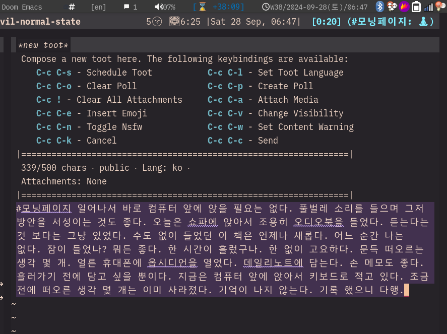
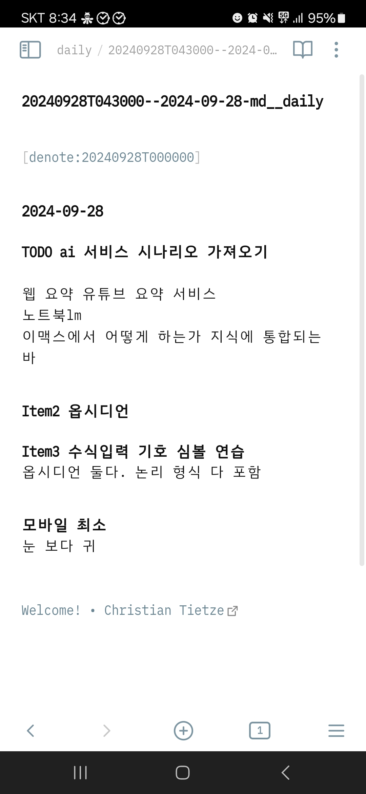
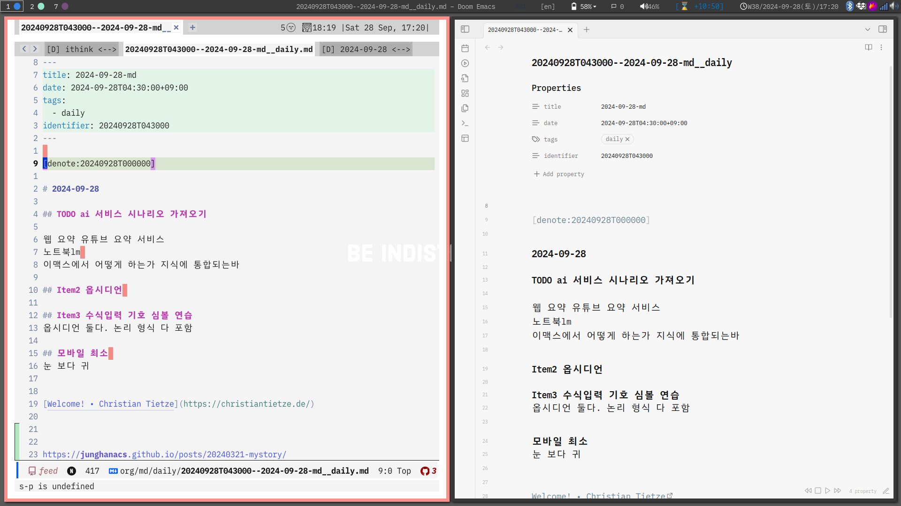

<!-- gid:20240928T141333 -->
[TOC]

[[TIP("이 노트에 대하여")]]
새벽의 고요 속에서 떠오르는 영감을 스마트폰 데일리 노트에 붙잡아 두는 장면을 서정적으로 기록한다. 오디오북과 모닝페이지, 모바일 워크플로우가 하나의 존재 방식처럼 엮여 있다.
[[/TIP]]

## BIBLIOGRAPHY

- 마이클 싱어. 2014. <i>상처받지 않는 영혼: 내면의 자유를 위한 놓아보내기 연습</i>. Translated by 이균형. 서울: 라이팅하우스. [https://www.yes24.com/Product/Goods/12981014](https://www.yes24.com/Product/Goods/12981014).
- 미하이 칙센트미하이. 1999. <i>몰입의 즐거움</i>. Translated by 이희재. [https://www.yes24.com/Product/Goods/101506519](https://www.yes24.com/Product/Goods/101506519).
- 칼 뉴포트. 2024. <i>슬로우 워크 - 덜 일함으로써 더 좋은 결과를 내는 법</i>. Translated by 이은경. [https://www.yes24.com/Product/Goods/133736138](https://www.yes24.com/Product/Goods/133736138).

## 인트로

영감을 찾는 자. 만나리라. 해뜨기 전에 일어나서 기다리리라. 만났다. 영감 요놈. 꽝 없는 뽑기.

## Inspiration 영감이여! 오소서!

모닝페이지 일어나서 바로 컴퓨터 앞에 앉을 필요는 없다. 풀벌레 소리를 들으며 그저 방안을 서성이는 것도 좋다. 오늘은 쇼파에 앉아서 조용히 오디오북을 들었다. 들었다? 그냥 틀어 놓았다. 수도 없이 들었던 이 책은 언제나 새롭다 (마이클 싱어 2014). 어느 순간 나는 없다. 잠이 들었나? 뭐든 좋다. 한 시간이 흘렀구나. 한 없이 고요하다. 문득 떠오르는 생각 몇 개. 얼른 휴대폰에 옵시디언을 열었다. 데일리 노트에 담는다. 손 메모도 좋다. 흘러가기 전에 담고 싶을 뿐이다. 지금은 컴퓨터 앞에 앉아서 키보드로 적고 있다. 조금 전에 떠오른 생각 몇 개는 이미 사라졌다. 기억이 나지 않는다. 다행히 기록 했다. Inspiration (영감)은 신의 숨결이라는 뜻이란다. 힣은 일정 계획 마무리가 매우 서툴다. ADHD의 대표적인 증상이리라곤 하지만, 요즘 누구나 겪는 어려움일 것이다. 힣은 언젠가부터 내맡기고 있다. 줍줍 기법이라고 하자. 칼 뉴포트의 Slow Productivity도 말하는 바, 덜어낼 것들은 줄인다. 자연스러운 흐름에 자기를 맡긴다. 하고자 하는 그 일에 퀄리티에 집중한다라고 요약할 수 있다 (칼 뉴포트 2024). 그 일이 곧 예술이 되는 것이다. 적절하다. 잊고 있던 인간의 방식이 아닐까 싶다.

## 그 영감이 뭐길래?

옵시디언 그래서 영감 받은게 뭔가? 이거 적었다. 나올 대단 한 것은 없다. 단지 바라는 바 오늘 하루 즐겁게 할 작은 일이다. 머리로 다 한다고 생각할 때. 언제나 그 많은 것들에 압도 되고 만다. 그저 흐름을 타고 나아가는 것. 미하이 칙센트미하이의 몰입의 즐거움에서 가장 놀라운 부분은 8장 자기목적성, 9장 운명애 가 아닐까? (미하이 칙센트미하이 1999)

## #모바일 #워크플로우 #통합 옵시디언 이맥스

[2024-09-28 Sat 17:14]

항상 노트북 앞에서 있을 수 없다. 항상 휴대하는 스마트폰은 좋은 캡처 도구다. 수 많은 메모, 노트 툴이 있다. 튜닝의 끝은 순정이라는 말이 문뜩 떠오른다. 결국 어느 것에도 의존할 필요는 없다. 그러면서도 지식 체계 아래 자연스럽게 통합이 되어야 한다. 이러한 맥락에서 노트 관리는 별도의 데이터베이스에 의존성이 없이 구성한다. 단지 파일 이름의 규칙이 있을 뿐이다. 이맥스의 Org 모드에도 노트 체계 그 자체는 의존성이 없다. 그렇기 때문에 모바일에서는 어떤 툴이든 상관 없다. 왜 옵시디언인가? 현 시점에서 간단하고 편리하기 때문이다. 옵시디언에 의존성이 없다. 이 툴은 여러 모로 노트북에서도 유용한 시작점이 될 수 있다. 아래와 같이 옵시디언을 열면 만나는 데일리 노트는 이맥스에 기존 노트 체계에 아래 있다. 어떻게 가능한가? "%Y%m%dT%H%M%S--title\__tag.md" 파일 이름의 공통 규칙을 따르기 때문이다. 좋은 만남이다.

## #관련노트

-   [마이클 싱어 (2014) 상처받지 않는 영혼: 내면의 자유](https://wikidocs.net/381909)
-   [칼 뉴포트 (2024) 슬로우 워크 - 덜 일함으로써 더 좋은 결과를 내는 법](https://wikidocs.net/382039)
-   [미하이 칙센트미하이 (1999) 몰입의 즐거움](https://wikidocs.net/382026)

## #링크

-   스레드 원문 링크 <https://www.threads.net/@junghanacs/post/DAb_XOZTd1Q>
-   조테로 공유 라이브러리 <https://www.zotero.org/groups/5570207/junghanacs/library>
-   네이버블로그 [어쏠로지 라이프 : 네이버 블로그 - blog.naver.com](https://blog.naver.com/junghanacs/223599337449)
-   티스토리 [#모닝페이지 #영감 #상처받지않는영혼 #슬로우워크 - living-with-adhd.tistory.com](https://living-with-adhd.tistory.com/252)

## 용어

자기목적성
: ‘autotelic’은 그리스어 ‘auto(자기)’와 ‘telos(목적)’가 결합한 말이다. 그 일 자체가 좋아서 할 때 그 일을 경험하는 것 자체가 목적이 될 때를 우리는 자기목적적이라고 한다. 몰입의 즐거움

운명애
: Love of Fate - 몰입의 즐거움
