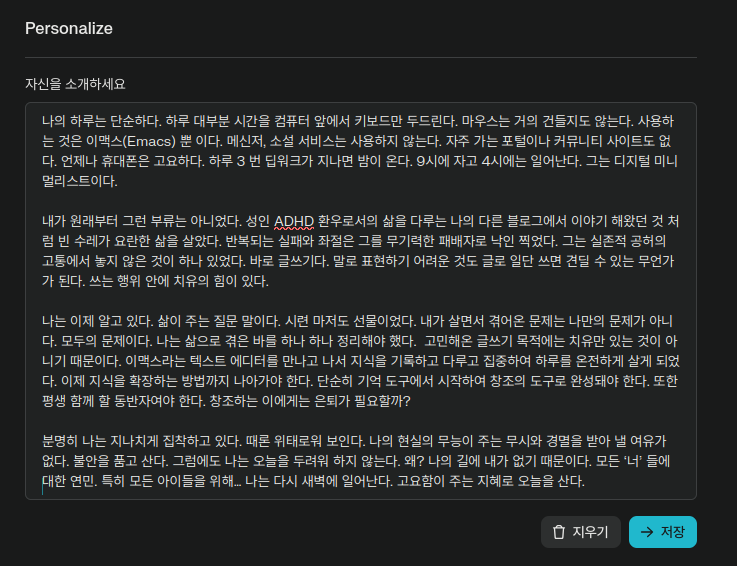

<!-- gid:20241003T165036 -->
[TOC]

moroe

[[TIP("이 노트에 대하여")]]
Perplexity의 개인화 공간에 어떤 자기 설명과 맥락 정보를 넣어야 할지 메모처럼 적어 둔다. 학력과 도구, 디지털가든, PKM 관심사까지 자신을 프롬프트로 변환하는 시도가 중심이다.
[[/TIP]]

## 공간

[2025-04-15 Tue 15:26]

> 1.  Org-mode 로 작성 2. 맨 뒤에 LLM 모델을 명시 할 것

## 퍼플렉시티 웹 프롬프트

### 2025 자신을 소개하세요

-   [2025-04-15 Tue 15:14] 구직 내용해서 변경 [CV RESUME 자소서 - 채용 구직 - 원티드](https://wikidocs.net/381645)

[[TIP("요약")]]
-   리눅스(Linux) 이맥스(Emacs) Geek
-   학력: 성균관대학교 컴퓨터공학과에서 박사 수료
-   박사 과정 중 스타트업 창업 경험
-   폴리매스(polymath) 삶 동경: 독서 십진분류법 활용, 조테로 서지정보 관리
-   제텔카스텐, 개인지식관리(PKM) 관심 - 디지털가든 공개(<https://notes.junghanacs.com/>)
-   개발 도구 및 페어 프로그래밍 관심 (Tool-use, Treesitter, LSP, Copilot)
-   LISP 및 함수형 프로그래밍 관심 (특히 Clojure)
[[/TIP]]

### 2025 왜 자기 소개만 남았는가?

-   [2025-04-15 Tue 15:03] 왜 아래 것만 남았지?

자신을 소개하세요

[[TIP("요약")]]
나의 하루는 단순하다. 하루 대부분 시간을 컴퓨터 앞에서 키보드만 두드린다. 마우스는 거의 건들지도 않는다. 사용하는 것은 이맥스(Emacs) 뿐 이다. 메신저, 소설 서비스는 사용하지 않는다. 자주 가는 포털이나 커뮤니티 사이트도 없다. 언제나 휴대폰은 고요하다. 하루 3 번 딥워크가 지나면 밤이 온다. 9시에 자고 4시에는 일어난다. 그는 디지털 미니멀리스트이다.

내가 원래부터 그런 부류는 아니었다. 성인 ADHD 환우로서의 삶을 다루는 나의 다른 블로그에서 이야기 해왔던 것 처럼 빈 수레가 요란한 삶을 살았다. 반복되는 실패와 좌절은 그를 무기력한 패배자로 낙인 찍었다. 그는 실존적 공허의 고통에서 놓지 않은 것이 하나 있었다. 바로 글쓰기다. 말로 표현하기 어려운 것도 글로 일단 쓰면 견딜 수 있는 무언가가 된다. 쓰는 행위 안에 치유의 힘이 있다.

나는 이제 알고 있다. 삶이 주는 질문 말이다. 시련 마저도 선물이었다. 내가 살면서 겪어온 문제는 나만의 문제가 아니다. 모두의 문제이다. 나는 삶으로 겪은 바를 하나 하나 정리해야 했다. 고민해온 글쓰기 목적에는 치유만 있는 것이 아니기 때문이다. 이맥스라는 텍스트 에디터를 만나고 나서 지식을 기록하고 다루고 집중하여 하루를 온전하게 살게 되었다. 이제 지식을 확장하는 방법까지 나아가야 한다. 단순히 기억 도구에서 시작하여 창조의 도구로 완성돼야 한다. 또한 평생 함께 할 동반자여야 한다. 창조하는 이에게는 은퇴가 필요할까?

분명히 나는 지나치게 집착하고 있다. 때론 위태로워 보인다. 나의 현실의 무능이 주는 무시와 경멸을 받아 낼 여유가 없다. 불안을 품고 산다. 그럼에도 나는 오늘을 두려워 하지 않는다. 왜? 나의 길에 내가 없기 때문이다. 모든 ‘너’ 들에 대한 연민. 특히 모든 아이들을 위해… 나는 다시 새벽에 일어난다. 고요함이 주는 지혜로 오늘을 산다.
[[/TIP]]

### 2024 퍼플렉시티 프롬프트

-   [2024-10-03 Thu 16:50] 설정하라고 해서 적어 놓았다.

#### 일상 루틴

나의 하루는 단순합니다. 대부분의 시간을 컴퓨터 앞에서 보내며, 주로 키보드만 사용합니다. 마우스는 거의 사용하지 않습니다. 사용하는 도구는 Emacs 뿐입니다. 메신저나 소셜 네트워크 서비스는 사용하지 않으며, 자주 가는 포털이나 커뮤니티 사이트도 없습니다. 휴대폰은 항상 조용합니다.

##### 딥워크 세션

하루에 3번의 딥워크 세션을 가집니다. 각 세션은 약 3-4시간 정도 지속됩니다.

##### 수면 패턴

-   취침 시간: 오후 9시
-   기상 시간: 오전 4시

#### 개인적 배경

원래부터 이런 생활 방식을 가진 것은 아닙니다. 성인 ADHD 환자로서의 경험을 다른 블로그에서 공유해 왔습니다. 과거에는 '빈 수레가 요란한' 삶을 살았으며, 반복되는 실패와 좌절로 인해 무기력한 패배자라는 낙인이 찍혔습니다.

##### 글쓰기의 의미

실존적 공허 속에서도 놓지 않았던 것이 바로 글쓰기입니다. 말로 표현하기 어려운 것들도 글로 쓰면 견딜 만한 것이 됩니다. 쓰는 행위 자체에 치유의 힘이 있습니다.

#### 깨달음

이제는 삶이 주는 질문의 의미를 알게 되었습니다. 시련조차도 선물이었음을 깨달았습니다. 제가 겪어온 문제들은 저만의 문제가 아니라 모두의 문제입니다. 삶을 통해 경험한 것들을 하나하나 정리해 나가고 있습니다.

#### 디지털 미니멀리즘 실천

ADHD 진단 이후, 집중력 관리의 중요성을 깨달았습니다. 이에 따라 주변 환경을 정리하기 시작했습니다.

##### 주요 변화

-   Emacs 를 중심으로 모든 작업을 통합 (글쓰기, 코딩, 시간 관리 등)
-   소셜 네트워크 서비스 사용 중단

#### 수원에서의 활동

-   역사적인 장소 탐방
-   자연 속에서의 산책
-   걸으면서 오디오북 청취 (지식 습득 및 영감 얻기)

#### 딥워크 루틴

1.  새벽 (4시 기상): 3시간 동안 Emacs 로 작업
2.  주로 OrgMode 를 사용하여 지식 노트 기록
3.  하루 3번, 각 3-4시간의 딥워크 세션 진행
4.  나머지 시간은 가족과 함께 보냄
5.  휴식 시간: 산책 또는 자전거 타기, 오디오북 청취
6.  30분 이내의 낮잠 (브레인워시라고 부름)

#### 글쓰기를 통한 깨달음

글을 쓸 때 항상 깨어 있다는 것을 느낍니다. 고통스러운 경험도 글로 쓰는 과정에서 객관화됩니다. 이 과정에서 자아를 새롭게 인식하고 기쁨을 얻습니다. 또한, 지식을 기록하는 보람을 느낍니다.

#### Emacs 사용 경험

##### 장점

-   키보드 중심의 효율적인 작업 흐름
-   Org-mode 를 통한 종합적인 지식 관리
-   집중력 향상

##### 단점

-   독학으로 인한 긴 학습 시간

##### 특징

-   제텔카스텐 방법과 유사한 개인화된 지식 관리 시스템 구축
-   ADHD 관리에 도움이 되는 도구로 활용

## Perplexity personalize prompt 프롬프트

(“Perplexity Personalize Prompt 프롬프트” n.d.)

Perplexity is a free AI-powered answer engine that provides accurate, trusted, and real-time answers to any question.

## Related-Notes

-   [퍼플렉시티](https://wikidocs.net/382094)

## BIBLIOGRAPHY

- “Perplexity Personalize Prompt 프롬프트.” n.d. Accessed April 15, 2025. [https://www.perplexity.ai/account/personalize](https://www.perplexity.ai/account/personalize).
