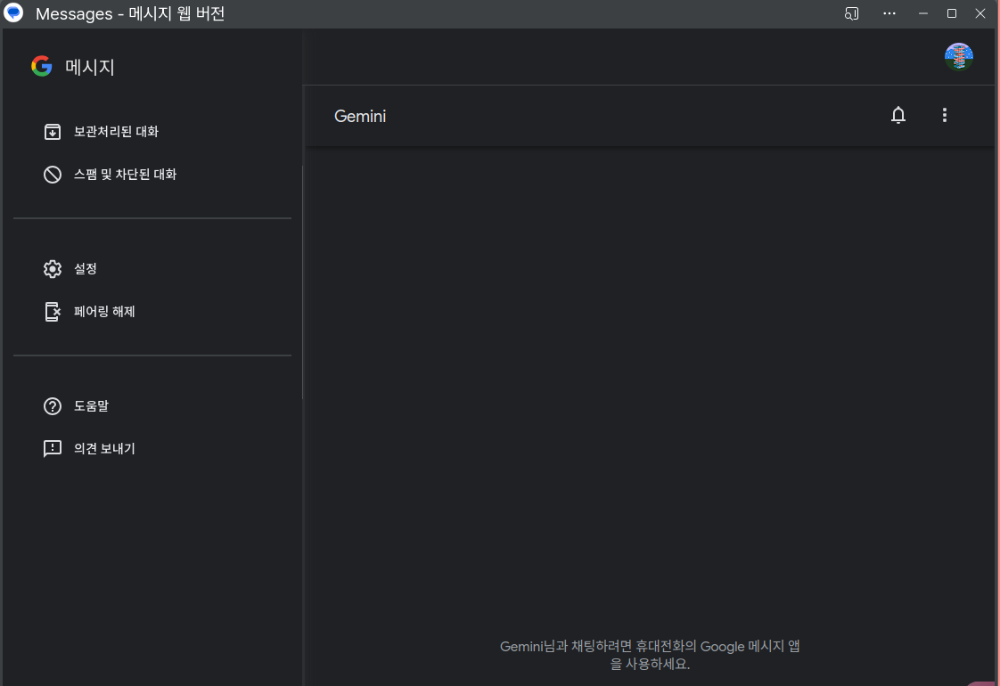

<!-- gid:20241003T172413 -->
[TOC]

[[TIP("이 노트에 대하여")]] 구글 메시지와 RCS가 카카오톡 중심 소통을 대체하거나 보완할 수 있을지 실용적으로 살핀다. 리눅스 웹앱 활용과 통합 소통이라는 기대가 디지털 미니멀리즘의 언어로 정리된다. [[/TIP]] 관련메타 - [연결 고리 링크 방향](https://wikidocs.net/380533)
-   [소통 대화 문자 연락](https://wikidocs.net/380695)

## BIBLIOGRAPHY

  “#Rcs문자 메시지 리치 커뮤니케이션 서비스 Rich Communication Services.” n.d. Accessed October 3, 2024. [https://ko.wikipedia.org/wiki/%EB%A6%AC%EC%B9%98_%EC%BB%A4%EB%AE%A4%EB%8B%88%EC%BC%80%EC%9D%B4%EC%85%98_%EC%84%9C%EB%B9%84%EC%8A%A4](https://ko.wikipedia.org/wiki/%EB%A6%AC%EC%B9%98_%EC%BB%A4%EB%AE%A4%EB%8B%88%EC%BC%80%EC%9D%B4%EC%85%98_%EC%84%9C%EB%B9%84%EC%8A%A4).

## 히스토리

-   [2025-05-25 Sun 07:59] 소통하려면 그냥 카카오톡도 해라. 그래서 한다. - [junghanacs 카카오톡 오픈프로필 오픈채팅 - 힣 _대장장이_ 인생도구](https://wikidocs.net/381726)
-   [2024-10-03 Thu 17:24] RCS 문자를 활용하면 문자 하나로 다 소통할 수 있겠다. 특히 구글메시지는 리눅스에서도 웹앱으로 사용할 수 있다. 그리고 제미나이도 활용할 수 있는데 아직 사용은 안해보았다. 디지털미니멀리즘 일부가 될 것 같다.

## #RCS문자 메시지 리치 커뮤니케이션 서비스 Rich Communication Services

(“#Rcs문자 메시지 리치 커뮤니케이션 서비스 Rich Communication Services” n.d.)

## 기기 페어링 - 리눅스 브라우저

엄청 편하다.

