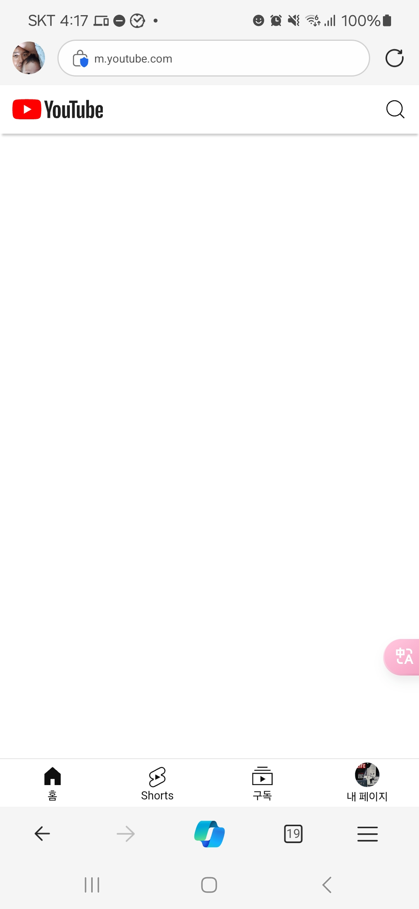

<!-- gid:20241003T173305 -->
[[TIP("이 노트에 대하여")]] 스마트폰에서 유튜브 앱을 지우고 브라우저와 Unhook 확장으로 필요한 영상만 보는 습관을 제안한다. 편리함을 줄이는 불편이 오히려 집중과 선택을 돕는다는 디지털 미니멀리즘 감각이 살아 있다. [[/TIP]] 스마트폰에서 유튜브 추천, 광고 없이 가볍게 사용하자. Unhook 설정 - 먼저 휴대폰에서 유튜브를 지운다 모바일에서 하나 넣자면 - 엣지 브라우저를 설치한다. - 엣지 -&gt; 확장 -&gt; Unhook - Remove YouiTube Recommanded and Short 활성화 - 이제 Unhook 누르면 설정 창이 보인다. 여기서 Hide Home Feed 를 켠다. - 필요하면 더 설정해보라. 끝. 이제 활용하라. 추천 광고 없다. 엣지 브라우저에서 유튜브 들어가면 다음과 같이 뜬다. 검색하거나 구독으로 가서 필요한 영상만 가볍게 보라.  그리고, 다 볼 필요 없이 요약해서 보는 것도 좋다. [2024-10-03 Thu 17:39] 이것은 다른 주제 관련메타 - [디지털미니멀리즘](https://notes.junghanacs.com/meta/20241003T173105/)
