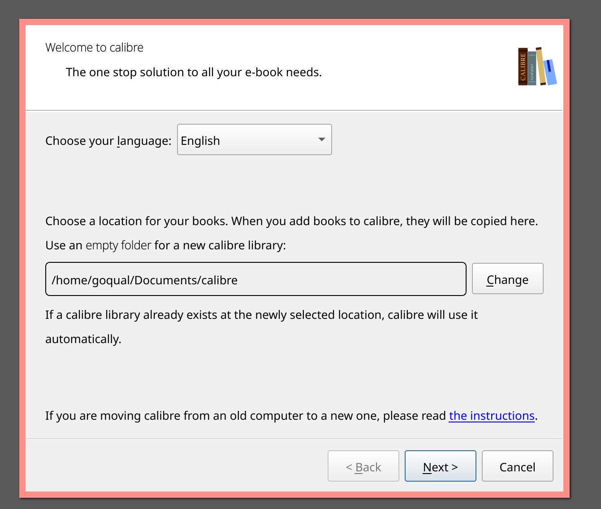
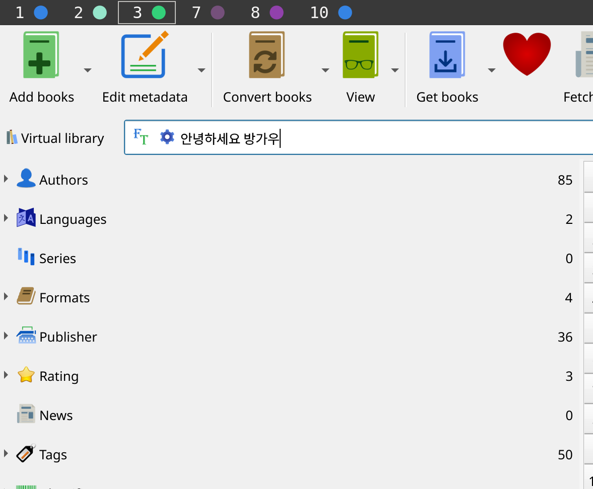
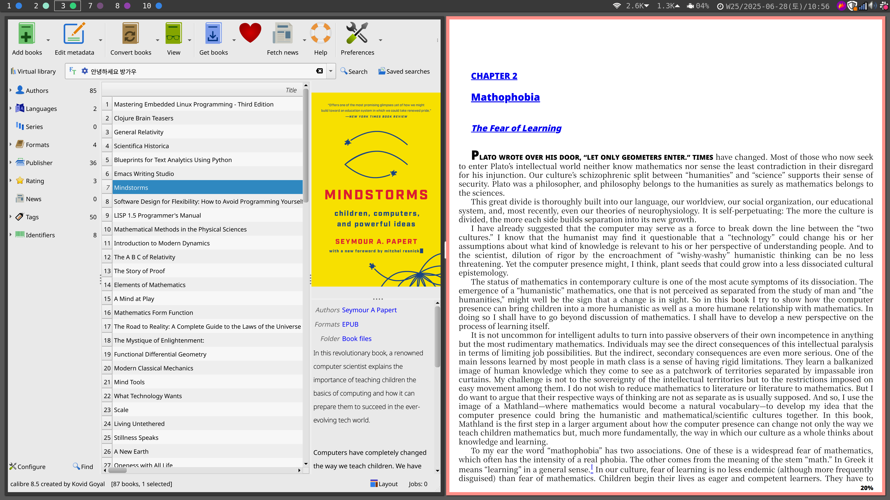

<!-- gid:20241018T120024 -->
[TOC]

[[TIP("이 노트에 대하여")]] Calibre를 전자책 관리 도구로 다시 설치하고 입력기와 환경 문제를 점검하는 기록이다. 리더기와 협업, calibredb 연동까지 이어지는 전자책 생태계의 중심 도구로 다뤄진다. [[/TIP]] 관련메타 - [ 도서 전자책 오디오북](https://wikidocs.net/380491)

## BIBLIOGRAPHY

  “Calibre - Ebook Epub.” n.d. Accessed September 1, 2024. [https://calibre-ebook.com/about](https://calibre-ebook.com/about).

## 히스토리

-   [2026-02-01 Sun 12:27] 입력기 kime 안쓰니까 한글 바로 되려나?! - [2025-06-28 Sat 10:48] [ 온보딩](https://wikidocs.net/380828) 노트북에 설치

## 키워드 calibre

-   [notes/ PDF 전자책 포멧 변환 방법 '2025-04-05 2025-04-05](https://wikidocs.net/381653)
-   [notes/ 힣: 라이브 공동편집 - 지식통합 협업 독서 대화 '2024-11-11 2025-04-04](https://wikidocs.net/381379)
-   [notes/ 전자책: 이맥스 설정 및 활용법 '2024-09-01](https://wikidocs.net/381300)
-   [notes/ 전자책: 뷰어 TTS Readest Foliate ReadEra calibredb '2024-09-01 2025-07-13](https://wikidocs.net/381299)
-   [llmlog/ #LLM: EPUB calibre 코드 구문 강조 HTML 전자책 '2025-07-13 #2025-07-13]

## 스트립트 내보내기 설치

-   [2026-02-01 Sun 12:27] 아니?! kime 안쓰면 그냥 설치하면 될거야. 아니 복사해줘야돼.
-   [2025-07-18 Fri 08:20] 그래 이렇게 해야된다.

<!--listend-->

```bash
sudo -v && wget -nv -O- https://download.calibre-ebook.com/linux-installer.sh | sudo sh /dev/stdin install_dir=/opt
sudo cp /lib/x86_64-linux-gnu/qt6/plugins/platforminputcontexts/libf* /opt/calibre/plugins/platforminputcontexts
# sudo cp /lib/x86_64-linux-gnu/qt6/plugins/platforminputcontexts/libkime* /opt/calibre/plugins/platforminputcontexts
```

## ¤calibre - ebook epub

(“Calibre - Ebook Epub” n.d.) [2023-09-20 Wed 10:50]

opt 에 설치하고 symlink 생성

## 2025 설치 후 스크린샷

[2025-06-28 Sat 10:54] 온보딩 하면서

### 설치 데이터베이스 위치

사용하는 폴더 그걸 쓰면 된다. 모든 디바이스 공유되는 경로.



### 한글 입력

qt6용 Kime so 파일 다운받아서 넣어줬다. 한글 입력 된다. 끝.



### 파일 보기 예시

[2025-06-28 Sat 10:56]

이런 느낌이다.



## 2024 설치 설정 한글 지원

### 설치

<https://calibre-ebook.com/download_linux>

```text
sudo -v && wget -nv -O- https://download.calibre-ebook.com/linux-installer.sh | sudo sh /dev/stdin install_dir=/opt
```

알아서 링크 잘 만들어주는구나.

### calibredb 최신 버전 한글 입력 kime

[2024-10-18 Fri 08:23]

-   libkime-qt 라이브러리 복사하고 실행하면 된다.

<!--listend-->

```text
sudo cp /lib/x86_64-linux-gnu/qt6/plugins/platforminputcontexts/libkime* /opt/calibre/plugins/platforminputcontexts

# /opt/calibre/plugins/platforminputcontexts
libcomposeplatforminputcontextplugin.so  libkime-qt-6.0.2.so
libibusplatforminputcontextplugin.so     libkimeplatforminputcontextplugin.so
```

-   시작프로그램에 등록해준다.
-   desktop 파일 만들어 준다.

### <span class="org-todo todo TODO">TODO</span> calibre 도서관리 통합

[2024-10-18 Fri 09:33]

어짜피 원서 번역이 많으니까 이렇게 하는게 좋겠다.
