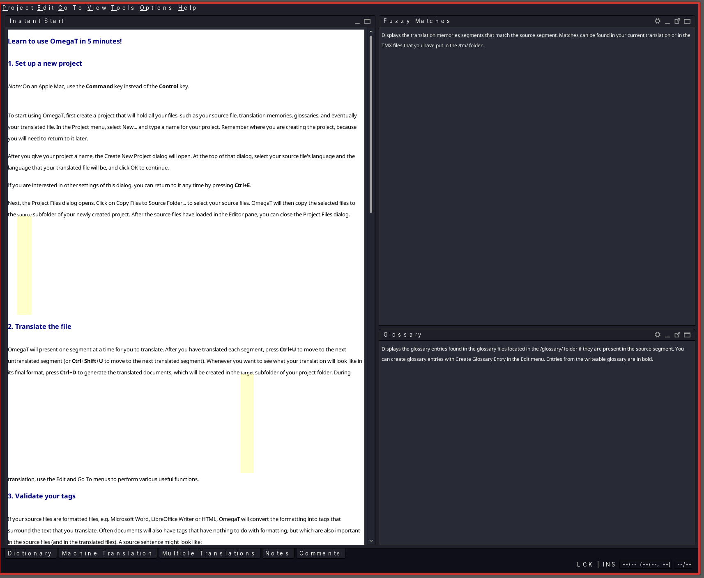
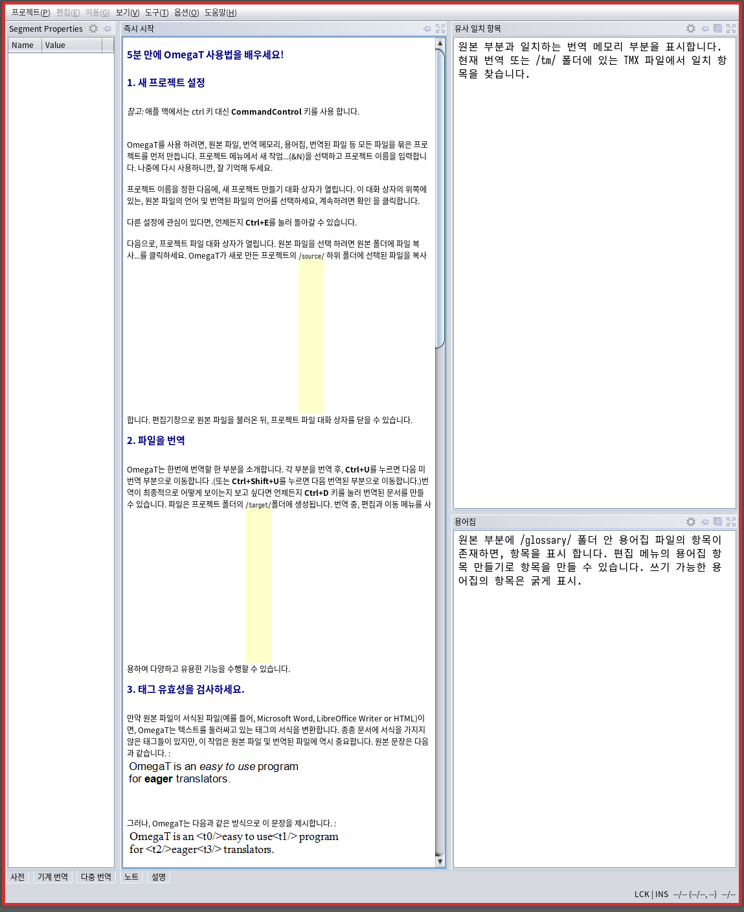

<!-- gid:20241019T145501 -->
[TOC]

[[TIP("이 노트에 대하여")]]
OmegaT와 Solar Mini Translate 플러그인이 실제 번역 작업에 어떤 도움을 주는지 영상 요약과 함께 정리한다. 설치보다도 품질과 응답 속도, 번역 메모리 운용 감각이 핵심으로 드러난다.
[[/TIP]]

여러가지 옵션이 있지만 홈페이지에서 다운 받아라. 그게 확실하다.

## Solar Mini Translate Plug-in for OmegaT 소개

(<i>Solar Mini Translate Plug-in for Omegat 소개</i> 2024)

-   [최용 위키북스 전뇌해커 번역가](https://wikidocs.net/382122)

-   비디오 요약 (Edge Copilot으로 생성): 이 비디오는 전뇌해커가 개발한 솔라 미니 트랜슬레이트 API를 활용하는 오메가 T 플러그인을 소개하고 사용하는 모습을 보여줍니다. 이 플러그인은 전문 번역가를 위한 트랜슬레이션 메모리 관리 프로그램인 오메가에 연동되어 기계 번역을 제공합니다. 솔라 미니 트랜슬레이트는 구글 트랜슬레이트나 오픈 AI 트랜슬레이트보다 품질이 좋고 응답이 빠르며 안정적이라고 주장합니다. **하이라이트**: 00:00:01 **솔라 미니 트랜슬레이트 API와 오메가 T 플러그인 소개** 솔라 미니 트랜슬레이트는 스마트 파일을 사용하여 번역 품질을 높임 오메가 T는 번역 작업을 도와주는 툴로, 여러 기계 번역 API를 연동할 수 있음 플러그인 설치 방법과 사용법을 github 사이트에서 확인할 수 있음 00:10:08 **오메가 T 플러그인을 사용하여 번역 작업 실시** 원문을 세그먼트로 나누고, 각 세그먼트에 대해 기계 번역 결과를 보여줌 구글, 오픈 AI, 솔라 미니 트랜슬레이트 중에서 가장 적절한 번역을 선택하거나 수정함 번역문을 저장하고, 태그나 코드 등을 적절히 처리함 00:23:15 **번역 작업 결과와 플러그인의 장단점 평가** 2.5.5 섹션을 번역하고, 버퍼드 이미지와 픽셀스에 대한 그림과 설명을 추가함 솔라 미니 트랜슬레이트는 문장 연결이 자연스럽고, 응답이 빠르고, 안정적임 오픈 AI 트랜슬레이트는 문장이 자연스럽기는 하지만, 응답이 늦거나 안 오기도 함 구글 트랜슬레이트는 문장이 잘려 있거나, 번역이 이상하거나, 품질이 낮음 오메가 T 플러그인은 세그먼테이션에 따라 번역 품질이 달라질 수 있으므로, 원문을 가공하거나, 번역 후에 수정하는 과정이 필요함

## <span class="org-hashtag">#히스토리</span>

-   [2024-10-19 Sat 14:55] 6.0.1 버전 설치 및 동작 확인

## <span class="org-hashtag">#다운로드</span> 및 <span class="org-hashtag">#설치</span>

그냥 홈페이지에서 다운받아라. 5.7.1 버전 다운 받아서 잘 된다. 위대한 오메가티다. 노 설정. 그냥 띄워본다.



## <span class="org-hashtag">#설정</span>

[2023-05-30 Tue 13:05] 설정 파일을 저장하고 영문 최신 메뉴얼이다.

[OmegaT 4.2 - User's Guide](https://omegat.sourceforge.io/manual-standard/en/index.html#__sethome)

### 시스템 폰트 및 nimbus 테마 한영 관련

[2023-05-30 Tue 13:43] ~/.bashrc 파일에도 추가했는데 뭐가 적절할까. 로케일 영향도 받는데 아무튼 지금은 그냥 터미널에서 실행한다. 급하지 않다. 한글로 잘 나온다. 그러면 활용할 수 있다.

```text
# Fix ugly OmegaT fonts
export _JAVA_OPTIONS='-Dawt.useSystemAAFontSettings=on'
Log out, log back in, and fonts are fixed.
BTW, where would I put this variable definition to make it system-wide under Rocky Linux? Would that be /etc/environment?
```

로케일 적용을 위해서 run-omegat 를 만들고 desktop 에서 호출하도록 했다. 위의 옵션은 ~/.bashrc 에 넣었다. 즉, 배시에서 로케일 맞춰 놓고 시스템 폰트로 로딩하니까 아래와 같이 제대로 나온다. 폰트는 내가 쓰는 폰트다.



### run-omegat scripts

[2023-06-26 Mon 14:06]

~/.local/bin/run-omegat 스크립트

```sh
#!/usr/bin/env bash

# export LANG=ko_KR.UTF-8
# export LANGUAGE=ko_KR.UTF-8

export LANG=en_US.UTF-8
export LANGUAGE=en_US.UTF-8

export _JAVA_OPTIONS='-Dawt.useSystemAAFontSettings=on'

exec -- /usr/local/bin/omegat
```

<span class="org-hashtag">#심볼링링크</span> 를 만들어 놓음.

```text
➜ ll /usr/local/bin/omegat
lrwxrwxrwx 1 root root 33 10월 19 14:46 /usr/local/bin/omegat -> /opt/omegat/OmegaT-default/OmegaT*
~ via  v20.14.0
```

### omegat.desktop

[2023-06-26 Mon 14:07] ~/.local/share/applications/omegat.desktop 파일

```text
[Desktop Entry]
Name=OmegaT-Custom
Comment=the free translation memory tool
Type=Application
Categories=Office;
Icon=OmegaT
# Exec=omegat %f
Exec= run-omegat %f
Terminal=false
```

## Related-Notes

-   [오메가티](https://wikidocs.net/380488)

## BIBLIOGRAPHY

- <i>Solar Mini Translate Plug-in for Omegat 소개</i>. 2024. [https://www.youtube.com/watch?v=5QrFqhwmKOQ](https://www.youtube.com/watch?v=5QrFqhwmKOQ).
