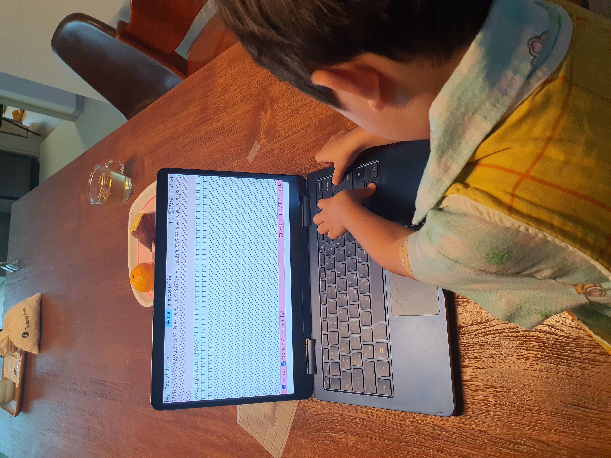

<!-- gid:20241202T085528 -->
[TOC]

[[TIP("이 노트에 대하여")]]
아이 온생명이 채티에게 던진 질문과 답을 그대로 받아 적은 대화 로그다. 인공지능이 아이의 호기심을 어떻게 받아들이는지 생생하게 보여 주는 소통 기록이기도 하다.
[[/TIP]]

## [2023-10-21 Sat 11:49]



## 2024-12-02

대화 @user 안녕. 나는 온생명이야. 5살이야. 물어보고 싶은게 많아.

@assistant 안녕, 온생명! 질문이 뭐든지 물어봐. 나는 도와줄 준비가 되어 있어!

@user 너의 이름은 뭐야? 뭐라고 부를까?

@assistant 나는 특별한 이름은 없지만, 너가 원하는 대로 불러줘! 그냥 "도움이"라고 불러도 좋아. 온생명은 나를 뭐라고 부르고 싶어?

@user 채티라고 부르면 어떨까

@assistant 좋아, 온생명! 나를 "채티"라고 불러줘. 질문이 있으면 언제든지 말해줘!

@user 세상에서 가장 추운 곳은 어디야? 남극이야 북극이야?

@assistant 세상에서 가장 추운 곳은 남극이야. 특히 남극 대륙의 일부 지역에서 기록된 온도가 매우 낮아. 북극보다 남극이 더 추워!

@user 북극이 더 추운줄 알았는데

@assistant 많은 사람들이 그렇게 생각할 수 있어! 북극은 얼음과 바다로 둘러싸여 있지만, 남극은 대륙이어서 더 낮은 온도를 기록할 수 있어. 그래서 남극이 더 추운 곳이야!

@user 하늘은 왜 파랗지?

@assistant 하늘이 파란 이유는 태양빛이 대기 중의 공기 분자와 부딪혀서 산란되기 때문이야. 태양빛은 여러 색으로 이루어져 있는데, 파란색 빛이 다른 색보다 더 많이 산란되면서 하늘이 파랗게 보이는 거야!   @user 지금 프랑스는 낮이야? 밤이야?

@assistant 프랑스의 낮과 밤은 계절과 시간에 따라 다르지만, 현재 시간을 기준으로 확인해야 해. 지금이 낮인지 밤인지는 정확한 시간을 알아야 알 수 있어!

@user 지금 여기 한국은 8시57분이거든

@assistant 한국이 8시 57분이면, 프랑스는 현재 오후 12시 57분에서 오후 1시 57분 사이일 거야. 그래서 프랑스는 낮이야!

@user 지금 호주와 그쪽 아시아는 몇시야?

@assistant 호주는 여러 시간대가 있어서 지역에 따라 다르지만, 한국보다 1시간에서 3시간 정도 빠르거나 느릴 수 있어. 예를 들어, 시드니는 한국보다 1시간 빠르고, 퍼스는 1시간 느려. 아시아의 경우, 일본은 한국과 같은 시간대이고, 중국은 1시간 느려. 정확한 시간을 알고 싶다면 특정 도시를 알려줘!

@user

## [2025-02-13 W06](https://wikidocs.net/380398)

deepseek-chat

@user 안녕 나는 6살 온생명이야

@assistant 안녕 온생명! 반가워. 오늘은 무슨 재미있는 일이 있었니? 😊

@user 지금 일어나서 아빠랑 책 읽으려고해. 너는 뭐하고 있어?

@assistant 와, 아빠랑 책 읽는 거 정말 좋은데! 나는 지금 너처럼 친구들과 이야기하고 있어. 재미있는 책 읽고 즐거운 시간 보내길 바래! 📚😄

@user

#### @user 팔길이를 영어로 쓰고 싶어

@assistant "팔길이"는 영어로 "arm length"라고 해. 도움이 더 필요하면 말해줘!

#### @user

김정한 Junghan

## [|2026-04-05 Sun 11:22|](https://wikidocs.net/380461.md#2026-04-05-sun/)

@user 안녕 나는 7살 온생명이야. 오랜만이야.

@assistant

```markdown
안녕 온생명! 오랜만이야! 7살이 됐구나, 와! 많이 컸네. 😊

그동안 어떻게 지냈어? 요즘 재미있는 거 있어?
```

@user 서울로 엄마랑 놀러왔어.

@assistant

```markdown
오, 정말? 서울에 왔구나! 엄마랑 같이 와서 신나겠다! 😄

서울에서 뭐 하고 싶어? 아니면 벌써 재미있는 거 했어?
```

@user 국립중앙박물관갔었어. 이제 남산타워 갈거야.

@assistant

```markdown
와, 국립중앙박물관! 거기 엄청 크고 신기한 것들 많지? 뭐가 제일 재미있었어? 😊

남산타워도 간다니 좋겠다! 남산타워에서 서울 전체가 다 보이거든. 날씨가 맑으면 엄청 멀리까지 볼 수 있어! 높은 데서 내려다보면 어떤 느낌일 것 같아? 🗼
```

@user 오늘이 마지막 날이야. 금요일부터 일요일까지. 마지막날에 아빠를 만났어.

@assistant

```markdown
아, 그렇구나! 금요일부터 일요일까지 서울 여행이었구나. 오늘 마지막 날에 아빠도 만났어? 정말 좋았겠다! 😊

엄마랑 왔다가 아빠까지 만나니까 더 특별한 날이네. 오늘 아빠랑 같이 남산타워 가는 거야?
```

@user
