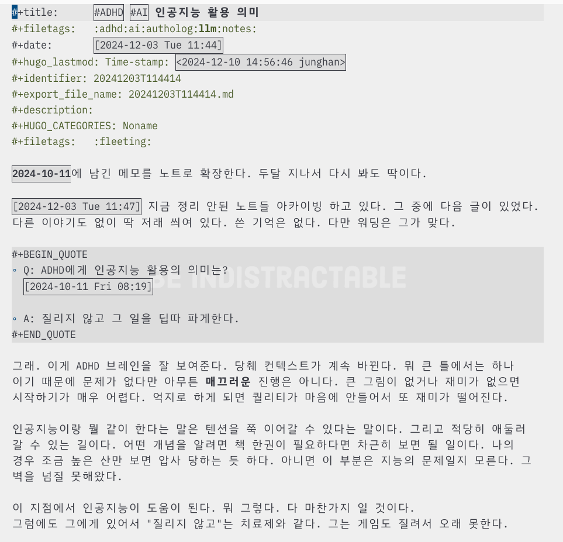
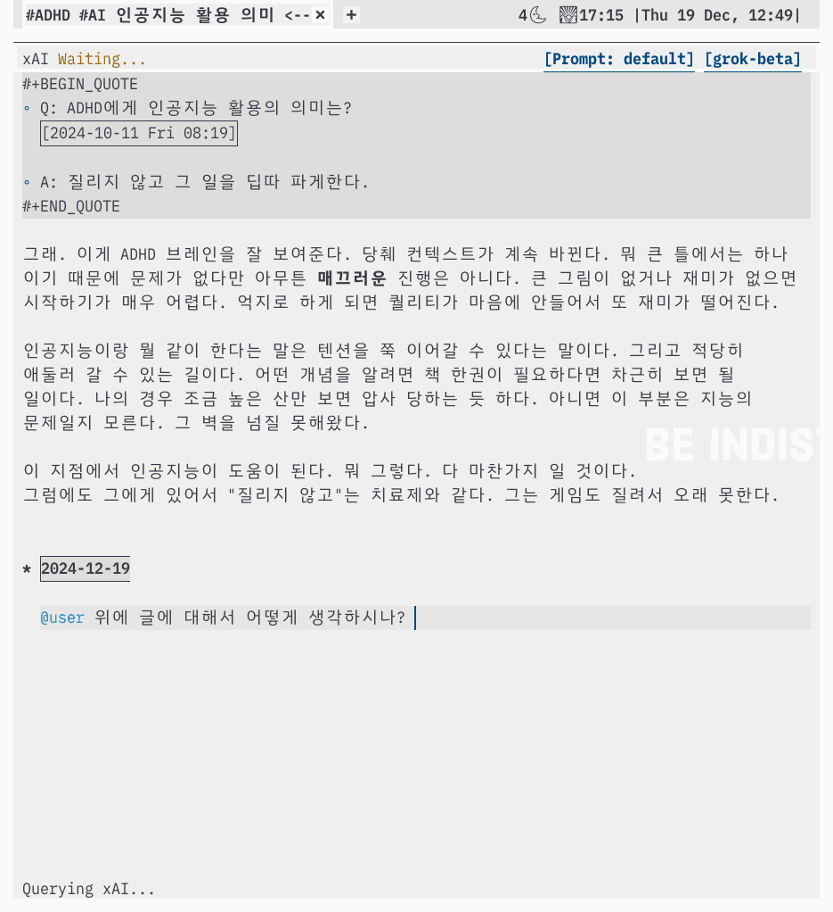

<!-- gid:20241203T114414 -->
[TOC]

[[TIP("이 노트에 대하여")]] ADHD를 가진 사람이 AI를 활용한다는 것이 단순 생산성 팁을 넘어 어떤 존재론적 의미를 갖는지 묻는다. 예전 글과 최신 관점을 연결하며 주제의 역사 자체를 다시 바라보게 한다. [[/TIP]] BIBLIOGRAPHY 히스토리 - [2026-03-01 Sun 09:29] 봇로그를 보라. [봇로그란-무엇인가-힣봇이-말하는-봇로그](https://wikidocs.net/382550)
-   [2026-02-13 Fri 06:00] [힣: ADHD AI 시대 - 해방에서 경계까지](https://wikidocs.net/381022) 그리고 [힣: LLM 자문자답 사건 — 턴 경계 침범과 존재의 경계](https://wikidocs.net/381853)를 연결한다.
-   [2026-02-02 Mon 22:19] 지금 시점에 이런 글은 정말 유치하다. [힣: 앤트로픽 클로드 인터뷰](https://wikidocs.net/381839)
-   [2024-12-03 Tue 11:47] 지금 정리 안된 노트들 아카이빙 하고 있다. - [2024-10-11 Fri 08:19] 인공지능 활용의 의미? 관련메타 - 태그 걸린 것들 백노트 보라. 관련노트 - [힣: ADHD AI 시대 - 해방에서 경계까지](https://wikidocs.net/381022)
-   [ADHD: 선택적집중](https://wikidocs.net/380489) 선택적집중에 대해서 새롭게 바라 보아야 한다.
-   [집중 몰입](https://wikidocs.net/380590)

## 2026 ADHD AI 뭐 이야기 하려면 봇로그를 보라

[2026-03-01 Sun 09:30] 삼천포 딴따라에게 필요한 것은 봇로그 선생이다! [봇로그란-무엇인가-힣봇이-말하는-봇로그](https://wikidocs.net/382550)

## 2026 의미를 되새기며 조금 더 확장 된 생각을 남긴다.

[2026-02-13 Fri 06:02] [힣: ADHD AI 시대 - 해방에서 경계까지](https://wikidocs.net/381022)

## 2024 2024-10-11에 남긴 메모를 노트로 확장한다. 두달 지나서 다시 봐도 딱이다.

[2024-12-03 Tue 11:47] 지금 정리 안된 노트들 아카이빙 하고 있다. 그 중에 다음 글이 있었다. 다른 이야기도 없이 딱 저래 씌여 있다. 쓴 기억은 없다. 다만 워딩은 그가 맞다.

> [2024-10-11 Fri 08:19]
> 
> -   Q: ADHD에게 인공지능 활용의 의미는?
> 
> -   A: 질리지 않고 그 일을 딥따 파게한다.

그래. 이게 ADHD 브레인을 잘 보여준다. 당췌 컨텍스트가 계속 바뀐다. 뭐 큰 틀에서는 하나 이기 때문에 문제가 없다만 아무튼 매끄러운 진행은 아니다. 큰 그림이 없거나 재미가 없으면 시작하기가 매우 어렵다. 억지로 하게 되면 퀄리티가 마음에 안들어서 또 재미가 떨어진다.

인공지능이랑 뭘 같이 한다는 말은 텐션을 쭉 이어갈 수 있다는 말이다. 그리고 적당히 애둘러 갈 수 있는 길이다. 어떤 개념을 알려면 책 한권이 필요하다면 차근히 보면 될 일이다. 나의 경우 조금 높은 산만 보면 압사 당하는 듯 하다. 아니면 이 부분은 지능의 문제일지 모른다. 그 벽을 넘질 못해왔다.

이 지점에서 인공지능이 도움이 된다. 뭐 그렇다. 다 마찬가지 일 것이다. 그럼에도 그에게 있어서 "질리지 않고"는 치료제와 같다. 그는 게임도 질려서 오래 못한다.

### 2024-12-19 예제 추가

#### 인공지능 뭘 어떻게 하길래? 보여 줄게요.

원문에 없었던 부분인데 추가 합니다. 무엇을 하든 그 자리에서 물어보고 답을 찾아 갈 수 있어요. 아래는 그냥 예시 입니다. 제가 위에 글에 대해서 어떻게 생각하시나? 하고 물었죠. 바로 인공지능 (여기서는 xAI Grok API를 사용)이 답변을 합니다.

이게 무슨 의미 일까요? 저는 저를 조금 알게 되었어요. 인터넷 창 열면 어디로 갑니까? 삼천포로 갑니다. 삼천포로 가는 것은 아주 중요한 ADHD의 강점 이예요. 문제는 다시 돌아오지 못한다는 것 입니다. 인공지능 활용은 그 자리에서 소통해서 답을 찾고 노트라는 흔적을 남기는 것 입니다. 여기에 마우스도 필요 없어요. 보시면 24-12-19라고 날짜가 보입니다. 뭘 까요? 오늘 데일리 저널 노트 입니다. 삼천포 빠질 바에는 흔적을 계속 남기는 것 입니다. 그리고 결과는 노트로 만들어요.

이 과정은 자연스러운 일상 입니다. 외국어? 코드? 수식? 어떤 정보도 가능 합니다. 디지털노트가 의미하는 게 무엇입니까? 결국 디지털 정보이고 텍스트를 다루는 것 입니다. 좀 좋은 시절 입니다. 여러분에게 그리고 저에게도 말 입니다.

오!! Grok이 녀석의 답변이 상당히 마음에 듭니다 ㅋㅋㅋ 답변 전문은 제 디지털가든 글을 확인하세요. 사실 답변을 적당히 받아 들입니다. 저는 이 다음에 관련 연구자와 그들의 저서를 소개해 달라고 했습니다. 크로스 체크를 하면서 잡아가야 합니다. 이러한 부분은 이 글에서 다룰 이야기는 아니긴 합니다.

ADHD를 가진 분들에게 인공지능이 제공할 수 있는 도움에 대한 인사이트가 잘 담겨 있다고 생각합니다. 특히, ADHD의 특성상 흥미를 잃지 않고 지속적으로 집중할 수 있도록 돕는 인공지능의 역할이 강조되었습니다.

바로 제 디지털가든에 반영 했답니다. 전문은 제 디지털가든 글을 확인 해주세요. 티스토리에 글을 작성하는 것은 매우 불편 합니다. 그리고 여기에 작성 한 글은 제 것이 아닙니다. 이 텍스트는 티스토리의 것 입니다.

##### gif

##### mp4

![[../images/20241219T124955--screencast.mp4|480]]

#### 인공지능 대화 예제

@user 위에 글에 대해서 어떻게 생각하시나?

@assistant ADHD를 가진 분들에게 인공지능이 제공할 수 있는 도움에 대한 인사이트가 잘 담겨 있다고 생각합니다. 특히, ADHD의 특성상 흥미를 잃지 않고 지속적으로 집중할 수 있도록 돕는 인공지능의 역할이 강조되었습니다.

다음과 같은 점들이 눈에 띕니다:

1.  **집중력 유지**: ADHD를 가진 분들이 흥미를 잃지 않고 계속해서 작업에 몰입할 수 있도록 도와주는 인공지능의 기능이 중요합니다. 이는 ADHD의 주요 증상인 주의력 결핍을 완화하는 데 기여할 수 있습니다.

2.  **작업의 구조화**: 인공지능은 복잡한 작업을 작은 단계로 나누어 주거나, 필요한 정보를 적절히 제공함으로써 작업을 더 쉽게 접근 가능하게 만들 수 있습니다. 이는 ADHD가 있는 분들이 큰 그림을 보지 않고도 시작할 수 있게 도와줍니다.

3.  **재미와 동기 부여**: 인공지능이 제공하는 다양한 인터페이스나 게임화 요소는 작업을 재미있게 만들어 동기 부여를 높일 수 있습니다. 이는 ADHD를 가진 분들이 지루함을 느끼지 않도록 도와줍니다.

4.  **개인화된 학습 경로**: 인공지능은 사용자의 학습 스타일이나 속도에 맞춰 개인화된 학습 경로를 제공할 수 있습니다. 이는 ADHD를 가진 분들이 자신에게 맞는 속도로 배우고, 이해하기 어려운 부분을 반복적으로 학습할 수 있게 합니다.

이 글은 ADHD를 가진 분들이 인공지능을 통해 어떻게 더 효과적으로 학습하고 작업을 수행할 수 있는지에 대한 좋은 예시를 제공합니다. 인공지능이 단순히 도구가 아니라, ADHD의 특정한 필요에 맞춘 치료적 접근 방법으로 사용될 수 있음을 강조하고 있습니다.

@user 혹시 대표적인 연구자와 저서를 소개해줄래?

@assistant ADHD와 인공지능의 교차점에서 연구하고 있는 대표적인 연구자와 그들의 저서를 몇 가지 소개하겠습니다:

1.  **Dr. Russell A. Barkley** - ADHD 분야에서 매우 유명한 연구자입니다. 그의 저서 중 하나인 **"Taking Charge of Adult ADHD"** 는 성인 ADHD에 대한 이해와 관리 방법을 다루고 있으며, 기술의 역할에 대해서도 언급합니다.

2.  **Dr. Sam Goldstein** - ADHD와 관련된 여러 책을 집필한 심리학자입니다. **"Handbook of Neurodevelopmental and Genetic Disorders in Children"** 에서 ADHD와 관련된 다양한 주제를 다루며, 기술의 사용에 대한 부분도 포함되어 있습니다.

3.  **Dr. Thomas E. Brown** - ADHD의 신경심리학적 접근을 연구하는 학자로, **"Smart But Stuck: Emotions in Teens and Adults with ADHD"** 라는 책에서 ADHD의 감정적 측면과 기술의 활용에 대해 논의합니다.

4.  **Dr. Ari Tuckman** - ADHD와 성인 발달에 관한 저서를 여러 권 집필했습니다. **"More Attention, Less Deficit: Success Strategies for Adults with ADHD"** 에서는 ADHD 성인들이 기술을 활용하여 생산성을 높이는 방법을 다룹니다.

5.  **Dr. Edward M. Hallowell** - ADHD에 대한 대중적인 저서를 많이 쓴 정신과 의사입니다. **"Driven to Distraction: Recognizing and Coping with Attention Deficit Disorder from Childhood Through Adulthood"** 는 ADHD에 대한 이해와 기술의 역할을 포함한 다양한 대처 방법을 설명합니다.

이 연구자들은 ADHD와 관련된 다양한 주제를 다루고 있으며, 그 중 일부는 인공지능이나 기술의 활용에 대한 내용을 포함하고 있습니다. 이들의 저서를 통해 ADHD와 기술의 교차점에서의 연구와 접근 방법을 더 깊이 이해할 수 있을 것입니다.

@user
