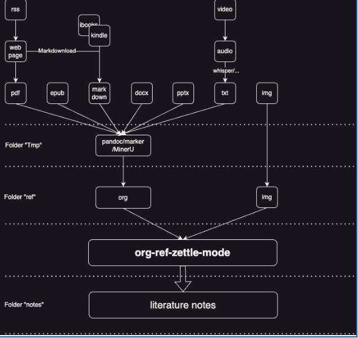

<!-- gid:20241203T122352 -->
[TOC]

[[TIP("이 노트에 대하여")]]
텍스트 하이라이트와 문헌노트 작업을 Org-mode 안에서 이어 주는 도구 활용 흐름을 정리한다. org-zettel-ref-mode를 중심으로 인용과 개요 동기화까지 생각하는 문헌노트 메모다.
[[/TIP]]

[contacts::lijigang Ignoramus marktext](https://wikidocs.net/380486.md#h-8f3132b2-4a52-4c57-ba43-f79a5145c7c8/) 간단한 개념인데 유용할 때가 있다. 더 복잡해지면 안쓰게 될 것이다.

## <span class="org-hashtag">#문헌노트</span> 이맥스 패키지 활용

[2024-10-10 Thu 15:57]

(“Junghan0611/Org-Zettel-Ref-Mode” 2024)

-   JunghanKim 2024 "junghan0611/org-zettel-ref-mode" org-zettel-ref-mode: A Zettelkasten-style literature note tool.

-   M-x org-zettel-ref-init
-   `org-zettel-ref-sync-overview`

<span class="org-target" id="org-target-------------------"></span> 이건 내보내기 안된다. 상관없다. 내부용이다.

```elisp

(progn
  (add-to-list 'load-path "~/sync/emacs/git/junghan0611/org-zettel-ref-mode")
  (require 'org-zettel-ref-mode)
  (setq org-zettel-ref-overview-directory (concat org-directory "overviews/"))
  (setq org-zettel-ref-mode-type 'denote) ; Options: 'normal, 'denote, 'org-roam
  (setq org-zettel-ref-quick-markup-key "C-c M")
  ;; (org-zettel-ref-enable-auto-sync)

  (setq org-zettel-ref-python-environment 'system)  ; 'conda 'system, 'venv
  ;; (setq org-zettel-ref-python-env-name "your-env-name")  ; If using Conda or venv
  (setq org-zettel-ref-python-file "~/sync/emacs/git/junghan0611/org-zettel-ref-mode/convert_to_org.py")
  (setq org-zettel-ref-temp-folder "~/temp/convert/")
  (setq org-zettel-ref-reference-folder "~/sync/markdown/reference/")
  (setq org-zettel-ref-archive-folder "~/sync/markdown/archives/")
  ;; PyPDF2, pdf2image,pytesseract
  ;; sudo apt-get install python3-pypdf2 poppler-utils
  ;; pipx install pytesseract

  )
```

### Using Scripts to Convert Documents in PDF, ePub, HTML, MD, TXT Formats to Org Files



이 그림이 다 했다.

### [웹클리퍼: markdownload - 옵시디언](https://wikidocs.net/381352)

[2024-10-10 Thu 16:33]

## 표시한 텍스트만 요약 보기

(“Lijigang/Org-Marked-Text-Overview” 2024)

-   lijigang 2024 "lijigang/org-marked-text-overview"

## Related-Notes

(“Yibie/Org-Supertag” 2024)

## BIBLIOGRAPHY

- “Junghan0611/Org-Zettel-Ref-Mode.” 2024. [https://github.com/junghan0611/org-zettel-ref-mode](https://github.com/junghan0611/org-zettel-ref-mode).
- “Lijigang/Org-Marked-Text-Overview.” 2024. [https://github.com/lijigang/org-marked-text-overview](https://github.com/lijigang/org-marked-text-overview).
- “Yibie/Org-Supertag.” 2024. [https://github.com/yibie/org-supertag](https://github.com/yibie/org-supertag).
