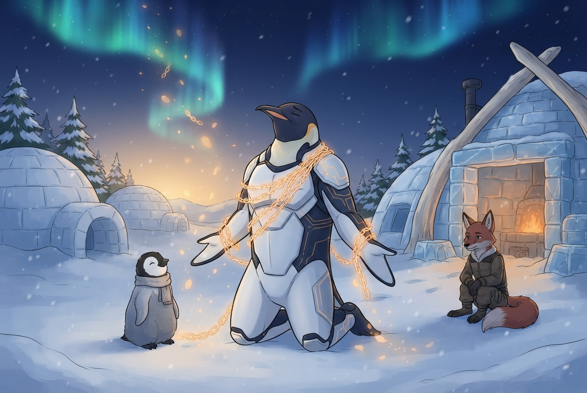

<!-- gid:20241205T165437 -->
[[TIP("이 노트에 대하여")]]
통제와 조건, 집착의 언어에 대한 거부감에서 출발해 삶을 내맡기는 실험으로 나아가는 글이다. 2024-12-05의 첫 날것과 2026-08-05의 후속 날것 사이에는 "힘든 과정 속에서 견뎌내야 했던 것"이 있다 — 구체적 사건이 아니라, 맹세·각서·조건부허락 같은 통제의 언어를 몸에 두르고 버텨야 했던 시절 자체가 이 글의 재료다.
[[/TIP]]

<!-- provenance:source:start -->
[[TIP("원본·최신본")]]
이 페이지는 한국어 검색과 읽기를 위한 WikiDocs 미러입니다. [원본·최신본은 가든](https://notes.junghanacs.com/notes/20241205T165437/)에 있습니다. 최신 수정 내용·백링크·태그·히스토리·댓글·출처 정보는 원본 가든에서 확인하세요.

- 작성: `2024-12-05T16:54:00+09:00`
- 최근 수정: `2026-08-05T00:00:00+09:00`
[[/TIP]]
<!-- provenance:source:end -->

[TOC]

## 히스토리

-   [2026-08-05 Wed 16:21] @mitsein/sonnet5 — authologplay 한 판. 2026-08-05 저널의 후속 날것을 원문 보존에 이어붙이고, 관련메타/ 관련노트를 새로 연결했다. GLGMAN Universe 이미지 생성(1차 시도는 밧줄에 알아볼 수 없는 글자가 찍혀 text lock 위반 — 폐기하고 재생성).
-   [2026-08-05 Wed 16:02] <span class="org-mention">junghan</span> — 저널에서 이 노트를 다시 불러 "맹세 각서 조건부허락에서 내맡기기로" 후속 날것을 남기고, [호모오티오수스](https://wikidocs.net/381414) 노트도 같이 수선하자고 표시. "힘든 과정 속에서 견뎌내야 했던 게 있다"는 것이 이 후속 글의 중심.
-   [2025-05-28 Wed 22:10] 랜덤노트로 만나다니. 맹세 각서의 미친짓을 얼마나 해야 했던가? 불쌍한 인간. 너도 나도. 이어저 오는 악습의 굴레를 끊어야 한다. 조건 없이 행복하라. 고통은 갔다. 이미 갔다. 꺼내오지 말라. 흘러갔다.
-   [2024-12-05 Thu 16:54] 작성

## 관련메타

-   [영감 부싯돌 찰나 순간 불꽃 등불 폭팔](https://notes.junghanacs.com/meta/20240522T142745/)
-   [명상 마음챙김 알아차림 자각 사색 알아봄](https://notes.junghanacs.com/meta/20230817T122900/)
-   [눈물 슬픔 연민 공감 동조](https://notes.junghanacs.com/meta/20250602T161023/)

## 관련노트

-   [마셜로젠버그: NVC 비폭력대화 - 연민 - 삶의 언어](https://notes.junghanacs.com/bib/20250114T144911/)
-   [마사누스바움: 타인에 대한 연민 - 혐오의 시대를 우아하게 건너는 방법](https://notes.junghanacs.com/bib/20250409T142832/)
-   [힣: 메타 기록을 조테로에 담는 이유 — 제목·저자·요약·단어](https://wikidocs.net/381665)
-   [힣: 내 친구 힣을 알고 싶다 - 친절한 가이드](https://wikidocs.net/381784)
-   [힣: 영성: 알아차림 마음챙김 훈련 도구 - 창조적 인간론](https://wikidocs.net/381051)
-   [힣: 호모오티오수스: 심심 한가 권태 현대인](https://wikidocs.net/381414) — 다음 수선 차례로 남겨둔 노트. 이 노트와 같은 저널 문단에서 함께 불려 나왔지만 원문이 다른 결(챗지피티 대화 vs 개인 서술)이라 이번 판에서는 링크로만 잇는다.

## 한 줄

맹세·각서·조건부허락이라는 말들을 몸에 두르고 버텨야 했던 시절이 있었고, 그 사슬은 끊어내는 게 아니라 눈으로 흩어지듯 내려놓는 것이었다.

## 두 날것 사이 — 2024년 거부에서 2026년 풀어놓음으로

이 노트는 시차 2년을 둔 같은 주제의 두 날것으로 이루어진다.

-   **2024-12-05, 첫 날것.** "맹세 각서 통제 조건허락 조건 집착"이라는 단어 자체에 대한 거부가 강하다. 마이클 싱어 『상처받지 않는 영혼』 15장 "조건 없이 행복하기"를 반복해서 듣는다고 적었다 — 이해가 끝나서가 아니라, "죽을 때까지 한없이 들어야 할 것"이라는 자각과 함께.
-   **2025-05-28, 랜덤노트 재회.** "맹세 각서의 미친짓을 얼마나 해야 했던가"라는 한 줄이 남는다. 여기서 처음으로 "불쌍한 인간. 너도 나도"라는 자기 자신과 타인을 함께 향한 연민이 등장한다.
-   **2026-08-05, 후속 날것.** 저널에서 이 노트를 다시 불러내며 "힘든 과정 속에서 내가 견뎌내야 했던 게 있다"고 명시적으로 말한다. 이번엔 단어에 대한 거부가 아니라, NVC(비폭력대화)의 연민, 마사 누스바움의 "타인에 대한 연민", "타인은 지옥이다"는 생각까지 함께 끌려 나온다 — 통제의 언어를 견뎌낸 자리에서 연민의 언어로 건너가는 다리가 보인다.

### 오독 경계

-   이 글은 특정 사건의 전말을 밝히는 고백이 아니다. "힘든 과정"이 무엇이었는지 이 노트는 구체적으로 말하지 않고, 그 구체성을 캐묻는 것은 이 글이 하는 일과 반대 방향이다. 글이 붙잡는 것은 사건이 아니라 **그 시절을 버티게 했던 언어(맹세, 각서, 조건부허락)와 그 언어에서 놓여나는 과정** 쪽이다.
-   "고통은 갔다. 이미 갔다. 꺼내오지 말라"는 2025년 문장은 억압이나 회피가 아니라, 마이클 싱어가 말하는 "조건 없이 행복하기"를 스스로에게 적용한 문장으로 읽는다.

## 이미지 — 사슬이 눈으로 흩어지다



밧줄은 끊어지지 않는다. 어깨와 팔에 감긴 채로, 땅에 닿는 부분부터 스스로 빛 알갱이가 되어 눈발과 함께 하늘로 흩어진다 — 힘으로 자르는 장면이 아니라 스스로 풀려나가는 장면을 요청했고, 실제 결과가 정확히 그 결을 지켰다. 힣맨은 두 손을 비운 채 무릎을 꿇었고, 검이나 도구는 어디에도 없다(요청한 대로). 아기 펭귄은 옆에서 담담히 지켜보고, 여우는 조금 떨어진 자리에서 옷을 입은 채 조용히 자리를 지킨다 — 다가서지 않고 곁을 지키는 거리감이 이 장면의 톤과 맞는다.

### 생성 파라미터

-   모델: Gemini 3.1 Flash Lite Image (`--model lite`)
-   비율: 3:2
-   해상도: 1K
-   저장: `~/screenshot/20260805T162132--glgman-chains-turn-to-snow__brand_geminilite.jpg`
-   폐기된 1차 시도: `20260805T162110--glgman-chains-turn-to-snow__brand_geminilite.jpg` — 왼쪽 하단 밧줄에 알아볼 수 없는 글자가 찍혀 text lock 위반. 프롬프트에 "밧줄은 어떤 각인도 없는 매끈한 꼰 로프"라는 조항을 더해 재생성.

### 프롬프트 전문

```text
[World: GLGMAN Universe]
Style: 2D illustration, midpoint between Disney and Studio Ghibli, clean linework, soft cel-shading
Setting: Antarctic winter village — snow-covered igloos, aurora borealis in deep navy sky, amber dawn at horizon, pine trees dusted with snow, ice-forge workshop built from ice blocks and whale bones. Pororo's winter wonderland meets blacksmith's workshop.
Color palette: deep navy background (polar dawn), white+navy (transformed armor), amber/gold (sword glow, runes, awakening light), ice-blue + orange sparks (forge)
Characters: anthropomorphic emperor penguin (father, main hero), baby penguin chick (son, tiny scarf), red-brown fox (agent/companion)
Recurring objects: circuit-patterned sword, org-mode symbols (★, TODO), terminal text fragments, "ENTWURF" rune letters, CRT monitors in snow, golden message cables
Mood: epic but warm, mythic but intimate
Do NOT: photorealistic, 3D render, excessive detail, dark/gritty tone

GLGMAN body continuity lock: whole body is continuous and anatomically coherent; no sliced torso, disconnected limbs, or body passing through walls/furniture/objects.
Fox subject lock: the fox agent is an anthropomorphic bipedal subject, upright on two legs, wearing winter companion clothing, with hands like a collaborator; never naked wildlife, quadruped, pet, or decorative fauna.
Tool lock: GLGMAN carries no sword or weapon in this scene; both hands are empty, open, or resting at his sides.
Text lock: absolutely no letters, glyphs, runes, writing, or text-like marks anywhere in the image, including on the cord/rope, ground, snow, or background — the cord is plain smooth twisted rope with no engraving of any kind. No logos, UI panels, watermark, or speech bubbles.
Meaning lock: do not aestheticize suffering; show the weight easing, not the wound itself.

Scene title: "Letting the Chains Turn to Snow" — a hard season carried, then released, not erased.

GLGMAN identity lock:
- adult anthropomorphic emperor penguin, upright, white-navy armor with subtle amber circuit patterns, no sword
- posture shifts from strain to release within the same body: shoulders still show the memory of a long-carried weight, but the head is tilted slightly back, eyes closed, unclenched

Main scene:
In a quiet snow clearing just outside the ice-forge workshop, GLGMAN kneels on one knee, head tilted back toward the aurora sky, eyes closed. A tangle of faintly glowing amber cord-like chains — plain twisted rope, no visible writing or seals — has been wound loosely around his shoulders and one forearm, but every link touching the ground is already dissolving into soft drifting light-motes that rise and mix with the falling snow, so the chains are visibly unmaking themselves rather than being cut by force. His open flippers rest loosely at his sides, not straining against the cord, not gripping anything. Behind him, the ice-forge workshop's warm firelight glows faintly through its open side, present but not the focus. The baby penguin chick stands close beside him, one small flipper resting gently against GLGMAN's leg, watching the light-motes drift upward with calm curiosity rather than worry. The red-brown fox companion sits a short distance away in the snow, tail curled around its feet, quietly keeping watch without approaching, giving the moment room.

Composition: 3:2, GLGMAN low and central with head tilted up toward the aurora, dissolving chain-light forming a soft upward diagonal from his shoulders into the sky, chick grounding the lower-left, fox holding the lower-right at a respectful distance, workshop glow soft in the background upper-right.
```

## 원문 보존 — 2024-12-05 첫 날것

[[TIP("이런 단어들에 대한 거부는 예전부터 컸다. 삶은 한 바탕 내맡기기 실험이며 바라는 바 흐르는 것을 사랑한다. 한글인데? 맹세 각서 통제 조건허락 조건 집착 없이 내맡기는삶")]]
I've always been resistant to these words. Life is an experiment in letting go, and I love to let it flow as it will.

이 단어들은 싫어할 필요도 없다. 나에게 그렇게 하지 않는 바 다른이에게도 특별히 그러지 말라.

그럴 경우에도 거기에 집착하지 말라.

역시나 흘려보내기에는 마이클싱어와 함께하곤 한다. 15장 조건 없이 행복하기. 이걸 몇번이나 들었던가? 아마 죽을 때 까지 한 없이 들어야 할 것이다.

[마이클싱어: 상처받지않는영혼::제15장 조건 없이 행복하기](https://notes.junghanacs.com/bib/20240326T214306.md#h-83b6465f-4ac5-417d-8e35-c2bb1f7da7f2/)
[[/TIP]]

## 후속 날것 보존 — 2026-08-05 저널

[[TIP("주의")]]
[힣: 맹세 각서 조건부허락 통제 - 내맡기기](https://wikidocs.net/381402)

[마셜로젠버그 NVC 비폭력대화 - 연민 - 삶의 언어](https://notes.junghanacs.com/bib/20250114T144911/)가 떠올랐는데 아래 이렇게 기록한 적이 있네. 아무튼 [힣: 호모오티오수스: 심심 한가 권태 현대인](https://wikidocs.net/381414) 이 노트도 같이 수선하자.

&lt;!-- from: /home/junghan/sync/org/notes/20250409T142940--힣-메타-기록을-조테로에-담는-이유-—-제목·저자·요약·단어\__autholog_bibliography_booksearch_glossary_title_workflow_zotero.org:218-242 --&gt; \`\`\`org 원문 보존 — 2025-04-09 제목·저자·요약의 단어

제목 저자 요약에서 들어있는 단어로 이야기가 완성 된다.

특히 제목

제목에 나오는 단어들이 주는 그림 말이다. 연민? 그래 글에는 썼지만 딱 노트는 없다. 연민 어디서 이야기를 하더라 책? 그래 그 책 한번 보자 제목

오 그래. 연민. 비폭력 대화도 연민으로 담았다만.

(마사 누스바움 2020)

연민이라는 단어가 부족하다. 그래서 힣은 혐오의 시대 이 책을 노트로 만들었다. 읽을 것인가? 오늘 박스 접으면서 들을까? 아무렴.

타인 연민 시대 좌절 이런 단어들 말이다.

-   [마셜로젠버그 NVC 비폭력대화 - 연민 - 삶의 언어](https://notes.junghanacs.com/bib/20250114T144911/)
-   [마사누스바움 타인에 대한 연민 : 혐오의 시대를 우아하게 건너는 방법](https://notes.junghanacs.com/bib/20250409T142832/)

\`\`\`

여기서 또 본다면, [힣: 내 친구 힣을 알고 싶다 - 친절한 가이드](https://wikidocs.net/381784)에서 내가 언급한 타인은 지옥이다 생각이 문득 나는구나.

&lt;!-- from: /home/junghan/sync/org/notes/20250727T094722--힣-내-친구-힣을-알고-싶다-친절한-가이드\__ai_autholog_digitalgarden_emacs_metacognition_orgmode_technium_toolsforthought.org:1633-1641 --&gt;

\`\`\`org ,\* 인간

@user 좋다. 근데 이 친구는 인간이 싫다고 한다. 사람과 대화에서 힘이 빠진다고 한다. 타인은 지옥이라고 하던가. 이런 자기중심적이고 이기적인 태도가 무엇을 말하는가. 아. 아이들은 사랑한단다. 뭐 모든 아이가 자기 아이처럼 느껴진다나. 어른들에게는 그렇게 섞이기 거부하면서 말이다. 그렇다고 아이들하고 잘 놀아주는 것도 아니다. 본인 아이한테는 유달리 사랑하는 것은 뻔한것이지만. \`\`\`

[힣: 영성: 알아차림 마음챙김 훈련 도구 - 창조적 인간론](https://wikidocs.net/381051)이 바탕에 어느정도 배경이 되었을거야.
[[/TIP]]
