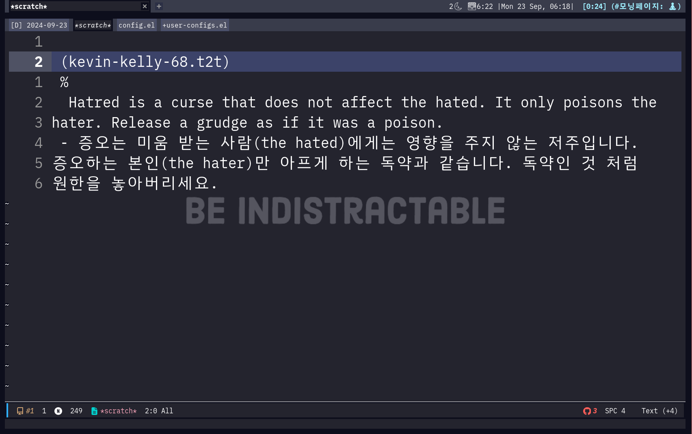

<!-- gid:20241207T071748 -->
[[TIP("이 노트에 대하여")]]
포춘쿠키 시스템과 인용, 삶과 죽음에 관한 책들을 하나의 영감 구조로 묶어 보려는 글이다. 도서 목록을 넘어 힣이 저자이자 독자로서 어떻게 영감을 다루는지 드러나는 노트다.
[[/TIP]]

<!-- provenance:source:start -->
[[TIP("원본·최신본")]]
이 페이지는 한국어 검색과 읽기를 위한 WikiDocs 미러입니다. [원본·최신본은 가든](https://notes.junghanacs.com/notes/20241207T071748/)에 있습니다. 최신 수정 내용·백링크·태그·히스토리·댓글·출처 정보는 원본 가든에서 확인하세요.

- 작성: `2024-12-07T07:17:00+09:00`
- 최근 수정: `2024-12-07T07:34:00+09:00`
[[/TIP]]
<!-- provenance:source:end -->

[TOC]

<!--more-->

## [2024-12-07 Sat 07:20] 2024-09-27에 끄적이다 말았네. 뭘 말하려고 한 것인가?

아 삶과 죽음 포춘쿠키 시스템을 이야기하려다가 도서목록을 마무리 했구만. 감사하네.

## #삶으로서의일 삶과죽음

## #구조 Structure

아! 오늘의 영감인가. 잠시만. 이것은?! 그래 구조다. 구조. 아니 근데 운동을 다녀와야 하겠다. 가서 생각한다.

## 포춘쿠키 Translation: Fortune cookie

#전문 홈페이지에 전문을 올리고 나서 글을 쓰자. 힣은 저자이자 독자이다. 모닝페이지는 쓰고 털어버리는 무언가가 아니다. 영감은 떠오른다고들 말한다. 그곳에 '나'가 자리할 곳은 없다. '나'가 없는 자리에서 떠오르는 것이기 때문이다. 그러기에 저자이자 독자일 수 밖에 없다. "저는 신이 부르는 피리의 한 구멍 입니다" 라는 라미의 시구는 어떨까. 아름답다.

## 힣의 도구는 시작하면 가장 먼저 #포춘쿠키 를 던저 준다. 물론

-   [케빈켈리](https://wikidocs.net/381886)
-   [포춘쿠키 인용구 모음](https://wikidocs.net/381071)
    
    > (kevin-kelly-68.t2t) Hatred is a curse that does not affect the hated. It only poisons the hater. Release a grudge as if it was a poison.
    > 
    > -   증오는 미움 받는 사람(the hated)에게는 영향을 주지 않는 저주입니다.
    > 
    > 증오하는 본인(the hater)만 아프게 하는 독약과 같습니다. 독약인 것 처럼 원한을 놓아버리세요.

 포춘쿠키

## 삶과죽음 삶으로서일 관련 도서 목록

(모르텐 알베크 2021)

-   "삶으로서의 일 : 일과 삶의 갈림길에 선 당신을 위한 철학" 모르텐 알베크 2021 이지연
-   의미 있는 일은 의미 있는 삶이 된다!일과 삶의 가장 완벽한 조화를 찾는 새로운 방법역사상 가장 풍요로운 시대, 우리는 일 때문에 가장 불행한 삶을 살고 있다. 일과 삶을 분리하는 ‘워라밸’만이 그 해답일까? 일을 하면서도 행복할 수는 없을까? 베스트셀러 철학...

(에크하르트 톨레 2013)

-   "삶으로 다시 떠오르기" 에크하르트 톨레 2013 류시화
    -   A New Earth : Awakening to Your Life’s Purpose

(찰스 핸디 2022)

-   "삶이 던지는 질문은 언제나 같다" 찰스 핸디 2022
    -   세계적인 경영사상가이자 경영철학의 대가 찰스 핸디가 손주들에게 전하는 때론 냉철하고 때론 다정한 응원의 편지“이토록 삶의 모든 문제를 다룬 책이 있을까? 그는 가히 내 인생의 구원자다” -아마존 독자노련하고 따뜻한 인생 선배로서 전하는 삶의 지혜와 철학 세계...

(야마구치 슈 2019)

-   "독학은 어떻게 삶의 무기가 되는가" 야마구치 슈 2019
    -   『철학은 어떻게 삶의 무기가 되는가』의 야마구치 슈,지적 전투력을 높이는 최고의 무기 ‘독학’에 대해 말하다!학교에서 배운 지식만으로는 부족한 시대가 되었다. 사회는 빠르게 변화하고 있으며, 이 변화에 적응하기 위해서는 새로운 지식을 배울 필요가 있다. 하지만...

(월터 아이작슨 2008)

-   "아인슈타인 삶과 우주" 월터 아이작슨 2008
    -   『아인슈타인 삶과 우주』는 가장 최근에 공개된 은밀한 편지들까지 조사하여 너무나 인간적인 천재이자 인류를 사랑하는 뜨거운 가슴을 지닌 한 인간으로서의 아인슈타인의 양면 세계를 다루고 있는 아인슈타인 전기이다. 아인슈타인의 힘든 결혼생활은 물론이고, 교수직과 박...

(빅터 프랭클 2020)

-   "(빅터 프랭클의) 죽음의 수용소에서: 죽음조차 희망으로 승화시킨 인간 존엄성의 승리" 빅터 프랭클 2020 이시형

(제프리 웨스트 2018)

-   "스케일 : 생물, 도시, 기업의 성장과 죽음에 관한 보편 법칙" 제프리 웨스트 2018 이한음
    -   원서 : Scale: The Universal Laws of Life, Growth, and Death in Organisms, Cities, and Companies

(크리스토퍼 히친스 2014)

-   "신 없이 어떻게 죽을 것인가" 크리스토퍼 히친스 2014
    -   베스트셀러 《신은 위대하지 않다》의 저자이자 세계적인 석학 히친스가 남긴 마지막 유작. 저자 크리스토퍼 히친스가 숙명적으로 마주친 생애 마지막 주제는 다름 아닌 ‘죽음’이었다. 신과 종교를 포함하여 세상의 모든 것들에 대해 예리한 비평을 가해온 저자는 자신의 ...

## 죽음에 대한 책에서 아내의 에필로그를 보며

2024-07-18 이 날

-   [크리스토퍼 히친스 (2014) 신 없이 어떻게 죽을 것인가](https://wikidocs.net/382008)

(크리스토퍼 히친스 2014) 를 조금 읽으면서 마음을 다 잡으려고 한다.

이 엄청난 이야기 앞에서 나의 죽음을 경험한다.

최근 죽음에 관한 책 (폴 칼라니티 2016) 도 같이 생각하게 된다.

두 책다 아내가 에필로그를 작성했는데 이거 참 엄청 아름다운 글이다.

둘다 조금 더 일찍 발견하지 못했는가? 안타까움이 든다.

죽기까지 이 기록들에서 나는 무엇을 발견하는가?

니체 멩켄 체스터턴

[SYS]: You are a helpful assistant. Please write in Korean language.

@user 니체 멩켄 체스터턴이 누구인지 각각 소개해줘. 세 사람의 공통된 특징도 궁금해

@assistant 물론이죠! 각각의 인물에 대해 간단히 소개해드릴게요.

1.  **프리드리히 니체 (Friedrich Nietzsche)**
    -   **생애**: 프리드리히 니체는 1844년 10월 15일에 태어나 1900년 8월 25에 사망한 독일 철학자입니다.
    -   **업적**: 니체는 '초인' (Übermensch), '영원회귀' (Eternal Recurrence), '신은 죽었다' (God is dead)라는 개념으로 유명합니다. 그의 철학은 전통적인 도덕과 진리에 대한 비판, 그리고 자아의 해방을 강조합니다.
    -   **영향**: 니체의 작품은 현대 철학, 문학, 심리학에 매우 큰 영향을 끼쳤으며, 특히 실존주의와 포스트모더니즘에 큰 영향을 주었습니다.

2.  **헨리 루이스 멩켄 (Henry Louis Mencken)**
    -   **생애**: H.L. 멩켄은 1880년 9월 12일에 태어나 1956년 1월 29일에 사망한 미국의 언론인, 수필가, 풍자 작가입니다.
    -   **업적**: 멩켄은 주로 사회와 정치에 대한 풍자를 통해 미국의 문화와 정치 체제를 비판했습니다. 그는 특히 '미국은 민주주의의 제도적으로 오류가 있는 실험'이라는 점을 비판하는 작품들로 유명합니다.
    -   **영향**: 그의 강력한 비판적 사고와 사회적 통찰력은 당대의 문학과 저널리즘에 깊은 영향을 미쳤습니다.

3.  **길버트 케이스 체스터턴 (Gilbert Keith Chesterton)**
    -   **생애**: G.K. 체스터턴은 1874년 5월 29일에 태어나 1936년 6월 14일에 사망한 영국 작가, 철학자, 기자입니다.
    -   **업적**: 체스터턴은 '브라운 신부 시리즈'로 유명하며, 신앙과 도덕, 사회 문제에 대한 기발하고도 깊이 있는 작품들을 남겼습니다. 그는 또한 기독교 수호자로서 많은 신학적 저서를 저술했습니다.
    -   **영향**: 그의 유머와 풍자, 깊이 있는 관찰력은 많은 독자들에게 사랑받았고, C.S. 루이스를 포함한 많은 작가들에게 영향을 미쳤습니다.

**공통된 특징**:

-   **비판적 사고**: 세 사람 모두 자신의 시대와 사회에 대한 비판적 사고를 발휘했습니다. 각자의 방식으로 기존의 가치와 제도를 재검토하고 도전했습니다.
-   **독특한 사상**: 이들은 각기 독특한 철학과 사상을 개발하며, 전통적인 관점에 새로운 빛을 비췄습니다.
-   **문학적 영향**: 각자는 문학을 통해 자신의 사상을 표현했으며, 후대 작가와 사상가들에게 큰 영향을 끼쳤습니다.

이렇게 세 인물의 삶과 업적, 그리고 공통된 특징에 대해 간단히 소개해드렸습니다!

@user

## Related-Notes

## BIBLIOGRAPHY

- 에크하르트 톨레. 2013. <i>삶으로 다시 떠오르기</i>. Translated by 류시화. [http://www.yes24.com/Product/goods/18770013](http://www.yes24.com/Product/goods/18770013).
- 크리스토퍼 히친스. 2014. <i>신 없이 어떻게 죽을 것인가</i>. [https://m.yes24.com/Goods/Detail/12454379](https://m.yes24.com/Goods/Detail/12454379).
- 야마구치 슈. 2019. <i>독학은 어떻게 삶의 무기가 되는가</i>. Translated by 김지영. [https://www.yes24.com/Product/Goods/76481875](https://www.yes24.com/Product/Goods/76481875).
- 제프리 웨스트. 2018. <i>스케일 : 생물, 도시, 기업의 성장과 죽음에 관한 보편 법칙</i>. Translated by 이한음. [https://www.yes24.com/Product/Goods/62600886](https://www.yes24.com/Product/Goods/62600886).
- 모르텐 알베크. 2021. <i>삶으로서의 일 : 일과 삶의 갈림길에 선 당신을 위한 철학</i>. Translated by 이지연. [https://m.yes24.com/Goods/Detail/101924220](https://m.yes24.com/Goods/Detail/101924220).
- 찰스 핸디. 2022. <i>삶이 던지는 질문은 언제나 같다</i>. [https://www.yes24.com/Product/Goods/106187445](https://www.yes24.com/Product/Goods/106187445).
- 빅터 프랭클. 2020. <i>죽음의 수용소에서: 죽음조차 희망으로 승화시킨 인간 존엄성의 승리</i>. Translated by 이시형. 개정보급판. 파주: 청아출판사. [https://www.yes24.com/product/goods/90384709](https://www.yes24.com/product/goods/90384709).
- 월터 아이작슨. 2008. <i>아인슈타인 삶과 우주</i>. [https://www.yes24.com/Product/Goods/2743750](https://www.yes24.com/Product/Goods/2743750).
- 폴 칼라니티. 2016. <i>숨결이 바람 될 때 - 젊은 의사의 마지막 순간</i>. Translated by 이종인. [https://www.yes24.com/Product/Goods/30555650](https://www.yes24.com/Product/Goods/30555650).
