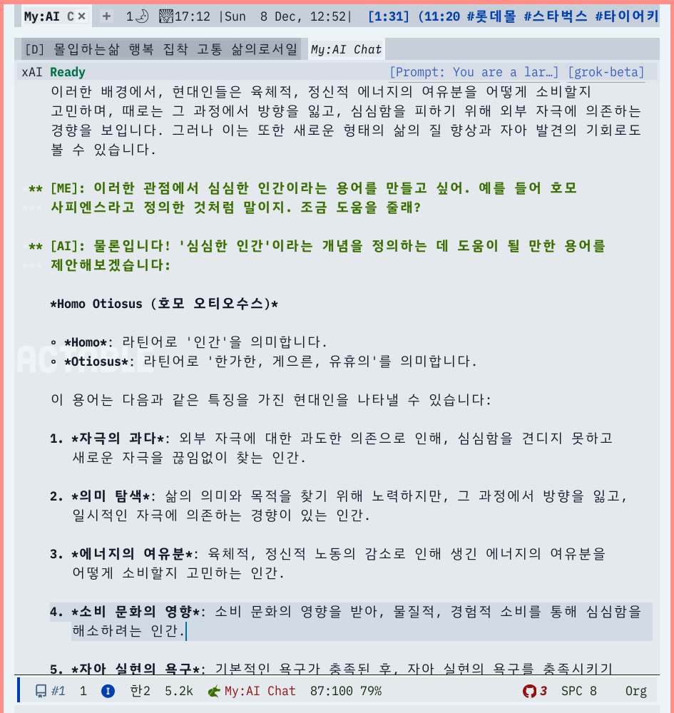

<!-- gid:20241208T125348 -->
[TOC]

[[TIP("이 노트에 대하여")]]
쇼핑몰과 스타벅스, 아이를 기다리는 짧은 시간 속에서 심심함과 권태, 몰입의 문제를 길어 올린다. 현대인의 산만함을 존재론적 주제로 확장하는 감각이 인상적인 글이다.
[[/TIP]]

## [2024-12-08 Sun 12:30] 너무 중요한 주제이다.

지금 쇼핑몰 스타벅스다. 아이는 쇼핑몰 교육센터에 가 있는 동안 나는 기다리면서 작업을 하고 있다. 데리러 올라갈 시간이 30분도 채 안 남았다. 이런 박진감을 요즘 즐긴다. 이럴 때 영겁의 것들을 벗어난 무언가가 나오지 않던가? 몰입에 대한 이야기다.

오늘의 영감은 소프트웨어 유연성 이었다. 죽음에서 깨어난 것 처럼 불시에 일어나서 해가 뜨기를 기다리며 창밖을 바라 보았다. 이중 창에 낀 서리와 창 밖에 새 들이 어딘가 떠나고 있었다. 아. 사진으로 찍었지만 올리려다 귀찮구나. 주제는 이건 아니다. 유연성은 서스먼 교수의 삶과 이룬 결과를 통해서 새롭게 바라본 것이다. 이 부분은 기술의 영역이고 관심 가지고 볼 이야기다.

오늘의 주제는 몰입에 대한 이야기다. 아마도 이... 행복, 고통, 집착, 삶, 일, 소명, 결혼, 자녀, 교육

## [2024-12-10 Tue 14:33] 이렇게 마무리한다.

더 말할 필요 없다. 끝. 호모오티오수스 나왔으면 된거다.

### 새로운 인간의 출현

**Homo Otiosus (호모 오티오수스)**

-   **Homo**: 라틴어로 '인간'을 의미합니다.
-   **Otiosus**: 라틴어로 '한가한, 게으른, 유휴의'를 의미합니다.

이 용어는 다음과 같은 특징을 가진 현대인을 나타낼 수 있습니다:

## 2024-12-08

### [SUM]: 현대인들은 풍요와 자극 속에서 심심함을 견디지 못하고, 이를 해결하기 위해 외부 자극에 의존하는 'Homo Otiosus'로 정의될 수 있다.

#### @user  권태와 나태의 의미의 차이는? [모음: 애매한 용어](https://wikidocs.net/381440)

#### @assistant  권태(倦怠)와 나태(懶怠)는 비슷한 느낌을 주지만 의미가 다릅니다:

-   **권태(倦怠)**: 이는 주로 '지루함'이나 '피로'를 의미합니다. 어떤 일이나 상황에 대한 흥미를 잃고, 더 이상 즐겁지 않거나 흥미를 느끼지 못하는 상태를 가리킵니다. 예를 들어, "그는 권태에 빠져서 아무것도 하고 싶지 않았다"는 표현을 사용할 수 있습니다.

-   **나태(懶怠)**: 이는 '게으름'이나 '태만'을 의미합니다. 의무를 다하지 않거나, 일을 게을리하는 태도를 가리킵니다. 나태는 주로 의지나 노력의 부족을 나타내며, "그는 나태해서 일을 제대로 하지 않았다"는 식으로 사용됩니다.

따라서, 권태는 감정적, 심리적 상태를 나타내고, 나태는 행동적, 태도적 문제를 나타낸다고 볼 수 있습니다.

#### @user  권태와 삶의 무의미에 대해서 현대 철학자의 시선들을 정리해줘

#### @assistant  현대 철학자들은 권태와 삶의 무의미에 대해 다양한 관점을 제시합니다. 여기 몇 가지 주요 철학자들의 시각을 간략히 정리해보겠습니다:

1.  **알베르 카뮈 (Albert Camus)**:
    -   카뮈는 그의 작품 /시지프 신화\*에서 삶의 무의미함을 인정하면서도, 그 속에서 의미를 찾는 인간의 노력을 강조합니다. 그는 '부조리'라는 개념을 통해 삶의 무의미함과 인간의 의미 추구 사이의 갈등을 설명합니다. 카뮈는 이 부조리를 받아들이고, 그럼에도 불구하고 삶을 긍정하며 살아가는 것을 제안합니다.

2.  **장 폴 사르트르 (Jean-Paul Sartre)**:
    -   실존주의 철학자 사르트르는 인간의 자유와 책임을 강조합니다. 그는 인간이 자신의 존재를 정의하고 의미를 부여해야 한다고 주장합니다. 권태는 인간이 자신의 자유를 제대로 사용하지 않거나, 자신의 존재에 대한 책임을 회피할 때 발생할 수 있는 상태로 볼 수 있습니다.

3.  **한나 아렌트 (Hannah Arendt)**:
    -   아렌트는 인간 활동의 세 가지 형태(노동, 작업, 행위)를 구분하며, 특히 '행위'를 통해 인간이 의미를 창출할 수 있다고 봅니다. 권태는 이러한 활동이 부족하거나, 사회적, 정치적 참여가 결여될 때 발생할 수 있습니다.

4.  **슬라보예 지젝 (Slavoj Žižek)**:
    -   지젝은 현대 사회에서의 권태와 무의미함을 자본주의와 소비주의의 결과로 보는 경향이 있습니다. 그는 자본주의가 제공하는 일시적 쾌락과 소비가 궁극적으로는 만족을 주지 못하고, 오히려 권태와 무의미함을 증가시킨다고 주장합니다.

5.  **마르틴 하이데거 (Martin Heidegger)**:
    -   하이데거는 '존재의 의미'를 탐구하며, 인간이 자신의 존재를 진정으로 이해하고 받아들이는 것이 중요하다고 봅니다. 권태는 존재에 대한 깊은 성찰과 이해가 부족할 때 발생할 수 있는 상태로, 이를 통해 인간은 자신의 '진정한 자아'를 찾을 수 있는 기회로 삼아야 한다고 제안합니다.

이러한 철학자들은 권태와 삶의 무의미함을 단순히 부정적인 상태로만 보지 않고, 그것을 통해 인간의 존재와 의미를 재고하고, 새로운 방식으로 삶을 살아갈 기회로 삼을 것을 제안합니다. 이들의 관점은 인간이 자신의 삶에 대해 더 깊이 생각하고, 의미를 스스로 창조할 수 있는 능력을 강조합니다.

#### @user  요즈음 "심심한 것을 견디지 못하는 시대"라는 생각을 종종해. 그러면서 심심하면 새로운 자극을 찾아서 휴대폰을 찾는 사람들의 문제를 어떠한 단어로 철학자들이 정리하고 있는지 알려줘.

#### @assistant  현대 사회에서 심심함을 견디지 못하고, 새로운 자극을 찾기 위해 휴대폰이나 다른 디지털 장치를 사용하는 현상에 대해 철학자들은 여러 용어와 개념을 사용하여 설명합니다:

1.  **Distraction (산만함)** - 철학자들은 현대인이 끊임없는 자극과 정보의 홍수 속에서 산만해지는 상태를 'distraction'으로 설명합니다. 이는 심심함을 피하기 위해 외부 자극에 의존하는 현상을 나타냅니다.

2.  **Boredom (권태)** - 심심함 자체를 'boredom'으로 정의하며, 이는 단순히 시간을 보내는 것이 아니라, 의미 있는 활동을 찾지 못하는 상태로 보기도 합니다. 현대인은 이 권태를 피하기 위해 디지털 장치에 의존합니다.

3.  **Instant Gratification (즉각적 만족)** - 심심함을 즉시 해소하기 위해 휴대폰을 찾는 행동은 '즉각적 만족'을 추구하는 현상으로 설명됩니다. 철학자들은 이가 장기적인 만족이나 성취감을 방해할 수 있다고 지적합니다.

4.  **Hyperreality (초현실)** - 장 보드리야르(Jean Baudrillard)는 현대 사회가 '초현실' 속에서 살고 있다고 주장했습니다. 여기서 사람들은 실제 경험보다 더 흥미로운 가상의 경험을 추구하며, 심심함을 피하기 위해 디지털 세계로 도피합니다.

5.  **Alienation (소외)** - 칼 마르크스(Karl Marx)의 소외 개념을 확장하여, 현대인은 자신의 노동과 생산물, 그리고 다른 사람들로부터 소외되어 심심함을 느끼고, 이를 디지털 장치로 채우려 한다고 설명할 수 있습니다.

6.  **Nihilism (허무주의)** - 프리드리히 니체(Friedrich Nietzsche)의 허무주의 개념에서, 현대인은 의미와 목적을 잃고, 심심함을 피하기 위해 일시적인 자극을 찾는다고 볼 수 있습니다.

7.  **Attention Economy (주의 경제)** - 현대 사회는 '주의 경제'로 설명되기도 합니다. 여기서 사람들의 주의는 상품이 되어, 심심함을 해소하기 위해 디지털 장치가 제공하는 자극에 쉽게 주의를 빼앗깁니다.

이러한 개념들은 현대인의 심심함을 피하려는 행동을 철학적, 사회적, 심리적 관점에서 분석하고, 그로 인해 발생할 수 있는 문제점을 지적합니다. 이들은 심심함을 단순히 피하는 것이 아니라, 그 안에서 자기 자신을 발견하고, 더 깊은 의미를 찾는 기회로 삼아야 한다고 제안합니다.

#### @user  이러한 배경에는 현대인들이 누리고 있는 이전에 경험하지 못한 풍요와 자극이 있다고 생각해. 상상할 수 없을 정도로 이전 세기의 대다수의 서민 계층은 육체적으로 고된 노동을 했다고 보거든. 현대인들은 한마디로 육체적 정신적 에너지의 여유분을 어떻게 소비할지 모르는게 아닐까?

#### @assistant  당신의 관찰은 매우 타당합니다. 현대 사회에서의 풍요와 자극은 이전 세대들이 경험하지 못한 수준에 이르렀고, 이는 여러 가지 방식으로 사람들의 삶에 영향을 미칩니다:

1.  **육체적 노동의 감소**: 과거에는 대부분의 사람들이 육체적으로 고된 노동을 해야 했지만, 현대 기술과 자동화 덕분에 많은 사람들이 육체적 노동의 부담에서 벗어났습니다. 이로 인해 많은 사람들이 '에너지의 여유분'을 갖게 되었습니다.

2.  **정신적 자극의 증가**: 정보통신기술의 발달로 인해 우리는 무한한 정보와 자극에 노출되어 있습니다. 이는 한편으로는 교육과 문화의 접근성을 높였지만, 다른 한편으로는 과도한 자극으로 인해 집중력과 깊이 있는 사고를 방해할 수 있습니다.

3.  **소비 문화**: 현대 자본주의 사회는 소비를 장려하며, 이는 물질적 풍요를 넘어 경험과 서비스에 대한 소비로 확장되었습니다. 이는 심심함을 피하기 위한 일시적 자극을 제공하지만, 장기적으로는 만족감을 주지 못할 수 있습니다.

4.  **의미와 목적의 탐색**: 과거에는 생존을 위한 노동이 주된 목적이었지만, 이제는 많은 사람들이 삶의 의미와 목적을 찾기 위해 노력합니다. 이 과정에서 심심함이나 무의미함을 느끼는 경우가 많아졌고, 이를 해결하기 위해 다양한 활동이나 자극을 찾습니다.

5.  **자아 실현의 필요성**: 마슬로우의 욕구 단계설에서처럼, 기본적인 생리적, 안전 욕구가 충족되면 자아 실현의 욕구가 부각됩니다. 현대인들은 이 욕구를 충족시키기 위해 다양한 경험과 활동을 시도하지만, 때로는 그 과정에서 방향을 잃고, 어떻게 에너지를 소비할지 모르는 상태에 빠질 수 있습니다.

6.  **디지털 디톡스와 심심함의 재발견**: 일부 사람들은 이러한 현상에 대한 반작용으로 디지털 디톡스나 심심함을 긍정적으로 받아들이려는 움직임을 보이고 있습니다. 심심함을 창의성과 자기 성찰의 기회로 삼아, 에너지의 여유분을 더 생산적이고 의미 있는 방식으로 사용하려는 노력입니다.

이러한 배경에서, 현대인들은 육체적, 정신적 에너지의 여유분을 어떻게 소비할지 고민하며, 때로는 그 과정에서 방향을 잃고, 심심함을 피하기 위해 외부 자극에 의존하는 경향을 보입니다. 그러나 이는 또한 새로운 형태의 삶의 질 향상과 자아 발견의 기회로도 볼 수 있습니다.

#### @user  이러한 관점에서 심심한 인간이라는 용어를 만들고 싶어. 예를 들어 호모 사피엔스라고 정의한 것처럼 말이지. 조금 도움을 줄래?

#### @assistant  물론입니다! '심심한 인간'이라는 개념을 정의하는 데 도움이 될 만한 용어를 제안해보겠습니다:

**Homo Otiosus (호모 오티오수스)**

-   **Homo**: 라틴어로 '인간'을 의미합니다.
-   **Otiosus**: 라틴어로 '한가한, 게으른, 유휴의'를 의미합니다.

이 용어는 다음과 같은 특징을 가진 현대인을 나타낼 수 있습니다:

1.  **자극의 과다**: 외부 자극에 대한 과도한 의존으로 인해, 심심함을 견디지 못하고 새로운 자극을 끊임없이 찾는 인간.

2.  **의미 탐색**: 삶의 의미와 목적을 찾기 위해 노력하지만, 그 과정에서 방향을 잃고, 일시적인 자극에 의존하는 경향이 있는 인간.

3.  **에너지의 여유분**: 육체적, 정신적 노동의 감소로 인해 생긴 에너지의 여유분을 어떻게 소비할지 고민하는 인간.

4.  **소비 문화의 영향**: 소비 문화의 영향을 받아, 물질적, 경험적 소비를 통해 심심함을 해소하려는 인간.

5.  **자아 실현의 욕구**: 기본적인 욕구가 충족된 후, 자아 실현의 욕구를 충족시키기 위해 다양한 활동을 시도하지만, 때로는 그 과정에서 방향을 잃는 인간.

6.  **디지털 디톡스와 자기 성찰**: 심심함을 긍정적으로 받아들이고, 디지털 디톡스나 자기 성찰을 통해 에너지를 더 생산적이고 의미 있는 방식으로 사용하려는 노력을 하는 인간.

이러한 특징을 가진 'Homo Otiosus'는 현대 사회에서의 심심함과 그로 인한 행동 패턴을 반영하며, 인간이 어떻게 자신의 시간과 에너지를 소비하고, 의미를 찾으려는 노력을 하는지를 설명하는 개념이 될 수 있습니다. 이 용어는 심심함을 단순히 부정적인 상태로만 보지 않고, 그 안에서 새로운 가능성과 기회를 찾으려는 인간의 노력을 강조합니다.

#### @user  전체 대화를 문장으로 한 문장으로 요약해줘.

현대인들은 풍요와 자극 속에서 심심함을 견디지 못하고, 이를 해결하기 위해 외부 자극에 의존하는 'Homo Otiosus'로 정의될 수 있다.

## Related-Notes
