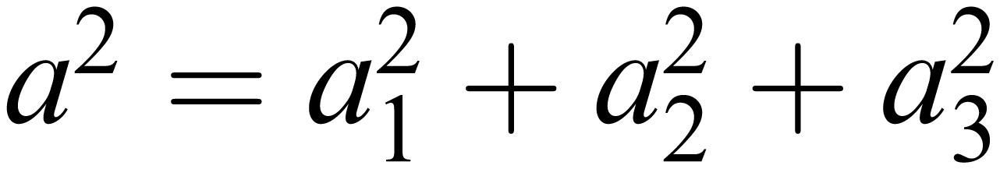
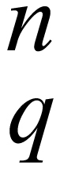

<!-- gid:20241213T143939 -->
[TOC]

[[TIP("이 노트에 대하여")]] 로저 펜로즈 책에서 사용하는 기호와 서체 체계를 따로 정리한 읽기 보조 노트다. 앞으로 본문을 따라갈 때 수학 표기와 물리 기호를 덜 헷갈리게 해 준다. [[/TIP]] - [RTR 실체이르는길 The-Road-to-Reality](https://wikidocs.net/381398)

## 기호설명 **Notation**

(Not to be read until you are familiar with the concepts, but perhaps find the fonts confusing!)

I have tried to be reasonably consistent in the use of particular fonts in this book, but as not all of this is standard, it may be helpful to the reader to have the major usage that I have adopted made explicit.

Italic lightface (Greek or Latin) letters, such as in _w/2, /pn_, log _z_, cos _θ_, ei/θ/, or e_x_ are used in the conventional way for mathematical variables which are numerical or scalar quantities; but established numerical constants, such as e, i, or π or established functions such as sin, cos, or log are denoted by upright letters. Standard physical constants such as c, _G, h, ħ_, _g_, or _k_ are italic, however.

A vector or tensor quantity, when being thought of in its (abstract) entirety, is denoted by a boldface italic letter, such as **_R_** for the Riemann curvature tensor, while its set of components might be written with lightface italic letters (both for the kernel symbol its indices) as _Rabcd_. In accordance with the abstract-index notation, introduced here in §12.8, the quantity _Rabcd_ may alternatively stand for the entire tensor **_R_**, if this interpretation is appropriate, and this should be clear from the text. Abstract linear transformations are kinds of tensors, and boldface italic letters such as **T** are used for such entities also. The abstract-index form _Tab_ is also used here for an abstract linear transformation, where appropriate, the staggering of the indices making clear the precise connection with the ordering of matrix multiplication. Thus, the (abstract-)index expression _SabTbc_ stands for the product **_ST_** of linear transformations. As with general tensors, the symbols _Sab_ and _Tbc_ could alternatively (according to context or explicit specification in the text) stand for the corresponding arrays of components---these being _matrices_---for which the corresponding bold upright letters **S** and **T** can also be used. In that case, **ST** denotes the corresponding matrix product. This ‘ambivalent' interpretation of symbols such as _Rabcd_ or _Sab_ (either standing for the array of components or for the abstract tensor itself) should not cause confusion, as the algebraic (or differential) relations that these symbols are subject to are identical for both interpretations. A third notation for such quantities---the _diagrammatic_ notation---is also sometimes used here, and is described in Figs. 12.17, 12.18, 14.6, 14.7, 14.21, 19.1 and elsewhere in the book.

There are places in this book where I need to distinguish the 4-dimensional spacetime entities of relativity theory from the corresponding ordinary 3-dimensional purely spatial entities. Thus, while a boldface italic notation might be used, as above, such as **_p_** or **_x_**, for the 4-momentum or 4-position, respectively, the corresponding 3-dimensional purely spatial entities would be denoted by the corresponding upright bold letters **p** or **x.** By analogy with the notation **T** for a matrix, above, as opposed to **T** for an abstract linear transformation, the quantities **p** and **x** would tend to be thought of as ‘standing for' the three spatial components, in each case, whereas **_p_** and **_x_** might be viewed as having a more abstract component-free interpretation (although I shall not be particularly strict about this). The Euclidean ‘length' of a 3-vector quantity **a** = (_a/1,/a/2,/a/3) may be written /a_, where , and the scalar product of **a** with **b** = (_b/1,/b/2,/b/3), written **a • b** = /a/1/b/1 + /a/2/b/2 + /a/3/b/3. This ‘dot' notation for scalar products applies also in the general /n_-dimensional context, for the scalar (or inner) product **_α • ξ_** of an abstract covector **_α_** with a vector **_ξ_.**

A notational complication arises with quantum mechanics, however, since physical quantities, in that subject, tend to be represented as linear operators. I do not adopt what is a quite standard procedure in this context, of putting ‘hats' (circumflexes) on the letters representing the quantum-operator versions of the familiar classical quantities, as I believe that this leads to an unnecessary cluttering of symbols. (Instead, I shall tend to adopt a philosophical standpoint that the classical and quantum entities are really the ‘same'---and so it is fair to use the same symbols for each---except that in the classical case one is justified in ignoring quantities of the order of _ħ_, so that the classical commutation properties _ab_ = _ba_ can hold, whereas in quantum mechanics, _ab_ might differ from _ba_ by something of order _ħ_.) For consistency with the above, such linear operators would seem to have to be denoted by italic bold letters (like **_T_**), but that would nullify the philosophy and the distinctions called for in the preceding paragraph. Accordingly, with regard to specific quantities, such as the momentum **p** or **_p_**, or the position **x** or **_x_**, I shall tend to use the same notation as in the classical case, in line with what has been said earlier in this paragraph. But for less specific quantum operators, bold italic letters such as **_Q_** will tend to be used.

The shell letters ℕ, ℤ, ℝ, ℂ, and 𝔽_q_, respectively, for the system of natural numbers (i.e. non-negative integers), integers, real numbers, complex numbers, and the finite field with _q_ elements (_q_ being some power of a prime number, see §16.1), are now standard in mathematics, as are the corresponding ℕ_n_, ℤ_n_, ℝ_n_, ℂ_n_, 𝔽, for the systems of ordered _n_-tuples of such numbers. These are canonical mathematical entities in standard use. In this book (as is not all that uncommon), this notation is extended to some other standard mathematical structures such as Euclidean 3-space 𝔼3 or, more generally, Euclidean _n_-space 𝔼_n_. In frequent use in this book is the standard flat 4-dimensional Minkowski spacetime, which is itself a kind of ‘pseudo-' Euclidean space, so I use the shell letter 𝕄 for this space (with 𝕄_n_ to denote the _n_-dimensional version---a ‘Lorentzian' spacetime with 1 time and (_n_ -- 1) space dimensions). Sometimes I use ℂ as an adjective, to denote ‘complexified', so that we might consider the complex Euclidean 4-space, for example, denoted by ℂ𝔼_n_. The shell letter ℙ can also be used as an adjective, to denote ‘projective' (see §15.6), or as a noun, with ℙ_n_ denoting projective _n_-space (or I use ℝℙ_n_ or ℂℙ_n_ if it is to be made clear that we are concerned with real or complex projective _n_-space, respectively). In twistor theory (Chapter 33), there is the complex 4-space 𝕋, which is related to 𝕄 (or its complexification ℂ𝕄) in a canonical way, and there is also the projective version ℙ𝕋. In this theory, there is also a space ℕ of _null_ twistors (the double duty that this letter serves causing no conflict here), and its projective version ℙℕ.

The adjectival role of the shell letter ℂ should not be confused with that of the lightface sans serif C, which here stands for ‘complex conjugate of' (as used in §13.1,2). This is basically similar to another use of C in particle physics, namely _charge conjugation_, which is the operation which interchanges each particle with its antiparticle (see Chapters 25, 30). This operation is usually considered in conjunction with two other basic particle-physics operations, namely P for _parity_ which refers to the operation of reflection in a mirror, and T, which refers to _time-reversal._ Sans serif letters which are bold serve a different purpose here, labelling _vector spaces_, the letters **V**, **W**, and **H**, being most frequently used for this purpose. The use of **H**, is specific to the Hilbert spaces of quantum mechanics, and \*H\*_n_ would stand for a Hilbert space of _n_ complex dimensions. Vector spaces are, in a clear sense, flat. Spaces which are (or could be) _curved_ are denoted by script letters, such as M, S, or T, where there is a special use for the particular script font J to denote _null infinity._ In addition, I follow a fairly common convention to use script letters for Lagrangians (L) and Hamiltonians (H), in view of their very special status in physical theory.

## Related-Notes

## BIBLIOGRAPHY
