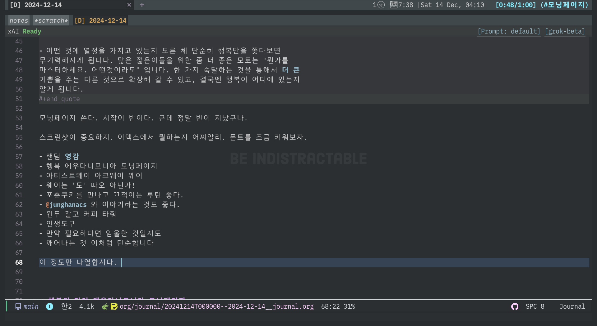

<!-- gid:20241214T070506 -->
[[TIP("이 노트에 대하여")]]
새벽 모닝페이지에서 떠오른 단어들을 따라 포춘쿠키와 웨이, 운명애, 깨어남을 연결한다. 사소한 영감 줍기가 삶의 철학으로 확장되는 힣 특유의 리듬이 살아 있다.
[[/TIP]]

<!-- provenance:source:start -->
[[TIP("원본·최신본")]]
이 페이지는 한국어 검색과 읽기를 위한 WikiDocs 미러입니다. [원본·최신본은 가든](https://notes.junghanacs.com/notes/20241214T070506/)에 있습니다. 최신 수정 내용·백링크·태그·히스토리·댓글·출처 정보는 원본 가든에서 확인하세요.

- 작성: `2024-12-14T07:05:00+09:00`
- 최근 수정: `2026-07-07T10:23:00+09:00`
[[/TIP]]
<!-- provenance:source:end -->

[TOC]

## 히스토리

-   [2026-07-07 Tue 10:23] 표준 포맷에 맞춰 관련메타·관련노트·한 줄을 세우고, 본문 초입과 행복/에우다이모니아 표기를 정리했다.
-   [2026-07-06 Mon 17:48] 아도/직관 원석은 별도 autholog 방 \`20251124T164312\`로 분리하고, 이 방은 원래 중심인 랜덤 포춘쿠키·웨이·행복·에우다이모니아·모닝페이지 축으로 정비했다.
-   [2024-12-14 Sat 07:05] 랜덤 포춘쿠키, 웨이, 도, 인생도구, 깨어남, 운명애를 모닝페이지 흐름으로 기록.

## 관련메타

-   [영감 부싯돌 찰나 순간 불꽃 등불](https://wikidocs.net/380585) — 랜덤 포춘쿠키를 영감 줍기의 장치로 쓰는 축.
-   [행복 만족 웰빙 기쁨 즐거움](https://wikidocs.net/380884) — bliss, happiness, eudaimonia를 구분해 보는 행복 자석.
-   [모닝페이지 데일리 저널 매일 일기 일상](https://wikidocs.net/380636) — 새벽 글쓰기 루틴의 자리.
-   [인생도구 생각도구 지식도구 사고도구](https://wikidocs.net/380657) — 도구를 마스터하며 삶의 방향을 발견하는 축.
-   [꽝 하산하라 깨달음 해탈 대극 다르마 경계 메타노이아 회심](https://wikidocs.net/380809) — 깨어남과 길 없는 길의 언어가 붙는 자리.

## 관련노트

-   [케빈켈리 기술의충격 통제불능 테크늄 구루](https://wikidocs.net/381886) — 포춘쿠키와 “master something” 조언의 출발점.
-   [줄리아카메론 아티스트웨이 모닝페이지](https://wikidocs.net/382196) — 모닝페이지라는 루틴의 직접 출전.
-   [미하이칙센트미하이 몰입의즐거움 자기목적성 운명애](https://wikidocs.net/382026) — bliss를 자기목적성과 연결하는 축.
-   [마이클싱어 상처받지않는영혼 될일은된다 삶이당신보다더잘안다 스승](https://wikidocs.net/381909) — 웨이 _도_ 받아들임의 감각.
-   [올리버버크먼 4000주 불완전주의 삶의유한함 받아들임](https://wikidocs.net/382132) — 커피를 내리는 수고로움과 시간의 감각.

## 한 줄

포춘쿠키 한 줄과 새벽 모닝페이지는 사소한 랜덤 영감이지만, 계속 붙잡으면 행복(bliss)·에우다이모니아·도(道)·인생도구가 한 루틴 안에서 만난다.

## 모닝페이지 영감 줍기

> (kevin-kelly-68.t2t)
> 
> Following your bliss is a recipe for paralysis if you don’t know what you are passionate about. A better motto for most youth is “master something, anything”. Through mastery of one thing, you can drift towards extensions of that mastery that bring you more joy, and eventually discover where your bliss is.
> 
> 어떤 것에 열정을 가지고 있는지 모른 채 단순히 행복만을 좇다 보면 무기력해지게 됩니다. 많은 젊은이를 위한 좀 더 좋은 모토는 “뭔가를 마스터하세요. 어떤 것이라도”입니다. 한 가지를 숙달하면 더 큰 기쁨을 주는 다른 것으로 확장해 갈 수 있고, 결국 행복이 어디에 있는지 알게 됩니다.

모닝페이지 쓴다. 시작이 반이다. 근데 정말 반이 지났구나. 스크린샷이 중요하지. 이맥스에서 뭘 하는지 어찌 알리. 폰트를 조금 키워보자.

-   랜덤 영감
-   행복 에우다이모니아 모닝페이지
-   아티스트웨이 아크웨이 웨이
-   웨이는 '도' 따오 아닌가!
-   포춘쿠키를 만나고 끄적이는 루틴 좋다.
-   @junghanacs 와 이야기하는 것도 좋다.
-   원두 갈고 커피 타줘
-   인생도구
-   만약 필요하다면 암울한 것일지도
-   깨어나는 것 이처럼 단순합니다

이 정도만 나열합시다. 여기서 스크린샷을 넣어 봅시다.

그래요. 지금은 새벽입니다. 우측에 보면 모닝페이지에 한 시간 잡아놨는데 벌써 저래 되었군요. 상관 없습니다. 보여주려고 잡아 놓은 것입니다. 저는 잘 안 쓰는 기능 입니다.

## xAI Ready — grok-beta

그리고 상단에 보면 xAI **Ready** ... [Prompt: default] [grok-beta] 라고 보입니다. 현재 grok-beta 를 켜놨습니다. 뭐 물어보기 좋더군요. 아무튼 이렇게 시작 합니다.

## 원두 갈고 커피 타줘

가족이 자고 있으니 조용히 원두를 갈고 커피를 내렸습니다. 버튼 하나면 될 법한 시대에 천천히 수고스러움을 즐겼습니다. 올리버버크먼의 4000주에서 커피를 내리기 위해 1시간 걸리는 수고로움을 즐기는 모 학자의 이야기가 생각이 납니다. 공용 전자레인지와 기다림에 관한 이야기도 흥미롭습니다. 아. 식기세척기 세탁기 등은 집안 일에 드는 시간을 줄여주지 않는 다는 이야기는 확 와닿더군요. ([올리버버크먼: 4000주 불완전주의 삶의유한함 받아들임](https://wikidocs.net/382132)) 아. 버크먼은 다룰 이야기가 아닌데 이런.

아무튼. 간단히 정리하자. 누가 보려나? 해서 쓰려면 맞춤법 검사기를 켜고 이래저래 손이 든다. 여긴 가든이야. 누더기를 찬양하는 공간이라고! 출판용 글에나 신경써라. 근데 뭘 출판 하겠나? 삶을 털어 줄껀데 뭔 책을? ([책쓰기: 책을 쓰지 말아야 하는 이유](https://wikidocs.net/381334))

## 랜덤 영감 : 포춘쿠키를 만나고 끄적이는 루틴 좋다.

아무튼 다시. 랜덤 영감으로 가자. 랜덤 영감 하려니 포춘쿠키 관련 글이 몇개 있지. 그래. 포춘쿠키 나오는 걸 보고 그거 풀어 보자고. 이게 뭔가 영감의 계시처럼 말이지.

-   [케빈켈리 기술의충격 테크늄 포춘쿠키 구루 와이어드 (2024-03-01)](https://wikidocs.net/381886)
-   [모음: 포춘쿠키 인용 구루 조언 (2023-06-21)](https://wikidocs.net/381071)
-   [힣: 포춘쿠키 삶과죽음 삶으로서일 도서목록 (2024-12-07)](https://wikidocs.net/381411)
-   [힣: 랜덤포춘쿠키 웨이 도 인생도구 깨어남 암울한시대 운명애 (2024-12-14)](https://wikidocs.net/381436)

영감에 대해서는 좀 썼지. 아마. 이거. 말이야. 아. 잠시만. 블로그 글 다 도로 가져와라. 노트에 없다.

-   [릭루빈: 창조적행위 영감 예술 프로듀서 음악 (2024-03-01)](https://wikidocs.net/381887)
-   [영감 (2024-05-22)](https://wikidocs.net/380585)
-   [힣: 영감: 상처받지않는영혼 슬로우워크 모바일워크플로우 (2024-09-28)](https://wikidocs.net/381337)
-   [부싯돌: 불 영감 창조 자각몽 원형 (2025-05-18)](https://wikidocs.net/381716)

블로그 글 내보낸 것들 이거 다 노트에 다시 담아줘. 노트에 있고 그 다음에 잘 추려서 내보내자고 한 것인데. 노트에 일단 있고 그 다음에 말이야. 중복환영!

## 행복 에우다이모니아 모닝페이지 아티스트웨이 웨이

행복 도구 마스터. 켈리 스승님 말씀 와따. 맞다. 진짜. 아. 주제 추가 안하려고 하기는 한데. 요즘에 참. 몰입하는 삶이 명상이고 전체의식으로 돌아가는 삶이라는 체험을 많이 하게 된다. 미하이 선생님 책에 오토텔릭 아놔. 생각 안나. 그래! 자기목적성 운명애 말이야. 이거. 몰입의 즐거움이 괜한게 아니여.

-   [미하이칙센트미하이: 몰입의즐거움 자기목적성 운명애 (2024-08-01)](https://wikidocs.net/382026)

한글로 행복이라고 퉁쳤지만, 영어는 bliss라고 써놨잖여. joy, happy 같은 말 말고. 행복 말이야. 역시 메타노트에 행복이라고 있는데 가보니 happiness라고 써놨군. 게을러서 그런 거여. 이참에 행복잡이 하는 거지 뭐. 에우다이모니아를 보자고. 이 부분은 가물해서 뒤에 대화로 적어놨어. 더 말하면 끝도 없어. 또 물어보면 되니까. 중복 허용하자.

-   [크리스토프알렉상드르마티유 지혜 수업 어떻게 행복해질 것인가 - 의사 철학자 종교인 - 세 친구 (2024-01-10)](https://wikidocs.net/381872)
-   [엘링카게 남극 탐험가 산책 침묵 조용한 행복 (2024-08-20)](https://wikidocs.net/382051)
-   [모가댓: 행복방정식 스승 공존 (2024-08-23)](https://wikidocs.net/382055)
-   [happiness 행복 에우다이모니아 (2025-04-24)](https://wikidocs.net/380884)
-   [힣: 인생도구: 앎 지식 몰입 행복 자기목적성 운명애 (2024-03-21)](https://wikidocs.net/381201)
-   [힣: 아무도 읽지 않는 디지털가든 만들고 행복한 지인 이야기 (feat. 6세 아이에게 기술이란) (2025-03-16)](https://wikidocs.net/381590)
-   [지식 앎 몰입 행복에 이르는 길 : 인생도구 (2024-03-21)]

## 인생도구

[인생도구 생각도구 지식도구](https://wikidocs.net/380657)

그래 도구 마스터. 이게 참 묘해. 인생도구라는 말이 웃기긴 한데. 심각하게 적어놨지.

## 웨이는 '도' 따오 아닌가!

이 참에 모닝페이지도 담았거든. 이게 줄리아카메론 선생님 책에서 나온 건데 책은 본적 없어. 근데 알 것 같아. 이 느낌. 쓰면 아는 느낌. 책 봐선 모를꺼야.

-   [줄리아카메론 아티스트웨이 모닝페이지 (2024-12-14)](https://wikidocs.net/382196)
-   [모닝페이지 데일리저널 일기 (2024-08-22)](https://wikidocs.net/380636)
-   [힣: 모닝페이지 데일리 루틴 저널 (2024-09-21)](https://wikidocs.net/381321)
-   [힣: 갈매기의꿈 상처받지않는영혼 무지의앎 모닝페이지 (2024-09-22)](https://wikidocs.net/381326)

웨이를 말하면 '도' 따오! 말이지. "삶의 길. 역설. 페러독스. 길 없는 길. 없이계신분. 내가 있는 곳에 신은 없다 신이 계신 곳에는 나는 없다." 이런 말들이 떠오르지만 떠오르는 것 또한 그것은 아닐게야. 마이클싱어의 책에 도덕경을 이야기 할 때, 놀라운 말로 시작했던 것이 기억난다. 하나도 받아 들일 수 없을 수도 있는 반면, 한 글자에 눈물이 샘솟을 수도 있다고. 이게 바로 '도'일거야. 실제로 음악에서 쉽게 알 수 이는 부분의 전체성의 [홀로그래피](https://wikidocs.net/380768) 이론으로 실체가 조금 잡히기도 해.

-   [마이클싱어: 상처받지않는영혼 될일은된다 삶이당신보다더잘안다 스승 (2024-03-26)](https://wikidocs.net/381909)
-   [프리초프카프라 물리학 동양사상 도 (2024-05-26)](https://wikidocs.net/381952)
-   [웨인다이어 치우치지않는삶 도덕경 노자 (2024-08-16)](https://wikidocs.net/382048)
-   [구본형 익숙한것과의결별 자기혁명 변화경영 사상가 스승 (2024-08-16)](https://wikidocs.net/382049)
-   [바이런케이티: 생각작업 네가지질문 기쁨의천가지이름 (2024-09-27)](https://wikidocs.net/382092)
-   [테런스타오 TerenceTao 수학자 보조증명 Machine Assisted Proof (2024-10-19)](https://wikidocs.net/382125)
-   [이부영 칼융 분석심리학 자아 자기실현 무의식 (2024-12-20)](https://wikidocs.net/382205)
-   [오강남 노자 도덕경 비교종교학 장자 세계종교 (2024-12-20)](https://wikidocs.net/382211)
-   [힣: 랜덤포춘쿠키 웨이 도 인생도구 깨어남 암울한시대 운명애 (2024-12-14)](https://wikidocs.net/381436)

## 깨어나는 것 이처럼 단순합니다

이제. 아. 화장실. 놀라운 사실. 몰입 집중은 변비에 좋다. 실제로 좋다. 과학적인 맥락이 있으나. 일단 패스. 놀라운 사실을 떠올리니. 크릭의 책이 생각이 났다. 놀라운가설이였구나. 아무렴. 물어봐서 찾음 되고. 이 참에 생명에 대한 이야기를 허접하게 나눴다. 아무렴. 지향하는 바가 있었으니. 앎이 아니겠는가.

-   [프랜시스크릭 놀라운가설 생명 과학적탐구 (2024-12-14)](https://wikidocs.net/382197)

잠시만. 원래 깨어나는 것은 이처럼 단순하다는게 아니다. 우리의 내부적인 목적은 깨어나는 것 입니다라고 해야 할 것 같다. 이 말은 톨레의 삶으로다시떠오르기에 9장 삶의 목적에 깨어나기에서 만나는 말이다. 9장과 10장으로 이어지는 이야기는 조용히 앉아서 바라보기 좋다. 지금 하던 글만 마무리하고 쇼파에 앉아서 9장부터 조용히 TTS 로 들을 예정이다. 따로 명상이랄 것은 없지만 하는 것이라곤 종종 눈을 감고 이런 책들을 듣는 것이다. 눈을 감는 것 만으로 두통에 좋다. 뇌신경계 이완이라고 하나 아무렴 의도적으로 풀어주는 것도 좋다. 아프면 뭘 할 수가 없으니 말이다. 아무튼 몇 시간 눈을 쓰면 피로가 온다. 이럴 때 눈... 뭐지? 깨어나는 이야기 하려다가... 말로 담을 수 있는 이야기는 아니다. 그렇다고 뭘 할 수 있는 것도 아니다. 그냥 스며드는게 아닐까 싶다.

-   [에크하르트톨레 1948 영성가 사상가 (2024-04-19)](https://wikidocs.net/381915)

## 만약 필요하다면 암울한 것일지도

이 이야기로 마무리를 지으려고 한다. 최근 문득 떠오른 말이다. 디지털가든이나 뭐나 여기 글들이나 질문들이나 고민들이나 이맥스 지식도구 앎도구 뭐든 간에. 하고 있다. 바쁘다. 실제로 바쁘다. 돈 버는 일도 아니고 취업 준비도 아니고. 납득할 수 없는 무언가 하는 것이다. 유용하다고 믿는 그런 것도 없다. 삶이 주는 질문은 문자와 되는 것이 아니고 불어오는 무언가를 하는 것이다. 여기에 '나'가 있다면 '나'는 그것을 할 수 없다. 존재로 불어오는 뭔가 하는 것이다. '나'는 안다. 자주 듣는다. 자기 합리화일 뿐. 취미 생활일 뿐이라고. 맞는 말이다. 근데 계속 한다. 막무가내로 한다.

막무가내? 있는 말인가? 딱 그렇다. 아하! "알려주는 데로 해"라는 말을 얼마나 들었던가? 실제로는 "시킨대로 해!"와 다를게 없다. 아무렴 '나' 좋게 해주려고 도와주는 많은 착한 이들의 가르침이다. 그런게 시키는대로 하는 게 정말 안된다. 납득은 둘째치고 흥미가 안간다. 그러면 정말 고통의 재생산 루프로 빠진다.([ADHD: 선택적집중](https://wikidocs.net/380489)) 결국 '나'의 방식대로 하고 있다. '나'대로 할 뿐. 이게 더 좋은 무언가라서 하는 것도 아니다. 그 무엇도 아니다.

그래. 이제 진짜 하려는 말은. 여기서 줄창 말하는 인생도구란게 필요하다면. 그래서 '나'가 뭐라도 세상에 쓸모가 있어 진다면. 세상은 암울하기 때문이라는 것이다. 인공지능 시대의 인간 존재 허무를 느끼기 때문일지도 모른다. 뭐 근데 사람은 다 다르니까. '나'가 허무하게 보는 것 뿐이니까. 도움이 되길 바란다. '나'가 보는 어려움이 있다면 다른 이가 아닌 '나'가 나설 일일테니까.

-   [유발하라리: 사피엔스 넥서스 호모데우스 명상가 YUVAL HARARI (2024-08-21)](https://wikidocs.net/382054)
-   [무스타파술레이만: 더커밍웨이브 The-Coming-Wave 딥마인드 인공지능 미래 인류세 규제 (2024-12-13)](https://wikidocs.net/382193)
-   [야니스바루파키스 테크노퓨달리즘 기술봉건주의 - 빅테크 알고리즘 새로운 지배 계급 계층](https://wikidocs.net/382479)

## 행복의 단어 — 에우다이모니아와 모닝페이지

[2024-12-14 Sat 03:23]

bliss: 행복, 기쁨, 또는 완전한 만족 상태를 의미합니다.

happiness 말고도 행복의 의미를 지니는 단어들이 있다. 좀 더 의미를 파헤쳐 봐야 한다. 아리스토텔레스 에우다이모니아인가? 그런 표현도 생각이 난다.

## 로그

### 2024-12-14

### @user 행복을 나타내는 영어 단어를 소개해줘.

물론입니다! 행복을 나타내는 영어 단어는 여러 가지가 있습니다:

-   **Joy** (기쁨): 순간적인 행복이나 즐거움을 의미합니다.
-   **Bliss** (극락, 완전한 행복): 매우 높은 수준의 행복이나 만족을 나타냅니다.
-   **Contentment** (만족): 현재 상태에 만족하는 상태를 의미합니다.
-   **Satisfaction** (만족): 목표를 달성하거나 기대를 충족시켰을 때 느끼는 감정입니다.
-   **Fulfillment** (충족, 만족): 삶의 목표나 꿈을 이루었을 때 느끼는 깊은 만족감입니다.
-   **Euphoria** (열락, 황홀경): 매우 강렬하고 일시적인 행복감을 의미합니다.
-   **Serenity** (평온): 마음의 평화와 안정을 의미합니다.
-   **Delight** (기쁨, 즐거움): 즐거움을 느끼는 상태입니다.
-   **Ecstasy** (황홀경): 극도의 기쁨이나 환희를 의미합니다.
-   **Well-being** (안녕, 복지): 전반적인 삶의 질과 행복을 포함하는 개념입니다.

이 단어들은 각기 다른 뉘앙스를 가지고 있으며, 상황에 따라 적절한 단어를 선택하는 것이 중요합니다.

@user happiness 는 어떤 행복이지?

**Happiness** 는 일반적으로 다음과 같은 의미를 지닙니다:

-   **일반적인 행복**: 'Happiness'는 일상적인 행복이나 기쁨을 나타내는 가장 일반적인 단어입니다. 이는 특정한 사건이나 상황에 의해 유발된 순간적인 감정일 수도 있고, 더 지속적인 삶의 상태일 수도 있습니다.

-   **주관적 안녕감**: 심리학에서는 'Happiness'를 주관적 안녕감(Subjective Well-Being)과 연관지어 설명합니다. 여기에는 긍정적 감정, 삶에 대한 만족, 그리고 부정적 감정의 부재가 포함됩니다.

-   **쾌락주의적 행복**: 'Happiness'는 종종 쾌락주의적 관점에서의 행복을 의미하기도 합니다. 즉, 쾌락과 즐거움을 추구하고 고통과 불쾌함을 피하는 것을 중심으로 한 행복입니다.

-   **에우다이모니아와의 차이**: 아리스토텔레스의 '에우다이모니아'와는 다소 다릅니다. '에우다이모니아'는 삶의 목적을 달성하고, 잠재력을 최대한 발휘하며, 덕을 실천하는 것에서 오는 더 깊고 의미 있는 행복을 의미합니다. 반면, 'Happiness'는 종종 더 일시적이고 외부적 요인에 의해 영향을 받는 감정 상태를 가리킵니다.

요약하자면, 'Happiness'는 일상적인 기쁨이나 만족을 나타내는 넓은 의미의 단어로, 순간적인 감정에서부터 지속적인 삶의 상태까지 다양한 형태의 행복을 포함합니다.

@user 아리스토텔레스의 에우다니모니아인가? 행복에 관련 된 단어가 있었는데?

네, 맞습니다. 아리스토텔레스는 **에우다이모니아** (eudaimonia)라는 개념을 통해 행복을 설명했습니다. 이 단어는 다음과 같은 의미를 가지고 있습니다:

-   **Eudaimonia** (에우다이모니아): 이 단어는 '행복'이나 '복지'를 의미하지만, 단순한 쾌락이나 순간적인 기쁨과는 다릅니다. 아리스토텔레스에게 에우다이모니아는 인간이 최고의 선을 추구하고, 자신의 잠재력을 최대한 발휘하며, 덕(virtue)에 따라 살아가는 상태를 의미합니다. 이는 인간이 자신의 본질적인 목적을 실현하고, 삶의 의미와 목적을 찾는 과정에서 오는 깊은 만족감을 나타냅니다.

에우다이모니아는 다음과 같은 요소들을 포함합니다:

-   **덕(virtue)**: 도덕적 선을 추구하는 것.
-   **실현**: 자신의 잠재력을 최대한 발휘하는 것.
-   **목적**: 삶의 목적을 찾고 그것을 실현하는 것.

이러한 개념은 현대 심리학에서도 '자기실현(self-actualization)'이나 '목적 있는 삶(purposeful life)'과 같은 개념으로 이어지고 있습니다.

@user "모닝페이지"를 쓰고 있는데 모닝페이지라는 삶의 루틴을 어떤 저자의 책에서 보았거든 찾아봐줄래. 그리고 왜 모닝페이지가 어떠한 삶의 철학에 닿아 있는지 알고싶어.

"모닝페이지"라는 개념은 **줄리아 캐머런(Julia Cameron)** 의 책 \*《The Artist's Way》/에서 소개되었습니다. 이 책은 창의력과 예술적 영감을 되찾기 위한 12주 프로그램을 제공하며, 모닝페이지는 그 중 하나의 중요한 도구입니다.

**모닝페이지란?**

모닝페이지는 매일 아침 일어나서 3페이지 분량의 글을 쓰는 것을 말합니다. 이 글은 다음과 같은 특징을 가집니다:

-   **자유로운 글쓰기**: 주제나 형식에 구애받지 않고, 떠오르는 생각을 그대로 적습니다.
-   **편집 없이**: 오타나 문법에 신경 쓰지 않고, 생각을 그대로 쏟아냅니다.
-   **비판 없이**: 자신을 비판하거나 판단하지 않고, 마음껏 표현합니다.

**모닝페이지의 철학적 배경**

모닝페이지는 다음과 같은 삶의 철학과 연결됩니다:

1.  **자기 발견과 성찰**: 모닝페이지를 통해 자신의 내면을 탐구하고, 감정과 생각을 정리할 수 있습니다. 이는 스스로를 더 잘 이해하고, 자신의 진정한 욕구와 목표를 발견하는 데 도움이 됩니다.

2.  **창의력의 해방**: 캐머런은 모닝페이지가 창의력을 억제하는 '내면의 비평가'를 잠재우고, 자유로운 창의력을 끌어내는 도구라고 설명합니다. 이는 예술가뿐만 아니라 모든 사람이 자신의 창의력을 발휘하는 데 도움이 됩니다.

3.  **정신적 건강**: 매일 아침 글을 쓰는 행위는 마음을 비우고, 스트레스를 줄이며, 정신적 건강을 증진시킵니다. 이는 명상이나 요가와 유사한 효과를 가질 수 있습니다.

4.  **습관과 루틴의 중요성**: 모닝페이지는 일상의 루틴을 통해 자기 규율과 일관성을 기르는 방법입니다. 이는 삶의 다른 영역에서도 긍정적인 영향을 미칠 수 있습니다.

5.  **자유와 표현의 권리**: 모닝페이지는 자신을 표현할 권리를 주장하며, 이는 개인의 자유와 자아실현을 위한 중요한 행위로 간주됩니다.

모닝페이지는 단순히 글을 쓰는 행위를 넘어서, 자신과의 대화, 창의력의 원천을 찾는 과정, 그리고 더 나은 삶을 위한 철학적 접근을 제공합니다.
