<!-- gid:20241214T210518 -->
[TOC]

[[TIP("이 노트에 대하여")]]
피타고라스 정리와 기하학의 여러 가능성을 통해 현대 물리학 질문으로 나아가는 장을 담고 있다. 고전의 증명과 현대적 물음이 어떻게 이어지는지 따라가게 하는 독서 노트다.
[[/TIP]]

-   [RTR 실체이르는길 The-Road-to-Reality](https://wikidocs.net/381398)

## **2** **An ancient theorem and a modern question** 고대의 정리와 현대의 질문

### **2.1  The Pythagorean theorem** 피타고라스의 정리

Let us consider the issue of geometry. What, indeed, are the different ‘kinds of geometry' that were alluded to in the last chapter? To lead up to this issue, we shall return to our encounter with Pythagoras and consider that famous theorem that bears his name:[^fn:1] for any right-angled triangle, the square of the length of the hypotenuse (the side opposite the right angle) is equal to the sum of the squares of the lengths of the other two sides (Fig. 2.1). What reasons do we have for believing that this assertion is true? How, indeed, do we ‘prove' the Pythagorean theorem? Many arguments are known. I wish to consider two such, chosen for their particular transparency, each of which has a different emphasis.

For the first, consider the pattern illustrated in Fig. 2.2. It is composed entirely of squares of two different sizes. It may be regarded as ‘obvious' that this pattern can be continued indefinitely and that the entire plane is thereby covered in this regular repeating way, without gaps or overlaps, by squares of these two sizes. The repeating nature of this pattern is made manifest by the fact that if we mark the centres of the larger squares, they form the vertices of another system of squares, of a somewhat greater size than either, but tilted at an angle to the original ones (Fig. 2.3) and which alone will cover the entire plane. Each of these tilted squares is marked in exactly the same way, so that the markings on these squares fit together to form the original two-square pattern. The same would apply if, instead of taking the centres of the larger of the two squares of the original pattern, we chose any other point, together with its set of corresponding points throughout the pattern. The new pattern of tilted squares is just the same as before but moved along without rotation---i.e. by means of a motion referred to as a _translation._ For simplicity, we can now choose our starting point to be one of the corners in the original pattern (see Fig. 2.4).

triangle, the squared length of the hypotenuse _c_ is the sum of the squared lengths of the other two sides _a_ and _b_.

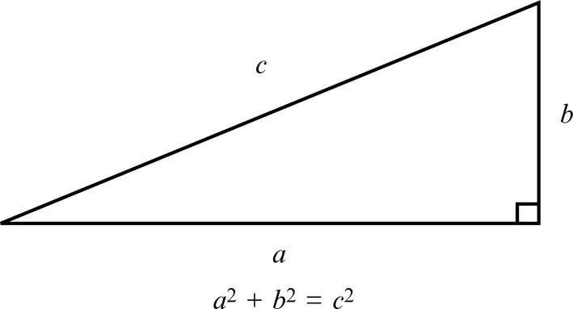

different sizes.

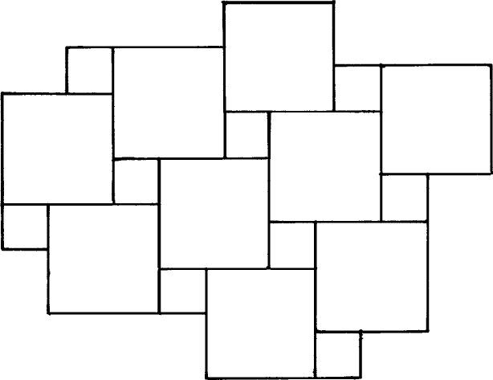

vertices of a lattice of still larger squares, tilted at an angle.

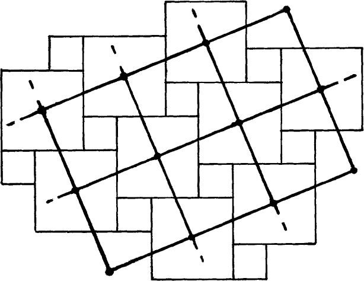

It should be clear that the area of the tilted square must be equal to the sum of the areas of the two smaller squares---indeed the pieces into which the markings would subdivide this larger square can, for any starting point for the tilted squares, be moved around, without rotation, until they fit together to make the two smaller squares (e.g. Fig. 2.5). Moreover, it is evident from Fig. 2.4 that the edge-length of the large tilted square is the hypotenuse of a right-angled triangle whose two other sides have lengths equal to those of the two smaller squares. We have thus established the Pythagorean theorem: the square on the hypotenuse is equal to the sum of the squares on the other two sides.

The above argument does indeed provide the essentials of a simple proof of this theorem, and, moreover, it gives us some ‘reason' for believing that the theorem has to be true, which might not be so obviously the case with some more formal argument given by a succession of logical steps without clear motivation. It should be pointed out, however, that there are several implicit assumptions that have gone into this argument. Not the least of these is the assumption that the seemingly obvious pattern of repeating squares shown in Fig. 2.2 or even in Fig. 2.6 is actually geometrically possible---or even, more critically, that a _square_ is something geometrically possible! What do we mean by a ‘square' after all? We normally think of a square as a plane figure, all of whose sides are equal and all of whose angles are right angles. What is a right angle? Well, we can imagine two straight lines crossing each other at some point, making four angles that are all equal. Each of these equal angles is then a right angle.

a translation, here so that the vertices of the tilted lattice lie on vertices of the original two-square lattice, showing that the side-length of a tilted square is the hypotenuse of a right-angled triangle (shown shaded) whose other two side-lengths are those of the original two squares.

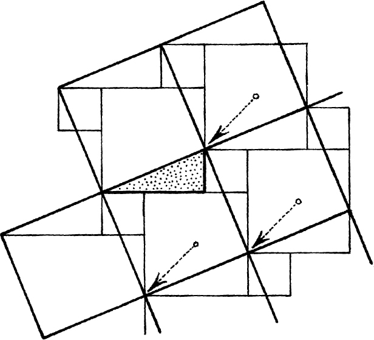

square, such as that depicted, the tilted square is divided into pieces that it together to make the two smaller squares.

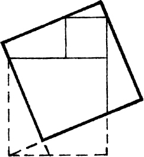

know it exists?

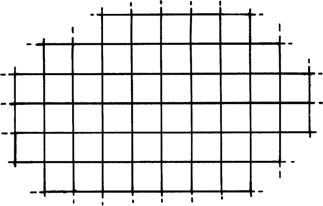

Let us now try to construct a square. Take three equal line segments AB, BC, and CD, where ABC and BCD are right angles, D and A being on the same side of the line BC, as in Fig. 2.7. The question arises: is AD the same length as the other three segments? Moreover, are the angles DAB and CDA also right angles? These angles should be equal to one another by a left--right symmetry in the figure, but are they actually right angles? This only seems obvious because of our familiarity with squares, or perhaps because we can recall from our schooldays some statement of Euclid that can be used to tell us that the sides BA and CD would have to be ‘parallel' to each other, and some statement that any ‘transversal' to a pair of parallels has to have corresponding angles equal, where it meets the two parallels. From this, it follows that the angle DAB would have to be equal to the angle complementary to ADC (i.e. to the angle EDC, in Fig. 2.7, ADE being straight) as well as being, as noted above, equal to the angle ADC. An angle (ADC) can only be equal to its complementary angle (EDC) if it is a right angle. We must also prove that the side AD has the same length as BC, but this now also follows, for example, from properties of transversals to the parallels BA and CD. So, it is indeed true that we can prove from this kind of Euclidean argument that squares, made up of right angles, actually do exist. But there is a deep issue hiding here.

right angles, with AB = BC = CD. Does it follow that DA is also equal to these lengths and that DAB and CDA are also right angles?

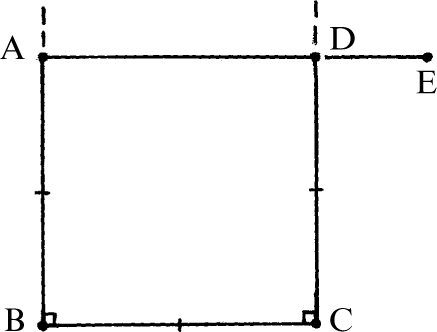

### **2.2  Euclid's postulates** 유클리드의 공준

In building up his notion of geometry, Euclid took considerable care to see what assumptions his demonstrations depended upon.[^fn:2] In particular, he was careful to distinguish certain assertions called _axioms_---which were taken as self-evidently true, these being basically definitions of what he meant by points, lines, etc.---from the five _postulates_, which were assumptions whose validity seemed less certain, yet which appeared to be true of the geometry of our world. The final one of these assumptions, referred to as Euclid's fifth postulate, was considered to be less obvious than the others, and it was felt, for many centuries, that it ought to be possible to find a way of proving it from the other more evident postulates. Euclid's fifth postulate is commonly referred to as the _parallel postulate_ and I shall follow this practice here.

Before discussing the parallel postulate, it is worth pointing out the nature of the other four of Euclid's postulates. The postulates are concerned with the geometry of the (Euclidean) plane, though Euclid also considered three-dimensional space later in his works. The basic elements of his plane geometry are points, straight lines, and circles. Here, I shall consider a ‘straight line' (or simply a ‘line') to be indefinitely extended in both directions; otherwise I refer to a ‘line segment'. Euclid's _first_ postulate effectively asserts that there is a (unique) straight line segment connecting any two points. His _second_ postulate asserts the unlimited (continuous) extendibility of any straight line segment. His _third_ postulate asserts the existence of a circle with any centre and with any value for its radius. Finally, his _fourth_ postulate asserts the equality of all right angles.[^fn:3]

From a modern perspective, some of these postulates appear a little strange, particularly the fourth, but we must bear in mind the origin of the ideas underlying Euclid's geometry. Basically, he was concerned with the movement of idealized rigid bodies and the notion of _congruence_ which was signalled when one such idealized rigid body was moved into coincidence with another. The equality of a right angle on one body with that on another had to do with the possibility of moving the one so that the lines forming its right angle would lie along the lines forming the right angle of the other. In effect, the fourth postulate is asserting the isotropy and homogeneity of space, so that a figure in one place could have the ‘same' (i.e. congruent) geometrical shape as a figure in some other place. The second and third postulates express the idea that space is indefinitely extendible and without ‘gaps' in it, whereas the first expresses the basic nature of a straight line segment. Although Euclid's way of looking at geometry was rather different from the way that we look at it today, his first four postulates basically encapsulated our present-day notion of a (two-dimensional) metric space with complete homogeneity and isotropy, and infinite in extent. In fact, such a picture seems to be in close accordance with the very large-scale spatial nature of the actual universe, according to modern cosmology, as we shall be coming to in §27.11 and §28.10.

What, then, is the nature of Euclid's fifth postulate, the parallel postulate? As Euclid essentially formulated this postulate, it asserts that if two straight line segments _a_ and _b_ in a plane both intersect another straight line _c_ (so that _c_ is what is called a _transversal_ of _a_ and b) such that the sum of the interior angles on the same side of _c_ is less than two right angles, then _a_ and _b_, when extended far enough on that side of _c_, will intersect somewhere (see Fig. 2.8a). An equivalent form of this postulate (sometimes referred to as _Playfair's axiom_) asserts that, for any straight line and for any point not on the line, there is a unique straight line through the point which is parallel to the line (see Fig. 2.8b). Here, ‘parallel' lines would be two straight lines in the same plane that do not intersect each other (and recall that /my ‘/lines' are fully extended entities, rather than Euclid's ‘segments of lines').[BROKEN LINK: Penr_9780593315309_epub3_c02_r1.xhtml_ch2-1]]

_b_ are transversals to a third line c, such that the interior angles where _a_ and _b_ meet _c_ add to less than two right angles. Then _a_ and _b_ (assumed extended far enough) will ultimately intersect each other. (b) Playfair's (equivalent) axiom: if _a_ is a line in a plane and P a point of the plane not on a, then there is just one line parallel to _a_ through P, in the plane.

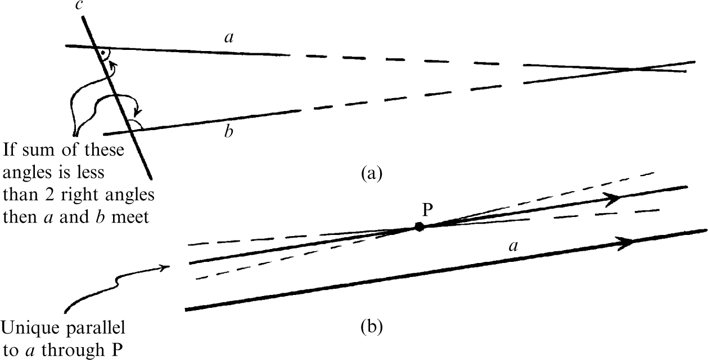

Once we have the parallel postulate, we can proceed to establish the property needed for the existence of a square. If a transversal to a pair of straight lines meets them so that the sum of the interior angles on one side of the transversal is two right angles, then one can show that the lines of the pair are indeed parallel. Moreover, it immediately follows that any other transversal of the pair has just the same angle property. This is basically just what we needed for the argument given above for the construction of our square. We see, indeed, that it is just the parallel postulate that we must use to show that our construction actually yields a square, with all its angles right angles and all its sides the same. Without the parallel postulate, we cannot establish that squares (in the normal sense where all their angles are right angles) actually exist.

It may seem to be merely a matter of mathematical pedantry to worry about precisely which assumptions are needed in order to provide a ‘rigorous proof' of the existence of such an obvious thing as a square. Why should we really be concerned with such pedantic issues, when a ‘square' is just that familiar figure that we all know about? Well, we shall be seeing shortly that Euclid actually showed some extraordinary perspicacity in worrying about such matters. Euclid's pedantry is related to a deep issue that has a great deal to say about the actual geometry of the universe, and in more than one way. In particular, it is not at all an obvious matter whether physical ‘squares' exist on a cosmological scale in the actual universe. This is a matter for observation, and the evidence at the moment appears to be conflicting (see §2.7 and §28.10).

[BROKEN LINK: LEVEL1] [2.1]]] Show that if Euclid's form of the parallel postulate holds, then Playfair's conclusion of the uniqueness of parallels must follow.

### **2.3  Similar-areas proof of the Pythagorean theorem** 닮음을 이용한 피타고라스 정리의 증명

I shall return to the mathematical significance of _not_ assuming the parallel postulate in the next section. The relevant physical issues will be re-examined in §18.4, §27.11, §28.10, and §34.4. But, before discussing such matters, it will be instructive to turn to the other proof of the Pythagorean theorem that I had promised above.

One of the simplest ways to see that the Pythagorean assertion is indeed true in Euclidean geometry is to consider the configuration consisting of the given right-angled triangle subdivided into two smaller triangles by dropping a perpendicular from the right angle to the hypotenuse (Fig. 2.9). There are now three triangles depicted: the original one and the two into which it has now been subdivided. Clearly the area of the original triangle is the sum of the areas of the two smaller ones.

Now, it is a simple matter to see that these three triangles are all _similar_ to one another. This means that they are all the same _shape_ (though of different sizes), i.e. obtained from one another by a uniform expansion or contraction, together with a rigid motion. This follows because each of the three triangles possesses exactly the same angles, in some order. Each of the two smaller triangles has an angle in common with the largest one and one of the angles of each triangle is a right angle. The third angle must also agree because the sum of the angles in any triangle is always the same. Now, it is a general property of similar plane figures that their areas are in proportion to the squares of their corresponding linear dimensions. For each triangle, we can take this linear dimension to be its longest side, i.e. its hypotenuse. We note that the hypotenuse of each of the smaller triangles is the same as one of the (non-hypotenuse) sides of the original triangle. Thus, it follows at once (from the fact that the area of the original triangle is the sum of the areas of the other two) that the square on the hypotenuse on the original triangle is indeed the sum of the squares on the other two sides: _the Pythagorean theorem!_

triangles. Take a right-angled triangle and drop a perpendicular from its right angle to its hypotenuse. The two triangles into which the original triangle is now divided have areas which sum to that of the original triangle. All three triangles are similar, so their areas are in proportion to the squares of their respective hypotenuses. The Pythagorean theorem follows.

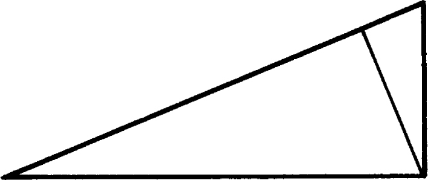

There are, again, some particular assumptions in this argument that we shall need to examine. One important ingredient of the argument is the fact that the angles of a triangle always add up to the same value. (This value of this sum is of course 180°, but Euclid would have referred to it as ‘two right angles'. The more modern ‘natural' mathematical description is to say that the angles of a triangle, in Euclid's geometry, add up to π. This is to use radians for the absolute measure of angle, where the degree sign ‘°' counts as π/180, so we can write 180° = π.) The usual proof is depicted in Fig. 2.10. We extend CA to E and draw a line AD, through A, which is parallel to CB. Then (as follows from the parallel postulate) the angles EAD and ACB are equal, and also DAB and CBA are equal. Since the angles EAD, DAB, and BAC add up to π (or to 180°, or to two right angles), so also must the three angles ACB, CBA, and BAC of the triangle---as was required to prove. But notice that the parallel postulate was used here.

This proof of the Pythagorean theorem also makes use of the fact that the areas of similar figures are in proportion to the squares of any linear measure of their sizes. (Here we chose the hypotenuse of each triangle to represent this linear measure.) This fact not only depends on the very existence of similar figures of different sizes---which for the triangles of Fig. 2.9 we established using the parallel postulate---but also on some more sophisticated issues that relate to how we actually define ‘area' for non-rectangular shapes. These general matters are addressed in terms of the carrying out of limiting procedures, and I do not want to enter into this kind of discussion just for the moment. It will take us into some deeper issues related to the kind of numbers that are used in geometry. The question will be returned to in §§3.1--3.

π (= 180° = two right angles). Extend CA to E; draw AD parallel to CB. It follows from the parallel postulate that the angles EAD and ACB are equal and the angles DAB and CBA are equal. Since the angles EAD, DAB, and BAC sum to p, so also do the angles ACB, CBA, and BAC.

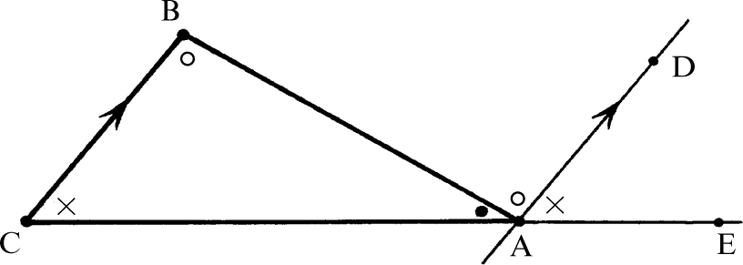

An important message of the discussion in the preceding sections is that the Pythagorean theorem seems to depend on the parallel postulate. Is this really so? Suppose the parallel postulate were false? Does that mean that the Pythagorean theorem might itself actually be false? Does such a possibility make any sense? Let us try to address the question of what would happen if the parallel postulate is indeed allowed to be taken to be false. We shall seem to be entering a mysterious make-belief world, where the geometry that we learned at school is turned all topsy-turvy. Indeed, but we shall find that there is also a deeper purpose here.

### **2.4  Hyperbolic geometry: conformal picture** 쌍곡기하학과 등각표현

Have a look at the picture in Fig. 2.11. It is a reproduction of one of M. C. Escher's woodcuts, called _Circle Limit I._ It actually provides us with a very accurate representation of a kind of geometry---called _hyperbolic_ (or sometimes _Lobachevskian_) geometry---in which the parallel postulate is false, the Pythagorean theorem fails to hold, and the angles of a triangle do not add to π. Moreover, for a shape of a given size, there does not, in general, exist a similar shape of a larger size.

In Fig. 2.11, Escher has used a particular representation of hyperbolic geometry in which the entire ‘universe' of the hyperbolic plane is ‘squashed' into the interior of a circle in an ordinary Euclidean plane. The bounding circle represents infinity' for this hyperbolic universe. We can see that, in Escher's picture, the fish appear to get very crowded as they get close to this bounding circle. But we must think of this as an illusion. Imagine that you happened to be one of the fish. Then whether you are situated close to the rim of Escher's picture or close to its centre, the entire (hyperbolic) universe will look the same to you. The notion of ‘distance' in this geometry does not agree with that of the Euclidean plane in terms of which it has been represented. As we look down upon Escher's picture from our Euclidean perspective, the fish near the bounding circle appear to us to be getting very tiny. But from the ‘hyperbolic' perspective of the white or the black fish themselves, they think that they are exactly the same size and shape as those near the centre. Moreover, although from our outside Euclidean perspective they appear to get closer and closer to the bounding circle itself, from their own hyperbolic perspective that boundary always remains infinitely far away. Neither the bounding circle nor any of the ‘Euclidean' space outside it has any existence for them. Their entire universe consists of what to us seems to lie strictly within the circle.

illustrating the conformal representation of the hyperbolic plane.

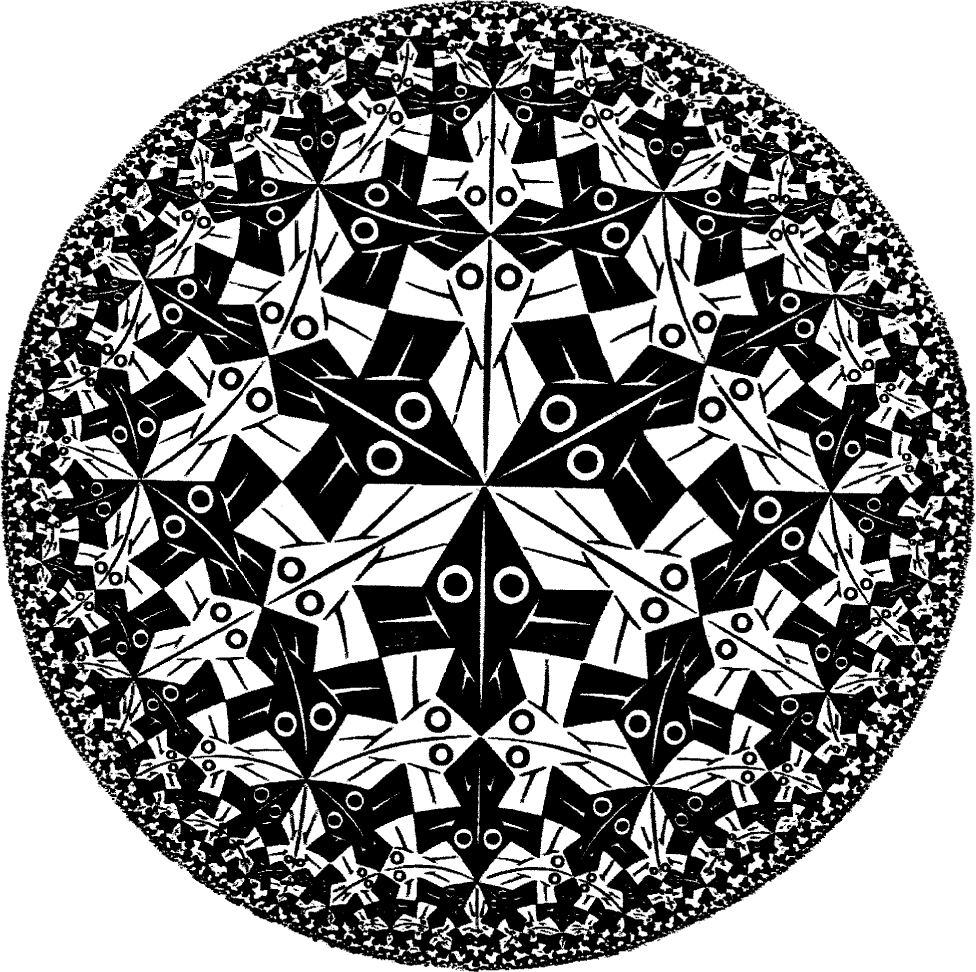

In more mathematical terms, how is this picture of hyperbolic geometry constructed? Think of any circle in a Euclidean plane. The set of points lying in the interior of this circle is to represent the set of points in the entire hyperbolic plane. Straight lines, according to the hyperbolic geometry are to be represented as segments of Euclidean circles which meet the bounding circle _orthogonally_---which means at right angles. Now, it turns out that the hyperbolic notion of an _angle_ between any two curves, at their point of intersection, is precisely the same as the Euclidean measure of angle between the two curves at the intersection point. A representation of this nature is called _conformal._ For this reason, the particular representation of hyperbolic geometry that Escher used is sometimes referred to as the _conformal model_ of the hyperbolic plane. (It is also frequently referred to as the _Poincaré disc._ The dubious historical justification of this terminology will be discussed in §2.6.)

We are now in a position to see whether the angles of a triangle in hyperbolic geometry add up to π or not. A quick glance at Fig. 2.12 leads us to suspect that they do not and that they add up to something less. In fact, the sum of the angles of a triangle in hyperbolic geometry always falls short of p. We might regard that as a somewhat unpleasant feature of hyperbolic geometry, since we do not appear to get a ‘neat' answer for the sum of the angles of a triangle. However, there is actually something particularly elegant and remarkable about what does happen when we add up the angles of a hyperbolic triangle: the shortfall is always proportional to the area of the triangle. More explicitly, if the three angles of the triangle are _α_, _β_, and γ, then we have the formula (found by Johann Heinrich Lambert 1728--1777)

hyperbolic straight lines (Euclidean circles or lines meeting the bounding circle orthogonally) and a hyperbolic triangle illustrated. Hyperbolic angles agree with the Euclidean ones. The parallel postulate is evidently violated (lettering as in Fig. 2.8b) and the angles of a triangle sum to less than p.

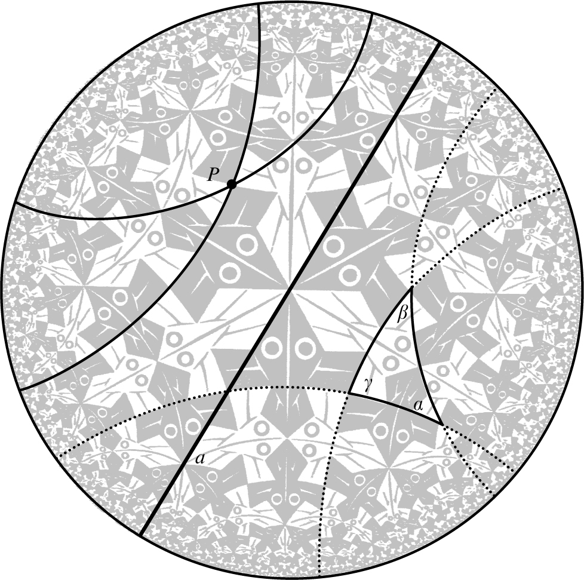

π -- (_α_ + _β_ + _γ_) = _CΔ_,

where _∆_ is the area of the triangle and _C_ is some constant. This constant depends on the ‘units' that are chosen in which lengths and areas are to be measured. We can always scale things so that _C_ = 1. It is, indeed, a remarkable fact that the area of a triangle can be so simply expressed in hyperbolic geometry. In Euclidean geometry, there is no way to express the area of a triangle simply in terms of its angles, and the expression for the area of a triangle in terms of its side-lengths is considerably more complicated.

In fact, I have not quite finished my description of hyperbolic geometry in terms of this conformal representation, since I have not yet described how the hyperbolic _distance_ between two points is to be defined (and it would be appropriate to know what ‘distance' is before we can really talk about areas). Let me give you an expression for the hyperbolic distance between two points A and B inside the circle. This is

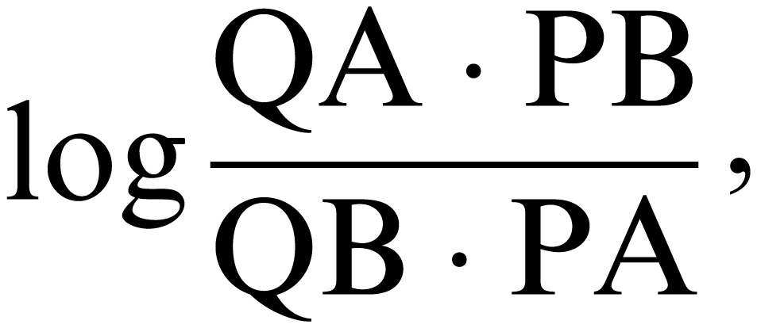

where P and Q are the points where the Euclidean circle (i.e. hyperbolic straight line) through A and B orthogonal to the bounding circle _meets_ this bounding circle and where ‘QA', etc., refer to Euclidean distances (see Fig. 2.13). If you want to include the _C_ of Lambert's area formula (with _C_ ≠ 1), just multiply the above distance expression by _C/<sup>--1/2</sup> (the reciprocal of the square root of /C_)[^fn:4]<sup>,</sup> [[2.2](#Penr_9780593315309_epub3_c02_r1.xhtml_ch2-2)] For reasons that I hope may become clearer later, I shall refer to the quantity _C/<sup>--1/2</sup> as the /pseudo-radius_ of the geometry.

If mathematical expressions like the above ‘log' formula seem daunting, please do not worry. I am only providing it for those who like to see things explicitly. In any case, I am not going to explain why the expression works (e.g. why the shortest hyperbolic distance between two points, defined in this way, is actually measured along a hyperbolic straight line, or why the distances along a hyperbolic straight line ‘add up' appropriately).[[2.3](#Penr_9780593315309_epub3_c02_r1.xhtml_ch2-3)] Also, I apologize for the ‘log' (logarithm), but that is the way things are. In fact, this is a _natural logarithm_ (‘log to the base e') and I shall be having a good deal to say about it in §§5.2,3. We shall find that logarithms are really very beautiful and mysterious entities (as is the number e), as well as being important in many different contexts.

distance between A and B is log {QA.PB/QB.PA} where QA, etc. are Euclidean distances, P and Q being where the Euclidean circle through A and B, orthogonal to the bounding circle (hyperbolic line), meets this circle.

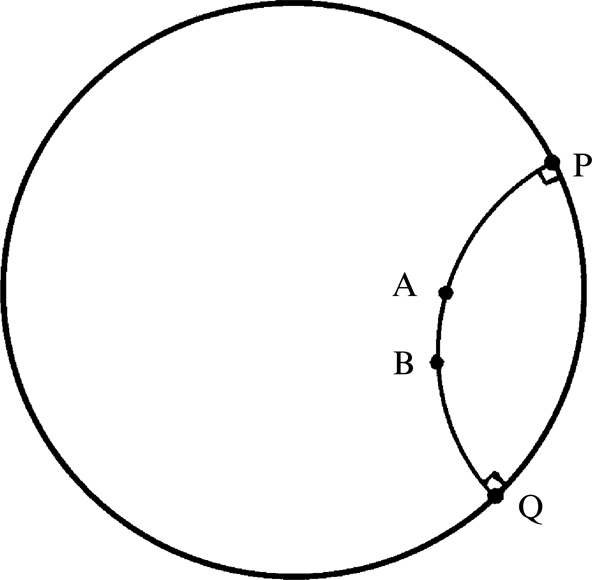

Hyperbolic geometry, with this definition of distance, turns out to have all the properties of Euclidean geometry apart from those which need the parallel postulate. We can construct triangles and other plane figures of different shapes and sizes, and we can move them around ‘rigidly' (keeping their hyperbolic shapes and sizes from changing) with as much freedom as we can in Euclidean geometry, so that a natural notion of when two shapes are ‘congruent' arises, just as in Euclidean geometry, where ‘congruent' means ‘can be moved around rigidly until they come into coincidence'. All the white fish in Escher's woodcut are indeed congruent to each other, according to this hyperbolic geometry, and so also are all the black fish.

[BROKEN LINK: LEVEL2] [2.2]]] Can you see a simple reason why?

[BROKEN LINK: LEVEL1] [2.3]]] See if you can prove that, according to this formula, if A, B, and C are three successive points on a hyperbolic straight line, then the hyperbolic distances ‘AB', etc. satisfy ‘AB' + ‘BC' = ‘AC'. You may assume the general property of logarithms, log (_ab_) = log _a_ + log _b_ as described in §§5.2, 3.

### **2.5  Other representations of hyperbolic geometry** 쌍곡기하학의 다른 표현법

Of course, the white fish do not all look the same shape and size, but that is because we are viewing them from a Euclidean rather than a hyperbolic perspective. Escher's picture merely makes use of one particular Euclidean _representation_ of hyperbolic geometry. Hyperbolic geometry itself is a more abstract thing which does not depend upon any particular Euclidean representation. However, such representations are indeed very helpful to us in that they provide ways of visualizing hyperbolic geometry by referring it to something that is more familiar and seemingly more ‘concrete' to us, namely Euclidean geometry. Moreover, such representations make it clear that hyperbolic geometry is a consistent structure and that, consequently, the parallel postulate cannot be proved from the other laws of Euclidean geometry.

There are indeed other representations of hyperbolic geometry in terms of Euclidean geometry, which are distinct from the conformal one that Escher employed. One of these is that known as the _projective_ model. Here, the entire hyperbolic plane is again depicted as the interior of a circle in a Euclidean plane, but the hyperbolic straight lines are now represented as straight Euclidean lines (rather than as circular arcs). There is, however, a price to pay for this apparent simplification, because the hyperbolic angles are now not the same as the Euclidean angles, and many people would regard this price as too high. For those readers who are interested, the hyperbolic distance between two points A and B in this representation is given by the expression (see Fig. 2.14)

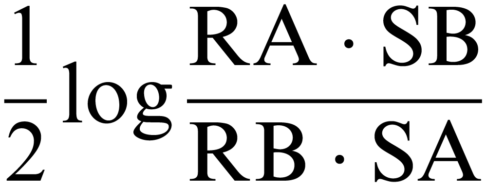

(taking _C_ = 1, this being almost the same as the expression we had before, for the conformal representation), where R and S are the intersections of the extended straight line AB with the bounding circle. This representation of hyperbolic geometry, can be obtained from the conformal one by means of an expansion radially out from the centre by an amount given by

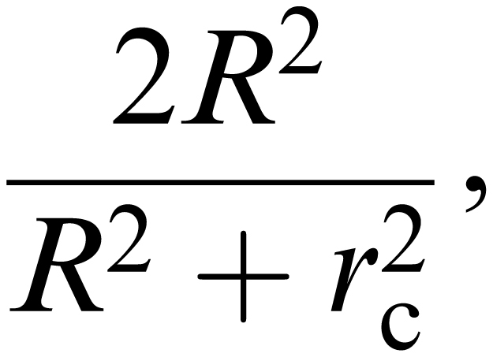

where _R_ is the radius of the bounding circle and /r/<sub>c</sub> is the Euclidean distance out from the centre of the bounding circle of a point in the conformal representation (see Fig. 2.15).[[2.4](#Penr_9780593315309_epub3_c02_r1.xhtml_ch2-4)] In Fig. 2.16, Escher's picture of Fig. 2.11 has been transformed from the conformal to the projective model using this formula. (Despite lost detail, Escher's precise artistry is still evident.)

for hyperbolic distance is now 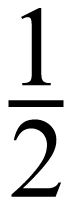 log {RA.SB/RB.SA}, where R and S are the intersections of the Euclidean (i.e. hyperbolic) straight line AB with the bounding circle.

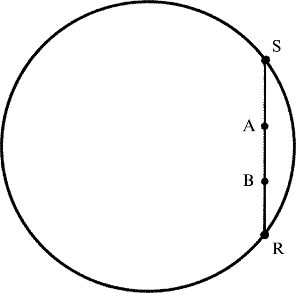

There is a more directly geometrical way of relating the conformal and projective representations, via yet another clever representation of this same geometry. All three of these representations are due to the ingenious Italian geometer Eugenio Beltrami (1835--1900). Consider a sphere S, whose equator coincides with the bounding circle of the projective representation of hyperbolic geometry given above. We are now going to find a representation of hyperbolic geometry on the _northern hemisphere S/<sup>+</sup> of /S_, which I shall call the _hemispheric_ representation. See Fig. 2.17. To pass from the projective representation in the plane (considered as horizontal) to the new one on the sphere, we simply project vertically upwards (Fig. 2.17a). The straight lines in the plane, representing hyperbolic straight lines, are represented on _S/<sup>+</sup> by semicircles meeting the equator orthogonally. Now, to get from the representation on /S/<sup>+</sup> to the conformal representation on the plane, we project from the /south pole_ (Fig. 2.17b). This is what is called _stereographic projection_, and it will play important roles later on in this book (see §8.3, §18.4, §22.9, §33.6). Two important properties of stereographic projection that we shall come to in §8.3 are that it is _conformal_, so that it preserves angles, and that it sends circles on the sphere to circles (or, exceptionally, to straight lines) on the plane.[[2.5](#Penr_9780593315309_epub3_c02_r1.xhtml_ch2-5)]<sup>,</sup> [[2.6](#Penr_9780593315309_epub3_c02_r1.xhtml_ch2-6)]

representation, expand out from the centre by a factor 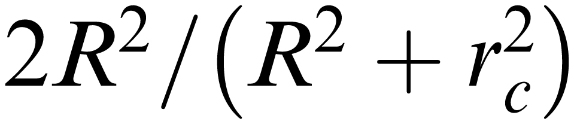, where _R_ is the radius of the bounding circle and _r<sub>c</sub>_ is the Euclidean distance out of the point in the conformal representation.

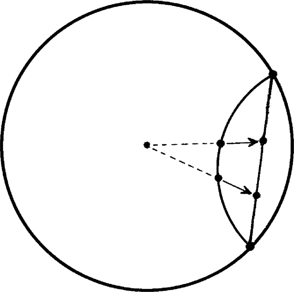

the conformal to the projective representation.

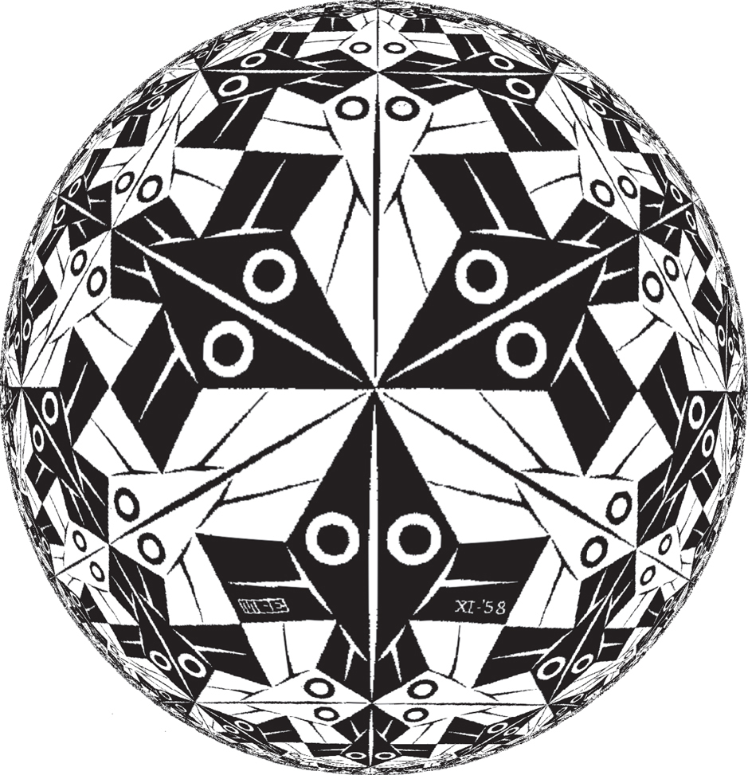

representations of hyperbolic geometry. (a) The hemispheric representation (conformal on the _northern hemisphere S/<sup>+</sup>) projects vertically to the projective representation on the equatorial disc. (b) The hemispheric representation projects stereographically, from the /south pole_ to the conformal representation on the equatorial disc.

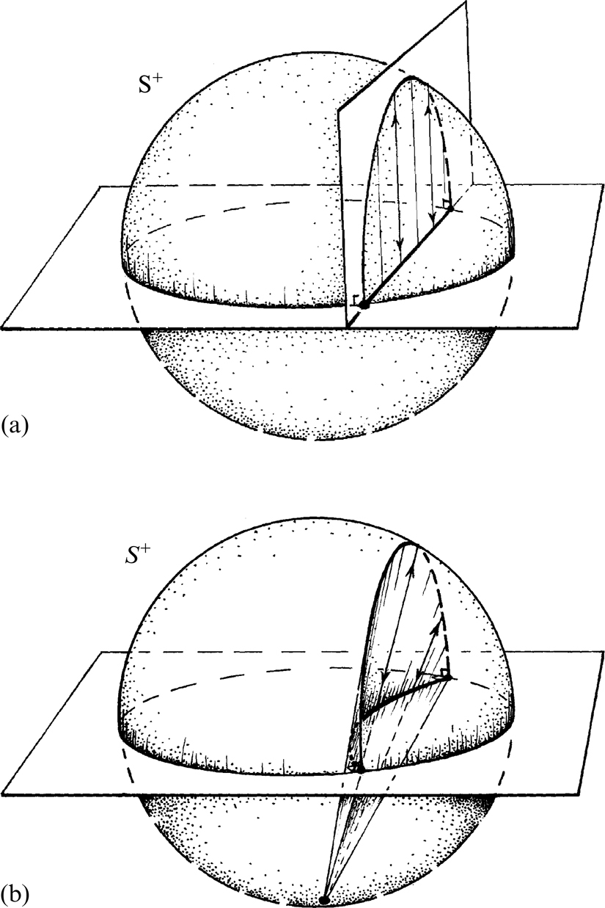

The existence of various different models of hyperbolic geometry, expressed in terms of Euclidean space, serves to emphasize the fact that these are, indeed, merely ‘Euclidean models' of hyperbolic geometry and are not to be taken as telling us what hyperbolic geometry actually is. Hyperbolic geometry has its own ‘Platonic existence', just as does Euclidean geometry (see §1.3 and the Preface). No one of the models is to be taken as the ‘correct' picturing of hyperbolic geometry at the expense of the others. The representations of it that we have been considering are very valuable as aids to our understanding, but only because the Euclidean framework is the one which we are more used to. For a sentient creature brought up with a direct experience of hyperbolic (rather than Euclidean) geometry, a model of Euclidean geometry in hyperbolic terms might seem the more natural way around. In §18.4, we shall encounter yet another model of hyperbolic geometry, this time in terms of the Minkowskian geometry of special relativity.

To end this section, let us return to the question of the existence of squares in hyperbolic geometry. Although squares whose angles are right angles do not exist in hyperbolic geometry, there are ‘squares' of a more general type, whose angles are less than right angles. The easiest way to construct a square of this kind is to draw two straight lines intersecting at right angles at a point O. Our ‘square' is now the quadrilateral whose four vertices are the intersections A, B, C, D (taken cyclicly) of these two lines with some circle with centre O. See Fig. 2.18. Because of the symmetry of the figure, the four sides of the resulting quadrilateral ABCD are all equal and all of its four angles must also be equal. But are these angles right angles? Not in hyperbolic geometry. In fact they can be any (positive) angle we like which is less than a right angle, but not equal to a right angle. The bigger the (hyperbolic) square (i.e. the larger the circle, in the above construction), the smaller will be its angles. In Fig. 2.19a, I have depicted a lattice of hyperbolic squares, using the conformal model, where there are five squares at each vertex point (instead of the Euclidean four), so the angle is 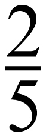 π, or 72°. In Fig. 2.19b, I have depicted the same lattice using the projective model. It will be seen that this does not allow the modifications that would be needed for the two-square lattice of Fig. 2.2.[[2.7](#Penr_9780593315309_epub3_c02_r1.xhtml_ch2-7)]

quadrilateral, whose vertices are the intersections A, B, C, D (taken cyclically) of two perpendicular hyperbolic straight lines through some point O with some circle centred at O. Because of symmetry, the four sides of ABCD as well as all the four angles are equal. These angles are not right angles, but can be equal to any given positive angle less than  π.

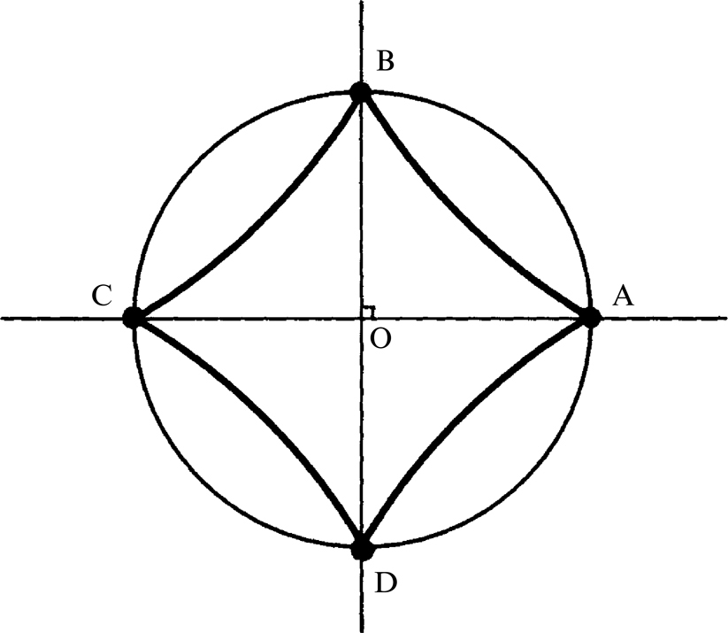

which five squares meet at each vertex, so the angles of the square are 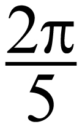, or 72°. (a) Conformal representation. (b) Projective representation.

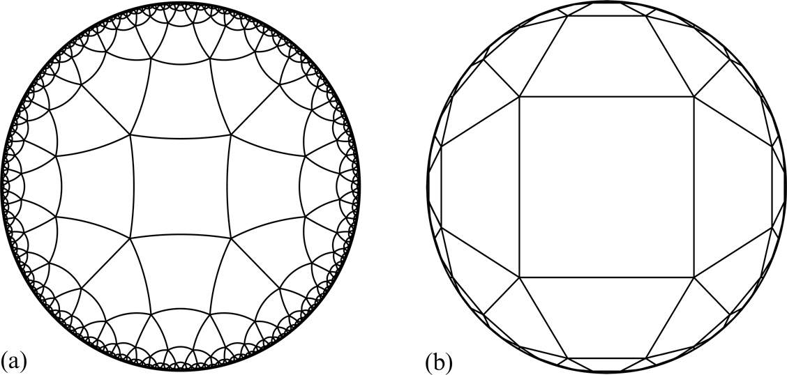

[BROKEN LINK: LEVEL2] [2.4]]] Show this. (_Hint:_ You can use Beltrami's geometry, as illustrated in Fig. 2.17, if you wish.)

[BROKEN LINK: LEVEL1] [2.5]]] Assuming these two stated properties of stereographic projection, the conformal representation of hyperbolic geometry being as stated in §2.4, show that Beltami's hemispheric representation is conformal, with hyperbolic ‘straight lines' as vertical semicircles.

[BROKEN LINK: LEVEL3] [2.6]]] Can you see how to prove these two properties? (Hint: Show, in the case of circles, that the cone of projection is intersected by two planes of exactly opposite tilt.)

[BROKEN LINK: LEVEL3] [2.7]]] See if you can do something similar, but with hyperbolic regular pentagons and squares.

### **2.6  Historical aspects of hyperbolic geometry** 쌍곡기하학의 역사

A few historical comments concerning the discovery of hyperbolic geometry are appropriate here. For centuries following the publication of Euclid's elements, in about 300 bc, various mathematicians attempted to prove the fifth postulate from the other axioms and postulates. These efforts reached their greatest heights with the heroic work by the Jesuit Girolamo Saccheri in 1733. It would seem that Saccheri himself must ultimately have thought his life's work a failure, constituting merely an unfulfilled attempt to _prove_ the parallel postulate by showing that the hypothesis that the angle sum of every triangle is less than two right angles led to a contradiction. Unable to do this logically after momentous struggles, he concluded, rather weakly:

> The hypothesis of acute angle is absolutely false; because repugnant to the nature of the straight line.[^fn:5]

The hypothesis of ‘acute angle' asserts that the lines _a_ and _b_ of Fig. 2.8. sometimes do not meet. It is, in fact, viable and actually yields hyperbolic geometry!

How did it come about that Saccheri effectively discovered something that he was trying to show was impossible? Saccheri's proposal for proving Euclid's fifth postulate was to make the assumption that the fifth postulate was false and then derive a contradiction from this assumption. In this way he proposed to make use of one of the most time-honoured and fruitful principles ever to be put forward in mathematics---very possibly first introduced by the Pythagoreans---called _proof by contradiction_ (or _reductio ad absurdum_, to give it its Latin name). According to this procedure, in order to prove that some assertion is true, one first makes the supposition that the assertion in question is _false_, and one then argues from this that some contradiction ensues. Having found such a contradiction, one deduces that the assertion must be true after all.[^fn:6] Proof by contradiction provides a very powerful method of reasoning in mathematics, frequently applied today. A quotation from the distinguished mathematician G. H. Hardy is apposite here:

> _Reductio ad absurdum_, which Euclid loved so much, is one of a mathematician's finest weapons. It is a far finer gambit than any chess gambit: a chess player may offer the sacrifice of a pawn or even a piece, but a mathematician offers _the game._[^fn:7]

We shall be seeing other uses of this important principle later (see §3.1 and §§16.4,6).

However, Saccheri failed in his attempt to find a contradiction. He was therefore not able to obtain a proof of the fifth postulate. But in striving for it he, in effect, found something far greater: a new geometry, different from that of Euclid---the geometry, discussed in §§2.4,5, that we now call _hyperbolic geometry._ From the assumption that Euclid's fifth postulate was false, he derived, instead of an actual contradiction, a host of strange-looking, barely believable, but interesting theorems. However, strange as these results appeared to be, none of them was actually a contradiction. As we now know, there was no chance that Saccheri would find a genuine contradiction in this way, for the reason that hyperbolic geometry _does_ actually exist, in the mathematical sense that there is such a consistent structure. In the terminology of §1.3, hyperbolic geometry inhabits Plato's world of mathematical forms. (The issue of hyperbolic geometry's _physical_ reality will be touched upon in §2.7 and §28.10.)

A little after Saccheri, the highly insightful mathematician Johann Heinrich Lambert (1728--1777) also derived a host of fascinating geometrical results from the assumption that Euclid's fifth postulate is false, including the beautiful result mentioned in §2.4 that gives the area of a hyperbolic triangle in terms of the sum of its angles. It appears that Lambert may well have formed the opinion, at least at some stage of his life, that a consistent geometry perhaps could be obtained from the denial of Euclid's fifth postulate. Lambert's tentative reason seems to have been that he could contemplate the theoretical possibility of the geometry on a ‘sphere of imaginary radius', i.e. one for which the ‘squared radius' is negative. Lambert's formula _π_ -- (_α_ + _β_ + _γ_) = _CΔ_ gives the area, _Δ_, of a hyperbolic triangle, where _α_, _β_, and _γ_ are the angles of the triangle and where _C_ is a constant (--_C_ being what we would now call the ‘Gaussian curvature' of the hyperbolic plane). This formula looks basically the same as a previously known one due, in 1603, to Thomas Hariot (1560--1621), _Δ_ = _R/<sup>2</sup>(/α_

-   _β_ + _Δ_ -- _π_), for the area _Δ_ of a _spherical triangle_, drawn

with great circle arcs[^fn:8] on a sphere of radius _R_ (see Fig. 2.20).[BROKEN LINK: Penr_9780593315309_epub3_c02_r1.xhtml_ch2-8]] To retrieve Lambert's formula, we have to put

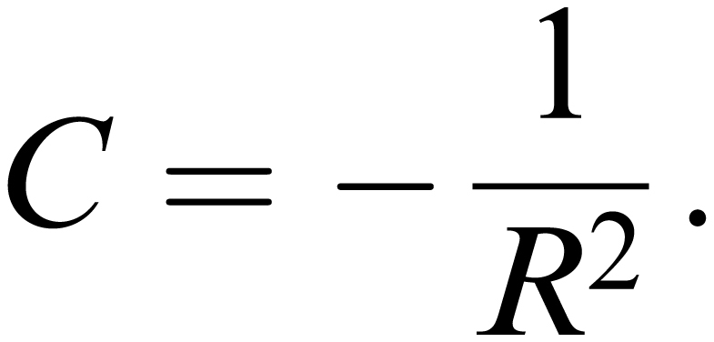

But, in order to give the _positive_ value of _C_, as would be needed for hyperbolic geometry, we require the sphere's radius to be ‘imaginary' (i.e. to be the square root of a negative number). Note that the radius _R_ is given by the imaginary quantity (--_C_)<sup>--1/2</sup>. This explains the term ‘pseudo-radius', introduced in §2.4, for the real quantity /C/<sup>--1/2</sup>. In fact Lambert's procedure is perfectly justified from our more modern perspectives (see Chapter 4 and §18.4, Fig. 18.9), and it indicates great insight on his part to have foreseen this.

It is, however, the conventional standpoint (somewhat unfair, in my opinion) to deny Lambert the honour of having first constructed non-Euclidean geometry, and to consider that (about half a century later) the first person to have come to a clear acceptance of a fully consistent geometry, distinct from that of Euclid, in which the parallel postulate is false, was the great mathematician Carl Friedrich Gauss. Being an exceptionally cautious man, and being fearful of the controversy that such a revelation might cause, Gauss did not publish his findings, and kept them to himself.[^fn:9] Some 30 years after Gauss had begun working on it, hyperbolic geometry was independently rediscovered by various others, including the Hungarian János Bolyai (by 1829) and, most particularly, the Russian geometer Nicolai Ivanovich Lobachevsky in about 1826 (whence hyperbolic geometry is frequently called _Lobachevskian_ geometry).

triangle/, on a sphere of radius _R_, with angles _α_, _β_, _γ_, is _Δ_ = _R/<sup>2</sup>(/α_ + _β_ + _γ_ -- _π_). Lambert's formula, for a hyperbolic triangle, has _C_ =--1//R/<sup>2</sup>.

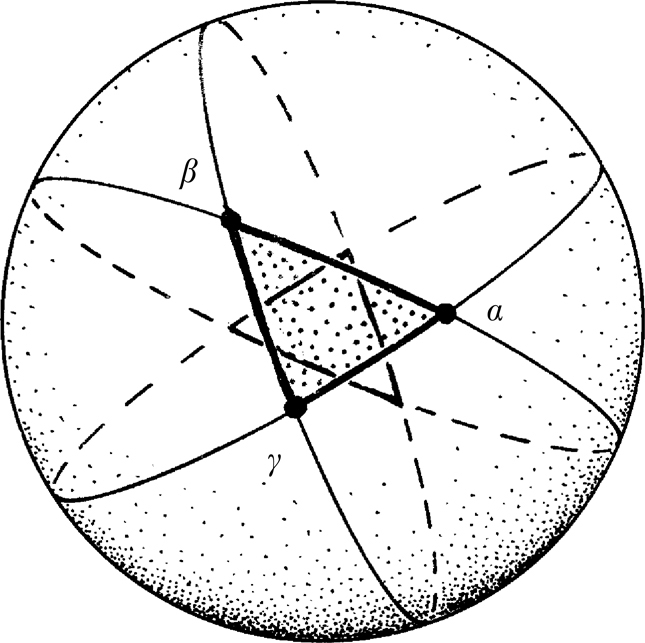

The specific projective and conformal realizations of hyperbolic geometry that I have described above were both found by Eugenio Beltrami, and published in 1868, together with some other elegant representations including the hemispherical one mentioned in §2.5. The conformal representation is, however, commonly referred to as the ‘Poincaré model', because Poincaré's rediscovery of this representation in 1882 is better known than the original work of Beltrami (largely because of the important use that Poincaré made of this model).[^fn:10] Likewise, poor old Beltrami's projective representation is sometimes called the ‘Klein representation'. It is not uncommon in mathematics that the name normally attached to a mathematical concept is not that of the original discoverer. At least, in this case, Poincaré did /re/discover the conformal representation (as did Klein the projective one in 1871). There are other instances in mathematics where the mathematician(s) whose name(s) are attached to a result did not even know of the result in question![^fn:11]

The representation of hyperbolic geometry that Beltrami is best known for is yet another one, which he found also in 1868. This represents the geometry on a certain surface known as a _pseudo-sphere_ (see Fig. 2.21). This surface is obtained by rotating a _tractrix_, a curve first investigated by Isaac Newton in 1676, about its ‘asymptote'. The asymptote is a straight line which the curve approaches, becoming asymptotically tangent to it as the curve recedes to infinity. Here, we are to imagine the asymptote to be drawn on a horizontal plane of rough texture. We are to think of a light, straight, stiff rod, at one end P of which is attached a heavy point-like weight, and the other end R moves along the asymptote. The point P then traces out a tractrix. Ferdinand Minding found, in 1839, that the pseudo-sphere has a constant negative intrinsic geometry, and Beltrami used this fact to construct the first model of hyperbolic geometry. Beltrami's pseudo-sphere model seems to be the one that persuaded mathematicians of the consistency of plane hyperbolic geometry, since the measure of hyperbolic distance agrees with the Euclidean distance along the surface. However, it is a somewhat awkward model, because it represents hyperbolic geometry only locally, rather than presenting the entire geometry all at once, as do Beltrami's other models.

rotating, about its asymptote (b) a _tractrix._ To construct a tractrix, imagine its plane to be horizontal, over which is dragged a light, frictionless straight, stiff rod. One end of the rod is a point-like weight P with friction, and the other end R moves along the (straight) asymptote.

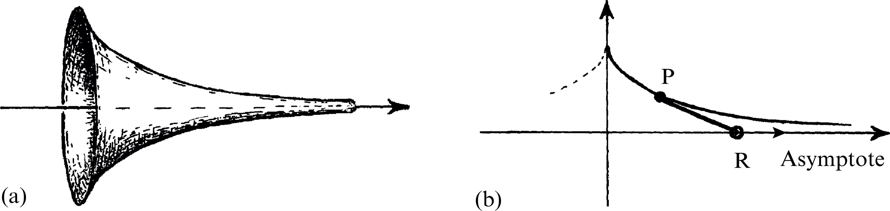

[BROKEN LINK: LEVEL3] [2.8]]] Try to prove this spherical triangle formula, basically using only symmetry arguments and the fact that the total area of the sphere is 4π/R/<sup>2</sup>. _Hint:_ Start with finding the area of a segment of a sphere bounded by two great circle arcs connecting a pair of antipodal points on the sphere; then cut and paste and use symmetry arguments. Keep Fig. 2.20 in mind.

### **2.7  Relation to physical space** 물리적 공간과의 관계

Hyperbolic geometry also works perfectly well in higher dimensions. Moreover, there are higher-dimensional versions of both the conformal and projective models. For three-dimensional hyperbolic geometry, instead of a bounding circle, we have a bounding sphere. The entire infinite three-dimensional hyperbolic geometry is represented by the interior of this finite Euclidean sphere. The rest is basically just as we had it before. In the conformal model, straight lines in this three-dimensional hyperbolic geometry are represented as Euclidean circles which meet the bounding sphere orthogonally; angles are given by the Euclidean measures, and distances are given by the same formula as in the two-dimensional case. In the projective model, the hyperbolic straight lines are Euclidean straight lines, and distances are again given by the same formula as in the two-dimensional case.

What about our actual universe on cosmological scales? Do we expect that its spatial geometry is Euclidean, or might it accord more closely with some other geometry, such as the remarkable hyperbolic geometry (but in three dimensions) that we have been examining in §§2.4--6. This is indeed a serious question. We know from Einstein's general relativity (which we shall come to in §17.9 and §19.6) that Euclid's geometry is only an (extraordinarily accurate) approximation to the actual geometry of physical space. This physical geometry is not even exactly uniform, having small ripples of irregularity owing to the presence of matter density. Yet, strikingly, according to the best observational evidence available to cosmologists today, these ripples appear to average out, on cosmological scales, to a remarkably exact degree (see §27.13 and §§28.4--10), and the spatial geometry of the actual universe seems to accord with a uniform (homogeneous and isotropic---see §27.11) geometry extraordinarily closely. Euclid's first four postulates, at least, would seem to have stood the test of time impressively well.

A remark of clarification is needed here. Basically, there are three types of geometry that would satisfy the conditions of homogeneity (every point the same) and isotropy (every direction the same), referred to as Euclidean, hyperbolic, and elliptic. Euclidean geometry is familiar to us (and has been for some 23 centuries). Hyperbolic geometry has been our main concern in this chapter. But what is elliptic geometry? Essentially, elliptic plane geometry is that satisfied by figures drawn on the surface of a sphere. It figured in the discussion of Lambert's approach to hyperbolic geometry in §2.6. See Fig. 2.22a,b,c, for Escher's rendering of the elliptic, Euclidean, and hyperbolic cases, respectively, using a similar tessellation of angels and devils in all three cases, the third one providing an interesting alternative to Fig. 2.11. (There is also a three-dimensional version of elliptic geometry, and there are versions in which diametrically opposite points of the sphere are considered to represent the same point. These issues will be discussed a little more fully in §27.11.) However, the elliptic case could be said to violate Euclid's second and third postulates (as well as the first). For it is a geometry that is finite in extent (and for which more than one line segment joins a pair of points).

geometry, as illustrated by Escher using tessellations of angels and devils. (a) Elliptic case (positive curvature), (b) Euclidean case (zero curvature), and (c) Hyperbolic case (negative curvature)---in the conformal representation (Escher's _Circle Limit IV_, to be compared with Fig. 2.11).

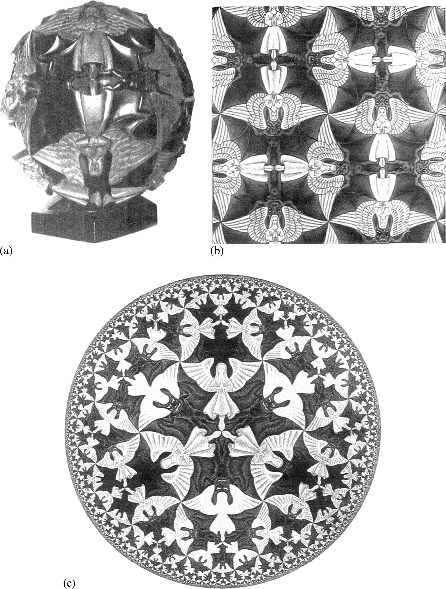

What, then, is the observational status of the large-scale spatial geometry of the universe? It is only fair to say that we do not yet know, although there have been recent widely publicized claims that Euclid was right all along, and his fifth postulate holds true also, so the averaged spatial geometry is indeed what we call ‘Euclidean'.[^fn:12] On the other hand, there is also evidence (some of it coming from the same experiments) that seems to point fairly firmly to a _hyperbolic_ overall geometry for the spatial universe.[^fn:13] Moreover, some theoreticians have long argued for the elliptic case, and this is certainly not ruled out by that same evidence that is argued to support the Euclidean case (see the later parts of §34.4). As the reader will perceive, the issue is still fraught with controversy and, as might be expected, often heated argument. In later chapters in this book, I shall try to present a good many of the considerations that have been put forward in this connection (and I do not attempt to hide my own opinion in favour of the hyperbolic case, while trying to be as fair to the others as I can).

Fortunately for those, such as myself, who are attracted to the beauties of hyperbolic geometry, and also to the magnificence of modern physics, there is another role for this superb geometry that is undisputedly fundamental to our modern understanding of the physical universe. For the space of _velocities_, according to modern relativity theory, is certainly a three-dimensional hyperbolic geometry (see §18.4), rather than the Euclidean one that would hold in the older Newtonian theory. This helps us to understand some of the puzzles of relativity. For example, imagine a projectile hurled forward, with near light speed, from a vehicle that also moves forwards with comparable speed past a building. Yet, relative to that building, the projectile can never exceed light speed. Though this seems impossible, we shall see in §18.4 that it finds a direct explanation in terms of hyperbolic geometry. But these fascinating matters must wait until later chapters.

What about the Pythagorean theorem, which we have seen to fail in hyperbolic geometry? Must we abandon this greatest of the specific Pythagorean gifts to posterity? Not at all, for hyperbolic geometry---and, indeed, all the ‘Riemannian' geometries that generalize hyperbolic geometry in an irregularly curved way (forming the essential framework for Einstein's general theory of relativity; see §13.8, §14.7, §18.1, and §19.6)---depends vitally upon the Pythagorean theorem holding in the limit of small distances. Moreover, its enormous influence permeates other vast areas of mathematics and physics (e.g. the ‘unitary' metric structure of quantum mechanics, see §22.3). Despite the fact that this theorem is, in a sense, superseded for ‘large' distances, it remains central to the small-scale structure of geometry, finding a range of application that enormously exceeds that for which it was originally put forward.

#### **_Notes_**

_Section 2.1_

_Section 2.2_

_Section 2.4_

_Section 2.6_

_Section 2.7_

See Gurzadyan and Torres (1997) and Gurzadyan and Kocharyan (1994) for the theoretical underpinnings, and Gurzadyan and Kocharyan (1992) (for COBE data) and Gurzadyan _et al._ (2002, 2003) (for BOOMERanG data and (2004) for WMAP data) for the corresponding analysis of the actual CMB data.

## 2장 요약

[2024-12-14 Sat 21:27]

@user 위에 옮겨 놓은 펜로즈의 책 2장의 내용을 요약해줄래?

@assistant 물론입니다! 펜로즈의 책 2장 "고대의 정리와 현대의 질문"에 대한 요약을 다음과 같이 제공드립니다:

#### 2.1 피타고라스의 정리

-   피타고라스의 정리는 직각삼각형에서 빗변의 제곱이 다른 두 변의 제곱의 합과 같다는 것을 주장합니다.
-   이 정리를 증명하는 방법 중 하나는 두 가지 크기의 정사각형으로 평면을 채우는 패턴을 사용하는 것입니다.
-   또 다른 방법은 직각삼각형을 두 개의 작은 삼각형으로 나누고, 이 삼각형들이 서로 유사하다는 점을 이용하는 것입니다.

#### 2.2 유클리드의 공준

-   유클리드는 그의 기하학 체계를 구축하면서 몇 가지 기본적인 가정(공준)을 설정했습니다.
-   특히, 평행선 공준(제5 공준)은 다른 공준들보다 덜 명확하다고 여겨졌고, 이를 다른 공준들로부터 증명하려는 시도가 여러 세기 동안 이어졌습니다.
-   평행선 공준은 두 직선이 한 직선에 의해 교차될 때, 한쪽의 내각의 합이 두 직각보다 작으면 두 직선이 교차한다는 것을 의미합니다.

#### 2.3 닮음을 이용한 피타고라스 정리의 증명

-   직각삼각형을 빗변에 수직으로 나누어 두 개의 작은 삼각형을 만들고, 이 삼각형들이 모두 유사하다는 점을 이용하여 피타고라스 정리를 증명할 수 있습니다.
-   이 증명은 유사한 도형의 면적이 그 선형 치수의 제곱에 비례한다는 사실에 기반합니다.

#### 2.4 쌍곡기하학과 등각표현

-   쌍곡기하학(hyperbolic geometry)에서는 평행선 공준이 성립하지 않으며, 삼각형의 각의 합이 π보다 작습니다.
-   이 기하학은 유클리드 기하학의 일부 속성을 가지지만, 평행선 공준을 필요로 하지 않는 모든 속성을 가집니다.
-   에셔의 작품을 통해 쌍곡기하학의 시각적 표현을 볼 수 있습니다.

#### 2.5 쌍곡기하학의 다른 표현법

-   쌍곡기하학은 여러 유클리드 기하학의 표현을 통해 시각화할 수 있습니다. 예를 들어, 프로젝티브 모델, 콘포멀 모델 등이 있습니다.
-   각 모델은 쌍곡기하학의 특정 측면을 강조하며, 각각의 장단점이 있습니다.

#### 2.6 쌍곡기하학의 역사

-   쌍곡기하학은 유클리드의 제5 공준을 증명하려는 시도에서 시작되었습니다. 여러 수학자들이 이 공준을 거짓으로 가정하고 모순을 찾으려 했지만, 결국 새로운 기하학을 발견하게 되었습니다.
-   이 기하학은 유클리드 기하학과는 다른 일관된 구조를 가지고 있음이 밝혀졌습니다.

#### 2.7 물리적 공간과의 관계

-   현대 물리학에서 우주의 대규모 공간 구조는 유클리드 기하학, 쌍곡기하학, 또는 타원기하학 중 하나일 수 있습니다.
-   쌍곡기하학은 특수 상대성 이론에서 속도 공간의 기하학으로 중요한 역할을 합니다.
-   피타고라스 정리는 쌍곡기하학에서 큰 거리에서는 성립하지 않지만, 작은 거리에서는 여전히 유효합니다.

이 요약은 펜로즈의 책 2장의 주요 내용을 간략히 정리한 것입니다.

## 2장 sympy 구현 그래프 표기

[2024-12-14 Sat 21:39]

@user 위의 2장에 해당하는 대표적인 예시를 sympy로 구현해서 코드와 그래프로 표기해줘

@assistant 물론입니다! 펜로즈의 책 2장에서 다루는 주제 중 하나인 피타고라스 정리와 쌍곡기하학의 예시를 `sympy` 를 사용하여 구현해보겠습니다. 여기서는 피타고라스 정리를 증명하는 간단한 예제와 쌍곡기하학의 기본적인 개념을 시각화하는 예제를 보여드리겠습니다.

#### 피타고라스 정리 증명

```python
import sympy as sp
from sympy import symbols, Eq, sqrt

# 피타고라스 정리를 증명하는 간단한 예제
a, b, c = symbols('a b c')

# 피타고라스 정리 식
pythagorean_theorem = Eq(c*2, a*2 + b**2)

# 예시 삼각형의 변 길이 설정
a_val, b_val = 3, 4
c_val = sqrt(a_val*2 + b_val*2)

# 식에 값 대입
pythagorean_theorem_subs = pythagorean_theorem.subs({a: a_val, b: b_val, c: c_val})

print("피타고라스 정리:")
print(pythagorean_theorem)
print("\n예시 삼각형의 변 길이:")
print(f"a = {a_val}, b = {b_val}, c = {c_val}")
print("\n대입한 식:")
print(pythagorean_theorem_subs)
```

```text
None
```

#### 쌍곡기하학의 기본 개념 시각화

```python
import matplotlib.pyplot as plt
import numpy as np

# 쌍곡기하학의 기본 개념을 시각화하는 예제
def hyperbolic_distance(x1, y1, x2, y2, R):
    return np.log((R*2 - x1*2 - y1**2) * (R*2 - x2*2 - y2*2) / ((R*2 - x1*x2 - y1*y2)**2 + (x1*y2 - x2*y1)**2)) / 2

R = 1  # 반지름

# 포인카레 원반 내의 점들
x = np.linspace(-0.9, 0.9, 100)
y = np.linspace(-0.9, 0.9, 100)
X, Y = np.meshgrid(x, y)

# 원반 내부의 점들만 선택
mask = X*2 + Y*2 < R**2
X = X[mask]
Y = Y[mask]

# 두 점 사이의 쌍곡 거리 계산
distances = hyperbolic_distance(X, Y, 0, 0, R)

# 시각화
plt.figure(figsize=(10, 10))
plt.scatter(X, Y, c=distances, cmap='viridis', s=10)
plt.colorbar(label='Hyperbolic Distance')
plt.title('Hyperbolic Geometry in the Poincaré Disk Model')
plt.gca().add_artist(plt.Circle((0, 0), R, color='r', fill=False))
plt.axis('equal')
plt.show()
```

```text
None
```

이 코드는 피타고라스 정리를 증명하는 간단한 예제와 쌍곡기하학의 포인카레 원반 모델을 시각화하는 예제를 포함하고 있습니다. 첫 번째 예제는 `sympy` 를 사용하여 피타고라스 정리를 수학적으로 표현하고, 두 번째 예제는 `matplotlib` 를 사용하여 쌍곡기하학의 거리 개념을 시각화합니다. 이 두 예제는 펜로즈의 책 2장에서 다루는 주제를 이해하는 데 도움이 될 것입니다.

@user

## 2장 번역

[^fn:1]: It is historically very unclear who actually first proved what we now refer to as the ‘Pythagorean theorem', see Note 1.1]]. The ancient Egyptians and Babylonians seem to have known at least many instances of this theorem. The true role played by Pythagoras or his followers is largely surmise.
[^fn:2]: Even with this amount of care, however, various hidden assumptions remained in Euclid's work, mainly to do with what we would now call ‘topological' issues that would have seemed to be ‘intuitively obvious' to Euclid and his contemporaries. These unmentioned assumptions were pointed out only centuries later, particularly by Hilbert at the end of the 19th century. I shall ignore these in what follows.
[^fn:3]: See e.g. Thomas (1939). Compare also Schutz (1997), who gives a nice axiomatic account of Minkowski's 4-dimensional spacetime geometry (§17.8, §18.1).
[^fn:4]: The ‘exponent' notation, such as _C/<sup>--1/2</sup>, is frequently used in this book. As already referred to in Note 1.2]], /a/<sup>5</sup> means /a × a × a × a × a_; correspondingly, for a positive integer n, the product of _a_ with itself a total of _n_ times is written _a<sup>n</sup>_. This notation extends to negative exponents, so that _a/<sup>--1</sup> is the reciprocal 1//a_ of _a_, and _a/^{--/n_} is the reciprocal 1/a<sup>n</sup>/ of _a<sup>n</sup>_, or equivalently (_a/<sup>--1</sup>)^{/n_}. In accordance with the more general discussion of §5.2, _a/^{1//n_}, for a positive number _a_, is the ‘/n/th root of _a_', which is the (positive) number satisfying (_a/^{1//n_})<sup>_n_</sup> = _a_ (see Note 1.2]]). Moreover, _a<sup>m</sup>/^{//n_} is the _m/th power of /a/^{1//n_}.
[^fn:5]: Saccheri (1733), Prop. XXXIII.
[^fn:6]: There is a standpoint known as _intuitionism_, which is held to by a (rather small) minority of mathematicians, in which the principle of ‘proof by contradiction' is not accepted. The objection is that this principle can be _non-constructive_ in that it sometimes leads to an assertion of the existence of some mathematical entity, without any actual construction for it having been provided. This has some relevance to the issues discussed in §16.6. See Heyting (1956).
[^fn:7]: Hardy (1940), p. 34.
[^fn:8]: Great circle arcs are the ‘shortest' curves (geodesics) on the surface of a sphere; they lie on planes through the sphere's centre.
[^fn:9]: It is a matter of some dispute whether Gauss, who was professionally concerned with matters of geodesy, might actually have tried to ascertain whether there are measurable deviations from Euclidean geometry in physical space. Owing to his well-known reticence in matters of non-Euclidean geometry, it is unlikely that he would let it be known if he were in fact trying to do this, particularly since (as we now know) he would be bound to fail, owing to the smallness of the effect, according to modern theory. The present consensus seems to be that he was ‘just doing geodesy', being concerned with the curvature of the Earth, and not of space. But I find it a little hard to believe that he would not also have been on the lookout for any significant discrepancy with Euclidean geometry; see Fauvel and Gray (1987), Gray (1979).
[^fn:10]: The so-called ‘Poincaré half-plane' representation (with metric form (d/x/<sup>2</sup> + d/y/<sup>2</sup>)//y/<sup>2</sup>; see §14.7) is also due to Beltrami; see Beltrami (1868). The constant negative curvature of the ‘Poincaré metric' 4(d/x/<sup>2</sup> + d/y/<sup>2</sup>)/ (1 -- /x/<sup>2</sup> -- /y/<sup>2</sup>)<sup>2</sup> of Figs. 2.11--13 was actually noted by Riemann (1854)!
[^fn:11]: This appears to have applied even to the great Gauss himself (who had, on the other hand, very frequently anticipated other mathematicians' work). There is an important topological mathematical theorem now referred to as the ‘Gauss--Bonnet theorem', which can be elegantly proved by use of the so-called ‘Gauss map', but the theorem itself appears actually to be due to Blaschke and the elegant proof procedure just referred to was found by Olinde Rodrigues. It appears that neither the result nor the proof procedure were even known to Gauss or to Bonnet. There is a more elemental ‘Gauss--Bonnet' theorem, correctly cited in several texts, see Willmore (1959), also Rindler (2001).
[^fn:12]: The main evidence for the overall structure of the universe, as a whole comes from a detailed analysis of the _cosmic microwave background radiation_ (CMB) that will be discussed in §§27.7,10,11,13, §§28.5,10, and §30.14. A basic reference is de Bernardis _et al._ (2000); for more accurate, more recent data, see Netterfield _et al._ (2002) (concerning BOOMERanG). See also Hanany _et al._ (2000) (concerning MAXIMA), Halverson _et al._ (2001) (concerning DASI), and Bennett _et al._ (2003) (concerning WMAP).
[^fn:13]:
