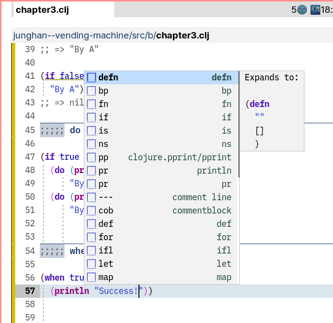

<!-- gid:20241215T123917 -->
[[TIP("이 노트에 대하여")]] Doom Emacs 환경에서 corfu와 yasnippet-capf, doom-snippets가 어떻게 얽히는지 추적한다. 스니펫 자동완성 문제가 왜 생기는지 실제 변수와 경로를 통해 확인하는 해결 노트다. [[/TIP]] 관련메타 - [이맥스 자동완성 프레임워크 - corfu vertico consult embark](https://wikidocs.net/381027)

## BIBLIOGRAPHY

## 2025 스니펫과 코파일럿

[2025-03-25 Tue 15:44] [스니펫 이맥스 tempel yasnippet auto-yasnippet doom-snippets](https://wikidocs.net/381140)을 보면 참고

잠시만. 스니펫의 종류 말이요.

### 둠이맥스 스니펫 자동 완성 수정 : 문제

여기에 방법이 있구만. 자동으로 퍼오는 이유 말일세



### 스니펫 디렉토리

```text

doom-snippets-dir is a variable defined in doom-snippets.el.

Value
"/home/junghan/doomemacs-git/.local/straight/build-30.1.50/doom-snippets/"

+snippets-dir is a variable defined in config.el.

Value
"/home/junghan/dotemacs/snippets/"
```

### corfu 기본으로 가라

해결방법.

```elisp
(setq +corfu-want-tab-prefer-expand-snippets nil) ; 2024-11-06
(setq +corfu-want-tab-prefer-navigating-snippets nil)
(setq +corfu-want-tab-prefer-navigating-org-tables nil)
```

### yasnippet-capf 삭제하라!

```elisp

(use-package! yasnippet-capf
  :when (modulep! :editor snippets)
  :defer t
  :init
  (add-hook! 'yas-minor-mode-hook
    (defun +corfu-add-yasnippet-capf-h ()
      (add-hook 'completion-at-point-functions #'yasnippet-capf 30 t))))

;; (setq yasnippet-capf-lookup-by 'name) ;; Prefer the name of the snippet instead
```

이게 뭐 되는 거냐?

```text
(setq yasnippet-capf-lookup-by 'name) ;; Prefer the name of the snippet instead
```
