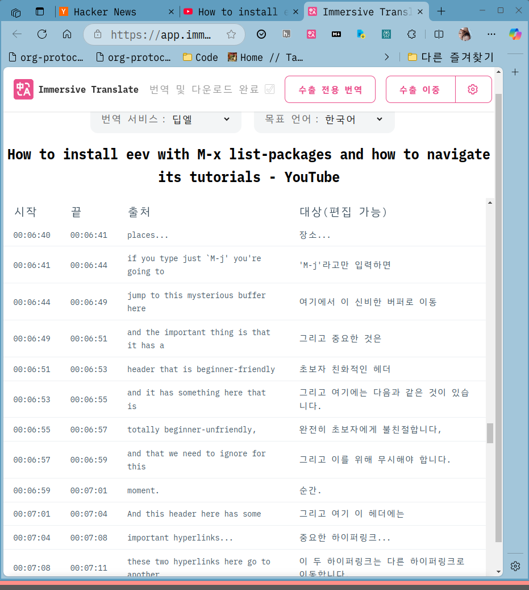

<!-- gid:20241215T185538 -->
[TOC]

[[TIP("이 노트에 대하여")]]
크롬과 파이어폭스에서 웹페이지 텍스트를 찾고 바꾸는 방법을 확장 프로그램과 개발자 도구 기준으로 정리한다. 자막 번역이나 웹 편집 같은 실사용 시나리오와 연결되는 메모다.
[[/TIP]]

## BIBLIOGRAPHY

## [번역기: ImmersiveTranslate](https://wikidocs.net/381126) 활용 시나리오에서 필요

[유튜브 자막 스크립트 자동번역](https://wikidocs.net/381132) 할 때, 테스트 편집



## 2024-12-15 Find &amp; Replace for Text Editing 설치하고 사용하라.

@user 크롬브라우저에서 텍스트 replace 하는 방법?

@assistant 크롬 브라우저에서 텍스트를 대체하는 방법은 다음과 같습니다:

1.  **확장 프로그램 사용**:
    -   크롬 웹 스토어에서 "Text Replacer" 또는 "Replace Text" 같은 확장 프로그램을 검색하고 설치합니다.
    -   설치 후, 확장 프로그램의 옵션에서 원하는 텍스트를 입력하고 대체할 텍스트를 설정합니다.

2.  **개발자 도구 사용**:
    -   웹 페이지에서 원하는 텍스트를 찾고, 오른쪽 클릭 후 "검사"를 선택합니다.
    -   개발자 도구가 열리면, 해당 텍스트를 찾은 후, `Elements` 탭에서 텍스트를 직접 수정할 수 있습니다. 하지만 이 방법은 일시적인 변경이며, 페이지를 새로 고치면 원래대로 돌아갑니다.

3.  **자바스크립트 콘솔 사용**:
    -   개발자 도구의 `Console` 탭을 열고, 다음과 같은 자바스크립트 코드를 입력하여 텍스트를 대체할 수 있습니다:
        ```javascript
        document.body.innerHTML = document.body.innerHTML.replace('원래 텍스트', '대체할 텍스트');
        ```
    -   이 방법도 페이지를 새로 고치면 변경 사항이 사라집니다.

4.  **북마클릿 사용**:
    -   북마클릿을 만들어 자주 사용하는 텍스트 대체를 쉽게 할 수 있습니다. 예를 들어:
        ```javascript
        javascript:(function(){document.body.innerHTML=document.body.innerHTML.replace('원래 텍스트','대체할 텍스트');})();
        ```
    -   이 코드를 북마클릿으로 저장하고 클릭하면 해당 페이지를 대체할 수 있습니다.

이 방법들은 모두 페이지의 텍스트를 일시적으로 변경하는 것이며, 원래 페이지를 다시 로드하면 변경 사항이 사라집니다. 영구적인 변경을 원한다면, 웹사이트의 소스 코드를 수정하거나, 웹사이트 관리자에게 요청해야 합니다.

@user 혹시 파이어폭스에서 replace 하는 방법은?

@assistant 파이어폭스 브라우저에서 텍스트를 대체하는 방법은 다음과 같습니다:

1.  _확장 프로그램 사용_:
    -   파이어폭스 애드온 페이지에서 "Text Replacer" 또는 "Replace Text" 같은 확장 프로그램을 검색하고 설치합니다.
    -   설치 후, 확장 프로그램의 옵션에서 원하는 텍스트를 입력하고 대체할 텍스트를 설정합니다.

2.  _개발자 도구 사용_:
    -   웹 페이지에서 원하는 텍스트를 찾고, 오른쪽 클릭 후 "검사"를 선택합니다.
    -   개발자 도구가 열리면, 해당 텍스트를 찾은 후, `Elements` 탭에서 텍스트를 직접 수정할 수 있습니다. 하지만 이 방법은 일시적인 변경이며, 페이지를 새로 고치면 원래대로 돌아갑니다.

3.  _자바스크립트 콘솔 사용_:
    -   개발자 도구의 `Console` 탭을 열고, 다음과 같은 자바스크립트 코드를 입력하여 텍스트를 대체할 수 있습니다:
        ```javascript
        document.body.innerHTML = document.body.innerHTML.replace('원래 텍스트', '대체할 텍스트');
        ```
    -   이 방법도 페이지를 새로 고치면 변경 사항이 사라집니다.

4.  _북마클릿 사용_:
    -   북마클릿을 만들어 자주 사용하는 텍스트 대체를 쉽게 할 수 있습니다. 예를 들어:
        ```javascript
        javascript:(function(){document.body.innerHTML=document.body.innerHTML.replace('원래 텍스트','대체할 텍스트');})();
        ```
    -   이 코드를 북마클릿으로 저장하고 클릭하면 해당 페이지를 대체할 수 있습니다.

이 방법들은 모두 페이지의 텍스트를 일시적으로 변경하는 것이며, 원래 페이지를 다시 로드하면 변경 사항이 사라집니다. 영구적인 변경을 원한다면, 웹사이트의 소스 코드를 수정하거나, 웹사이트 관리자에게 요청해야 합니다.

@user chrome 확장 Vimium에서 빔스타일로 텍스트 교체 가능해?

@assistant Vimium은 기본적으로 텍스트를 교체하는 기능을 제공하지 않습니다. Vimium은 주로 키보드 단축키를 사용하여 웹 페이지 내에서 탐색하고, 링크를 열고, 스크롤하는 등의 작업을 수행하는 확장 프로그램입니다. 하지만, 다음과 같은 방법으로 Vimium과 함께 텍스트를 교체할 수 있습니다:

1.  **Vimium과 함께 사용할 수 있는 확장 프로그램**:
    -   "Text Replacer" 또는 "Replace Text" 같은 확장 프로그램을 설치합니다. 이 확장 프로그램들은 페이지 로드 시 자동으로 텍스트를 교체할 수 있습니다. Vimium과 함께 사용하면, Vimium의 키보드 단축키로 페이지 내에서 이동한 후, 확장 프로그램이 자동으로 텍스트를 교체합니다.

2.  **자바스크립트 콘솔 사용**:
    -   Vimium의 키보드 단축키를 사용하여 개발자 도구를 열고, 자바스크립트 콘솔에서 텍스트를 교체할 수 있습니다. 예를 들어:
        ```javascript
        document.body.innerHTML = document.body.innerHTML.replace('원래 텍스트', '대체할 텍스트');
        ```
    -   이 방법은 페이지 로드 후에 수동으로 실행해야 하며, 페이지를 새로 고치면 변경 사항이 사라집니다.

3.  **북마클릿 사용**:
    -   Vimium의 키보드 단축키를 사용하여 북마클릿을 실행할 수 있습니다. 북마클릿에 자바스크립트 코드를 저장하여 텍스트를 교체할 수 있습니다:
        ```javascript
        javascript:(function(){document.body.innerHTML=document.body.innerHTML.replace('원래 텍스트','대체할 텍스트');})();
        ```
    -   이 코드를 북마클릿으로 저장하고 Vimium의 키보드 단축키로 북마클릿을 실행하면 해당 페이지를 대체할 수 있습니다.

이 방법들은 Vimium과 함께 사용할 수 있는 방법들이지만, Vimium 자체에서 텍스트를 교체하는 기능은 제공하지 않습니다. Vimium은 주로 웹 페이지 내에서의 탐색과 상호작용을 위한 도구이기 때문에, 텍스트 교체는 다른 확장 프로그램이나 자바스크립트 코드를 사용하여 수행해야 합니다.

@user
