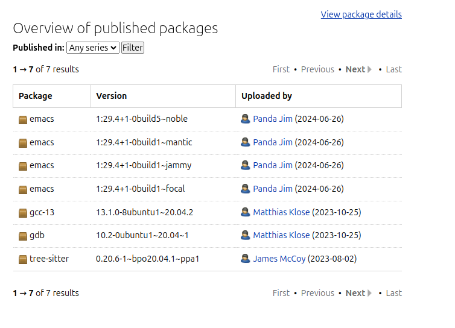

<!-- gid:20241216T100853 -->
[TOC]

[[TIP("이 노트에 대하여")]]
리눅스에서 Emacs를 설치할 때 PPA 패키지와 직접 빌드 방식을 어떻게 고를지 정리한다. 재설치 명령과 스크린샷까지 남겨 두어 실제 설치 때 바로 참고하기 좋다.
[[/TIP]]

## BIBLIOGRAPHY

  Panda Jim. 2024. “Emacs Ubuntu Ppa 우분투 이맥스 설치.” March 7, 2024. [https://launchpad.net/~ubuntuhandbook1/+archive/ubuntu/emacs/+index](https://launchpad.net/~ubuntuhandbook1/+archive/ubuntu/emacs/+index).

## 관련노트

-   [설치](https://wikidocs.net/380712)
-   [이맥스 빌드 설치: 스토우 - 심볼릭 링크 재연결](https://wikidocs.net/381660) : 확장판

## PPA 설치 Panda Jim ubuntu 29.4

[2025-02-10 Mon 00:54] (Panda Jim 2024)

-   unofficial build of GNU Emacs 29.x. backport from Debian unstable. If the packages here are helpful, you may buy me a coffee: ~~~~~~~~~<https://ko-fi.com/ubuntuhandbook1>
-   GNU Emacs

<!--listend-->

```shell
sudo add-apt-repository ppa:ubuntuhandbook1/emacs
sudo apt update
sudo apt-get install emacs emacs-gtk emacs-el --reinstall
```

### PPA screenshot

[2025-02-10 Mon 06:12]



## 2024-12-16 빌드 설치 방법

[2024-12-15 Sun 15:22]

```shell
git clone git@github.com:emacs-mirror/emacs.git --depth 50 --single-branch -b emacs-30 emacs-30-git
```

@user 리눅스에서 이맥스 컴파일 및 설치하는 방법을 알려줘

이맥스를 리눅스에서 컴파일하고 설치하는 방법은 다음과 같습니다:

1.  **필요한 패키지 설치**:
    ```bash
    sudo apt-get update
    sudo apt-get install build-essential libncurses5-dev libxpm-dev libpng-dev libjpeg-dev libgif-dev libtiff-dev libxft-dev libxaw7-dev libgpm-dev libgtk-3-dev libwebkit2gtk-4.0-dev
    ```

2.  **소스 코드 다운로드**:
    ```bash
    git clone git@github.com:emacs-mirror/emacs.git --depth 50 --single-branch -b emacs-30 emacs-30-git
    ```

3.  **컴파일**:
    ```bash
    cd emacs-30-git
    ./autogen.sh
    ./configure --with-x-toolkit=gtk3 --with-xft --with-json --with-native-compilation
    make -j$(nproc)
    ```
    
    -   `--with-x-toolkit=gtk3`: GTK3 툴킷을 사용하여 GUI를 제공합니다.
    -   `--with-xft`: Xft 폰트 렌더링을 지원합니다.
    -   `--with-json`: JSON 지원을 추가합니다.
    -   `--with-native-compilation`: 네이티브 컴파일을 지원합니다.

4.  **설치**:
    ```bash
    sudo make install
    ```
    이 명령어는 기본적으로 `/usr/local/bin` 에 이맥스를 설치합니다. 설치 경로를 변경하고 싶다면 `configure` 스크립트에서 `--prefix` 옵션을 사용하세요.

5.  **설치 확인**:
    ```bash
    emacs --version
    ```

이 과정을 통해 최신 이맥스를 리눅스 시스템에 설치할 수 있습니다. 설치 후에는 이맥스를 실행하여 정상적으로 작동하는지 확인하세요.
