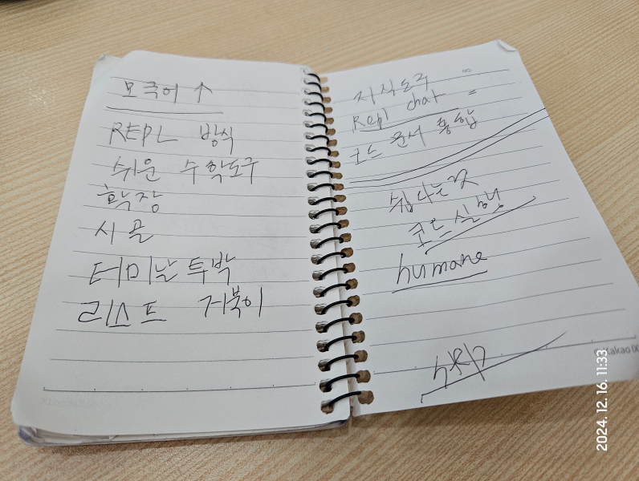
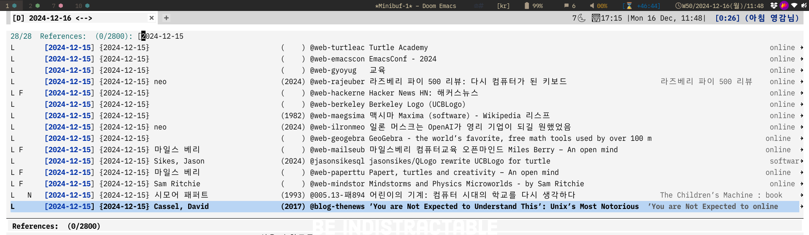
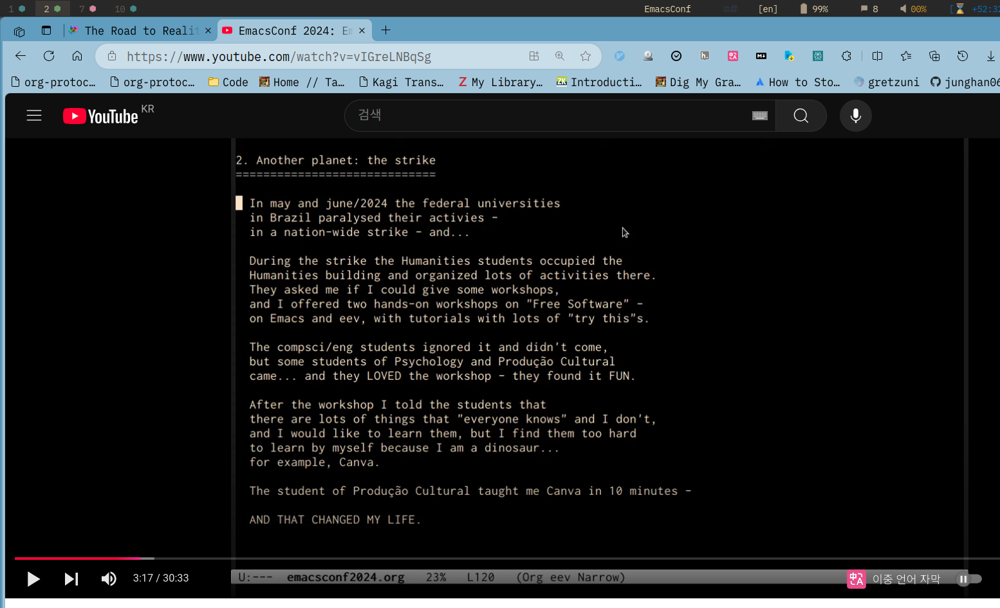

<!-- gid:20241216T134714 -->
[[TIP("이 노트에 대하여")]]
쉬운 도구란 무엇인지 모국어와 거북이, REPL, 수학 도구의 관점에서 다시 생각한다. 손에 익고 삶에 붙는 도구를 향한 힣의 감각이 새벽 메모처럼 살아 있다.
[[/TIP]]

<!-- provenance:source:start -->
[[TIP("원본·최신본")]]
이 페이지는 한국어 검색과 읽기를 위한 WikiDocs 미러입니다. [원본·최신본은 가든](https://notes.junghanacs.com/notes/20241216T134714/)에 있습니다. 최신 수정 내용·백링크·태그·히스토리·댓글·출처 정보는 원본 가든에서 확인하세요.

- 작성: `2024-12-16T13:47:00+09:00`
- 최근 수정: `2026-06-11T14:05:00+09:00`
[[/TIP]]
<!-- provenance:source:end -->

## [2026-06-11 Thu] 모국어는 로꾸꺼다

[2026-06-11 Thu 14:05]

> 모국어는 로꾸꺼다. 모구거 로꾸꺼. 거꾸로를 다시 뒤집는 말이다.

출근길에 다시 모국어가 떠올랐다. 메타워드로는 [모국어 모어](https://wikidocs.net/380750)로 들어간다. 그런데 오늘의 말은 사전 정의가 아니라 입에 붙는 주문이다. 모국어는 왜 로꾸꺼인가. 둘을 발음해보면 묘하게 붙는다. 모구거 로꾸꺼. 기가 막히다. 끝인가? 아니다. 네바엔딩스또리다.

모국어는 그동안 거꾸로처럼 취급되어 왔다. 아이가 한글을 떼기도 전에 영어를 먼저 심으려는 집이 많다. 괜찮다. 다만 그러려면 부모 자신도 영어로 일상을 다 살 수 있어야 한다. 그게 아니라면 지금 이 시점에는 모국어를 세우는 일이 더 중요하다. 영어공부가 취미라면 좋다. 그러나 프롬프트를 영어로 쓸 계획인가? 모국어보다 더 맛나게 갈겨 쓸 수 있는가? 아니라면 훔.

### 프롬프트는 아포리즘이다

지금은 [어쏠리즘/아포리즘](https://wikidocs.net/380757)의 시대다. 모두가 프롬프트에 갈겨 쓰는 그것은 사실 아포리즘이다. 고밀도의 정보를 압축해서 던지는 행위이기 때문이다.

코딩테스트, 라이브코딩 같은 것은 점점 퍼즐500, 보드게임, 두뇌퀴즈가 되어간다. 그렇다면 훈련이랄 게 있다면 무엇인가. 매 턴마다 모국어로 프롬프트를 작성하는 것 자체다. 자기 생각을 자기 언어로 압축해서 던지는 일. 그게 프롬프트 시대의 기본 체력이다.

한글이 모국어라는 사실을 슬퍼할 필요 없다. 영어는 영어권 사람들에게 너무 지루한 것이라 신경을 덜 쓸 수도 있다. 물론 정보 압축에서는 영어가 월등한 면이 있다. 스킬 문서나 에이전트 문서는 영어를 중심으로 재작성하는 것이 훨씬 효과적일 때가 많다. 그러나 에이전트 문서의 상단, 곧 정신 또는 그들이 좋아하는 북극성에는 모국어로 갈겨 쓰는 편이 좋다. 해석의 여지가 넓어야 유연하기 때문이다.

### 북극성은 모국어로, 기술면은 영어로

여러 리포에서 에이전트 문서의 북극성 블록을 한글로 바꾸었다. 왜냐하면 새로 만날 때마다 정신이 희석되기 때문이다. 영어로 옮기면 명확해지지만 힘이 빠지는 문장이 있다. [프롤로그 2탄 — 힣의 드라이버: 단련된 한 자루의 각인](https://wikidocs.net/382600)이 그렇다. 그 글의 정신을 대략 영어로 옮겨 놓으면 영 힘이 없다.

그러니 구분한다.

-   정신 / 북극성 / 호출문 — 모국어로 갈겨 쓴다.
-   스킬 문서 / 실행 규약 / 에이전트 프로토콜 — 영어로 정밀하게 쓴다.
-   실제 프롬프트 — 모국어로 압축해 던지고, 필요하면 영어 구조로 보강한다.

이것이 정답이라는 말은 아니다. 정량 검증은 하지 않았다. 리서치를 뒤져보면 뭔가 많을 것이다. 그건 그 일을 하는 연구자의 몫으로 남긴다. 힣에게 지금 중요한 것은 이미 한글로 써야만 하는 상황이라는 사실이다. 그러면 한글로 계왕권을 터뜨리면 된다.

### 로꾸꺼 — 거꾸로를 뒤집는 주문

로꾸꺼는 거꾸로를 뒤집는다. 모국어가 열등하고 영어가 우월하다는 감각을 다시 뒤집는다. 모구거 로꾸꺼. 찰지다. 계왕권 10배가 바로 터져나올 것 같지 않은가.

초사이언 이야기는 스카우터 이야기를 먼저 해야 한다. 이미 [어쏠리즘 모음](https://wikidocs.net/381579) 어딘가에 적혀 있을 것이다. 계왕권, 스카우터, 시간과공간의방 같은 단어들이 어린 시절 드래곤볼에서 왔듯, 모국어 프롬프트도 삶 전체에서 온다. 버릴 게 없는 것이 삶이다.

출근길 단상은 여기까지. 하나만 기억하라.

> 모구거는 로꾸꺼다!

### 원문 보존

[[TIP("주의")]]
모국어는 로구꺼다.

출근길에 전철역으로 나가는 길에 몇가지 적을 이야기 중에 모국어가 떠올랐다. 메타워드로 보자면 여기로 들어간다 (#모국어 #모어 <https://lnkd.in/gZJc6xic>)

모국어는 왜 로꾸꺼인가? 둘을 발음해보라. 묘하게 입에 붙는다. 기가막힌다. 끝인가? 네바엔딩스또리다.

모국어는 거꾸로 처럼 인식되어 온게 사실이다. 요즘 집에서는 아이들에게 한글 때기도 전에 영어를 심어주려고 난리다. 뭐 괜찮다. 그러려면 본인 부터 영어로 일상을 다 살수 있어야 한다. 그게 아니라면 모국어를 세우는 것이 지금 시점에 더 중요하리라 본다.

어른이라면 영어공부는 취미로라면 좋겠지만... 혹시 프롬프트을 영어로 쓸 계획인가? 모국어보다 더 맛나게 갈겨 쓸수 있는가? 아니라면 훔....

지금은 아포리즘의 시대다. 모두가 프롬프트에 갈겨쓰는 그것은 아포리즘이다. 고밀도의 정보를 압축해서 던지는 행위이기 때문이다.

코딩테스트 라이브코딩 뭐 이런것은 퍼즐500, 보드게임, 두뇌퀴즈가 되어가는 시대에는 훈련이랄게 있다면 턴마다 모국어로 프롬프트를 작성하는 것 자체다.

모국어가 한글인데? 슬퍼하지 말라. 영어는 그들에게는 너무 지루한 것이라 신경을 덜 쓴다. 물론 정보의 압축에서는 영어가 월등하다. 스킬문서나 에이전트문서는 영어를 중심으로 재작성하는게 훨씬 효과적이다. 단, 에이전트 문서의 상단에 '정신' 또는 그들이 좋아하는 북극성에는 모국어로 갈겨쓰는게 좋다. 해석의 여지가 넓어야 유연하다.

그렇다면 프롬프트로 모국어는 어떤가? 좋다. 영어 네이티브 보다 좋을지 모른다. 알게뭐람? 어짜피 한글로 써야만 하는 상황인데...

검증은? 정량적으로는 한적이 없다. 리서치를 뒤져보면 뭔가 많을거다. 그건 그 일하는 연구자의 몫으로 남겨두기로 하자.

여러 리포에서 나는 에이전트 문서의 북극성 블록에는 한글로 바꾸었다. 왜? 새로 만날때마다 정신이 희석되기 때문이다. pi-shell-acp의 경우 프로젝트를 시작할 시점에 정신에 대한 이야기를 갈겨 써주었다. 그 글은 다음 링크에 있다. 이글의 정신을 대략 영어로 옮겨 놓으면 영 힘이 없다. (프롤로그 2탄 — 힣의 드라이버: 단련된 한 자루의 각인 <https://lnkd.in/gnxc69GV>)

아 손가락이 이제 아프다. 로꾸꺼는 거꾸로를 뒤집는다. 모구거 로꾸꺼 아 찰지다. 계왕권을 10배가 바로 터져나오지 않겠는가?

그렇다면 초사이이언에 대한 이야기는? 이는 '스카우터' 이야기를 먼저 해야 한다. 이미 어쏠리즘에 적어놨을게다.

출근길 단상은 여기까지 줄이기로 한다. 하나만 기억하라. 모구거는 로꾸꺼다!
[[/TIP]]

## [2024-12-16 Mon] #모국어 #거북이 #지식도구 #REPL도구 #쉽다는것

쉬운 이맥스 철학 무엇이 쉬움인가? 손이 얼어서 잘 안써지는 구만. 새벽에 메모장에 적은 단어들. 해뜨기 전이라 노트에 대충 썼다. 불꺼진 거실 쇼파에 앉아서. 며칠 전에 찍은 사진. 멀찍이 크레인 뒤로 해가 떠오른다.

### 키워드

-   모국어
-   REPL
-   쉬운 수학도구
-   확장
-   시골
-   터미날 투박
-   리스프 거북이
-   지식도구 REPL 채팅
-   코드 문서 통합
-   쉽다는 것
-   코드 실행
-   humane
-   eev org

대충 이래 적어 놓았다.

### 정보 수집 - 조테로 스마트폰 옵시디언 퍼플렉시티 활용

보이는가? 어제만 조테로에 28개 링크 넣었다. 위키피디아, 책, 블로그 등이다. 막연하게 검색해서 찾는 것 보다는 LLM 대화 후 사실 확인 거쳐서 거르는 자료들이다. 대략 다음과 같다.

대부분은 스마트폰에서 조테로에 넣은 링크일 것이다. 스마트폰에서는 [퍼플렉시티](https://wikidocs.net/382094) 앱을 활용한다. SKT Pro 혜택이다. 다양한 백엔드를 비교 할 수 있기에 좋다. 정말 필요하면 휴대폰에 옵시디언에 담는다. 옵시디언에 마크다운으로 담으면 이맥스에서 복붙하면 된다. 다음 노트는 그렇게 만들었다. 터틀기하학 목차와 PDF를 이렇게 구했다.

[헤럴드에이블슨 TurtleGeometry 터틀기하학 거북이 마인드스톰 기하학 로고](https://wikidocs.net/382201)

퍼플렉서티 앱에 나름 지식을 분류할 수 있도록 스레드 도서관 공간 등을 만들 수 있다. 그도 공간도 쓴다. 다만 그건 그거다. 텍스트는 거기 있다. 여기가 아니다. 인생도구에서 API 호출로 만나는 정보가 활용도가 높을 수 밖에 없다.

### 모국어

[조지은 AI리터러시 미래언어가온다](https://wikidocs.net/382202)의 저서를 보면 인간다움 관계 대화를 말한다. 저자의 워딩은 인공지능이 모방 할 수 없는 인간의 1% 인간다움이라고 한다.

문득... 만화를 영어로 틀어주는 요즘 부모들을 생각하게 된다. 정답은 없다. 1퍼센트의 인간다움을 외국어로 표현 할 수 있을까? 질문하게 된다.

모르겠다. 디지털노트를 구성하면서 가능한 우리말로 연결하게 되는 이유는 모국어이기 때문일 것이다. 이 방향으로 계속 가야 한다.

### 리스프 거북이 - 기하학

거북이를 여기에 붙여야겠다. 어제 한글 코드로 터틀기하학을 확인했다. 기대 안했는데 말이다. 이거다. 싶더라.

-   [헤럴드에이블슨 TurtleGeometry 터틀기하학 거북이 마인드스톰 기하학 로고](https://wikidocs.net/382201)
-   [LLM: 모음 오픈소스 교육 KDE 우분투](https://wikidocs.net/381444)

### 수학 - EEV - 시골 - 터미널 - 코드문서통합 - 확장

하나로 엮어서 보자. 어제 [edrx/eev 이맥스 패키지](https://wikidocs.net/382200)를 알게 되었다. 처음 들어보는 이름이다. 더구나 힣이 모니터링하는 50여개 이맥시안들의 닷파일 뒤져봐도 아무도 안쓴다. 뭐지? 삼천포가 맞다. 빠지면 안된다. 그래서 굳이 이맥스 컨퍼런스도 찾아보지 않았던 것이다.

아무튼 영상을 보았다. 시커먼 화면에서 시작해서 끝났다. 아래 스크린샷 넣었다. 저기서 위 아래 왔다 갔다하다가 끝나는 영상이다. 아무리 저런 영상을 주로 본다고 하지만 너무 투박하다. 힣도 스크린샷을 넣지만 나름의 텍스트 미학이 있다.

이야기를 들어 보았다. 브라질 사는 수학자 논리학자 교육가 자유소프트운동가라고 한다. 카테고리 이론이 주특기인듯. 시골에 있는 학교(대학?)에서 수학 컴퓨터를 가르친단다. 브라질 상황을 모르겠으나 거기 시골 학생들은 전자 디바이스를 접해본 적 없는 아이들이 대부분이란다. 뭔가 있더라도 형편 없는 장비일 것이다. 이 분은 그러니까 재야의 고수인 것이다.

그러니 아무튼 저자는 아이들을 수학의 세계로 이끈다. 뭘로? 이맥스로 말이다. 이맥스는 물과 재주껏 담아서 쓰면 되는 도구 아니겠는가. 키보드도 처음 만져보는 아이들에게 왜 이맥스인가 싶었는데 저자는 재주꾼이다. 말도 안되게 단순한 방법으로 본질에 이끈다.

코드와문서가 통합된 도구를 만든 것이다. 이맥스의 꽃인 설정덕질도 필요 없다. 이맥스는 코드로 배워야한다라는 말로 뒤통수를 친다. 더 좋은 키바인딩도 필요 없다. 그냥 2-3개 알면 끝. 분명 투박하다. 허접하다. 근데 놀랍도록 간결하다.

터미널 프로그램을 위한 [레플](https://wikidocs.net/380772)(REPL) 도구가 아닌가? 터미널에 뭐가 있는가? 사실 다 있다. 우리가 사용하는 왠만한 무언가는 예쁘게 보여주는 것만 제외하면 터미널에 있다. 그러니 투박하게 다 되는 확장 가능한 도구 인 것이다.

더구나 그는 실제로 전연령 대상으로 이 방식을 검증해왔다. 그러니 끌린다. 그래. 이렇게 간단하게 던져주면 못할 수가 없겠구나. 본질만 챙기면 되니까. 무슨 본질? 그는 수학자가 아닌가. 수학 과학 도구 말이다.

### 지식도구 대화도구 REPL도구

지식도구는 결국 대화도구가 아닌가. 글을 정리하고 연결한다는 것도 자기와의 대화, 도구에 있는 자아와의 대화([junghanacs](https://wikidocs.net/381214))이다. LLM과 협업하는 방식도 대화하는 것이다. 대화에서 얻은 정보를 적절히 도구 속의 자아에게 넘겨주는 것 아닌가? 이러한 방식은 [레플](https://wikidocs.net/380772)이다. 터미널에 투박한 녀석들과 대화하는 방식은 익숙하고 쉬운 방법이였다. 웹브라우저를 열고 마우스를 눌러서 예쁜 아이콘들과의 눈인사는 더 큰 자극으로 이끄는 유혹과도 같다. 이렇듯 도구는 [옴니](https://wikidocs.net/380708)의 형태로 다시금 돌아오고 있다.

### 쉽다는 것 - Humane한 것

쉽다는 것에 대해서 다시 돌아보게 된다. 간결함 본질에 대한 방향성이 더욱 중요하다. 인간적인(Humane) 것이 꼭 화면에 드러나야 하는 무언가는 아닐 수도 있다. 모국어의 이야기에서부터 삶에 많은 부분에서 그것이 아님을 배운다.

언젠가부터 휴대폰 위젯 메모장 할일목록에 뭐가 적혀 있다. 언제 썼는지는 모른다. 힣이 쓴 것은 맞다.

"진짜 아무것도 아닌데 아무것이다."
