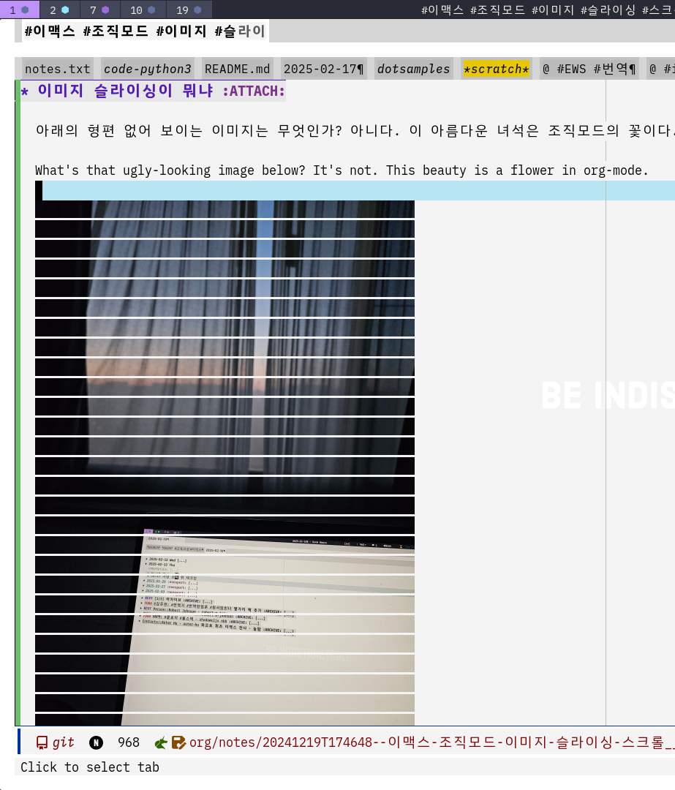

<!-- gid:20241219T174648 -->
[TOC]

[[TIP("이 노트에 대하여")]]
Org-mode에서 큰 이미지를 잘게 나눠 부드럽게 스크롤하는 org-sliced-images 아이디어를 담는다. 이미지가 많은 문서에서도 이맥스 경험을 훨씬 낫게 만드는 작은 개선점에 주목한다.
[[/TIP]]

## BIBLIOGRAPHY

  “Jcfk/Org-Sliced-Images.” 2024. [https://github.com/jcfk/org-sliced-images](https://github.com/jcfk/org-sliced-images).

## 관련노트

[버퍼 내에서 이동하기](https://notes.junghanacs.com/notes/20250218T171350/)

## 2024-12-19 이거 매우 필요한 패키지 였다.

이제야 알다니.

## jcfk/org-sliced-images

(“Jcfk/Org-Sliced-Images” 2024)

-   Fong, Jacob
-   Smoother scrolling with sliced images in org-mode

스크롤 할 수 있어서 감사합니다.

Thank you for being able to scroll.

### Example

아래의 형편 없어 보이는 이미지는 무엇인가? 아니다. 이 아름다운 녀석은 조직모드의 꽃이다.

What's that ugly-looking image below? It's not. This beauty is a flower in org-mode.

## DONT inqi7/image-slicing
