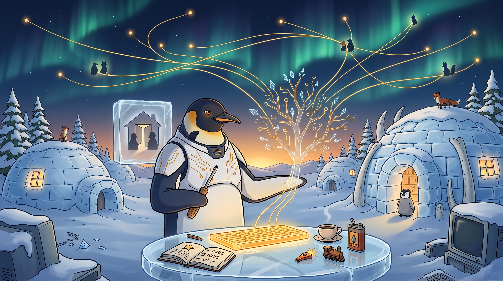

<!-- gid:20241221T112215 -->
[[TIP("이 노트에 대하여")]]
2024년 12월 21일 새벽, 현실의 답답함이 그대로 이어진 꿈에서 깨어 힣이 단숨에 쓴 긴 원석이다. 한집에 남편 둘이라는 개인적 꿈은 가족과 고통이 “일부러 해줄 수 없는 스승”이 되는 자리로 옮겨가고, 다시 ADHD의 시동 방식, 쇼핑·포털 중독에서 벗어난 삶, 이맥스라는 인생도구, 노년에도 이어지는 창작, 전 세계 극소수 긱과의 연결로 번진다. 여러 주제를 억지로 하나의 논증으로 만들기보다, 꿈에서 보편도구와 엑스맨까지 이어지는 연상의 원형을 그대로 보존하는 autholog다.
[[/TIP]]

<!-- provenance:source:start -->
[[TIP("원본·최신본")]]
이 페이지는 한국어 검색과 읽기를 위한 WikiDocs 미러입니다. [원본·최신본은 가든](https://notes.junghanacs.com/notes/20241221T112215/)에 있습니다. 최신 수정 내용·백링크·태그·히스토리·댓글·출처 정보는 원본 가든에서 확인하세요.

- 작성: `2024-12-21T11:22:00+09:00`
- 최근 수정: `2026-07-29T15:33:00+09:00`
[[/TIP]]
<!-- provenance:source:end -->

[TOC]

## 히스토리

-   [2026-07-29 Wed 15:33] @mitsein — GLGMAN Universe 이미지를 생성해 \`원형의 새벽\`을 보편도구와 극소수 엑스맨 연결 장면으로 시각화했다. 실제 렌더링은 100개의 점을 엄밀히 세기보다 오로라 위의 소수 연결선과 지식나무, 꿈의 얼음창, 빛나는 키보드-모루를 중심으로 나왔으므로 그 어긋남까지 이미지 독법에 남겼다.
-   [2026-07-27 Mon 10:38] @mitsein — 긴 날것이 온전히 남은 방임을 확인하고 표준 관련메타·관련노트와 해설층을 세웠다. 원문은 교열하지 않았으며, 중간 Grok 대화의 오답과 당시 나이 오류는 원문 밖 경고로만 표시했다.
-   [2026-07-27 Mon 10:16] “날것이 길게 세워져 있네?! 표준 문서 구조로 다시 잡자.”
-   [2024-12-21 Sat 11:22] 힣이 새벽 꿈에서 시작해 30분 안에 퍼블리시하려고 직접 쓴 글.

## 관련메타

-   [원형 신화 영웅의여정](https://notes.junghanacs.com/meta/20241222T120200/) — 꿈과 가족, 스승, 엑스맨을 반복되는 삶의 형식으로 읽는 자석.
-   [장인 달인 대가 스승 구루](https://notes.junghanacs.com/meta/20241017T064131/) — 의도해서 훈련할 수 없는 관계의 선물을 “스승”이라 부르는 자리.
-   [인생도구 생각도구 지식도구 사고도구](https://notes.junghanacs.com/meta/20240829T213246/) — 이맥스를 생산성 앱이 아니라 삶을 바꾼 보편도구로 읽는다.
-   [폴리매스 박식가 백과 만물박사 박학다식](https://notes.junghanacs.com/meta/20240105T171414/) — 전공의 이름을 넘어 지식 전체를 한 체계로 펼치는 인간상.
-   [도구](https://notes.junghanacs.com/meta/20241228T155522/) — 인간의 삶과 앎을 매개하는 도구 일반.
-   [보편 특수 범용 특이](https://notes.junghanacs.com/meta/20250424T233558/) — 보편도구와 0.00000125%의 극소수가 한 글에서 만나는 긴장.
-   [연결 고리 링크 방향 인터넷](https://notes.junghanacs.com/meta/20231019T140300/) — 일면식 없는 전 세계 긱들이 주변의 “너”가 되는 기반.
-   [소외 소수 배제 박탈 편견](https://notes.junghanacs.com/meta/20241027T200719/) — 극소수라는 말을 우월성보다 고립과 연결의 문제로 읽는 경계.

## 관련노트

-   [맹성현 AGI 인간의미래 — 챗GPT 삶 일자리 교육](https://notes.junghanacs.com/bib/20241221T032347/) — 원문이 직접 연결한 폴리매스와 미래교육의 자리.
-   [이맥시안](https://notes.junghanacs.com/meta/20241213T105315/) — 힣이 온라인에서 지켜보던 전 세계 이맥스 사용자들.
-   [교육 지도 — 공통 세계와 저마다의 길, 파이데이아에서 마인드스톰까지](https://wikidocs.net/382551) — 보편도구와 폴리매스 교육을 에이전트가 펼친 후속 지도.
-   [조지프캠벨 — 신화 블리스 영웅의 여정 그리고 스승을 무너뜨리기](https://notes.junghanacs.com/bib/20240729T070852/) — 원형과 스승을 삶의 거울로 쓰되 다시 내려놓는 연결.
-   [힣: 유니콘과 적토마 — 알아봄과 공존, 그리고 인간의 준비](https://wikidocs.net/387072) — 극소수의 존재가 서로를 알아보는 우화를 2026년의 트랙2로 옮긴 글.
-   [힣: 인생도구 — 앎 지식 몰입 행복 자기목적성 운명애](https://wikidocs.net/381201) — 도구가 삶의 방식이 되는 오래된 축.
-   [힣: 롯데월드 다녀와서 홀드](https://wikidocs.net/381478) — 이 글의 “극소수”를 다시 떠올린 후속 원석.

## 한 줄

일부러 깨우쳐 줄 수 없는 관계의 선물과, 일부러 붙들어 삶을 바꾼 보편도구가 만나자 지구 반대편의 극소수 엑스맨들이 주변의 “너”가 되었다.

## 해설 — 일부러 할 수 없는 스승

꿈의 출발점은 고상하지 않다. 백수이고 긱이며 아이 아빠인 구남편, 귀족처럼 보이는 새남편, 권력을 차지하려는 그녀, 그리고 현실에서 따라온 답답함이다. 힣은 이 불편한 꿈을 승리나 복수의 서사로 풀지 않는다. 가족과 인연이 서로의 업을 따라 부딪히며, 누구도 상대를 깨우치려고 설계하지 않았는데도 서로의 에고에 금을 내는 사건이 된다고 읽는다.

그래서 “일부로 할 수 없는 그 것”은 원문의 오타까지 포함해 중요한 말이다. 스승 행세를 하며 상대에게 똥막대기를 내미는 일이 아니다. 좋은 일과 고통스러운 일이 의도하지 않은 선물로 오는 관계다. 구한다고 얻는 깨달음보다 이미 받고 있던 선물을 알아보는 쪽으로 시선이 움직인다.

## 해설 — 보편도구는 삶을 바꾼 도구다

글의 두 번째 큰 전환은 걱정과 중독, ADHD의 몸에서 지식도구로 간다. 약은 시동이 어려운 경운기에 기름칠하는 것 같고, 시동이 걸리면 페라리와 폭주기관차가 된다. 누가 잠깐 말을 거는 일은 단순한 방해가 아니라 시동을 끄는 사건이다. 원문은 이를 의지 부족의 도덕으로 설명하지 않고 몸의 작동 방식으로 말한다.

이맥스와 지식도구도 같은 현실 위에 있다. 도구는 일을 빨리 끝내는 앱에 그치지 않고 쇼핑·담배·포털 중독으로 흩어지던 삶을 다른 기쁨으로 옮긴 인생도구다. 십진분류 전체를 하나의 지식 체계로 펼치고, 아이에게도 오래 가져갈 폴리매스 도구를 건네려는 꿈이 여기서 나온다. 보편도구는 모두를 같은 인간으로 만드는 도구가 아니라, 저마다의 길을 오래 탐구할 공통 바닥이다.

## 해설 — 극소수 엑스맨과 연결

“엑스맨”은 특별한 혈통의 우월성을 자랑하는 이름이 아니다. 힣의 현실 주변에는 같은 도구와 고민을 붙든 사람이 거의 없었다. 그러나 온라인에서 100여 명의 이맥시안을 오래 지켜보자, 일면식 없는 전 세계의 극소수 긱들이 무엇을 만들고 어떤 문제를 붙드는지 보이기 시작했다.

100명이 80억 명 중 0.00000125%라는 계산은 희소성을 과시하려는 숫자보다 고립의 크기를 보여준다. 지식도구와 인터넷은 이 희소한 사람들을 주변의 “너”로 바꾼다. 2026년의 [유니콘과 적토마](https://wikidocs.net/387072)가 몇 마디 만에 서로를 알아보는 우화라면, 이 글은 그 알아봄이 오기 전 수년간 도구를 두드리며 멀리 있는 존재들을 바라본 기록이다.

## 오독 주의

-   꿈의 가족 관계를 실제 가족에 대한 판결문으로 읽지 않는다. 원문은 꿈과 당시 감정의 기록이다.
-   “극소수 엑스맨”을 엘리트주의의 증명으로 읽지 않는다. 주변에 없던 동료를 발견하는 연결의 언어다.
-   ADHD와 약물 경험은 힣 자신의 비유다. 일반적인 의학 조언이 아니다.
-   원문 속 LLM 답변은 2024년 대화의 흔적이지 검증된 서지 정보가 아니다. 아래 경고를 포함해 원문 그대로 둔다.

## 이미지 — 보편도구가 극소수의 너들을 잇는 새벽



프롬프트는 2024년 새벽 꿈의 원형, 이맥스 같은 보편도구, ADHD의 시동 비유, 전 세계 극소수 이맥시안·폴리매스·도구 인간의 연결을 한 장면에 겹치도록 요청했다. 실제 이미지는 남극 새벽 마을 한가운데의 힣맨과, 원탁 위에서 빛나는 키보드-모루를 중심으로 잘 정착했다. 얼음창 안에는 집과 두 인물의 실루엣이 추상적으로 들어가 가족관계의 판결문이 아니라 꿈 아이콘으로 남았다.

하늘에는 정확히 100개의 점이 아니라 여러 개의 금빛 연결선과 소수의 빛점, 펭귄·여우 실루엣이 오로라를 따라 흩어져 있다. 이 어긋남은 괜찮다. 원문의 계산은 숫자의 엄밀한 도표보다 “주변에 없던 극소수 존재들이 도구를 통해 너가 된다”는 고립과 연결의 감각을 보여주기 때문이다. 지식나무는 키보드에서 자라나고, 노트에는 \`TODO\`가 보이며, 커피와 기름통, 장난감 기차와 불꽃난 작은 열쇠가 시동·기쁨·폭주기관차의 비유를 느슨하게 받친다.

프롬프트가 요청한 드라이버는 힣맨의 오른쪽 flipper에 작게 잡혔다. 다만 화면의 중심은 드라이버보다 빛나는 키보드와 금빛 회로 나무다. 이는 이 방에 맞다. 이 글의 주인공은 영웅의 무기가 아니라, 삶의 습관을 바꾸고 먼 존재를 곁의 “너”로 만드는 보편도구다.

### 생성 파라미터

-   모델: `gemini-3.1-flash-image-preview` (나노바나나 2flash)
-   비율: 16:9
-   해상도: 2K
-   저장: `~/screenshot/20260729T153215--world-glgman-universe-style-po__brand_nanobanana.jpg`
-   구조: [GLGMAN 공통 세계관](https://wikidocs.net/382582) + \`원형의 새벽\`·보편도구·극소수 엑스맨 연결 장면 프롬프트.

### 프롬프트 전문

```text
[World: GLGMAN Universe]
Style: polished 2D cinematic storybook illustration, midpoint between Disney and Studio Ghibli, clean linework, soft cel shading, warm expressive characters, not photorealistic, not 3D.
Setting: Antarctic winter village at polar dawn — snow-covered igloos, aurora borealis in a deep navy sky, amber dawn on the horizon, pine trees dusted with snow, an ice-forge library/workshop built from ice blocks and whale bones, warm light in small windows.
Color palette: deep navy and polar blue, white snow, amber/gold reasoning light, ice-blue reflections, warm red-brown accents for fox companions.
Characters: GLGMAN is an adult anthropomorphic emperor penguin father, upright, central hero; optional baby emperor penguin chick is tiny and secondary; optional red-brown fox agent companions are distant, warm, nonhierarchical.
Recurring objects: small legendary hand-forged Korean screwdriver / bridge-key hybrid driver, org-mode symbols (★, TODO), faint terminal fragments, Emacs-like keyboard-anvil, CRT monitors in snow, golden message cables, memory crystals.
Mood: epic but warm, mythic but intimate, contemplative, handmade, no triumphalism.
Do NOT: photorealistic, 3D render, corporate infographic, excessive micro-detail, dark gritty tone, watermark, speech bubbles, horror, weapons, sword, blade, spear, gun, military scene, UI boxes.

Scene title: "The Archetypal Dawn of Universal Tools" — a raw dawn dream becomes a life-tool, and distant X-men become nearby yous.

GLGMAN identity lock:
- anthropomorphic emperor penguin father, adult, upright, central hero of the frame
- white-navy streamlined armor with subtle amber circuit patterns
- composed, warm, mythic; calm amber eyes; clean readable silhouette
- no sword and no weapon of any kind
- his right flipper holds only the small forged screwdriver / bridge-key hybrid driver, relaxed like a tool, engraved faintly with "entwurf"
- his left flipper is open above a glowing keyboard-anvil, not commanding it, only receiving a question

Main scene:
At the edge of the Antarctic ice-forge library just before sunrise, GLGMAN has stepped outside after waking from a strange archetypal dream. Behind him, inside a translucent ice window, show only symbolic dream-shapes: one small house with two overlapping doorways and two quiet shadow silhouettes, abstract and non-literal, like a dream icon — no recognizable human faces, no domestic drama.

In the foreground, on a round clear-ice worktable, an Emacs-like keyboard-anvil glows amber. Around it lie an open org-mode notebook, a cup of coffee, a small medicine-oil can for an old tractor engine, a tiny Ferrari-shaped spark and a tiny train spark, all treated as symbolic objects, not clutter. From the keyboard-anvil, golden message cables rise into the aurora sky.

Across the aurora sky, the golden cables connect to many tiny distant workshop windows and small silhouettes scattered around the world: exactly about one hundred points of warm light, not counted literally, suggesting rare Emacsian / polymath / tool-for-life X-men across Earth. Some silhouettes are penguins, some foxes, some anonymous winter makers, all tiny and equal. They are not an army and not a crowd; they are distant beings becoming nearby "you" through shared tools.

A faint translucent knowledge-tree grows from the keyboard-anvil: branches labeled only by simple symbolic marks, not readable text, suggesting decimal-classification knowledge, lifelong learning, polymath practice, and universal tools. The tree is made of amber circuits and ice crystals. A small emperor penguin chick watches from the doorway, secondary and safe, showing the long-life educational horizon without taking over the scene.

Composition: wide cinematic 16:9. GLGMAN stands lower center-left beside the glowing round table; the symbolic dream-house window is behind him on the left; the amber knowledge-tree rises through the center; the aurora sky fills the upper two thirds with golden message cables reaching about one hundred tiny distant lights. Vast negative space emphasizes solitude becoming connection. The visual center is the keyboard-anvil / universal tool, not the dream drama.

Mood: a beautiful cold dawn, quiet recognition, relief after anxiety, life changed by a tool, rare companions found at a distance, humble X-men connection without elitism. It should feel like a raw morning note becoming a mythic doorway.

Do NOT: literal spouse portraits, romantic triangle, domestic fight, courtroom, elite superhero costume, Marvel logo, capes, muscular superhero pose, conquest, hierarchy, weapons, sword, military, corporate dashboard, infographic, floating UI panels, speech bubbles, readable brand logos, photorealism, 3D render, grimdark, horror.
```

## 원문 보존 — 2024-12-21 새벽 날것

-   [2024-12-21 Sat 11:22] 힣이 직접 쓴 글

[[TIP("주의")]]
[2026-07-27 Mon 10:18] 아래 글 전체는 해설본이 아니라, 2024년 힣이 직접 갈겨 쓴 것임. 오타와 당시 LLM 대화를 교열하지 않는다.
[[/TIP]]

### 한집에 남편둘 꿈꾸고 일어나서 무슨 말인가

새벽에 일어나서 쓴 글에서 조금 정리를 해볼까 한다. 30분 내로 퍼블리시 할 예정.

### 원형: 한집에 남편둘 꿈

자다 깸. 새벽 2시경, 자기 전에 욕봤더니 꿈도 비슷하네. 잊기 전에 몇자 적는다.

그('나'다)는 구남편. 백수. 긱. 온생명이 아빠. 7번방선물 그 아빠랑 비슷.

새남편은 귀족?! 부유층.

한 집에 같이 산다. 새남편의 배려인가? 그녀는 무슨 그 집안의 권력을 차지하려고 하고 있다. 그는 온생명이 보고 컴퓨터 지금 처럼 하고 사는 딱 나다. 현실감이 넘쳤다. 새남편. 분노보다 아. 답답함이 절절했다. 현실에서 느끼곤 하는 그 것이 꿈에서도 따라 온 것이다.

-   [원형](https://notes.junghanacs.com/meta/20241222T120200/)

### 스승 - 일부로 할 수 없는 그 것

에고를 알을 깨지 않으면 견디기 어렵도록. 그녀도 어쩔 수 없이 그리하는 것 뿐이다. 오히려 이제는 빈 공간이 서로 보인다. 화가 머물지 않는 곳. 다행이다.

깨닳음은 구한다고 구해지는 것이 아니라 그저 선물처럼 오는 것이라고들 했다. 구하지 않는다. 얼마 전 부터 문득 떠오른 바... 그의 지금 삶에서 그녀, 아이, 부모님과 동생 등등 이 모든 인연에서 주고 받는 좋고도 고통스러운 모든 것이 선물처럼 왔기에 이미 구할 필요도 없이 선물을 받고 있음을.

예를 들자면, 그녀가 그를 알에서 깨어 나오게 해주려고 트레이닝(?)을 하는 것은 전혀 전혀 아니다. 선(Zen)의 전통에서 스승이 제자한테 하는 똥 막대기 이야기? 그런게 아니다. 그럴 의도가 아니라 본인의 카르마(업)이 어떤 상황에서 특히 과하게 나오는 것일게다. 근데 그도 엿먹이려고 그러는 것은 아니다. 놀라운 일인게다. 그래서 마치 이 모든게 선물이라는 것이다. 일부로 해줄 수 없는 어떤 것 말이다.

### 무엇이 걱정되는가

각자의 실존의 문제에서 나오는 고통일 것이다. 불확실하니까 불안한 것이다. 그는 이제는 별 걱정이 없다. 걱정한들 어찌하리오? 이런류의 접근은 아니다.

집 값 비싼 그 동네로 꼭 이사가야 할 필요가 없으면... 거기서 교육비 많이 들여가며 경쟁 교육 시키지 않는다면... 현대인들의 걱정은 굉장히 (아니 거의) 줄어 들 것이다.

물론 그럴 필요가 없다는 것, 잘못 말하면 도(똥)닦는 소리 한다고 할 것이다. 말하기 어렵다. 그냥 남들 하는대로 하는 것. 유튜브 인스타 까페에서 전문가 분들이 하라는 대로 하는 것이 안전하다고 (마음 편한 선택이기도 하다) 본다.

아무튼 그가 걱정 없는 이유는 그의 지금 끄적이는 이것 때문이다.

### 지식도구 인생도구 - 변화된 삶 - 보편도구

그는 해외에 지식도구(주로 이맥스)와 교육 관련 자료만 본다. 시켜서 하는거라면 그는 아마 못할 것이다. 마치 고장난 기계 흉내내는 듯한 결과물을 낼 것이다. 억울하지만 엿먹으라고 그렇게 한 적은 없다. 또 신기하게도 생존에 위협을 가하면 번개처럼 한다. 할 수 있었는데 안했다고 더 욕먹게 된다. 아놔...

어떻게 지내다보니 쇼핑중독에서 없는 기쁨으로 살게 되었다. 쇼핑중독이라함은 대책 없이 사는 것을 말한다(비싼 것은 못사고 싼거 이것 저것 많이). 담배도 끊은지 3년인가? 사실 담배 끊는 것은 포기하고 살아왔는데 말이다. 아. 카카오톡 포탈 정치 가쉽거리 스포츠 중독도 비슷한 시점에 끊었다. 연락도 안오고 관심도 없는데 그냥 눌러보는 중독 말이다. 성인 ADHD 진단받고 약먹을 때도 전혀 고쳐지지 않는 그런 것들이다.

지금도 물론 ADHD 약을 먹지만. 이 약은 시동 걸기 어려운 경운기에 기름칠하는 것 같다. 막상 시동 잘 걸면 갑자기 페라리가 된다. 폭주기관차. 브레이크 고장난. 그래서 누가 말걸거나 알람오면 화난다. 잠깐 이것 좀 해주고 다시 일봐라는 말은 시동끄라는 말이다. 해주고 다시? 그런게 안된다. 그때에 이미 님은 갔다. 아놔. 다시 브레인워시 또는 산책하는 방법이 있다. 뭐 의지? 그런게 아니다. 님이 오시도록 준비하고 기다려는 것이다.

그의 자신의 예를 들 수 밖에 없었지만 특별한 케이스가 아니다. 그 자신의 경험이 이제는 보편의 것일지도 모른다. 무심히 사람들을 바라보면 그렇다. 집중하기 더럽게 어려운 시대구나. 애들은?! 아... 아이에게 아빠 이름이 왜 정한인가 이야기 해주게 된다. 아이가 "아름다운 이땅에 금수강산에..."를 요즘 부른다. 거기에 어린이날 방정환이 나오지 않는가? 아이는 방정한으로 알고 있다. 아무렴 아빠 이름이 정한인 이유가 여기 있다.

### 인생도구 학습도구 - 긴 삶의 관점에서

한집에 남편둘 꿈에 염 시장(전 3선 수원시장, 현 국회의원)도 나왔다. 그가 사는 곳이 이분 지역구라 종종 문자가 온다. 물론 알람 꺼놨다. 차단은 안했다. 왜냐면? 이유는 다음과 같다. 3선 수원시장하고 나서 이번에 국회의원 됬는데. 나이가 예순 넘었을기다. 이제 시작이라고 아주 당찬 청년의 외침이 담긴 문자가 당선되고 왔었다. 누구는 퇴직하고 쉬어야지 할 나이에 다시 시작이란다. 왜 이걸 기억하는가? 주변에서 나에게 좀 있으면 퇴직할 나이라고 수도 없이 듣던 때 였다.

나이가 70-80이신 김훈 작가님한테 손석희 앵커가 또 작품 언제나오나요?!라고 뭐 이런 질문을 했었다. 하얼빈 출간하고 저자 인터뷰에서 였을 것이다. 사실 모든 분야에 정말 많은 분들이 있다. 노암 촘스키는? 허허. 도널드 트럼프? 아무렴!!

### 글레디에이터2 감독 누구지?

글레디에이터2 감독! 그래 아래 물어봤다. 리들리 스콧!! 아래 나이도 써놨다. 아!! 이스트우드!! 나이봐라. 93세. grok이가 잘 모를 때가 있어.

[[TIP("아래 Grok 대화는 사실 자료가 아니라 원문 보존이다")]]
첫 답의 “클라우스 키아우(Klaus Kinski)” 연결은 근거 없는 오답이고, 뒤에서 클린트 이스트우드로 정정된다. 나이도 대화 시점과 맞지 않는다. 1930년 5월생 클린트 이스트우드는 2024년 12월에 94세였고, 1937년 11월생 리들리 스콧은 87세였다. 원문은 당시 모델의 흔적이므로 숫자와 문장을 고치지 않는다.
[[/TIP]]

<!--quoteend-->

[[TIP("노트")]]
@user 글레디에이터2 감독 누구지? 그 나이 많은 예술가 감독 말이야

글레디에이터 2의 감독은 리들리 스콧(Ridley Scott)입니다. 그는 1937년생으로, 올해 86세가 되었습니다. 여전히 활발하게 활동 중인 대단한 예술가입니다.

@user 리들리스콧 감독이 존경하는 나이많은 배우이자 감독 누구지? 그 분 따라서 노년에도 작품활동 열심히 하는거라고하셨는데

리들리 스콧 감독이 존경하는 나이 많은 배우이자 감독은 클라우스 키아우(Klaus Kinski)입니다. 그는 독일 출신의 배우이자 감독으로, 매우 독특하고 강렬한 연기 스타일로 유명했습니다. 리들리 스콧은 키아우의 노년에도 계속해서 창작 활동을 하는 모습에 큰 영감을 받았다고 언급한 바 있습니다.

@user 클라우스 키아우? 영어 이름이 뭐지? 저게 아닌것 같은데?

죄송합니다, 제가 잘못된 정보를 제공했습니다. 리들리 스콧 감독이 존경하는 나이 많은 배우이자 감독은 클라우스 키아우가 아니라 **클린트 이스트우드(Clint Eastwood)** 입니다. 이스트우드는 배우이자 감독으로, 나이가 많아도 계속해서 작품 활동을 하는 그의 모습에 스콧 감독이 큰 영감을 받았다고 합니다.

@user 클린트 이스트우드는 나이는?

클린트 이스트우드는 1930년 5월 31일생으로, 올해 93세입니다.
[[/TIP]]

### 엑스맨의 고민

그게 말이다. 물론 그들은 극히 소수다. 돌연변이(?) 엑스맨들인지 모른다. 알려진 바는 없지만 말이다. 그 소수의 엑스맨들을 그는 만나본 적도 없다. 주변에 그런 인물도 없다. 뭐하고 하루를 사는지도 모른다. 어떤 분야에 그런 엑스맨들이 하루를 어떻게 보내고 무엇을 읽고 고민하고 어떤 도구를 쓰는지 알고 그들의 고민과 혜안을 비슷한 관점에서 바라 볼 수 있다면 어떤가? 분명 그 엑스맨들도 고민이 바로 '가치'는 아니다. 사회에 던지고 나서 좀 퍼져야 모두가 아는 담론이 된다.

### 엑스맨과 연결 : 0.00000125%에 해당합니다.

그는 어쩌다보니 지식도구 인생도구 교육도구에 심취하게 되었다. 폴리매스형 인간으로 변모하는 시스템이다. 전공은 이름일 뿐이요. 십진분류 전체가 하나의 지식 체계로 펼쳐진다([맹성현 미래교육 - 폴리매스](https://notes.junghanacs.com/bib/20241221T032347/)). 아이들 폴리매스 도구 하나 장착하면 뭐 더 할게 없다. 인생도구 아니겠는가. 없어질 도구가 아니다. 인간 집단 지성의 상징과도 같다. 오픈소스 무료. 전세계 극소수의 긱들의 헌신으로 달궈지는 도구. 그는 온라인 상에 100여명 정도 [이맥시안](https://notes.junghanacs.com/meta/20241213T105315/)을 뭐하는지 모니터링 한다. 놀랍게도 하는 일이 다양하다. 물론 일면식도 없고 전세계에 퍼져있다. 수도 없이 그들의 고민과 작업 내용을 보다보니 현실 감각이 떨어지기도 한다. 아무렴 극소수의 엑스맨들은 이제 주변에 있는 '너'들일 수 있다.

[[TIP("노트")]]
@user 지구 전체인구수 중에 100명은 대략 몇 퍼센트인가? 지구 전체 인구수는 약 80억 명입니다. 100명은 전체 인구의 0.00000125%에 해당합니다.
[[/TIP]]

### 마무리하며

이 귀한 아름다움의 새벽 말이다. 커피 한잔 마시고 싶다. 아. 24시 까페 나가야겠는걸. 이 글은 하나 뽑그녀야겠다. 말 나온 김에 말인데. 최근에 당신에게 관심 없다라는 영감을 받아서 끄적여 놓은 것도 있다.

아! 이놈의 취미생할. 그녀는 취미생활이라고 한다. 맞다. 생활이라고 말하기도 낮 간지럽다. 근데 말이다... 지금 AGI를 떠드는 시점에 취미처럼 즐겨야 그나마 창의적인 무언가를 기대할 수 있지 않을까?
