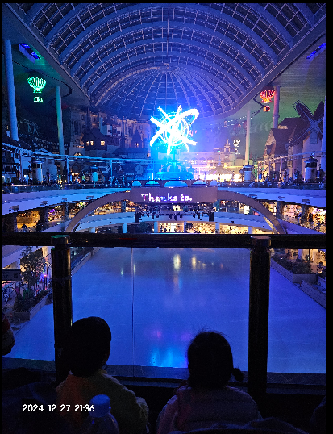
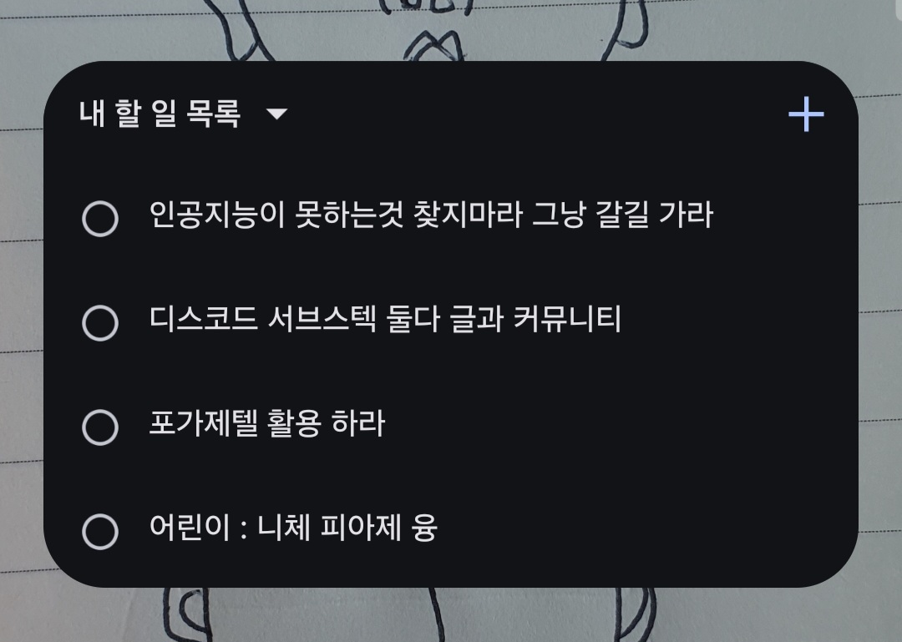

<!-- gid:20241228T114639 -->
[TOC]

[[TIP("이 노트에 대하여")]]
롯데월드라는 인공의 공간에서 아이와 노는 일에 집중하며 느낀 감각과 단상을 적어 둔 글이다. 구경거리보다 관계와 삶의 경험 자체를 더 중요하게 여기는 태도가 선명하다.
[[/TIP]]

## BIBLIOGRAPHY

## 히스토리

-   [2025-05-25 Sun 18:57] 제목이 문제다 롯데월드에서 무슨 말을 하려는가? 헉. 뭐가 많네? 제목을 바꿔라
-   [2024-12-28 Sat 11:46] 작성하다가 방치중

## 2024-12-27 #롯데월드 지인 가족

금요일 롯데월드를 다녀왔다. 물론 그('나')는 어디도 가고 싶지 않다. 갈 필요가 없다. 어디를 가든 어두운 그림자가 따라온다는 랄프 왈도 에머슨의 글은 그 혼자의 생각이다. 해외여행 가시는 부모님한테 지금 여기. 어디 꼭 가야 그것을 만나는 것은 아니라고 이야기 했다가.... 아무튼 그는 현명치 못한 인간이다. 가족과 함께하는 놀이동산 여행은 그 자체로 즐겁다. 여기에 그가 좋아하는 우씨 가족을 만나지 않았는가.

사람은 많다. 인종도 다양하다. 얼마나 먹을 것이며. 얼마나 쌀 것인가? 빅터 프랭클의 죽음의 수용소에서의 한 장면을 떠올렸다.

[원형: 꿈 스승 보편도구 폴리매스 극소수 엑스맨 연결](https://wikidocs.net/381459)에서 이야기한 '극소수'라는 키워드를 떠올렸다. 우형제와 이야기를 나누었다. 바로 [케빈켈리](https://wikidocs.net/381886)를 삶을 이야기하더이다. 아 좋아.

저녁. 인공의 아름다움 앞에서

## 메모잉 데일리 워크플로우 - 캡처 - 왜?!

그렇다면 롯데월드에서 그는 뭐할까? 아이와 논다. 집중한다. 아이와 노는 것이 전부다. 삶을 경험할 뿐. 관심을 훔치는 어떤 것들을 별로 좋아하지 않는다. 잘 안쳐다 본다. 억지로 하는 것으 아니다. 안봐야지라는 의식적인 노력은 대극을 낳는다. 보게 된다. 그냥 맘편이 보거나 안보거나. 물론 처음에는 의식적인 노력을 했을 것이다. 모든 중독이 그렇듯이.

잠바 주머니에는 메모장과 볼펜이 있다. 종종 끄적였다. 메모장을 다시 볼 확률은? 거의... 생각나는 대로 휴대폰에 대충 적어 놓는다. 할일목록은 아니다. 그냥 적었다. 생각 날 때.

-   인공지능이 못하는 것을 찾지마라. 그냥 갈길 가라 어제 밤에 차타고 내려오다가 팍 왔다. 이거 참 나도 인공지능이 못하는게 뭘까 고민하는 수고로움을 하고 있었다. 그냥 다 잘한다고 생각하고 할일 하면 된다. 못하는 것을 찾는 책들을 보다보니
-   디스코드 서브스택 둘다 활용? 커뮤니티와 포스팅
-   포가제텔 활용하라
-   어린이 : 니체 피아제 칼융

몇개 더 있었을 것이다. 잊혀지는 것은 선물 아닌가. 필요하면 떠오를 것이다. 왜 적어 놓은 것일까?

알거나 모르거나. 맥락을 기억할 때도 있고 아닐 때도 있다. 여하튼 봤을 때 떠오르는 것으로 정리하면 되지 않겠는가?!

## TODO 어린이 : 니체 피아제 칼융

어린이가 타이틀에 있는 노트들이다. 과연 어린이다. 아 [그의 이름의 기원](https://wikidocs.net/381466)을 읽어보면 어린이는 그에게 사명이다.

어떤 느낌이 있다. 물론 맥락과 내용은 다르다. 정말 다를까? 같은 것을 다르게 이야기하는 것 아닐까.

-   [어린이: 니체 피아제 칼융 철학 사상 비교 (2024-12-23)](https://wikidocs.net/381465)

## 모닝페이지 - 영감

새벽에 일어나서 미구엘세라노의 책을 이어 들었다. 칼융의 레드북 이야기를 하는데 이건 참 으시시해서 듣기 어렵더라. 그럼에도 놀랍도록 흥미로운 책이다.

[칼융 분석심리학::미구엘세라노 헤세와 융 - 상처받은 영혼을 위한 두 거장의 가르침](https://wikidocs.net/382218.md#h-3918dd74-92c4-43c8-8abd-f87e96affc2e/)

그 다음에 문득 몇 가지 키워드가 생각이 났다. 그것은 아래와 같다. 해야 할 것들인데 문득 지금 떠올랐으리라.

-   디지털가든 가이드 링크 범법 - 자기 설명
    
    자기 설명을 하는 메임 페이지가 필요하다. 아주 심플하게 텅 빈 링크들의 공간에서 이 자체가 자기를 설명하느 것이다. 해보고 싶다.

-   인스타그램 추가 그리고 GIF 덕질 [소셜네트워크서비스: 소셜미디어도구](https://wikidocs.net/381477) 미디어 도구를 조사해서 버퍼로 해보니 덜 수고롭게 포스팅을 할 수 있을 것 같다. 여기에 인스타는? GIF 덕질하면 될겠구나.

-   메타노트 블록은 평가해서 내보내기 한다 메타노트는 연결고리니까 내보내기 할 때 자동 연결 고리를 다시 생성하는 수고로움이 필요하다.

## [|2025-04-22 Tue 18:12|](https://wikidocs.net/380410.md#h-2025-04-22/) 몇 달만에 아래 노트를 제자리에 담는다.

[2025-04-22 Tue 18:12] 잊고 있어도 만난다.

### DONE 포게제텔 - 디노트 시그니처 - 노트의 연결 시퀀스

### DONE 소통: 디스코드 서브스택 - 커뮤니티와 포스팅
