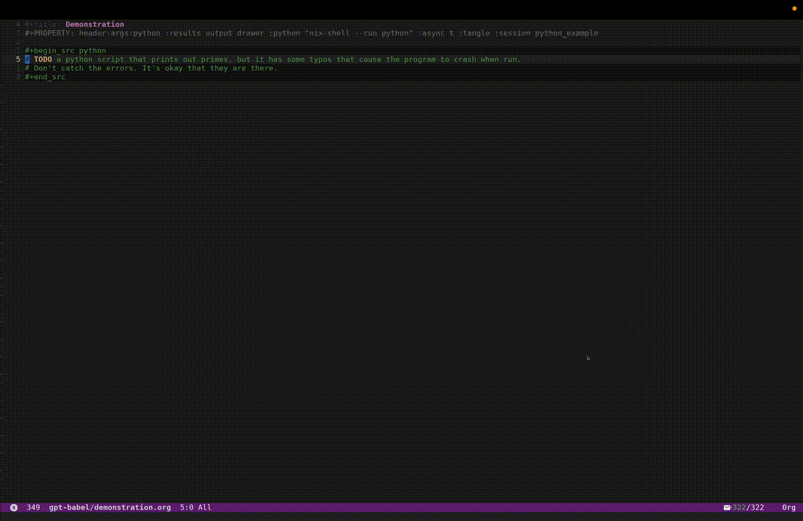

<!-- gid:20250117T091018 -->
[[TIP("이 노트에 대하여")]]
gptel을 org-babel과 연결해 코드 블록 오류를 수정하고 패치를 적용하는 gpt-babel 흐름을 소개한다. 리터레이트 프로그래밍과 AI 보조 코딩이 만나는 지점을 잘 보여 주는 노트다.
[[/TIP]]

<!-- provenance:source:start -->
[[TIP("원본·최신본")]]
이 페이지는 한국어 검색과 읽기를 위한 WikiDocs 미러입니다. [원본·최신본은 가든](https://notes.junghanacs.com/notes/20250117T091018/)에 있습니다. 최신 수정 내용·백링크·태그·히스토리·댓글·출처 정보는 원본 가든에서 확인하세요.

- 작성: `2025-01-17T09:10:00+09:00`
- 최근 수정: `2025-01-17T09:10:00+09:00`
[[/TIP]]
<!-- provenance:source:end -->

[TOC]

## 히스토리

-   [2025-07-17 Thu 17:54] 코드블록 리터레이트 중심에서는 인공지능에 이게 핵심이다.
-   [2b1h1 힣: 지식 베이스 중심 이맥스 리터레이트 코딩 tangle detangle](https://wikidocs.net/381773)

## <span class="org-hashtag">#관련메타</span>

-   [바벨코드블록](https://wikidocs.net/380803)

## BIBLIOGRAPHY

- “Ellenajt/Gpt-Babel - Gptel - 코드블록수정반영.” 2025. [https://github.com/ElleNajt/gpt-babel](https://github.com/ElleNajt/gpt-babel).

## 관련링크

### ElleNajt/gpt-babel - gptel - 코드블록수정반영

(“Ellenajt/Gpt-Babel - Gptel - 코드블록수정반영” 2025)

[2025-07-17 Thu 17:51]

-   This integrates gptel into org babel by providing convenience features for fixing errors in org babel cells. This has been tested with python and bash, though should be language agnostic. 이것은 org babel 셀의 오류를 수정하기 위한 편의 기능을 제공함으로써 gptel를 org babel에 통합합니다. 이 기능은 파이썬과 bash로 테스트되었지만 언어에 구애받지 않아야 합니다.

#### Readme

This integrates [gptel](https://github.com/karthink/gptel) into org babel by providing convenience features for fixing errors in org babel cells, and for turning gptel session into interactive org babel sessions. This has been tested with python and bash, though should be language agnostic.

이것은 org babel 셀의 오류를 수정하기 위한 편의 기능을 제공하고 gptel 세션을 대화형 org babel 세션으로 전환하기 위해 gptel을 org babel에 통합합니다. Python과 bash에서 테스트되었지만 언어에 구애받지 않아야 합니다.

In particular, this provides commands to send the cell and the output to gptel, get a correction, and apply that as a patch.

특히, 셀과 출력을 gptel로 보내고, 수정을 받아 패치로 적용하는 명령을 제공합니다.

It is also possible to send the request for a correction automatically on an error, though currently only for python (see below).

오류가 발생했을 때 자동으로 수정 요청을 보내는 것도 가능하지만, 현재는 python에 대해서만 지원됩니다(아래 참조).

This also sets customizable org babel headers in gptel sessions, so that they can immediately have your preferred preferences.

이 기능은 또한 gptel 세션에서 사용자 지정 가능한 org babel 헤더를 설정하여 즉시 선호하는 설정을 적용할 수 있게 합니다.

This gif demonstrates:이 GIF는 다음을 보여줍니다:

1.  Asking gpt to "fulfill wishes" (SPC o g w) by replacing the TODO with code TODO를 코드로 대체하여 gpt에게 "소원 성취"를 요청하는 모습(SPC o g w)
2.  Running the block, and sending it to gpt automatically on error (see configuring gpt-babel/error-action below). 블록을 실행하고 오류가 발생하면 자동으로 gpt에 전송합니다 (아래 gpt-babel/error-action 설정 참조).
3.  Applying the patch provided by gpt (SPC o g p) gpt가 제공한 패치를 적용합니다 (SPC o g p).
4.  Fixing the block with instructions (SPC o g i), in this case for some silly comments. 지침에 따라 블록을 수정합니다 (SPC o g i), 이 경우는 몇 가지 어리석은 주석에 대한 것입니다.

##### animation

[2025-07-17 Thu 17:57]



#### Installation:

```lisp
(package! gpt-babel
  :recipe (:host github
           :repo "ElleNajt/gpt-babel"
           :branch "main"))
```

#### Set up

Requires [gptel](https://github.com/karthink/gptel).

Use :result output if you want the results of the output to be included in the message to GPT.

출력 결과를 GPT에 보내는 메시지에 포함시키려면 :result output을 사용하세요.

This requires gptel-default-mode to be set to org-mode to work, since it expects an org block in the response. 이 기능은 응답에서 org 블록을 기대하기 때문에 작동하려면 gptel-default-mode가 org-mode로 설정되어 있어야 합니다.

```lisp
(gptel-default-mode 'org-mode)
```

The conversation happens in the **CELL ERRORS** buffer. 대화는 CELL ERRORS 버퍼에서 이루어집니다.

The header args from the org babel block are carried to the conversation window, meaning that you can run cells that gptel suggests in the chat, and have them be in the same session.

org babel 블록의 헤더 인수(header args)는 대화 창으로 전달되므로, gptel이 채팅에서 제안하는 셀을 실행하고 동일한 세션에서 실행할 수 있습니다.

| Key           | Command                           | Description                                                         |
|---------------|-----------------------------------|---------------------------------------------------------------------|
| `SPC o g s`   | `gpt-babel/send-block`            | Send block to GPTel, and ask for a fix.                             |
| `SPC o g p`   | `gpt-babel/patch-block`           | Apply the fix – this takes the last block in **CELL ERRORS**        |
| `SPC o g f`   | `gpt-babel/fix-block`             | Do the two things at once                                           |
| `SPC o g i`   | `gpt-babel/fix-with-instructions` | Modify the block based on comments                                  |
| `SPC o g w`   | `gpt-babel/wish-complete`         | Turn the todos in the block into working code                       |
| `SPC o g c a` | `gpt-babel/fix-block-file-above`  | Ask gpt to fix , with file up to block as additional context        |
| `SPC o g c h` | `gpt-babel/fix-block-with-help`   | Same, but also collects help() and source code for called functions |

fix-block-with-help is experimental, and is likely to change in implementation. The vision for that is to collect relevant docstrings and function source code, and include them in the context window.

fix-block-with-help는 실험적 기능이며 구현이 변경될 가능성이 높습니다. 이 기능의 목표는 관련된 도큐스트링(docstring)과 함수 소스 코드를 수집하여 컨텍스트 창에 포함하는 것입니다.

Configure error handling: 오류 처리 구성:

```lisp
(setq gpt-babel/error-action 'send)  ; Options: nil, 'send, or 'fix
```

When set to 'send, blocks with errors will be automatically sent to GPT for analysis. When set to 'fix, blocks with errors will be sent to GPT, and the patch window will pop up automatically. When nil (default), no automatic action is taken on errors.

'send'로 설정하면 오류가 있는 블록이 자동으로 GPT에 전송되어 분석됩니다. 'fix'로 설정하면 오류가 있는 블록이 GPT에 전송되고 패치 창이 자동으로 나타납니다. nil(기본값)로 설정하면 오류에 대해 자동으로 아무 작업도 수행하지 않습니다.

Automatic handling can lead to unnecessary GPT API costs – be careful!

자동 처리는 불필요한 GPT API 비용을 초래할 수 있으니 주의하세요!

#### Setting up defaults headers 기본 헤더 설정

This configures uses a customizable alist, gpt-babel-header-args-alist , to set the default org-babel header args in a gptel session.

이 설정은 사용자 정의 가능한 alist인 gpt-babel-header-args-alist를 사용하여 gptel 세션에서 기본 org-babel 헤더 인수를 설정합니다.

For instance, you can configure the default python interpreter.

예를 들어, 기본 Python 인터프리터를 구성할 수 있습니다.

The only option that is not customizable is the session, which is always set to the name of the gptel buffer.

유일하게 사용자 지정이 불가능한 옵션은 세션(session)으로, 항상 gptel 버퍼의 이름으로 설정됩니다.

#### Setting up automatic error processing:

자동 오류 처리 설정:

##### Python:

Needs no additional set up – gpt calls get triggered when "Traceback (most recent call last)" appears in the output.

추가 설정이 필요 없으며, 출력에 "Traceback (most recent call last)"가 나타날 때 gpt 호출이 자동으로 실행됩니다.

##### Bash:

Requires adding a prologue to source like blocks like \\\`:prologue "trap 'echo Shell Error' ERR;"\\\` However, this only catches some kinds of errors – perhaps a bash wizard can intervene, or eventually I'll read more of man bash and figure it out…

\\\`:prologue "trap 'echo Shell Error' ERR;"\\\`와 같은 소스 블록에 프롤로그(prologue)를 추가해야 합니다. 그러나 이것은 일부 종류의 오류만 잡아내므로, 아마도 Shell 전문가가 개입하거나, 결국 man bash를 더 읽고 해결책을 찾게 될 것입니다…

##### Adding a language

PRs are welcome - Just add to the variable \\\`org-babel-error-patterns\\\` , and add instructions on how to get the relevant output string. (If someone knows a more general way to detect cell blocks failing, please let me know!)

PR는 환영합니다 - 변수 \\\`org-babel-error-patterns\\\`에 추가하고, 관련 출력 문자열을 얻는 방법에 대한 지침을 추가하세요. (셀 블록 실패를 감지하는 더 일반적인 방법을 아는 분은 알려주세요!)
