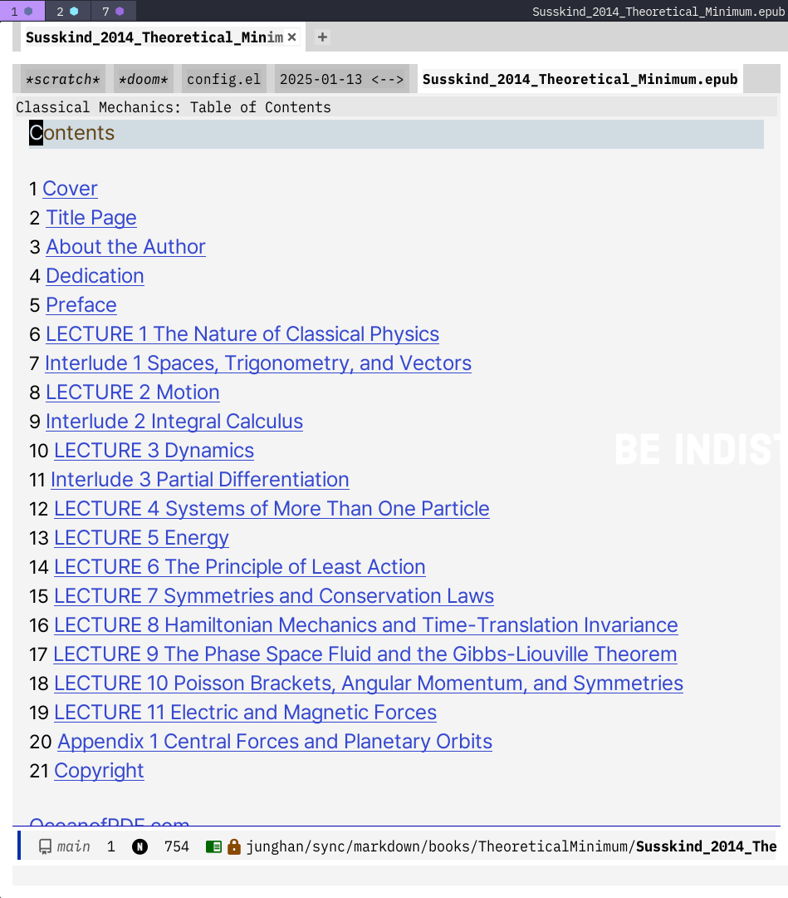
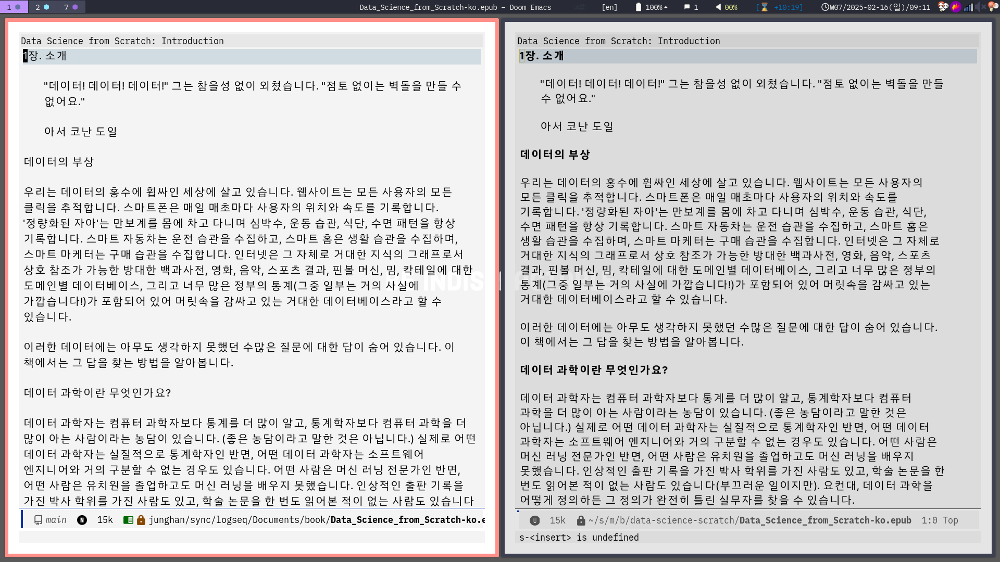

<!-- gid:20250118T124126 -->
[TOC]

[[TIP("이 노트에 대하여")]]
nov 패키지를 이용해 Doom Emacs 안에서 EPUB을 읽고 org 링크와 연결하는 설정을 정리한다. 전자책 독서와 노트 연결을 에디터 안에서 해결하려는 실용적인 기록이다.
[[/TIP]]

## BIBLIOGRAPHY

## [둠이맥스](https://wikidocs.net/380689)에서 EPUB 보려면 이렇게 하라!

[2025-01-18 W02](https://wikidocs.net/380393) 에 추가한다. 완전 아름다움.

이 노트는 이맥스 가이드에 있다. 그거 확인하고 내 설정을 넣는다.

```elisp
(use-package! nov
  :mode ("\\.epub\\'" . nov-mode)
  :commands (nov-org-link-follow nov-org-link-store)
  :init
  (with-eval-after-load 'org
    (org-link-set-parameters "nov"
                             :follow 'nov-org-link-follow
                             :store 'nov-org-link-store))
  :config
  (map! :map nov-mode-map
        :n "RET" #'nov-scroll-up
        :n "d" 'nov-scroll-up
        :n "u" 'nov-scroll-down)

  (defun +nov-mode-setup ()
    "Tweak nov-mode to our liking."
    (face-remap-add-relative 'variable-pitch
                             :family "Pretendard Variable"
                             :height 1.1
                             :width 'semi-expanded)
    (face-remap-add-relative 'default :height 1.0)
    (variable-pitch-mode 1)
    (setq-local line-spacing 0.2
                ;; next-screen-context-lines 4
                shr-use-colors nil)
    (when (featurep 'hl-line-mode)
      (hl-line-mode -1))
    (when (featurep 'font-lock-mode)
      (font-lock-mode -1))
    ;; Re-render with new display settings
    (nov-render-document)
    ;; Look up words with the dictionary.
    (add-to-list '+lookup-definition-functions #'+lookup/dictionary-definition))
  (add-hook 'nov-mode-hook #'+nov-mode-setup 80)

  (setq font-lock-global-modes '(not nov-mode))
  )
```

## 스크린샷

[2025-01-18 Sat 12:43]

이게 나와야 했다. 그러려면 위에와 같이 해주면 된다. font-lock-mode를 꺼라.



## <span class="org-todo done DONE">DONE</span> 둠이맥스 스페이스맥스 왜 다른가?

[2025-02-16 Sun 09:12]

테마 설정 상 다른 것 뿐. 문제 없음. 훌륭.


