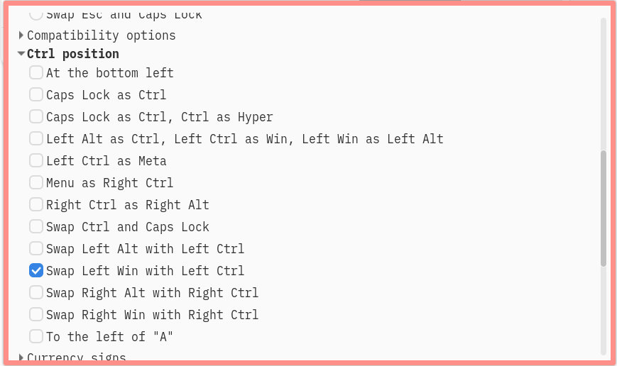
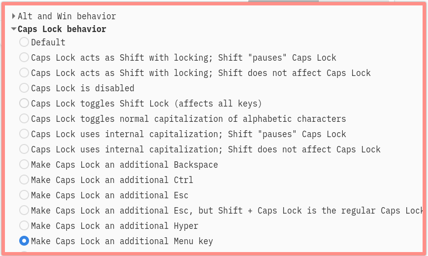

<!-- gid:20250119T000448 -->
[TOC]

[[TIP("이 노트에 대하여")]] CapsLock과 한영키, Control 배치를 바꾸며 손가락 부담을 줄이는 실제 설정과 스크린샷을 남긴다. 키바인딩 철학과 입력기 실용이 함께 묶인 생활형 최적화 노트다. [[/TIP]] BIBLIOGRAPHY 관련메타 - [키바인딩](https://wikidocs.net/380645)
-   [키보드](https://wikidocs.net/380531)

## 히스토리

-   [2025-01-18 Sat 22:19] 새끼손가락 보호

## 리눅스 설정 변경

### 스왑 컨트롤 - 윈도우키



### <span class="org-todo done DONE">DONE</span> 캡스락 - Menu - 한영키로 매핑

-   [2025-06-24 Tue 06:48] 노트북에 적용



## 이맥스 설정 변경

### 관련 코드

[2025-01-19 Sun 00:05]

```elisp

;;;###autoload
  (defun block-toggle-input-method ()
    (interactive)
    (message (format "Input method is disabled in <%s> state." evil-state)))

  (mapc
   (lambda (mode)
     (let ((keymap (intern (format "evil-%s-state-map" mode))))
       (define-key
        (symbol-value keymap) (kbd "<Hangul>") #'block-toggle-input-method)
       (define-key
        (symbol-value keymap) (kbd "S-SPC") #'block-toggle-input-method)
       (define-key
        (symbol-value keymap) (kbd "<menu>") #'block-toggle-input-method)))
   '(motion normal visual))

(global-set-key (kbd "<menu>") 'toggle-input-method) ;; caps lock as <menu>
(add-hook 'context-menu-mode-hook '(lambda () (define-key context-menu-mode-map (kbd "<menu>") #'toggle-input-method)))
(global-unset-key (kbd "S-SPC"))

```

## 로그

### How to remap all C-c prefix keys to M-c?

[2025-01-21 Tue 16:20]

손가락 아파서 리매핑

Emacs에서 모든 C-c 접두사 키를 M-c로 리매핑하는 것은 복잡한 작업입니다. 이는 C-c가 Emacs의 주요 접두사 키 중 하나이며, 많은 모드와 패키지에서 광범위하게 사용되기 때문입니다. 그러나 다음과 같은 방법으로 접근할 수 있습니다:

#### 키 변환 맵 사용

키 변환 맵(key translation map)을 사용하여 M-c를 C-c로 변환할 수 있습니다:

```elisp
(define-key key-translation-map (kbd "M-c") (kbd "C-c"))
```

이 방법은 M-c를 입력할 때마다 Emacs가 C-c로 해석하도록 합니다[1][5].

#### 동적 키맵 생성

더 복잡하지만 유연한 방법으로, C-c의 키맵을 동적으로 생성하여 M-c에 바인딩할 수 있습니다:

```elisp
(progn
  (defun my-generate-c-c-map ()
    (let ((map (make-sparse-keymap)))
      (set-keymap-parent map (lookup-key global-map (kbd "C-c")))
      map))

  (global-set-key (kbd "M-c") (my-generate-c-c-map))
  )
```

이 방법은 C-c의 모든 바인딩을 M-c에 복제합니다[1][3].

#### 주의사항

1.  이 변경은 광범위한 영향을 미칠 수 있으므로 신중히 고려해야 합니다.
2.  일부 모드나 패키지에서 예기치 않은 동작이 발생할 수 있습니다.
3.  C-c는 사용자 정의 키 바인딩을 위해 예약된 접두사이므로, 이를 변경하면 관례를 벗어나게 됩니다[10].

이러한 변경을 적용할 때는 기존 워크플로우에 미치는 영향을 충분히 테스트하고 고려해야 합니다.
