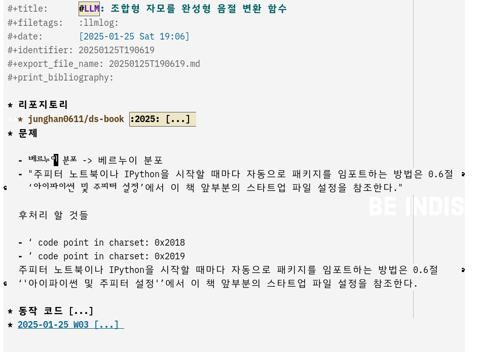

<!-- gid:20250125T190619 -->
[TOC]

[[TIP("이 노트에 대하여")]]
판독과 pandoc 변환 과정에서 나타나는 한글 NFD/NFC 정규화 문제를 실전 사례와 함께 설명한다. 터미널 환경과 AI 협업에서도 반복해서 마주칠 수 있는 중요한 인코딩 메모다.
[[/TIP]]

## 관련메타

-   [유니코드](https://wikidocs.net/380672)
-   [한글 한국어 우리말](https://wikidocs.net/380544)
-   [타이포그래피 폰트](https://wikidocs.net/380978)

## BIBLIOGRAPHY

- “Astoff/Code-Cells.El: Emacs Utilities for Code Split into Cells, Including Jupyter Notebooks.” n.d. Accessed January 28, 2025. [https://github.com/astoff/code-cells.el](https://github.com/astoff/code-cells.el).
- “Junghan0611/Ds-Book.” 2025. [https://github.com/junghan0611/ds-book](https://github.com/junghan0611/ds-book).

## 히스토리

-   [2025-11-14 Fri 08:05] 링크 엄청 중요한 문제를 해결한 것이다.
    -   [memex-kb: Legacy 문서 RAG 파이프라인 입구](https://wikidocs.net/381806)
    -   [doomemacs-config: 터미널 최적화 Emacs와 AI 융합](https://wikidocs.net/381804)
-   [2025-01-25 Sat 19:06] 생성 문제 해결 NFC(완성형)와 NFD(분해형)

## 완벽한 한글 처리를 위한 두 가지 이슈 해결

이맥스를 사용하지 않더라도 앞으로 터미널 환경에서 AI 에이전트와 협업하려면 반드시 마주칠 수 있는 귀한 정보입니다. UTF-8 정규화 문제의 완벽한 해결책입니다.

### 1️⃣ 이슈 #1: Confluence 문서 변환 시 한글 깨짐

#### 문제 상황

Confluence에서 Export한 `.doc` 파일을 pandoc으로 변환 시:

-   한글이 유니코드 escape 형식(=EC=97=B0...)과 섞여서 표시
-   이맥스에서 열면 읽을 수 없는 상태

<!--listend-->

```text
# IoT Core Device =EC=97=B0=EB=8F=99=EA=B7=9C=EA=B2=A9=EC=84=9C v1.13
                   ^^^^^^^^^^^^^^^^^^^^^^^^^^^^^^^^^^^^^^^^^^^^^^^^
                   이 부분이 "연동규격서"여야 하는데 깨짐
```

#### 원인 분석

1.  **Confluence Export 형식**:
    -   `.doc` 확장자이지만 실제로는 `MIME multipart/related` 메시지
    -   HTML이 `quoted-printable` 인코딩으로 포함됨
    -   Soft line break (=으로 끝나는 줄)가 포함되어 있음

2.  **Quoted-Printable 문제**:
    ```text
    # 원본 (quoted-printable)
    =EC=97=B0=EB=8F=90=   <- soft line break (=)
    =EA=B7=9C=EA=B2=A9
    
    # Python quopri.decodestring() 사용 시
    한글이 일부만 디코딩되고 일부는 그대로 남음
    ```

3.  **올바른 방법**:
    -   Python `email` 모듈로 MIME 파싱
    -   HTML 파트를 UTF-8로 추출
    -   Pandoc으로 Markdown 변환

#### 해결 방법

##### Python 스크립트 (memex-kb 프로젝트)

파일: `~/repos/gh/memex-kb/scripts/confluence_to_markdown.py`

```python
import email
from email import policy

# MIME 메시지 파싱
with open('document.doc', 'rb') as f:
    msg = email.message_from_binary_file(f, policy=policy.default)

# HTML 파트 추출
for part in msg.walk():
    if part.get_content_type() == 'text/html':
        html_content = part.get_content()  # UTF-8 문자열
        break

# Pandoc 변환
subprocess.run([
    'pandoc', html_file, '-f', 'html', '-t', 'markdown', '--wrap=none'
])
```

##### 후처리 (Fenced Div 제거)

```python
import re

# 1. 긴 Section 구분자 제거
markdown = re.sub(r'^:{3,}.*Section\d+.*$', '', markdown, flags=re.MULTILINE)

# 2. 빈 fenced div 제거
markdown = re.sub(r'^:{3,}\s*{[^}]*}\s*$', '', markdown, flags=re.MULTILINE)
markdown = re.sub(r'^:{3,}\s*$', '', markdown, flags=re.MULTILINE)

# 3. 헤딩 ID 제거
markdown = re.sub(r'\s+{#[^}]+}', '', markdown)

# 4. 코드 블록 정리
markdown = re.sub(
    r'```\s*\{\.syntaxhighlighter-pre[^}]+\}',
    '```json',
    markdown
)

# 5. NFD → NFC 정규화
markdown = unicodedata.normalize('NFC', markdown)
```

#### 사용 방법

```bash
# 단일 파일
python3 ~/repos/gh/memex-kb/scripts/confluence_to_markdown.py document.doc

# 일괄 변환
python3 ~/repos/gh/memex-kb/scripts/confluence_to_markdown.py \
    --batch input_dir/ output_dir/
```

### 2️⃣ 이슈 #2: Termux Emacs 실시간 한글 입력 문제

#### 문제 상황 (가장 심각한 이슈!)

**Termux 터미널 환경에서 Emacs nw 모드로 실행 시**:

-   한글 입력 후 **스페이스 키를 누르면** 입력된 글자가 NFD(분해형)으로 변환됨
-   파일에 저장되면 NFC(완성형)와 NFD(분해형)가 혼재
-   검색 불가능, 편집 불가능, 파일 손상

<!--listend-->

```text
입력: "안녕하세요" + 스페이스
결과: "ㅇㅏㄴㄴㅕㅇ하세요"  <- 첫 두 글자가 분해됨!

유니코드:
- 정상(NFC): U+C548 U+B155 U+D558 U+C138 U+C694
- 문제(NFD): U+1109 U+1161 U+11AB U+1102 U+1167 U+11BC U+D558 U+C138 U+C694
                ^^^^^^^^^^^^^^^^^^^^ ^^^^^^^^^^^^^^^^^^^^^^
                초성 +중성+ 종성 분리    초성 +중성+ 종성 분리
```

#### 원인 분석 (UTF-8 Normalization)

1.  **NFD vs NFC**:
    ```text
    NFC (Normalization Form Composed):
    "한" = U+D55C (1개 코드 포인트, 완성형)
    
    NFD (Normalization Form Decomposed):
    "한" = U+1112(ㅎ) + U+1161(ㅏ) + U+11AB(ㄴ)  (3개 코드 포인트, 조합형)
    ```

2.  **macOS/Termux 특성**:
    -   macOS: 파일시스템이 NFD 사용 (HFS+)
    -   Termux: Android IME가 NFD로 입력
    -   Windows: NFC 사용

3.  **스페이스 입력 시 발생 이유**:
    -   Termux IME가 조합 완료 시점에 NFD로 변환
    -   이맥스가 그대로 받아서 버퍼에 저장
    -   저장 전까지 변환 기회 없음

#### 해결 방법 (실시간 변환!)

##### Emacs Lisp 패키지

파일: `~/.doom.d/+korean-input-fix.el`

###### 핵심 아이디어

-   `after-change-functions` 훅으로 **입력 즉시** NFD → NFC 변환
-   디바운스로 성능 최적화
-   저장 전 / 파일 열기 시에도 변환 (안전망)

###### 실시간 변환 함수

```elisp
(defun korean/after-change-nfc-normalize (beg end _len)
  "텍스트 변경 후 자동으로 NFD → NFC 정규화."
  ;; 디바운스: 0.1초 이내 연속 입력은 마지막만 처리
  (when korean/nfc-timer
    (cancel-timer korean/nfc-timer))

  (setq korean/nfc-timer
        (run-with-idle-timer
         0.1 nil
         (lambda ()
           (when (buffer-live-p (current-buffer))
             (save-excursion
               (save-match-data
                 ;; 변경된 영역 + 앞뒤 10자 검사
                 (let* ((search-begin (max (point-min) (- beg 10)))
                        (search-end (min (point-max) (+ end 10)))
                        (inhibit-modification-hooks t))
                   (goto-char search-begin)
                   ;; 한글 자모 패턴 찾기
                   (while (re-search-forward korean-jamo-pattern search-end t)
                     (ucs-normalize-NFC-region (match-beginning 0) (match-end 0)))))))))))
```

###### 마이너 모드

```elisp
(define-minor-mode korean-nfc-mode
  "한글 NFD → NFC 자동 변환 마이너 모드."
  :lighter " 한"
  :global nil
  (if korean-nfc-mode
      (progn
        (add-hook 'after-change-functions #'korean/after-change-nfc-normalize nil t)
        (add-hook 'before-save-hook #'korean/before-save-nfc-normalize nil t))
    (progn
      (remove-hook 'after-change-functions #'korean/after-change-nfc-normalize t)
      (remove-hook 'before-save-hook #'korean/before-save-nfc-normalize t))))
```

###### 자동 활성화 (Termux 감지)

```elisp
(defun korean/enable-nfc-mode-if-needed ()
  "Termux 환경이면 자동으로 korean-nfc-mode 활성화"
  (when (and (not (display-graphic-p))
             (or (getenv "TERMUX_VERSION")
                 (string-match-p "termux" (or (getenv "PREFIX") ""))))
    (korean-nfc-mode 1)))

(add-hook 'text-mode-hook #'korean/enable-nfc-mode-if-needed)
(add-hook 'prog-mode-hook #'korean/enable-nfc-mode-if-needed)
```

#### 설정 (Doom Emacs)

`~/.doom.d/config.el` 에 추가:

```elisp
(load! "+korean-input-fix")
```

### 🎯 성능 최적화 및 주의사항

#### 성능 고려사항

1.  **디바운스 타이머**:
    -   0.1초 지연으로 과도한 실행 방지
    -   사용자가 타이핑 중일 때는 대기
    -   타이핑 멈춘 후 0.1초 후 실행

2.  **제한된 영역 검사**:
    -   변경된 위치 ±10자만 검사
    -   전체 버퍼 검사 X (성능 저하 방지)

3.  **재귀 방지**:
    -   `inhibit-modification-hooks t` 설정
    -   변환 중 다시 훅 호출 방지

#### 검증 방법

```elisp
;; 1. 한글 입력 테스트
안녕하세요 스페이스를 누르면 자동 변환됨

;; 2. 버퍼 전체 수동 변환
M-x korean/convert-jamo-to-syllable

;; 3. 모드 확인
M-x describe-mode
;; "korean-nfc-mode" 표시되는지 확인

;; 4. 파이프라인 테스트
(progn
  (insert "ㅎㅏㄴ")  ; NFD 직접 입력
  (korean/convert-jamo-to-syllable))
;; → "한" (NFC)로 변환됨
```

### 📚 참고 자료 및 관련 이슈

#### 동일 문제 보고

1.  [WezTerm #2482](https://github.com/wezterm/wezterm/issues/2482): Korean NFD vs NFC
2.  [org-roam #1423](https://github.com/org-roam/org-roam/issues/1423): Hangul(Korean letter) is not supported
3.  [Jonghyun Yun Blog](https://jyun.rbind.io/post/utf_hfs/): How to fix when Emacs in OS X displays decomposed Korean characters

#### Unicode 정규화 표준

-   [UAX #15: Unicode Normalization Forms](https://www.unicode.org/reports/tr15/)
-   [UTR #47: Korean Processing Forms](https://www.unicode.org/L2/L2009/09052-tr47.html)

#### 한글 자모 유니코드 범위

| 구분 | 범위            | 설명      |
|----|---------------|---------|
| 초성 | U+1100 ~ U+115F | Choseong  |
| 중성 | U+1160 ~ U+11A7 | Jungseong |
| 종성 | U+11A8 ~ U+11FF | Jongseong |
| 완성형 | U+AC00 ~ U+D7A3 | 한글 음절 |
| 호환 | U+3130 ~ U+318F | 호환 자모 |

### 🚀 결론

이제 완벽한 한글 처리가 가능합니다:

1.  **Confluence 문서**: MIME 파싱 → 깨끗한 Markdown
2.  **실시간 입력**: NFD → NFC 자동 변환 (0.1초 디바운스)
3.  **저장/열기**: 안전망으로 이중 체크

**이맥스가 아니더라도** 터미널 환경에서 AI 에이전트와 협업 시 이 정보는 매우 귀중합니다. UTF-8 정규화 문제의 완벽한 해결책입니다.

## 조합형 자모를 완성형 음절로 변환 문제

-   베르누이 분포 -&gt; 베르누이 분포
-   "주피터 노트북이나 IPython을 시작할 때마다 자동으로 패키지를 임포트하는 방법은 0.6절 ‘아이파이썬 및 주피터 설정’에서 이 책 앞부분의 스타트업 파일 설정을 참조한다."

후처리 할 것들

-   ‘ code point in charset: 0x2018
-   ’ code point in charset: 0x2019

주피터 노트북이나 IPython을 시작할 때마다 자동으로 패키지를 임포트하는 방법은 0.6절 ‘'아이파이썬 및 주피터 설정'’에서 이 책 앞부분의 스타트업 파일 설정을 참조한다.

### 스크린샷



### junghan0611/ds-book

(“Junghan0611/Ds-Book” 2025)

### 동작 코드

현재 버퍼에서 조합형 자모를 완성형 음절로 변환합니다. 동작 잘 된다.

-   my/process-files-by-extension
-   .ipynb
-   my/convert-hangul-jamo-to-syllable

<!--listend-->

```elisp

(progn
  (require 'ucs-normalize)

  (defun my/convert-hangul-jamo-to-syllable ()
    "Convert conjoining jamo to precomposed syllables in the current buffer."
    (interactive)
    (let* ((choseong "[\u1100-\u115F\uA960-\uA97C]")
           (jungseong "[\u1160-\u11A7\uD7B0-\uD7C6]")
           (jongseong "[\u11A8-\u11FF\uD7CB-\uD7FB]?")
           (pattern (concat choseong jungseong jongseong)))
      (save-excursion
        (goto-char (point-min))
        (while (re-search-forward pattern nil t)
          (let ((start (match-beginning 0))
                (end (match-end 0)))
            (ucs-normalize-NFC-region start end))))))

  ;; 버퍼 전체에 적용하려면 다음 함수를 호출하세요:
  ;; (my/convert-hangul-jamo-to-syllable)

  (defun my/process-files-by-extension (directory extension process-func)
    "주어진 디렉토리에서 특정 확장자를 가진 파일들에 대해 처리 함수를 적용합니다."
    (interactive
     (list (read-directory-name "처리할 디렉토리: ")
           (read-string "파일 확장자 (예: txt): ")
           (intern (completing-read "처리 함수: " obarray 'functionp t))))
    (dolist (file (directory-files-recursively directory (concat "\\." extension "$")))
      (with-current-buffer (find-file-noselect file)
        (funcall process-func)
        (save-buffer)
        (kill-buffer))))
  )

```

#### code-cells를 끄거나 제거하고 할 것

[2025-02-09 Sun 11:51] (“Astoff/Code-Cells.El: Emacs Utilities for Code Split into Cells, Including Jupyter Notebooks” n.d.)

텍스트는 텍스트를 수정하는 것만 해야지 양식이 바뀜

[리터레이트 프로그래밍 이맥스 콰르토 주피터](https://wikidocs.net/381236) 여기에 기록함

### [2025-01-25 W03](https://wikidocs.net/380394)

@user 아래 글에서 폰트가 달라지는 이유는?

-   베르누이 분포, 이항 분포, 카테고리 분포, 다항 분포 등의 이산 분포와 가우시안 정규분포, 스튜던트-t 분포 카이제곱 분포, F 분포 등의 연속 분포의 정의와 특성, 그리고 이 분포들이 어떻게 데이터 분석에 쓰이는지에 대해 알아봅니다.

@assistant 글에서 폰트가 달라지는 이유에 대한 직접적인 설명은 없지만, 일반적으로 폰트가 달라지는 이유는 다음과 같습니다:

1.  **웹사이트의 스타일 시트 설정**: 웹사이트가 특정 폰트를 지정하고, 사용자의 시스템에 해당 폰트가 설치되어 있지 않으면 기본 폰트로 변경될 수 있습니다[3].
2.  **사용자 시스템의 폰트 설정**: 사용자의 운영체제나 브라우저 설정에 따라 기본 폰트가 다를 수 있습니다[3].
3.  **디자인 요소**: 디자인 목적상 특정 폰트를 사용하기 위해 의도적으로 변경할 수 있습니다.

이 글에서는 이러한 이유에 대해 직접적으로 언급하지 않았습니다.

@user emacs-lisp으로 현재 버퍼에 한글 텍스트 중에서 조합형으로 표기 된 것을 완성형으로 바꿔주는 방법은?

@assistant Emacs Lisp를 사용하여 현재 버퍼에 있는 조합형 한글 텍스트를 완성형으로 변환하는 방법은 다음과 같습니다. 이 작업은 Emacs의 내장 기능을 활용하거나 외부 라이브러리를 사용하여 수행할 수 있습니다. 그러나 Emacs에서 직접적으로 조합형을 완성형으로 변환하는 내장 함수는 제공되지 않으므로, 외부 라이브러리나 시스템 명령어를 활용해야 할 수 있습니다.

##### 1. 시스템 명령어 사용

Emacs Lisp에서 시스템 명령어를 실행하여 텍스트를 변환할 수 있습니다. 예를 들어, Linux 시스템에서 `iconv` 명령어를 사용하여 인코딩을 변환하는 방식으로 간접적으로 조합형을 완성형으로 변환할 수 있습니다. 하지만 이 방법은 직접적인 변환이 아니며, 시스템의 인코딩 설정에 따라 제한이 있을 수 있습니다.

```emacs-lisp
(defun convert-to-composed ()
  "현재 버퍼의 텍스트를 조합형에서 완성형으로 변환합니다.
   이 함수는 시스템 명령어를 사용하므로, 시스템 설정에 따라 제한이 있을 수 있습니다."
  (interactive)
  (let ((buffer-string (buffer-string)))
    (with-temp-buffer
      (insert buffer-string)
      (shell-command-on-region (point-min) (point-max) "iconv -f UTF-8 -t UTF-8" t)
      (buffer-string))))

;; 버퍼 내용을 변환하여 새로운 버퍼에 삽입
(let ((new-buffer (generate-new-buffer "Converted Buffer")))
  (with-current-buffer new-buffer
    (insert (convert-to-composed)))
  (switch-to-buffer new-buffer))
```

이 코드는 시스템 명령어를 사용하여 텍스트를 변환하지만, 조합형에서 완성형으로의 직접적인 변환은 지원하지 않습니다. 따라서 이 방법은 제한적일 수 있습니다.

##### 2. 외부 라이브러리 사용

조합형을 완성형으로 변환하는 작업은 일반적으로 Unicode 관련 라이브러리를 사용하여 수행됩니다. Emacs에서 외부 라이브러리를 사용하려면, 해당 라이브러리가 Emacs와 호환되는지 확인해야 합니다.

현재로서는 Emacs Lisp에서 직접적으로 조합형을 완성형으로 변환하는 라이브러리나 함수는 제공되지 않는 것으로 보입니다. 따라서, 외부 명령어나 다른 프로그래밍 언어의 라이브러리를 활용하는 것이 필요할 수 있습니다.

##### 3. Python 라이브러리 사용

예를 들어, Python의 `unicodedata` 라이브러리를 사용하여 조합형을 완성형으로 변환할 수 있습니다. Emacs에서 Python 스크립트를 실행하여 텍스트를 변환하는 방법도 있습니다.

```python
import unicodedata

def convert_to_composed(text):
    return unicodedata.normalize('NFC', text)

# Python 스크립트를 실행하여 변환된 텍스트를 얻는 방법
```

이후 Emacs Lisp에서 Python 스크립트를 실행하고 결과를 받아오는 방식으로 구현할 수 있습니다.

```emacs-lisp
(defun run-python-script (text)
  "Python 스크립트를 실행하여 텍스트를 변환합니다."
  (let ((python-command "python -c 'import unicodedata; print(unicodedata.normalize(\"NFC\", input()))'"))
    (with-output-to-string
      (with-current-buffer standard-output
        (shell-command python-command t)))))

;; 버퍼 내용을 변환하여 새로운 버퍼에 삽입
(let ((new-buffer (generate-new-buffer "Converted Buffer"))
      (buffer-string (buffer-string)))
  (with-current-buffer new-buffer
    (insert (run-python-script buffer-string)))
  (switch-to-buffer new-buffer))
```

이 방법은 Python 스크립트를 실행하여 텍스트를 변환하는 방식으로, Emacs Lisp에서 직접적으로 변환하는 것이 아니라 Python의 `unicodedata` 라이브러리를 활용하는 것입니다.

##### 결론

Emacs Lisp에서 조합형을 완성형으로 변환하는 직접적인 방법은 제공되지 않으므로, 외부 라이브러리나 시스템 명령어를 활용해야 합니다. Python의 `unicodedata` 라이브러리를 사용하는 방법이 가장 효과적일 수 있습니다.

@user 다음은 한글의 자모를 찾아서 합쳐주는 코드의 일부야. 조합한 코드를 일치하는 완성형 코드로 변경하게 바꿔 줄래?

```elisp
;; For auto-composing conjoining jamo.
(let* ((choseong "[\u1100-\u115F\uA960-\uA97C]")
       (jungseong "[\u1160-\u11A7\uD7B0-\uD7C6]")
       (jongseong "[\u11A8-\u11FF\uD7CB-\uD7FB]?")
       (pattern (concat choseong jungseong jongseong)))
  (set-char-table-range composition-function-table
                        '(#x1100 . #x115F)
                        (list (vector pattern 0 #'font-shape-gstring)))
  (set-char-table-range composition-function-table
                        '(#xA960 . #xA97C)
                        (list (vector pattern 0 #'font-shape-gstring))))
```

@assistant 네, 주어진 코드를 조합형 한글을 완성형으로 변환하는 코드로 수정하겠습니다. 이를 위해 `ucs-normalize-NFC-region` 함수를 사용할 수 있습니다. 이 함수는 유니코드 정규화 형식 C(NFC)를 적용하여 조합형 문자를 완성형으로 변환합니다.

다음은 수정된 코드입니다:

```elisp
(defun convert-jamo-to-syllable ()
  "Convert conjoining jamo to precomposed syllables in the current buffer."
  (interactive)
  (let* ((choseong "[\u1100-\u115F\uA960-\uA97C]")
         (jungseong "[\u1160-\u11A7\uD7B0-\uD7C6]")
         (jongseong "[\u11A8-\u11FF\uD7CB-\uD7FB]?")
         (pattern (concat choseong jungseong jongseong)))
    (save-excursion
      (goto-char (point-min))
      (while (re-search-forward pattern nil t)
        (let ((start (match-beginning 0))
              (end (match-end 0)))
          (ucs-normalize-NFC-region start end))))))

;; 버퍼 전체에 적용하려면 다음 함수를 호출하세요:
;; (convert-jamo-to-syllable)
```

이 코드는 다음과 같이 작동합니다:

1.  `convert-jamo-to-syllable` 함수를 정의합니다.
2.  원래 코드에서 사용된 것과 같은 패턴을 사용하여 조합형 한글을 찾습니다.
3.  버퍼 전체를 순회하면서 패턴과 일치하는 부분을 찾습니다.
4.  일치하는 각 부분에 대해 `ucs-normalize-NFC-region` 함수를 적용하여 조합형을 완성형으로 변환합니다.

이 함수를 실행하려면, Emacs에서 `M-x convert-jamo-to-syllable` 를 입력하거나 Lisp 코드에서 `(convert-jamo-to-syllable)` 을 호출하면 됩니다.

주의사항:

-   이 방법은 유니코드 정규화를 사용하므로, 대부분의 경우에 잘 작동하지만, 모든 가능한 조합을 완벽하게 처리하지 못할 수 있습니다.
-   이 함수는 버퍼의 내용을 직접 수정하므로, 중요한 데이터에 적용하기 전에 백업을 만들거나 테스트 버퍼에서 먼저 시도해보는 것이 좋습니다.

@user ucs-normalize-NFC-region 함수로 알려줄래?

@assistant `ucs-normalize-NFC-region` 함수는 Emacs의 `ucs-normalize.el` 파일에 정의된 함수입니다. 이 함수는 지정된 영역의 텍스트를 유니코드 정규화 형식 C(NFC)로 변환합니다[1][3].

주요 특징:

-   버퍼의 특정 영역(FROM에서 TO까지)을 정규화합니다.
-   조합형 문자를 해당하는 완성형 문자로 변환합니다.
-   정규화 과정에서 문자의 순서를 조정하고 불필요한 조합 문자를 제거합니다.

이 함수를 사용하면 한글 조합형 문자를 완성형으로 쉽게 변환할 수 있습니다.

@user 잘 동작한다. 디렉토리와 확장자를 선택해서 일괄 처리하도록 하는 함수를 하나 만들어 줄래?

@assistant 네, 디렉토리와 확장자를 선택하여 일괄 처리하는 함수를 만들어 드리겠습니다. 다음은 그러한 기능을 하는 Emacs Lisp 함수입니다:

```elisp
(defun process-files-by-extension (directory extension process-func)
  "주어진 디렉토리에서 특정 확장자를 가진 파일들에 대해 처리 함수를 적용합니다."
  (interactive
   (list (read-directory-name "처리할 디렉토리: ")
         (read-string "파일 확장자 (예: .txt): ")
         (intern (completing-read "처리 함수: " obarray 'functionp t))))
  (dolist (file (directory-files-recursively directory (concat "\\." extension "$")))
    (with-current-buffer (find-file-noselect file)
      (funcall process-func)
      (save-buffer)
      (kill-buffer))))
```

이 함수는 다음과 같이 작동합니다:

1.  사용자에게 디렉토리, 파일 확장자, 그리고 적용할 처리 함수를 입력받습니다.
2.  지정된 디렉토리에서 주어진 확장자를 가진 모든 파일을 찾습니다.
3.  각 파일에 대해 버퍼를 열고, 지정된 처리 함수를 적용한 후, 저장하고 버퍼를 닫습니다.

이 함수를 사용하려면 `M-x process-files-by-extension` 을 실행하고 프롬프트에 따라 입력하면 됩니다.

@user Convert conjoining jamo to precomposed syllables in the current buffer 이 영어 문장을 한글로 번역해줘

@assistant 네, 영어 문장을 한글로 번역해 드리겠습니다. 번역할 영어 문장을 입력해 주세요.

@user Convert conjoining jamo to precomposed syllables in the current buffer.

@assistant 현재 버퍼에서 조합형 자모를 완성형 음절로 변환합니다.
