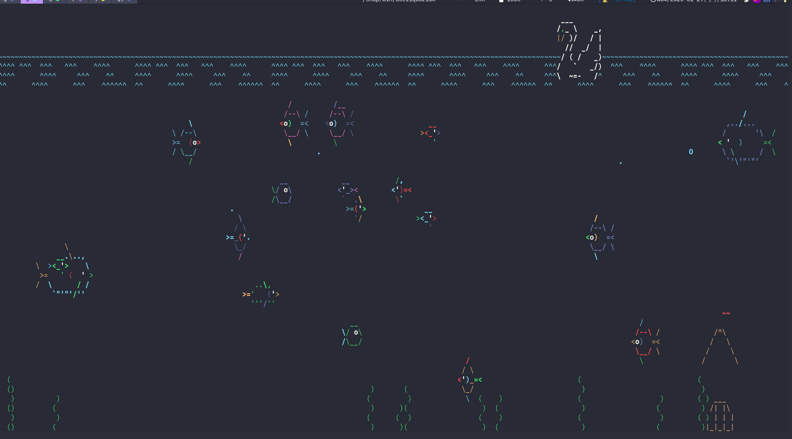

<!-- gid:20250129T180814 -->
[TOC]

[[TIP("이 노트에 대하여")]] 아스키 문자만으로 수족관 풍경을 보여 주는 asciiquarium과 유사한 터미널 예술 도구를 찾는 질답 메모다. 실용과 장난기, 텍스트 문화가 만나는 귀여운 노트다. [[/TIP]] asciinema [터미널](https://notes.junghanacs.com/meta/20230925T080700/)

## #Related-Notes

-   

## BIBLIOGRAPHY

## [2025-01-29 W04](https://notes.junghanacs.com/journal/20250127T000000/)

@user 아쿠라리움이라는 리눅스 터미널 소프트웨어 찾아줘

@assistant Aquarium은 리눅스 터미널 소프트웨어가 아닙니다. `cmatrix` 나 `asciinema` 를 찾으시는 건가요?

@user asciiquarium인가? 찾아줘

@assistant `asciiquarium` 은 Emacs에서 직접 설치하거나 사용할 수 없습니다. 터미널에서 사용하는 프로그램입니다. 시스템 패키지 관리자 (apt, yum, pacman 등)를 사용하거나, 소스 코드를 직접 컴파일해야 합니다. 어떤 리눅스 배포판을 사용하시나요?

@user 우분투

@assistant 우분투에서 `sudo apt update && sudo apt install asciiquarium` 명령어를 사용해 설치해보세요.

@user 유사한 ascii art 패키지 알려줄래

@assistant `cmatrix`, `aircat` 등이 있습니다.

@user 우분투 설치 방법은?

@assistant `sudo apt update && sudo apt install cmatrix aircat`

@user

## 스크린샷

[2025-01-29 Wed 18:10]

