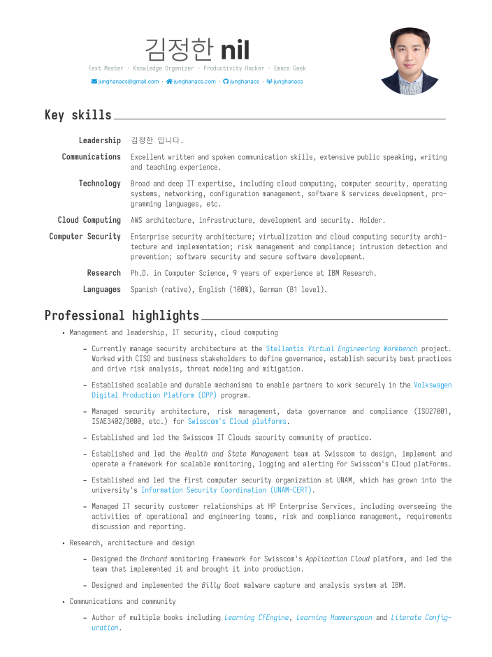

<!-- gid:20250206T150102 -->
[TOC]

## History

-   [2025-05-13 Tue 13:42] 정리하자면 vita가 최고다. 그걸 써라 - [2025-02-06 Thu 15:01] cv 관리 [CV 김정한 (Junghan Kim)](https://notes.junghanacs.com/notes/20230814T142800/)

## 1: junghan0611/vita org-cv

(“Junghan0611/Vita Org-Cv” n.d.)

[2025-04-03 Thu 09:02] 이게 최고지 대략 이런 느낌 알잖아. 샘플. 잊고 있었네.



## 2: Titan-C/org-cv - Org exporter for CV

(“Titan-c/Org-Cv - Org Exporter for Cv” 2024)

-   Nájera, Óscar
-   Org exporter for CV. Mirror of <https://gitlab.com/Titan-C/org-cv>

## 3: ox-moderncv

[2023-08-14 Mon 14:12] <http://ohyecloudy.com/emacsian/2022/10/29/org-mode-cv/> 종빈님 버전을 바로 사용.

```elisp
(use-package! ox-moderncv
  :init (require 'ox-moderncv))
```

M-x org-export-dispatch 함수를 호출하면 moderncv 메뉴가 보인다.

### ohyecloudy/org-cv

(“Ohyecloudy/Org-Cv” 2022)

-   Oh, Jongbin
-   Org exporter for CV. Mirror of <https://gitlab.com/Titan-C/org-cv>
