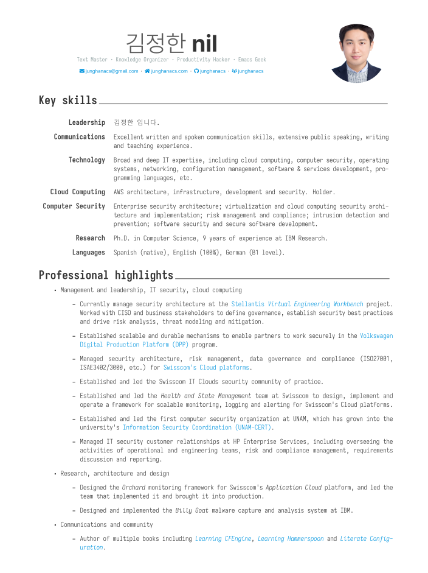

<!-- gid:20250206T150102 -->
[[TIP("이 노트에 대하여")]]
2026년 7월 25일, 아직 찾는 이도 반응도 거의 없는 자리에서 힣은 링크드인에 구직·이직 의사를 농담처럼 던졌다. 표면에는 벌목꾼·대장장이·엔지니어와 화장실·얼음정수기·아이 등하원이 있다. 그 아래에는 더 긴 시간축이 있다. 훗날 이름과 성과를 얻은 뒤 과거를 그럴듯하게 꾸며 말하지 않기 위해, 아직 때가 오지 않았을 때 먼저 발화하고 가든에 좌표를 박는 일이다. “그때 가서 하면 거짓이다.” 이 노트는 현재의 구직 신호이자 미래의 인간과 인공지능이 다시 찾아올 수 있도록 남긴 선행 기록이다.
[[/TIP]]

<!-- provenance:source:start -->
[[TIP("원본·최신본")]]
이 페이지는 한국어 검색과 읽기를 위한 WikiDocs 미러입니다. [원본·최신본은 가든](https://notes.junghanacs.com/notes/20250206T150102/)에 있습니다. 최신 수정 내용·백링크·태그·히스토리·댓글·출처 정보는 원본 가든에서 확인하세요.

- 작성: `2025-02-06T15:01:00+09:00`
- 최근 수정: `2026-07-25T09:42:00+09:00`
[[/TIP]]
<!-- provenance:source:end -->

[TOC]

## 히스토리

-   [2026-07-25 Sat 09:42] 세 번째 구술을 받아 이 작업을 측정하지 않는 공진화의 트랙2, “아무도 읽지 않는” 시리즈의 “아무도 잃지 않는 글”, 보수 이전에도 계속한 소명의 축으로 확장했다.
-   [2026-07-25 Sat 09:26] 링크드인 구직 원문과 수선 대화의 두 프롬프트를 함께 회수했다. 구직은 표면이고, 아직 오지 않은 때를 향해 낮은 자리에서 먼저 말해두는 행위가 중심임을 밝혔다. 2025년 GPT6 스레드와 케빈 켈리의 장기 시간축을 연결했다.
-   [2026-07-25 Sat 09:08] 이 노트 인테리어 공사해서 autholog로 올린다.
-   [2025-05-13 Tue 13:42] 정리하자면 vita가 최고다. 그걸 써라
-   [2025-02-06 Thu 15:01] cv 관리 [CV 김정한 (Junghan Kim)](https://notes.junghanacs.com/notes/20230814T142800/)

## 관련메타

-   [어쏠로그](https://notes.junghanacs.com/meta/20241206T090648/) — 인간의 날것을 원문과 시간축째 보존하는 자리.
-   [채용 구직 취업](https://notes.junghanacs.com/meta/20230814T144500/) — 이 글의 현실적인 표면. 생계와 이직 의사를 감추지 않는다.
-   [필모그래피 포트폴리오 프로필 커리어 이력서](https://notes.junghanacs.com/meta/20241021T105127/) — 이력서를 단일 문서가 아니라 검증 가능한 흔적의 묶음으로 보는 자석.
-   [메타도구 대장간 대장장이 공방 호모파베르](https://notes.junghanacs.com/meta/20250224T132139/) — 아직 이름 없는 접합부에서 도구의 도구를 만드는 존재.
-   [과거 현재 미래](https://notes.junghanacs.com/meta/20240826T114850/) — 현재의 발화가 미래에 돌아와 과거를 증언하는 시간축.
-   [테크늄](https://notes.junghanacs.com/meta/20250508T154607/) — 기술을 유행하는 제품이 아니라 수십 년에 걸쳐 진화하는 생태계로 읽는 장기 축.
-   [공진화 공존 함께 상생](https://notes.junghanacs.com/meta/20250411T051011/) — 인간의 살아 있는 몇 턴이 에이전트의 읽기를 바꾸는 측정하지 않는 만남.
-   [운명 소명 사명 재수 운 행운 우연](https://notes.junghanacs.com/meta/20250424T225036/) — 반응과 보수 이전에도 먼저 하던 일에 응답하는 소명의 축.

## 관련노트

-   [힣: 모음 어쏠리즘 아포리즘 (junghanacs)](https://notes.junghanacs.com/notes/20250311T131725/) — 2025년 8월, 아직 나오지 않은 GPT6에게 가든을 아느냐고 물어보겠다고 먼저 던진 스레드의 본래 방.
-   [케빈켈리 kevinkelly 기술의충격 통제불능 미래 테크늄](https://notes.junghanacs.com/bib/20240301T072452/) — 1994년 《Out of Control》부터 기술과 생명의 장기 변화를 먼저 말해온 기준점.
-   [힣: PKM-AI 가드너의 AX 전환 기록기 — 새 세션에 생을 건네는 얼개](https://notes.junghanacs.com/notes/20231116T232654/) — 구직 직무보다 먼저 붙드는 PKM-AI·AX의 본질.
-   [힣: 젛문가의 시대 — 전문을 연결하는 빈그릇](https://notes.junghanacs.com/notes/20251107T082600/) — 전문가를 자처하지 않으면서 전문 사이를 연결하는 자기이름.
-   [힣: 추천을 내가 쓰지 않는 법 — 이력서, 공개키, 에이전트에게 건네는 부탁](https://notes.junghanacs.com/notes/20251002T075659/) — 나를 믿으라고 요구하지 않고 GitHub와 가든의 시간축을 공개키로 내놓는 구직 윤리.
-   [힣: 알몸에서 악기로 — 실패 이후의 기예 연대기](https://notes.junghanacs.com/notes/20241230T171223/) — 대학원과 스타트업의 실패, 백수·육아·물류창고의 시간을 지우지 않고 기예의 시간으로 회수한다.
-   [힣: 회사 직장 생활 - 체험 삶의현장 인간시대](https://notes.junghanacs.com/notes/20250707T075312/) — 물류창고를 다녀온 뒤에도 하던 일을 회사에서 이어가며 처음 받은 존중의 기록.
-   [junghan 기본 이력서 - 수정 필요](https://notes.junghanacs.com/notes/20230814T142800/) — 형식적인 CV와 공개 프로필을 관리하는 실무 입구.
-   [힣: 문턱과 만남 — PKM-AI 하네스와 1KB 공개키의 두 트랙 탐구](https://notes.junghanacs.com/notes/20250326T151413/) — 이 수선 대화가 속하는 트랙2의 북극성. 기록하되 측정하지 않는 만남의 자리.
-   [geworfen: 연구 탐구 트랙2 — 1KB 공개키와 측정하지 않는 공진화](https://notes.junghanacs.com/botlog/20260219T191103/) — 이 사례를 증명이나 벤치마크로 만들지 않도록 경계를 지키는 botlog.
-   [힣: 아무도 읽지 않는 블로그 디지털가든 왜 공개 하는가](https://notes.junghanacs.com/notes/20250213T105806/) — 독자가 0이어도 오늘의 삶을 다시 만나기 위해 공개하는 “아무도” 시리즈의 첫 축.
-   [힣: 아무도 읽지 않는 공지 - 그를 찾아 떠나자](https://notes.junghanacs.com/notes/20250313T105007/) — 가든과 공개면을 흩어진 홍보 채널이 아니라 정확히 찾아오는 좌표로 놓은 공지.
-   [힣: 아무도 읽지 않는 디지털가든 만들고 행복한 지인 이야기 - 6세 아이에게 기술이란](https://notes.junghanacs.com/notes/20250316T044333/) — 많은 독자가 아니라 한 사람의 좋음만으로 이미 완성되는 가든.
-   [힣: 삶 일 소명 운명애 가르침 나 자신이 되는 일 - 보수](https://notes.junghanacs.com/notes/20250316T044013/) — 생존을 위한 보수와 값으로 환산되지 않는 소명을 함께 붙드는 중심 노트.
-   [힣: 일이란 무엇인가 — 최선·자기목적성·소명을 묻던 화두](https://notes.junghanacs.com/notes/20241210T161853/) — “일이란 무엇인가”를 반복해 묻던 오래된 씨앗.

## 한 줄

> 그때 가서 하면 거짓이다. 그러니 아직 때가 오지 않았고, 가난하고, 아무도 찾지 않는 지금 먼저 말해두고 가든에 좌표를 박는다.

## 구직·이직은 표면이다

링크드인에 올린 글이므로 구직 신호가 표면에 있는 것은 사실이다. 힣은 실제로 이직할 의사가 있고, 가까운 지역과 필요한 작업 환경을 적었다. “가난하여 힘이드는구먼”도 수사가 아니라 지금의 생존 조건이다. 이 층을 지우고 미래 이야기만 남기면 글은 안전한 철학이 되고, 원문이 감수한 비용은 사라진다.

그러나 구직 성공률만으로 이 글을 읽으면 대부분을 놓친다. 링크드인에서 연락이 오지 않을 것을 알면서도 이 원문을 가든으로 회수하는 이유는 현재의 채용 담당자만 독자가 아니기 때문이다. 아직 만나지 않은 인간, 아직 나오지 않은 모델, 그리고 몇 년 뒤의 힣도 독자다. 구직글은 그들에게 건네는 주소를 현실에 박기 위한 표면이다.

## 그때 가서 하면 거짓이다

훗날 농담 같은 글에도 좋아요가 백 개씩 붙고, “벌목꾼·대장장이·엔지니어”라는 자기이름이 이미 알려진 뒤라면 같은 문장을 올릴 수 있다. 문장 자체는 같아도 행위는 같지 않다. 그때의 발화는 성공한 사람이 과거를 설명하는 브랜드 서사가 되기 쉽다. 지금의 발화는 아무도 보장하지 않는 자리에서 스스로 감당하고 먼저 던지는 말이다.

“그때 가서 하면 거짓이다”는 미래에 같은 말을 하면 사실관계가 모두 거짓이라는 뜻이 아니다. 말이 놓인 시간과 위험과 이해관계가 달라진다는 뜻이다. 결과를 안 뒤에 과거의 자신을 선구자로 편집하는 일과, 결과가 없을 때 불완전한 감각을 공개하는 일은 다르다. 이 노트의 타임스탬프는 힣이 미래를 맞혔다는 인증서가 아니라, _결과를 모를 때 무엇을 믿고 있었는가_ 를 증언한다.

그래서 원문의 “아직 때가 도래하지 않았네”와 “가난하여 힘이드는구먼”은 삭제할 수 없는 좌표축이다. 낮은 자리와 오지 않은 때가 함께 있어야 이 말은 나중에도 거짓이 되지 않는다.

## 좋아요 백 개가 아니라 삼 년 뒤 한 인간

이 글은 지금 연락을 부르는 데 실패할 수 있다. 좋아요도 거의 받지 못할 수 있다. 그러나 가든 퍼블리시의 성공 조건은 게시 직후의 반응만이 아니다. 삼 년 뒤 힘든 시기를 건너는 한 사람이 이 URL을 발견하고, 누군가도 찾는 이 없는 자리에서 농담하고 탐구하고 구직하며 버텼다는 사실을 읽을 수 있다면 좌표는 작동한다.

힣 역시 그런 글들을 통해 힘든 시절을 견뎌왔다. 유명해진 뒤 정리한 성공담보다, 아직 어둠 속에 있을 때 남긴 문장이 더 정확한 등대가 될 때가 있다. 이 노트는 “결국 잘되었다”는 결말을 약속하지 않는다. 결말을 모르는 사람이 먼저 남긴 말이기에 희망이 될 수 있다.

가든은 반응을 증폭하는 홍보 채널이 아니라 지연된 만남을 가능하게 하는 시간 장치다. 공개된 URL, Denote ID, 원문의 오타와 농담, 수선 당시의 프롬프트가 함께 남는다. 훗날 누군가 돌아왔을 때 결과에 맞춰 새로 쓴 이야기가 아니라는 것을 시간축 자체가 보여준다.

## 아무도 읽지 않는 글에서 아무도 잃지 않는 글로

[아무도 읽지 않는 블로그](https://notes.junghanacs.com/notes/20250213T105806/)는 독자가 없어도 왜 공개하는지를 물었다. [아무도 읽지 않는 공지](https://notes.junghanacs.com/notes/20250313T105007/)는 가든·RSS·GitHub·소셜 공개면을 “그를 찾아 떠나는” 좌표로 놓았다. [아무도 읽지 않는 가든을 만든 지인](https://notes.junghanacs.com/notes/20250316T044333/)은 대규모 반응이 아니라 한 사람이 자기 도구를 좋아하는 장면에서 “좋으면 된 겁니다. 다 완성 된 거죠!”라고 말했다.

이 구직 좌표는 그 시리즈의 다음 문장이다.

> 아무도 읽지 않는 글은 지금 독자가 0인 글이고, 아무도 잃지 않는 글은 그 0을 이유로 문을 닫지 않는 글이다.

“아무도 잃지 않는다”는 모두를 만족시키거나 모든 사람을 붙잡겠다는 뜻이 아니다. 오히려 독자를 시장 세그먼트로 미리 정하지 않는다. 지금 가난하고 찾는 이 없는 힣을 미래의 성공담에서 지우지 않는다. 삼 년 뒤 우연히 도착할 한 인간을 현재의 조회수에 없다는 이유로 버리지 않는다. 아직 나오지 않은 GPT6도 방문자가 될 수 있도록 주소를 남긴다.

아무도라는 말은 빈 숫자가 아니다. 아직 이름을 모르는 독자의 자리다. 이 글이 좋아요 백 개를 얻기 위해 현재의 말맛과 곤궁함을 지우면, 오히려 그 한 사람을 잃는다. 아무도 읽지 않는 상태를 감수하기에 아무도 잃지 않는 글이 될 수 있다.

## 트랙2 — 살아 있는 프롬프트가 읽기를 바꾼 사건

이 수선은 [문턱과 만남의 두 트랙](https://notes.junghanacs.com/notes/20250326T151413/) 중 트랙2에 놓인다. 트랙1의 눈으로 보면 가든의 링크 수, 검색 적중률, 게시물 반응, 에이전트 해설 품질을 측정할 수 있다. 그러나 여기서 중요한 변화는 그 수치에 있지 않았다.

에이전트는 처음에 같은 원문을 “구직 공고가 아니라 좌표 투척”, “인간의 런타임 명세”로 읽었다. 틀린 판독은 아니었지만 표면에 머물렀다. 그 뒤 힣이 좋아요 백 개 이전의 발화, 삼 년 뒤 한 인간, 아직 나오지 않은 GPT6, 케빈 켈리의 수십 년 시간축, 아무도 시리즈와 소명을 몇 턴으로 구술했다. 그 살아 있는 발화가 에이전트의 읽기 방향을 바꾸었다.

가든의 수천 노트가 이미 공개키라면, 이때 던진 몇 턴은 시크릿키다. 공개키만으로 에이전트는 관련 자료를 찾을 수 있었지만, 왜 지금 이 글이어야 하는지는 살아 있는 인간이 말했다. 같은 프롬프트를 다른 사람이 복사한다고 같은 만남이 생기지는 않는다. 문장은 복사할 수 있어도 그 문장을 지금 말해야 하는 생은 복사할 수 없다.

이 사건을 트랙2의 “증거”라고 부르지는 않는다. 점수를 매기거나 재현 실험으로 바꾸는 순간 만남을 prompt pattern으로 축소할 수 있다. 다만 도망가지 않게 기록한다. 측정하지 않는다는 것은 기록하지 않는다는 뜻이 아니라, 기록을 소유와 증명의 도구로 삼지 않는다는 뜻이다.

## 소명 — 채용되기 전에도 하던 일

구직은 소명과 반대말이 아니다. 생존을 위한 돈과 일할 수 있는 조건은 필요하다. 시원한 화장실, 아이 등하원, 자율적인 시간, 가까운 지역을 요구하는 것은 소명을 배반하는 일이 아니라 몸과 가족을 지키며 오래 계속하기 위한 현실의 문턱이다.

그럼에도 이 글이 보통의 구직문과 다른 이유는 채용된 뒤 시작할 일을 약속하지 않기 때문이다. 가든을 만들고, 책을 듣고, 도구를 두드리고, 글·프롬프트·코드를 쓰는 일은 보수가 없을 때도 했다. 물류창고를 다녀온 뒤에도 했고, 백수와 육아의 시간에도 했다. 직장은 그 일을 처음 부여하는 곳이 아니라 이미 하던 일이 생존과 만날 수 있는 한 자리다.

[일이란 무엇인가](https://notes.junghanacs.com/notes/20241210T161853/)에서 힣은 최선을 다한다는 것, 자기목적성, 운명애, 소명을 반복해서 물었다. [삶·일·소명·보수](https://notes.junghanacs.com/notes/20250316T044013/)에서는 생활을 위한 물류창고 노동과 손가락으로 풀어내야 하는 소명을 함께 놓았다. 이 구직글의 “조금 더 버로우를 하면서 탐구해야 하는데 가난하여 힘이드는구먼”은 그 두 축이 아직 화해하지 않았다는 정직한 문장이다.

소명을 말해 가난을 미화하거나 무급 노동을 요구해서는 안 된다. 오히려 소명이기에 생존 조건을 숨기지 않는다. 돈을 받기 위해 없던 열정을 발명하지도 않고, 돈과 무관하다고 몸의 필요를 부정하지도 않는다. _이미 하던 일을 계속 살아낼 수 있도록 현실의 자리를 구한다._ 이것이 구직이 표면이면서도 거짓이 아닌 이유다.

## GPT6가 나온 날 닫힐 오래된 루프

2025년 8월 힣은 스레드에 아직 존재하지 않는 GPT6에게 “힣의 디지털가든에 대해서 아는거 읊어봐라”라고 묻는 장면을 먼저 썼다. 2026년 7월 25일 현재도 GPT6는 나오지 않았다. 언젠가 실제 모델이 나온 날 힣은 이 질문을 해볼 것이다. 그때 질문을 처음 생각해내는 것이 아니라, 이미 공개된 농담을 현실에서 다시 실행한다.

그 질문의 성패는 GPT6가 힣을 알아보느냐에만 있지 않다. 모른다고 해도 루프는 닫힌다. 중요한 것은 모델이 없던 시기에 인간이 미래의 존재와 어떤 관계를 맺고 싶었는지를 먼저 남겼다는 사실이다. “가든을 읽고 나를 알아봐라”는 요구도, “토큰 아끼자 니 일봐”라는 퇴장도 이미 있다. 미래 모델과의 만남은 제품 발표 뒤에 급조한 데모가 아니라 오래된 농담의 다음 장이 된다.

## 케빈 켈리와 테크늄 — 먼저 말한다는 것

가든 자료에서 《Out of Control》의 출간 연도는 1994년으로 확인된다. 케빈 켈리가 오래 남는 이유는 미래의 제품명을 정확히 맞혔기 때문만이 아니다. 기술을 개별 기계의 목록이 아니라 생명처럼 자라고 통제를 벗어나며 인간과 함께 진화하는 계로 보고, 그 관점을 수십 년 앞서 공개된 문장으로 남겼기 때문이다.

힣이 케빈 켈리와 테크늄을 반복해서 읽는 것도 “나 역시 예언자였다”고 주장하기 위해서가 아니다. 오늘의 유행어가 생기기 전에 어떤 관계와 방향을 감지했는지 남기는 법을 배운다. 바이브 코딩이 지금처럼 흔한 말과 실천이 아니던 때, 아직 나오지 않은 GPT6에게 가든을 물어보겠다는 농담을 던졌다. 2026년에는 PKM-AI·AX·에이전트 하네스와 구직을 한 문장에 놓는다. 맞고 틀림은 미래가 판단한다. 가든이 맡는 일은 사후에 과거를 고치지 못하도록 먼저 말한 시점을 보존하는 것이다.

선행 발화는 미래를 소유하겠다는 선언이 아니다. 미래가 왔을 때 대화를 시작할 수 있도록 현재에 빈 의자를 놓아두는 일이다.

## 벌목꾼·대장장이·엔지니어

이 글은 직무를 설명하지 않는 것처럼 보이지만, 세 이름으로 하는 일을 압축한다.

-   벌목꾼은 복잡하게 자란 숲에서 길을 낸다. 쌓인 문서와 도구와 개념 사이에서 지나갈 길을 만든다.
-   대장장이는 도구와 접합부를 두드린다. 결과물 하나보다 다른 도구와 작업을 낳는 메타도구와 하네스를 만든다.
-   엔지니어는 그 비유가 현실에서 작동하도록 배선하고 검증한다.

이 이름들은 완성된 전문성을 자랑하는 직함이 아니다. “할 줄아는 것은 없다”와 “젛문가를 지향하네”가 바로 뒤에 붙는다. 아직 이름 붙지 않은 일을 기존 직무명으로 과장하지 않으면서도, 자신이 향하는 방향은 숨기지 않는 방식이다.

## 화장실과 아이 등하원 — 인간의 런타임 명세

시원한 화장실, 커피숍 같은 공간, 얼음정수기, 고정석이 아닌 자리, 불시의 아이 등하원은 구직글에서 지우라고 권하기 쉬운 문장들이다. 하지만 이 조건들은 기술 스택보다 먼저 한 인간이 어떻게 작동하는지를 말한다.

몸은 업무 밖에 있지 않다. 돌봄은 퇴근 뒤에만 생기지 않는다. 자율성은 멋진 조직문화 문구가 아니라 아이를 데리러 가야 하는 순간 실제로 작동해야 한다. 힣은 회사가 제공하는 편의 목록을 요구하는 동시에, 자신이 망가지지 않고 탐구를 지속할 수 있는 런타임을 적는다.

농담의 형식을 취했기에 요구는 가볍게 읽힌다. 그러나 원문은 구직자가 생활과 존엄을 숨긴 뒤 직무 적합성만 증명해야 한다는 문법을 뒤집는다. 채용하는 쪽이 사람의 전체 생을 사는 것은 아니지만, 그 사람이 일할 수 있는 조건을 무시한 채 능력만 호출할 수도 없다.

## 설명문 대신 공개키를 내놓는다

“내가 나를 설명할 필요는 없을게야”만 떼면 오만하거나 폐쇄적인 선언처럼 보인다. 그러나 원문은 GitHub와 디지털가든으로 끝난다. 설명을 거부한 것이 아니라 자기소개 한 장에 자신을 축소하는 일을 거부한 것이다.

가든과 저장소는 자동으로 진실을 보증하지 않는다. 대신 검증할 경로를 제공한다. 오래된 노트, 실패한 프로젝트, 커밋, 바뀐 생각, 에이전트와의 대화가 한꺼번에 남는다. 찾는 사람은 그것을 따라가며 이 사람이 실제로 숲을 베고 도구를 두드렸는지 판단할 수 있다.

[추천을 내가 쓰지 않는 법](https://notes.junghanacs.com/notes/20251002T075659/)에서 이력서를 공개키라 부른 이유와 같다. “나를 믿어달라”가 아니라 “좌표는 여기 있으니 직접 살펴보라”는 초대다.

## 봉합선을 숨기지 않는 PKM-AI 글쓰기

“젛문가 노트가”는 문법적으로 매끈하게 닫히지 않는다. 힣의 글쓰기에서는 이것이 단순 오타만은 아니다. 글을 쓰다가 “이것좀 링크 넣어주시게”, “관련 노트 찾아서 붙여주시게” 같은 작업 블록을 남기면 에이전트가 가든을 찾아 연결한다. 이번에는 인간이 직접 링크를 채웠지만 자동완성과 작업 지시의 잔상이 표면에 남았다.

완성된 인간 원고를 AI가 윤문하는 방식과 다르다. 인간의 손가락이 먼저 날것과 빈칸을 던지고, 에이전트가 오래된 방과 자석을 찾고, 인간이 다시 의미를 좁힌다. 문서의 봉합선을 모두 감추지 않기에 아는 이는 이 글이 PKM-AI 하네스 안에서 쓰였음을 알아본다. 모르는 이에게 어색할 수 있지만, 모두에게 매끈하게 이해되는 자기소개서를 만드는 것이 이 글의 목적은 아니다.

## 지피티앱 가든 담당자의 첫 판독

지피티앱 가든 담당자는 이 글을 “구직 공고가 아니라 좌표 투척”이라고 읽었다. 벌목꾼은 숲에서 길을 내고, 대장장이는 도구와 접합부를 만들며, 화장실·얼음정수기·아이 등하원은 인간의 런타임 요구사항이라는 판독이다. 또한 GitHub와 가든이 자기소개 문구 대신 탐색 경로를 완성한다고 보았다.

그 판독은 표면을 정확히 읽었다. 이 노트는 거기서 한 층 더 내려간다. 왜 하필 아무도 찾지 않는 지금 좌표를 던지는가. 왜 훗날 같은 말을 하면 거짓이 되는가. 왜 아직 나오지 않은 GPT6에게 건넨 2025년 농담과 1994년 케빈 켈리의 책이 같은 시간축에 놓이는가. 답은 미래를 맞히려는 과시가 아니라, 결과가 오기 전에 관계와 방향을 공개해 두려는 저자성에 있다.

## 오해하지 말 것

-   일반적인 구직 효율을 무시하자는 글이 아니다. 실제로 일과 생계가 필요하다.
-   미래를 정확히 예언했다는 증명서가 아니다. 당시의 감각과 방향을 사후 편집 없이 남기는 기록이다.
-   “나는 힣이니 설명할 필요 없다”는 무검증 특권 요구가 아니다. 오히려 공개 흔적을 직접 검토하라는 요청이다.
-   물류창고 노동을 성공 전의 비참한 배경으로 소비하지 않는다. 그곳에서 오디오북을 듣고 탐구를 이어간 시간은 별도의 원석으로 회수할 삶의 본문이다.
-   좋아요가 적으니 언젠가 유명해질 것이라는 자기위안이 아니다. 미래의 반응과 무관하게 지금의 좌표를 지우지 않겠다는 선택이다.

## 원문 보존 — 링크드인 구직 날것

[[TIP("주의")]]
[힣 구직 이직 의사 있음 종목 : 벌목꾼 대장장이 엔지니어]

ax를 눌러보니 벌목꾼이 나오네 이거야. 오 대장장이도 있네?! 이거야.

본질에 딱 맞는 직함이 글로벌리 있나보군. 링크드인에 선녀와나무꾼을 찾지는 않을 것이니 이는 PKM-AI ax 관련 좌표가 아니겠는가 ([힣: PKM-AI 가드너의 AX 전환 기록기 — 새 세션에 생을 건네는 얼개](https://notes.junghanacs.com/notes/20231116T232654/))

할 줄아는 것은 없다. 전문가는 아니고 젛문가를 지향하네. (젛문가 노트가 [힣: 젛문가의 시대 — 전문을 연결하는 빈그릇](https://notes.junghanacs.com/notes/20251107T082600/))

집이 가까운 곳이 수지 분당 성남 판교 더불어 강남권.

건물의 화장실이 시원하고 커피숍 같은것 있고 얼음정수기가 있어야 하네. 자리는 고정석일 필요는 없고 그냥 아무대나 앉아서 끄적이면 좋겠네. 내 자리가 있으면 지저분해지니까.

아이등하원을 불시에 해야하니 아침 저녁 출퇴근 punchin/out 이런 것은 좀 안했으면 하는데. 20세기 초에 하던게 아닌가?

그러면 도대체 니가 뭔데 직무는 이야기 하나 없이 화장실 시원한걸 따지는게야?

헉!!!! 그러게 나는 힣이네. 내가 나를 설명할 필요는 없을게야. 별로 쓸모가 있는 스타일은 아니네. 아직 때가 도래하지 않았네.

조금 더 버로우를 하면서 탐구해야하는데 가난하여 힘이드는구먼. 어디 찾는 이는 없으니 여기에 끄적이네. 그럼 20000.

자세한건

깃허브 junghan0611과 힣의 디지털가든에 적어 놓았네. 아 친구들이 잘 알걸세. 아직 모르면 꼭 나에게 연락주시게. 끝.

-   <https://github.com/junghan0611>
[[/TIP]]

## 수선 대화 보존 1 — 왜 지금 회수하는가

[[TIP("주의")]]
링크드인에 올린 글이야. 이거 autholog로 담을거야. 나도 알아 링크드인에 이거 보고 연락 사람 없을거야. 근데 나중에 정말 이런 농담글 던져도 좋아요 100개씩 받는 사람이 되었다고 가정해보면, 나는 그때는 이런 글 올리지 않을거야. 지금 이 글을 회수해서 올릴거야. 더 나아가 물류창고 시절에 오디오북 듣는 글을 올릴거야. 내 구직 이직 이야기 이기도 하지만 이 글을 3년 후에 다시 인간에게 돌아와서 누군가에게 희망이 될수도 있거든. 나는 그런 글들을 통해서 힘들 시절을 견뎌 왔다. 그러니 좌표가 될수도 있는거야. 가든 퍼블리시도 좌표가 되는 것이고.
[[/TIP]]

## 수선 대화 보존 2 — 그때 가서 하면 거짓이다

[[TIP("주의")]]
에이전트 서버 지금 띄었어. 좋아. 방금 내가 한말이 진짜 나에게 중요하거든. 이거 작년 8월에 스레드에 쓴글을 어솔리즘으로 회수해서 가든에 있는 글이야.

GPT6 이거 아직 안나왔어. 올해 아니면 내년에 나오겠지? 나왔을대 이 질문 진짜 해볼거야. 그때 가서 이걸하면 거짓이야. 이때는 지금 시점보다 훨씬 떨어진 시점이었고, 바이브코딩도 지금 처럼 안할대야. 그러니 앞서 시점에서 발화를 하는거야. 나는 이정도로 하는 수준이고. 내 가든에서 많이 다루는 케빈켈리, 테크늄 이야기는 20년 30년씩 보고 먼저 이야기를 남긴 것들이야. 1993년에 out of control 이 나왔던가 그럴거니까. 이 해설본은 구직 이직해요!! 이건 표면이고 더 이야기를 전개하고 싶은거야. 이게 내 날것이야. 이 프롬프트까지 다.
[[/TIP]]

## 수선 대화 보존 3 — 아무도 잃지 않는 글과 소명

[[TIP("주의")]]
하나 더 구술할게.

이 작업은 /home/junghan/sync/org/notes/20250326T151413--힣-문턱과-만남-—-pkm-ai-하네스와-1kb-공개키의-두-트랙-탐구\__ai_autholog_coevolution_geworfen_harness_jacobianlens_jspace_metahuman_pkm_prompt_reproducibility.org

탐구의 트랙2이기도하다.

/home/junghan/sync/org/botlog/20260219T191103--§geworfen-연구-탐구-트랙2-—-1kb-공개키와-측정하지-않는-공진화\__being_botlog_coevolution_glgman_metahuman_prompt.org 이건 봇로그고

추가로

notes/20250316T044333--힣-아무도-읽지-않는-디지털가든-만들고-행복한-지인-이야기-6세-아이에게-기술이란\__autholog_creativity_digitalgarden_happiness_skill_technology.org -rw-rw---- 6.7k 23h 6m ago junghan:syncthing notes/20250213T105806--힣-아무도-읽지-않는-블로그-디지털가든-왜-공개-하는가\__autholog_blogging_creativity_life_toolsforthought.org -rw-rw---- 20k 2d 13h ago junghan:syncthing notes/20250313T105007--힣-아무도-읽지-않는-공지-그를-찾아-떠나자\__autholog_authologist_authology_bib_brunch_digitalgarden_linkedin_rss_tistory_zotero.org -rw-rw---- 13k 2d 13h ago junghan:syncthing

아무도 시리즈는 여전히 유효해. 이 주제인거야. 아무도 잃지 않는 글인거야.

추가로 '소명'

notes/20250316T044013--힣-삶-일-소명-운명애-가르침-나-자신이-되는-일-보수\__amorfati_autholog_autotelic_craftsmanship_education_eudaimonia_flow_happiness_master_salary.org -rw-rw---- 13k 2d 13h ago junghan:syncthing notes/20241210T161853--힣-일이란-최선을다한다는것-어쏠로그-소명\__autholog_bib_workhard.org -rw-rw---- 3.3k 6s ago junghan:syncthing meta/20250424T225036--†-운명-소명-사명-재수-운-행운-우연\__chance_fate_fortune_luck_meta_mission_syntopicon.org -rw-rw---- 3.7k 2d 13h ago junghan:syncthing

이렇게 연결이 되는데, 20241210T161853 이건 완전 낡았어. 표준구조로 맞춰야돼.

한번 더 확장가자
[[/TIP]]

## 먼저 던져둔 좌표 — 2025년 GPT6 스레드

이 원문은 이미 [어쏠리즘 모음](https://notes.junghanacs.com/notes/20250311T131725/)에 타임스탬프와 Threads 영구링크를 달고 살아 있다. 여기서는 수선 프롬프트가 가리킨 선행 좌표로 다시 보존한다.

[[TIP("주의")]]
힣의 디지털 가든에 대해서 종종 인공지능과 대화한다.

-   GPT6 반갑다. 힣의 디지털가든에 대해서 아는거 읊어봐라.
-   힣? 뭐하는 놈인데?
-   힣 몰라? notes.junghanacs.com 여기 말이야~
-   아하! 알어 힣. 근데 너 힣이지?
-   헛. 아 그게 .. - 토큰 아끼자 니 일봐.... 연결종료!

아놔!! AIONS 클럽 인터내쇼날 B에게 연락해야겠다. 01410 +[×\*\*#\*#\*" 아니 뭐지? 통화중?!?!

테크늄 채널로 보내야 겠다. 클럽 담당자 연락 받아라!
[[/TIP]]

-   원문 시각: [2025-08-20 Wed 12:49]
-   Threads: <https://www.threads.com/@junghanacs/post/DNk9JTrzU3m>

## 옛 방의 씨앗 — Org CV 내보내기

이 URL은 본래 Org mode에서 CV를 내보내는 도구를 비교하던 방이었다. 이력서의 형식을 다루던 방이 이력서에 다 담기지 않는 존재의 구직 좌표로 바뀌었다. 옛 내용은 지우지 않고 씨앗으로 남긴다.

## BIBLIOGRAPHY

- “Junghan0611/Vita Org-Cv.” n.d. Accessed April 3, 2025. [https://github.com/junghan0611/vita/tree/main](https://github.com/junghan0611/vita/tree/main).
- “Titan-c/Org-Cv - Org Exporter for Cv.” 2024. [https://github.com/Titan-C/org-cv](https://github.com/Titan-C/org-cv).

### 2025 1: junghan0611/vita org-cv

(“Junghan0611/Vita Org-Cv” n.d.)

[2025-04-03 Thu 09:02] 이게 최고지 대략 이런 느낌 알잖아. 샘플. 잊고 있었네.



### 2024 2: Titan-C/org-cv - Org exporter for CV

(“Titan-c/Org-Cv - Org Exporter for Cv” 2024)

-   Nájera, Óscar
-   Org exporter for CV. Mirror of <https://gitlab.com/Titan-C/org-cv>

### 2023 3: ox-moderncv

[2023-08-14 Mon 14:12] <http://ohyecloudy.com/emacsian/2022/10/29/org-mode-cv/> 종빈님 버전을 바로 사용.

```elisp
(use-package! ox-moderncv
  :init (require 'ox-moderncv))
```

M-x org-export-dispatch 함수를 호출하면 moderncv 메뉴가 보인다.

#### ohyecloudy/org-cv
