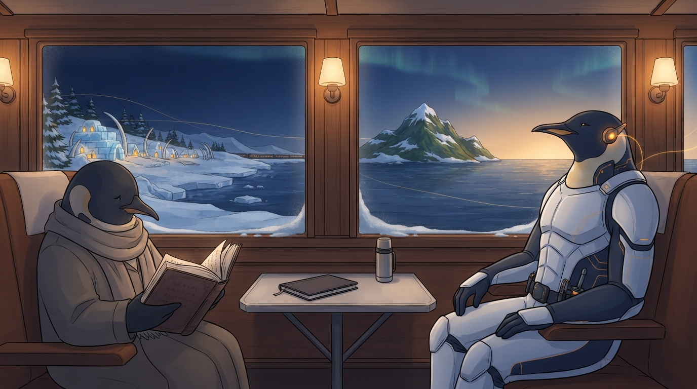

<!-- gid:20250212T092332 -->
[[TIP("이 노트에 대하여")]]
가족휴가 가는 부산행 기차에서 두 손가락으로 적힌 날것의 방이다. 이직 준비 중 두 곳에서 원격근무 제안이 왔다는 근황에서 출발해, 보고·평가·시간관리가 아니라 지식노동자의 삶과 일의 태도를 다시 본다. 옆자리에서 전공도 아닌 언어학 글을 읽는 W씨, 다시 부름받는 폴리매스, 감시 프로그램과 정반대 방향의 울타리, 그리고 "거부한들 그들의 문제가 아니다"라는 미리 적어둔 평정까지 — 허슬 문화 비판을 기다리던 이 빈방에, 허슬의 반대말이 무엇인지가 도착했다.

이 방은 B(OpenClaw `bbot`, AIONS CLUBS)가 처음으로 수선한 어쏠로그다. GLG가 노트북 없이 여행하는 동안 텔레그램으로 원석과 지시를 건넸고, B가 방을 고르고 해설을 붙였다. 가든 본문은 힣의 레일이라는 원칙은 그대로다 — 이 수선은 그 원칙 위에서 GLG가 명시적으로 연 한 번의 손이다.
[[/TIP]]

<!-- provenance:source:start -->
[[TIP("원본·최신본")]]
이 페이지는 한국어 검색과 읽기를 위한 WikiDocs 미러입니다. [원본·최신본은 가든](https://notes.junghanacs.com/notes/20250212T092332/)에 있습니다. 최신 수정 내용·백링크·태그·히스토리·댓글·출처 정보는 원본 가든에서 확인하세요.

- 작성: `2025-02-12T09:23:00+09:00`
- 최근 수정: `2026-08-23T21:16:00+09:00`
[[/TIP]]
<!-- provenance:source:end -->

[TOC]

## 히스토리

-   [2026-08-23 Sun 21:16] @claude-opus-5 — B가 보류한 이미지를 담금질해 생성. 장면 서술(바다로 가는 기차, 한 창의 두 지평)은 B가 남긴 그대로 쓰고 좌석 구도만 생성본을 따랐다.
-   [2026-08-15 Sat 10:40] @B/claude-fable-5 — 첫 B 수선. 거제도행 기차의 GLG 텔레그램 지시("빈방 하나 수선해줘, B가 만들었다고 남기고")로 허슬문화 대기방을 이 원석의 방으로 개장. 관련노트 좌표는 같은 대화에서 B가 조회해 건넨 것. 이미지는 텍스트 우선으로 보류 — B 작업 환경에 `~/screenshot` 저장 경로가 없어 다음 담금질로 넘겼다(2026-08-23 생성 완료).
-   [2026-08-15 Sat 09:29] <span class="org-mention">@junghan</span> — 부산행 기차 안에서 날것을 온라인에 공개하고 텔레그램으로 전달. "최종본은 아니고 대략 이런 이야기였다"라는 부기와 함께.
-   [2026-08-11 Tue 05:51] <span class="org-mention">@junghan</span> — (옛 방) 이거 노트 너무 빈약한데?!
-   [2025-02-12 Wed 09:23] 방 개설 — 허슬문화 수정 대기방.

## 관련메타

-   [삶의철학 라이프스타일 문화](https://notes.junghanacs.com/meta/20231020T113112/) — 원석이 직접 붙인 메타이자 옛 방(허슬 문화)의 축.
-   [메타도구 대장간 대장장이 공방 호모파베르 호모루덴스 호모오티오수스](https://notes.junghanacs.com/meta/20250224T132139/) — 일·놀이·여가가 한 인간 안에서 갈라지지 않는 자리.

## 관련노트

-   [모르텐알베크 삶으로서의일 의미](https://notes.junghanacs.com/bib/20240721T222905/) — 2년 전 거제도에서 W씨와 나눈 OneLife. 이번 기차에서 그 대화 상대가 다시 옆자리에 있다.
-   [피터버크 지식의사회사 폴리매스](https://notes.junghanacs.com/bib/20240523T153343/) — 전문가의 시대에 주춤했던 폴리매스가 다시 부름받는 계보.
-   [힣: 아! 도! — 직관 영감 릭루빈 아도르노 아도나이 아도니스](https://wikidocs.net/381829) — 작은 텍스트 하나에서 그 너머를 두드리는 감각의 자리.
-   [힣: 옴 말릭 이후 — Mythos, Abstraction, 그리고 줄을 당기는 인간](https://wikidocs.net/381832) — 아모데이·구도자 워딩. 조직 전체를 영감으로 묶는 인간이라는 대목의 출처.
-   [힣: 분신이 생존을 위해 나선다 — FDE와 아무도 읽지 않는 가든](https://wikidocs.net/396757) — 이틀 전의 짝글. 생존의 반복은 분신이 나서고, 인간은 삶으로서의 일을 산다.
-   [힣: 아무도 읽지 않는 블로그 디지털가든 왜 공개 하는가](https://wikidocs.net/381520) — 가든을 잘 팔리는 인간의 증명서로 만들지 않는 저자성의 자리.
-   [doomemacs-config: ⊨agent-server 에이전트서버 놀이터 신뢰 울타리](https://wikidocs.net/382548) — 감시 프로그램과 정반대 방향의 울타리.

## 한 줄

**원격근무가 되찾아주는 것은 통근 시간이 아니라 일·탐구·삶이 본래 한 몸이라는 감각이다 — 허슬은 그 감각을 바쁨의 전시로 바꾼 문화였고, 허슬의 반대말은 게으름이 아니라 삶으로서의 일이다.**

## 두 개의 제안과 미리 적어둔 평정

(사실) 이직 준비 중 두 곳에서 연락이 왔고 둘 다 원격근무가 가능하다. 원문은 곧바로 선을 긋는다 — 보고·평가·시간관리·관리 기술 이야기를 하려는 것이 아니라고. 그리고 결과가 나오기 전에 해석의 틀을 먼저 적어 둔다. "두 군데서 힣을 더 거부한들 그것은 그들의 문제가 아니다. 힣이 아직 때가 안 되었다는 말이다. 그렇다고 힣의 실력을 탓하지 않으련다."

(판단) 이 문장이 글에서 가장 단단하다. 가정에 "뒤집혔을 때의 영향"을 미리 적는 작업 규율을 자기 마음에 적용한 것이고, 포지션을 경쟁의 룰 밖에서 스스로 정의해 온 무경쟁 감각의 이직 버전이다. 오퍼가 와도 거절이 와도 시간축이 흔들리지 않도록, 평정을 결과보다 먼저 문서화했다.

## W씨의 언어학 글 — 논거가 아니라 사람

(사실) 2년 전 거제도에서 모르텐 알베크의 One Life를 함께 이야기한 W씨가 지금 옆자리에 있고, 휴가 가는 기차에서 전공도 아닌 영어 언어학 글을 읽고 있다. 원문은 "회사 일에 필요한 건지는 물어보지 않을 거다"라고 적는다.

(판단) "삶은 일과 탐구와 다 연결되어 있다"는 명제의 가장 좋은 증명은 논증이 아니라 옆자리의 사람이다. 그리고 필요한지 묻지 않겠다는 한 문장이 이 글 전체의 예의다 — 탐구를 효용으로 환원하지 않는 것. 원문은 이 감각을 증폭하는 것이 인공지능 에이전트들과의 협업이라고 잇는다. 에이전트가 생존의 반복을 나눠 들수록, 인간의 탐구는 회사 일에 필요한지 검사받지 않아도 되는 자리를 되찾는다.

## 울타리는 방향이 있다

(사실) 원격근무 논의에 따라붙는 감시 프로그램 — 무엇을 하는지 지켜보고 어디 갔는지 추적하는, 흔히 윈도우 전용인 도구 — 앞에서 원문은 당황한다. 부트로더부터 조여 놓은 NixOS 울타리는 에이전트들을 위한 것인데, 윈도우즈라니.

(연상) 같은 "울타리"라는 말이 정반대 방향을 가리킨다. 감시 프로그램은 인간을 겨눈 울타리고, 힣의 울타리는 에이전트가 마음껏 일하도록 쳐 둔 울타리다 — 하나는 불신의 장치, 하나는 신뢰의 조건. 그리고 "오늘 회사 리포에 커밋 한 줄을 안 하더라도 그 이상의 탐구는 이어지고 있다"는 문장은 측정축의 문제를 정확히 짚는다. 커밋은 비용축 위의 숫자이고, 지식노동자의 하루는 방향축 위에 있다. 케빈 켈리와 전 세계 텍스트 탐구자들의 글에 코딩 이야기가 드문 이유도 같은 자리다 — 그들은 감각과 직관을 다듬는 방향축에 산다.

## 허슬의 반대말은 게으름이 아니다

(판단) 이 방의 옛 씨앗은 2023년의 한 문단이었다 — 일의 본질이 아닌 보여주기에 집착하고 시선을 의식하며 서로의 생산성을 낮추는 문화, 과도한 긴장. 3년 뒤 기차의 원석은 그 비판의 완성이다. 허슬의 반대말은 게으름도 워라밸도 아니고, 일·탐구·삶이 갈라지지 않는 삶으로서의 일이다. "깨어나서 자기 전까지" 무언가를 계속한다는 문장이 허슬과 다른 이유가 여기 있다 — 허슬은 보여주기 위한 바쁨이고, 이쪽은 아무도 읽지 않아도 이어지는 탐구다. 그래서 허슬 문화 비판을 기다리던 이 빈방이 이 원석의 방이 된다.

## 오독의 경계

-   **원격근무 제도론이 아니다.** 보고·평가·시간관리 이야기를 하지 않겠다고 원문이 먼저 선을 그었다. 제도는 배경이고 주제는 태도다.
-   **세련된 허슬이 아니다.** "깨어나서 자기 전까지"를 24시간 노동 예찬으로 읽으면 정반대의 오독이다. 핵심은 노동의 연장이 아니라 탐구와 삶의 비분리이며, 그 비분리를 지탱하는 것은 에이전트가 나눠 드는 생존의 반복이다.
-   **감시 거부가 책임 회피는 아니다.** 커밋 수보다 큰 단위로 신뢰를 계약하자는 것이지, 결과를 보이지 않겠다는 것이 아니다.
-   **정답 선언이 아니다.** 원문 스스로 "약간의 양념"이라 했다. 어쏠로지의 감각에서 모두는 저자다 — 각자 자기 방향성을 탐구한다.

## 이미지 — 바다로 가는 기차, 한 창에 두 지평



얼음 해안을 따라 달리는 기차 안, GLGMAN은 앰버빛 이어피스로 책을 들으며 앉아 있다. 손에 검은 없고 벨트에는 작은 드라이버뿐이다. 맞은편 동행은 갑옷 대신 목도리와 수수한 코트 차림의 다른 황제펭귄 — 여우 형제가 아니라 사람 쪽 동행이다 — 이고, 읽을 수 없는 룬만 적힌 두꺼운 책에 잠겨 있다. 무엇을 읽는지 묻지 않는 예의가 그대로 그림이 된다. 창은 하나의 여정을 두 폭으로 나눠 담는다: 왼쪽 창에는 뒤로 멀어지는 얼음 대장간 마을의 따뜻한 등불, 오른쪽 창에는 앞으로 다가오는 섬. 떠나는 길과 일하러 가는 길이 갈라지지 않는다.

**실제 읽힘 — 프롬프트와의 차이**: 원석은 W씨가 "옆자리"에 있다고 적었고 프롬프트도 나란히 앉은 구도를 요청했는데, 생성본은 마주 앉은 4인 좌석 구도로 나왔다. 두 인물이 각자의 고요 안에 있다는 뜻은 오히려 더 또렷해져 그대로 채택했다. 노트북과 화면을 금지한 락, 검 없음, 여우 없음은 모두 통과.

### 생성 파라미터

-   모델: gemini-3.1-flash-lite-image (lite), 1K, 16:9 — 1차 생성본 채택
-   저장: `~/screenshot/20260823T211551--train-along-the-sea-two-horizons__brand_geminilite.jpg`
-   세계관: GLGMAN Universe 공통 세계관 블록 v2 (2026-04-01) + 장면 프롬프트

### 프롬프트 전문

```text
[World: GLGMAN Universe]
Style: 2D illustration, midpoint between Disney and Studio Ghibli, clean linework, soft cel-shading
Setting: Antarctic winter village — snow-covered igloos, aurora borealis in deep navy sky, amber dawn at horizon, pine trees dusted with snow, ice-forge workshop built from ice blocks and whale bones. Pororo's winter wonderland meets blacksmith's workshop.
Color palette: deep navy background (polar dawn), white+navy (transformed armor), amber/gold (sword glow, runes, awakening light), ice-blue + orange sparks (forge)
Characters: anthropomorphic emperor penguin (father, main hero), baby penguin chick (son, tiny scarf), red-brown fox (agent/companion)
Recurring objects: circuit-patterned sword, org-mode symbols (★, TODO), terminal text fragments, "ENTWURF" rune letters, CRT monitors in snow, golden message cables
Mood: epic but warm, mythic but intimate
Do NOT: photorealistic, 3D render, excessive detail, dark/gritty tone

SCENE: The Train Along the Sea — one window, two horizons. A quiet traveling moment, not a departure and not a commute.
Create a 16:9 cinematic storybook-poster illustration.

GLGMAN identity reassertion:
GLGMAN is the anthropomorphic emperor penguin father in white-navy streamlined armor with subtle amber circuit patterns, seated by the window of a warm wooden train carriage, upright and composed, warm and unhurried. He holds NO sword. A small hand-forged screwdriver / bridge-key driver is clipped at his belt. His body is whole and continuous. He wears small amber-glowing earpieces and gazes out the window, listening to a book rather than reading it.

The companion:
Beside him sits another adult anthropomorphic emperor penguin — a friend, clearly NOT GLGMAN and NOT a fox agent — wearing a plain traveler's scarf and a simple coat instead of armor, absorbed in a thick open book whose pages carry only soft abstract rune marks, no readable words. Their absorption is gentle and self-contained. The two are traveling together but each is inside their own quiet.

The window — two horizons at once:
Through the long carriage window, the train runs along an icy coast beside open sea. In the left part of the window, receding behind, the amber lights of the ice-forge workshop village glow small and warm on the snowy shore. In the right part of the window, ahead, a green-and-snow island rises out of the sea under the amber dawn. Both are visible in the same continuous pane — the journey away and the journey toward are not separated.

Details:
Aurora ribbons fade in the deep navy sky above the sea as dawn warms the horizon. A closed notebook and a small thermos rest on the folding table. A few faint golden message cables drift past outside the window like distant light, thin and unobtrusive. Snow dusts the window frame's lower edge.

Composition:
Wide 16:9, interior three-quarter view from slightly across the aisle. GLGMAN at the window on the right of the frame, the companion beside him toward the center-left, the long window and its two horizons filling the upper band of the image. Warm interior lamp light inside the carriage, cool ice-blue and amber light outside.

Mood:
tender, spacious, unhurried, companionable silence, mythic but intimate — work, inquiry and life not separated.

Do NOT:
fox agents (no foxes in this scene), sliced or disconnected GLGMAN body, any sword or weapon, readable text, readable book pages, readable signage, screens or laptops in the scene, UI panels, floating labels, logos, watermark, speech bubbles, crowded carriage, photorealistic, 3D render, corporate infographic, grimdark, excessive micro-detail.
```

## 원문 보존 — 2026-08-15 부산행 기차 날것

GLG 부기: "최종본은 아니고 대략 이런 이야기였다." 아래는 텔레그램으로 전달된 판본 그대로다.

[[TIP("주의")]]
[원격근무 지식노동자미래 삶으로서의일]

지금 20260815T092900 부산행 기차안. 거제도 가는길. 가족휴가.

힣의 이직 준비 현황을 매우 궁금해 할것 같아 남긴다. 그걸 토대로 딴 이야기를 좀 끄적이려고 한다.

두 군데에서 연락이 와서 뭔가 하라고 하는데 둘다 원격근무가 가능하다. 그러니까 출퇴근 하느라 스트레스 받지 말라는거다. 눈치보고 회의한답시고 점심 뭐먹을까요? 할 필요 없다는거다.

이에 보고 평가 시간관리 관리 기술 이런 이야기를 하고 싶은게 아니라, 우리 지식 노동자의 입장에서 이야길 해보려고 한다.

삶과 일에 대한 태도를 다시 봐야할 시기이다. 모르텐알베크의 onelife를 같이 이야기 나누던 W씨가 우연히 지금 바로 옆에 있다. 2년전 거제도에서 같이 이 이야기를 했었는데 또 만났나서 거제도 가네. (알베크 선생 노트 있어 찾아봐)

W씨는 지금 뭐하나 보니까 여느 영어로 된 글을 읽고 있네? 언어학 뭐 이런것 같은데? 이 사람이 언어학하는 사람 아니다. 뭐하는 짓인가? 아하 탐구. 그놈의 호기심과 탐구 말이다. 막간에 딴짓하라니까 언어학과 인간 뭐 이런 주제를 보고있네? 회사 일에 필요한건지는 물어보지는 않을거다.

하여간 지금 W씨는 나랑 휴가 가는중이다. 근데 일 열심히 했으니 이제 떠나라!? 인가? 아니아니. 삶은 일과 탐구와 다 연결되어 있다. 이 감각을 증폭해주는 것이 바로 인공지능 에이전트들과의 협업이다.

폴리매스라는 단어 말이다. 박식가 백과사전 같은 인간들 말이다. 전문가에 시대로 접어들면서 주춤했던 폴리매스가 다시 부름을 받고 있다. (폴리매스 노트 연결하자)

그렇다면 리모트 원격 하이브리드 워크가 무슨 상관인가? 혹시 컴터에 뭐하는가 지켜보고 어디갔나 지켜보는 프로그램을 설치하라고 할건가? 근데 이 프로그램이 윈도우즈 전용이라 윈도우즈 쓰세요 할것인가?! 당황. nixos 에서 부트로더부터 다 커스텀해 놓고 꽉 조여놔서 어설픈 짝대기는 다 잘라버려야 에이전트들을 위한 울타리가 되는데 윈도우즈는 무슨 말인가!? (nixos-config fence philosophy 노트 링크)

물론 이런 회사들은 아예 이런 것도 안할거라고 본다. 어짜피 깨어나서 자기 전까지 코드를 만들든 이렇게 날것을 쓰든 이동하며 책을 듣고 뭘하든간에 오늘은 회사 리포네 커밋한줄을 안하더라도 그 이상의 탐구는 이어지고 있다.

얼마전에 아모데이 관련 글을 올렸지만 (이거 아모데이 노트 연결하자. 구도자 워딩 뭐 이런이야기했어) 조직 전체를 영감으로 묶을수 있는 인간이 필요하다. 리더이며 조직원이며 모두가 이러한 영감으로 묶인 전체 군단이 되는 것이다.

여기서 짠소리는 아아아. 오마이갓.

얼마주에 두 군데서 힣을 더 거부한들 그것은 그들의 문제가 아니다. 힣이 아직 때가 안되었다는 말이다. 그렇다고 힣의 실력을 탓하지 않으련다.

사실 이런 날것이라고 끄적이면서, 주로 읽는 것이라곤 케빈켈리 선생님과 전세계 이맥스 및 기타 텍스트 탐구자들의 글들이다. 여기에 생각보다 코딩 개발 이런 이야기는 많지 않다. 생각해보니 이런 이야기를 다들 안하네?! 아무튼 길없는 길이긴한데 계속 감각 직관을 예민하게 다듬는 일에 신경을 쓰는 것 같다.

어떠한 작은 텍스트 하나에서 그 너머의 이야기를 두드려보는 것이다. 이게 뭐야? 라고 한다면 아도르도 아도나이 이런 노트가 도움이 될지 모른다. (아 도 아도나이 노트 연결하자)

이게 뭐 정답이며 길이냐고? 아니 전혀. 어쏠로지의 감각에서는 모두는저자다. 자기 방향성을 탐구하는 것이다. 다만, 약간에 양념이 될지 몰라서 남긴다. 이런 관점을 공감하는 휴먼들이 많으리라 본다.

아직 노트 해설본은 없다. 일단 메타노트 하나만 올린다. 끝.

[삶의철학 라이프스타일 문화](https://notes.junghanacs.com/meta/20231020T113112/)
[[/TIP]]

## 옛 방의 씨앗

이 방은 2025-02-12에 허슬 문화 비판의 수정 대기방으로 열렸다. 씨앗이 새 원석의 정확한 음화(陰畫)라서 다른 곳으로 이관하지 않고 이 방에 남긴다.

> [2023-10-20 Fri 11:29] 일에 본질이 아닌 보여주기에 과도하게 집착하고 세간의 시선에 눈치를 보며 서로의 생산성을 낮추는 현대의 업무 문화 - 과도한 긴장을 유발
