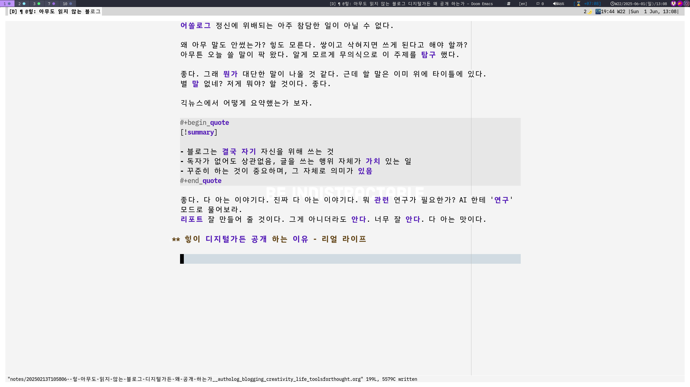
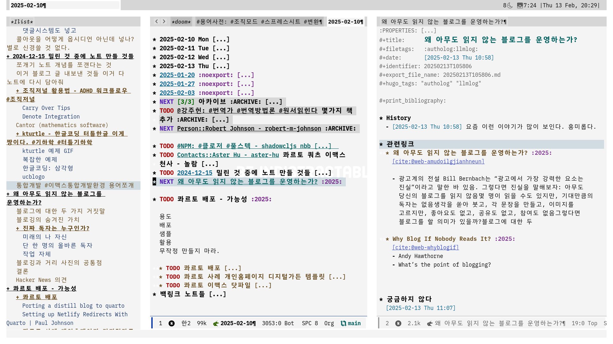

<!-- gid:20250213T105806 -->
[TOC]

[[TIP("이 노트에 대하여")]]
무명의 시간 속에서도 왜 글을 공개하고 디지털가든을 계속 가꾸는지 스스로 묻는다. 유명과 무명의 대립을 넘어 글쓰기와 공개의 존재론적 이유를 더듬는 어쏠로그다.
[[/TIP]]

## BIBLIOGRAPHY

- Andy Hawthorne. 2025. “Why Blog If Nobody Reads It?” February 5, 2025. [https://andysblog.uk/why-blog-if-nobody-reads-it/](https://andysblog.uk/why-blog-if-nobody-reads-it/).
- neo. 2025a. “왜 아무도 읽지 않는 블로그를 운영하는가?” February 10, 2025. [https://news.hada.io/topic?id=19146](https://news.hada.io/topic?id=19146).
- ———. 2025b. “무명의 시간을 견디며 성장하기.” June 3, 2025. [https://news.hada.io/topic?id=21255](https://news.hada.io/topic?id=21255).

## History

-   [2026-06-11 Thu 13:36] [힣: 링크드인 날것 공개면 — AI 크롤러 시대의 손가락 프롬프트](https://wikidocs.net/381631) 연결 — 아무도 읽지 않는 공개에서, AI가 통째로 읽는 공개면으로.
-   [2025-06-08 Sun 21:25] 무명 유명 명명
-   [2025-06-01 Sun 12:05] 내가 보려고 운영 하는거다
-   [2025-03-14 Fri 11:55] 아래에서 가져온 질문 입니다. 하지만 당연하게도 오랜기간 아무도 읽지 않는 곳을 위해 애써온 사람으로서 매우 적절한 질문이네요. 네. 제 생각도 좀 담아 볼 예정 입니다만, 일단 아래 원문을 읽고 질문을 삭혀보는 시간이 좋을 것 같네요.
-   [2025-02-13 Thu 11:07] 적는데 시간 오래 걸릴텐데 아놔. 잠시만
-   [2025-02-13 Thu 10:58] 요즘 이런 이야기가 많이 보인다. 흥미롭다.

## 2025 견디지도 성장하지도 무명도 유명도 아닙니다

[2025-06-08 Sun 21:25]

무명의 시간을 견디며 성장하기 (neo 2025b)라는 글의 요약: 지금 아무도 읽지 않는 어둠(Obscurity)에 게시글을 올리고 있다면, 계속해도 좋다는 다정한 조언임.

하지만 이미 그 글은 다정하지 않다. 구할 바 없다. 다정한 글 마저도 구할 바 없다. 무명에서 유명으로 갔다가 무명으로 오기도 하고 그렇다면 유와무는 빼고 언제나 명만 하자. 여여하다.

오늘 살이. 내일이 있을까요? 모를 뿐이라면 유명도 무명도 견딤도 성장도 '무' 입니다.

[[TIP("주의")]]
아무도 읽지 않는 블로그를 왜 하는가와 닿는 이야기 같아요. 오늘 오직 오늘 하루. 하되 함이 없이. 어떻게 견뎌왔는가? 어제도 오늘도 그저 영감에 맡겨서 그 일을 했을 뿐인데요. 견뎌왔다는 건 사람들이 하는 말이고요. 전 그저 오늘을 살아요. 호는 불호의 다른 이름... 불완전한 오늘 살이. 하아! 다시 컴터에 앉아서 이맥스랑 놀아 봅니다.
[[/TIP]]

[이현주 구도자 영성가 (1944)](https://wikidocs.net/382311) 할아버지 또 생각 납니다. 안도현 시인 맞나요? 교과서에 있던 시 인가? 힣도 좋아하는 시 입니다. 아래 글은 시인을 디스하고 있나요? 아닐 겁니다. 무엇이 옳은가요? 좋은가요? 모릅니다.

[[TIP("인용")]]
어느 시인이, 연탄재 함부로 밟지 말라고,

너는 언제 남을 위해서 온몸을 불태워 본 적 있느냐고,

그랬다기에

하루는 연탄재한테 물어보았지.

남을 위해서 온몸을 불태운 소감이 어떻더냐고.

연탄재가 말하더군.

남을 위해서?

그게 무슨 말이지?

우리들 자연(自然)에는 '남'이 없거니와

'위해서'는 더욱 없는 물건이라네.

― 이현주, 『공(空)』
[[/TIP]]

## 2025 내가 보려고 공개한다

[2025-06-01 Sun 12:09]

[[TIP("요약")]]
힣을 반년 이상 지켜봤다. 휴대폰으로 뭐하나 봤다. 이런!!! 힣's 디지털가든 보면서 웃고 있다.
[[/TIP]]

### 불완전함 + 아무도 그리고 '다 아는 맛'

힣의 불완전함을 찬양의 핵심에는 ([힣: 디지털가든 - 불완전함에서 창조가 나오는 곳](https://wikidocs.net/381586))

아무도 읽지 않는 시리즈가 있다.

-   [힣: 아무도 읽지 않는 공지 - 그를 찾아 떠나자](https://wikidocs.net/381582)
-   [힣: 아무도 읽지 않는 디지털가든 만들고 행복한 지인 이야기 (feat. 6세 아이에게 기술이란)](https://wikidocs.net/381590)
-   [힣: 책을 쓰지 않는/말아야 하는 이유](https://wikidocs.net/381334)

핵심이라고 말을 하면서도 실제로 이 어쏠로그에는 힣은 한 마디도 써놓지 않았었다. 어쏠로그 정신에 위배되는 아주 참담한 일이 아닐 수 없다.

왜 아무 말도 안썼는가? 힣도 모른다. 쌓이고 삭혀지면 쓰게 된다고 해야 할까? 아무튼 오늘 쓸 말이 팍 왔다. 알게 모르게 무의식으로 이 주제를 탐구 했다.

좋다. 그래 뭔가 대단한 말이 나올 것 같다. 근데 할 말은 이미 위에 타이틀에 있다. 별 말 없네? 저게 뭐야? 할 것이다. 좋다.

긱뉴스에서 어떻게 요약했는가 보자.

[[TIP("요약")]]
-   블로그는 결국 자기 자신을 위해 쓰는 것
-   독자가 없어도 상관없음, 글을 쓰는 행위 자체가 가치 있는 일
-   꾸준히 하는 것이 중요하며, 그 자체로 의미가 있음
[[/TIP]]

좋다. 다 아는 이야기다. 진짜 다 아는 이야기다. 뭐 관련 연구가 필요한가? AI 한테 '연구' 모드로 물어보라. 리포트 잘 만들어 줄 것이다. 그게 아니더라도 안다. 너무 잘 안다. 다 아는 맛이다.

### 힣이 공개 하는 이유 - 리얼 라이프

[2025-06-01 Sun 13:12]

본 문서 아래에 스크린샷을 넣었다. 편집도구로 컴퓨터 앞에 앉아서 보거나 요즘에는 안드로이드로도 보고 편집도 한다([힣: 스크린샷 범용 지식도구 - 안드로이드 덱스 호환](https://wikidocs.net/381028))

그럼에도 24시간 중에 편집도구 앞에서 키보드 두드릴 시간이 얼마나 될까? 생각보다 많지 않다.

[[TIP("주의")]]
힣을 반년 이상 지켜봤다. 휴대폰으로 뭐하나 봤다. 이런!!! 힣's 디지털가든 보면서 웃고 있다.
[[/TIP]]

이리 저리 눌러보면서 빈 곳, 오래된 곳을 찾아다니는 것이다. 때론 댓글도 남긴다. 이동하거나 기다리거나 등 일반적으로 짜투리 시간이라고 말하는 그 시간에 말이다.

"자기를 위해 쓰는 것이다. 쓰는 행위 자체가 가치 있다. 꾸준히 하는 것에 의미가 있다." 등의 좋은 말, 아는 말로는 '힘'이 부족하다.

[[TIP("노트")]]
힣도 24시간을 산다. 대충 쓴다. 후다닥 올린다. 오가며 본다. 수정하고 싶으면 스크린샷 한다. 이래 저래 하루가 간다. 하루 끝.
[[/TIP]]

삶에 중심에 **디지털가든** 에 스며든다. 점점 노트가 많아 진다. 간격반복학습이 된다. 어떤 노트는 때론 이게 뭐지?하며 놀라기도 한다. ([간격반복학습플래시카드](https://wikidocs.net/380483))

AI와 대화 한 기록들은 짬짬이 시간에 읽어보기 좋다. AI는 화 안내고 얼마나 친절한가? 물론 말이 너무 많다(그걸 원하지만). 아무튼 오가며 읽어 보기 좋다. 이 녀석이 헛소리를 남겨 놓았네?! 괜찮다. 힣도 뭐 다른가? ([힣: AI노트 지식도구 핵심: 질문과 답변 - 불완전함](https://wikidocs.net/381708))

오가며 AI한테 페이지 주소를 던져 주면서 읽어보라 한다. 그리고 같이 이야기 한다. 빈 곳도 찾는다. 짜투리 시간에 하기 좋은 일이다. 정리해볼까?

[[TIP("important")]]
오늘 하루. 불완전한 그대로 삶을 기록한다. 아무도 안본다. 맘편히 틈틈히 다시 보며 고민 한다. 되는 대로 수정하고 또 공개한다. 쓸 때는 AI를 옆에 두고 같이 쓴다. 심심하지 않다. 풍성하게 쓸 수 있다. 틈틈히 AI한테 읽어보고 피드백 달라고 부탁한다. 자기 전에 마지막으로 나의 디지털가든 또 들어간다. 헉! 이 노트에 뭔가 더 쓰고 싶네?! 스크린샷하고 적어 놓고 잔다. 그리고 좀 더 생각을 한다. 귀찮다. 잠이 든다.
[[/TIP]]

이제 소설을 써 본다. 안타깝게도 힣은 다음 날 다시는 일어나지 못했다. 영영 먼 길을 떠나게 되었다. 힣은 무슨 이야기를 남기고 싶을까. 진짜 떠나면 남길 수가 없기에 지금 남겨보자면...

[[TIP("완료")]]
지금 이 순간에, 바로 그 일을 하는 누군가가 죽었다. 뭐가 이상한가? 만약 그게 '나' 라면? 내가 아니어야 할 이유가 있는가?

단 하루라도 불완전한 그대로 삶을 사랑할 수 있다면, 내일이 필요하지 않다. 오늘 온전히 살아냈기에 더 바랄 것이 없다.
[[/TIP]]

물론, 디지털가든을 열고 노트테이킹을 하는 이야기에 왜 죽음까지 들먹이는가 할 수도 있다. 그렇다면 이 글은 당신을 위한 글이 아니다.

힣은 이 순간에 'ㄱ' 한글자를 누르고 멍하니 눈물이 흘리고 있을 누군가를 위해 이 글을 썼다.

지식관리는 거짓말인지도 모르다. 힣도 사실 모른다. 본인도 딱히 지식관리를 해본 적도 없다. 알음알음 가고 있을 뿐이다. [그는누구인가](https://wikidocs.net/381392)에 담았던 '삶이 주는 질문'에 대한 답을 힣도 한 글자 한 글자 그저 적고 있을 뿐이다.

### 참고자료 - 긱뉴스: 왜 아무도 읽지 않는 블로그를 운영하는가?

(neo 2025a)

-   [긱뉴스해커뉴스](https://wikidocs.net/382198)에서 찾은 글이다. 아래 한글 요약을 가져 왔다.
-   Andy Hawthorne, What's the point of blogging?, Thoughts on creativity and life
-   광고계의 전설 Bill Bernbach는 "광고에서 가장 강력한 요소는 진실"이라고 말한 바 있음
-   그렇다면 진실을 말해보자: 아무도 당신의 블로그를 읽지 않음
-   몇 명이 읽을 수도 있지만, 기대만큼의 독자는 없음
-   생각을 쏟아 붓고, 각 문장을 만들고, 이미지를 고르지만, 좋아요도 없고, 공유도 없고, 참여도 없음
-   그렇다면 블로그를 할 의미가 있을까?
-   원문 Why Blog If Nobody Reads It? (Andy Hawthorne 2025)

## 아카이빙

### 현재 편집중 #스크린샷

[2025-06-01 Sun 13:10]

### 스크린샷 아름답다

[2025-02-13 Thu 20:29]

풀 스크린샷. 아름답다. 뭥미

