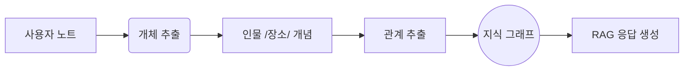

<!-- gid:20250214T145633 -->
[[TIP("이 노트에 대하여")]]
andenken 이 sessions + md 두 트랙으로 production 서고 나서, 이맥스에서 직접 시멘틱 검색을 띄울 자리가 비어 있었다. 이 노트는 그 자리를 `lisp/andenken-config.el` 얇은 클라이언트로 메꾼 결정과 설계를 기록한다. khoj / emacs-rag-libsql 검토는 그 결정의 비교 자료로 남긴다.
[[/TIP]]

<!-- provenance:source:start -->
[[TIP("원본·최신본")]]
이 페이지는 한국어 검색과 읽기를 위한 WikiDocs 미러입니다. [원본·최신본은 가든](https://notes.junghanacs.com/notes/20250214T145633/)에 있습니다. 최신 수정 내용·백링크·태그·히스토리·댓글·출처 정보는 원본 가든에서 확인하세요.

- 작성: `2025-02-14T14:56:00+09:00`
- 최근 수정: `2026-05-28T17:00:00+09:00`
[[/TIP]]
<!-- provenance:source:end -->

[TOC]

## BIBLIOGRAPHY

- “Debanjum (Debanjum) - Khoj.” 2025. 2025. [https://github.com/debanjum](https://github.com/debanjum).
- “Khoj AI - Github.” 2025. 2025. [https://github.com/khoj-ai](https://github.com/khoj-ai).
- “Khoj-Ai/Khoj.” 2024. [https://github.com/khoj-ai/khoj](https://github.com/khoj-ai/khoj).
- “Khoj-Ai/Knowledge-Graph.” 2025. [https://github.com/khoj-ai/knowledge-graph](https://github.com/khoj-ai/knowledge-graph).
- “Microsoft/Graphrag.” 2025. [https://github.com/microsoft/graphrag](https://github.com/microsoft/graphrag).
- “Ofalvai/Obsidian-Llm-Workspace.” 2025. [https://github.com/ofalvai/obsidian-llm-workspace](https://github.com/ofalvai/obsidian-llm-workspace).

## 히스토리

-   [2026-05-28 Thu 17:00] sessions retrieval 진단 단락 추가. md 트랙은 일단 안 봄(글 형식이라 기대치 다름), sessions 한정으로 백엔드 품질 자리 잡힘. andenken 담당자가 NEXT.md 2e (session-as-unit windowed view) 진입점으로 잡음. boundary 단락 박음 — andenken=단축, recall skill= 다축 합성.
-   [2026-05-28 Thu 16:00] time-axis 명령 추가 (`-sessions-today`, `-sessions-this-week`). 기존 `my/denote-links-today` / `-this-week` 패턴 그대로. preview 버퍼 + 키맵 (`RET` `/org / ~o` md / `q` 닫기) 추가.
-   [2026-05-28 Thu 15:00] andenken을 백엔드로 확정. doomemacs-config 측 얇은 클라이언트(`lisp/andenken-config.el`) 추가. 노트 방향을 "khoj 검토"에서 "이맥스 인터페이스 설계"로 재정렬.
-   [2026-05-28 Thu 14:05] 수정할거야.
-   [2025-02-14 Fri 14:56] 이 프로젝트를 분석하면 여럿 길이 보인다.

## 관련노트

-   [GraphRAG: 지식그래프 검색증강생성](https://wikidocs.net/381529)
-   [embedding-config: Notion CS 지식베이스 임베딩 시스템](https://wikidocs.net/381805)
-   [ahyatt semext embed-db LLM 시맨틱 임베딩 확장 이맥스 패키지](https://wikidocs.net/381730)

## 결정 — andenken 백엔드, 이맥스가 얇은 클라이언트

2026-05 시점에 결론. 지금까지의 후보 검토(khoj / emacs-rag-libsql / GraphRAG)는 모두 "이맥스에서 시멘틱 검색을 어떻게 띄울까"의 후보였다. 답은 백엔드를 새로 만들 게 아니라, 이미 production 으로 서 있는 [andenken](https://github.com/junghan0611/andenken) 을 그대로 호출하는 얇은 이맥스 클라이언트.

-   **백엔드**: andenken. sessions(pi + Claude Code JSONL) + md(가든 export) 두 트랙. OpenRouter Qwen3-Embedding-8B (4096d), LanceDB. hybrid retrieval (vector + BM25 + MMR) + 한국어↔영어 dictcli expand.
-   **호출 자리**: `~/.claude/skills/semantic-memory/semantic-memory` wrapper. 에이전트가 쓰는 면과 SSOT 공유 — 한쪽이 바뀌면 양쪽이 같이 따라간다.
-   **이맥스 측**: `doomemacs-config/lisp/andenken-config.el`. CLI 호출 → JSON 파싱 → `completing-read`. 의존 없음 (이맥스 내장 `json-parse-string`).

### 명령 (6개, 더 늘리지 않음)

| 명령                                     | 동작                                                                                   |
|----------------------------------------|--------------------------------------------------------------------------------------|
| `M-x andenken-search-md`                 | 가든 의미 검색. preview 버퍼 → `RET` `/org 원본 / ~o` 가든 md / `q` 닫기.              |
| `M-x andenken-search-sessions`           | 과거 세션 검색. preview 버퍼 → `RET` JSONL `file:line` / `q` 닫기.                     |
| `M-x andenken-search-sessions-today`     | 오늘 KST 일일창. prefix `C-u` → calendar 픽. query 비우면 `--mode recent`, 채우면 `--mode hybrid`. |
| `M-x andenken-search-sessions-this-week` | 이번 주 (Mon~Sun) KST. prefix `C-u` → calendar 픽 (그 주).                             |
| `M-x andenken-search`                    | 두 트랙 합쳐 score 내림차순 (cross-track sort 위험 자리 — 진단 섹션 참조).             |
| `M-x andenken-status`                    | 인덱스 통계 한 줄.                                                                     |

**인터페이스 더 안 늘림.** [2026-05-28 Thu] 결정. "복잡하면 사용하지 않겠다는 것" — 사용자 명시.

키바인딩은 일단 잡지 않음. 사용 패턴 보고 결정.

### 안 한 것 (의도적)

-   **dynamic-collection** (입력 중 실시간 검색): OpenRouter 호출 비용/지연 때문에 안 함. 한 번 `read-string` → 한 번 호출. khoj.el 도 dynamic 안 함 (Ivy 사용 시 제한적).
-   **이맥스 자체 인덱스**: andenken 이 sessions + md 모두 잡고 있어서 불필요. emacs-rag-libsql 처럼 Python FastAPI + libsql DB 를 이맥스가 관리할 자리가 없다.
-   **org 트랙**: andenken 측에서 production 비활성 (upstream R&amp;D). 활성화되면 `andenken-search-org` 만 더하면 됨.

### 왜 다른 후보가 아닌가

-   **emacs-rag-libsql**: Python FastAPI 서버 + libsql DB 를 이맥스가 관리. 우리 자리(검색 백엔드)는 andenken 에 이미 있음. 참고할 것은 결과 표시 패턴(`emacs-rag--display-results`, `emacs-rag--open-result`) 정도.
-   **khoj.el**: self-hostable AI second brain. 인덱싱·LLM·UI 통합 패키지. 우리의 분할(memory 면 / agent 면 / 에디터 면)과 결이 다르다.
-   **GraphRAG**: 다른 차원(지식 그래프 RAG). andenken 이 hybrid retrieval 까지 잡고 있어서 1차 retrieval 은 충분. graph 관계는 denote 가 이미 한다.

### 운영 메모

-   **어떤 쿼리가 잘 나오는지** — 사용자 학습 영역. 결과 한 줄에 `score | title | snippet` 표시해서 피드백 빠르게 받기. 후속으로 dictcli expand 결과를 헤더에 노출 검토.
-   **md → ~/org 매핑** — 가든 export 의 basename 이 Denote ID 라 `denote-get-path-by-id` 한 번으로 원본 잡힘. 가든은 export 시점 스냅샷이므로 편집은 항상 ~/org 원본.
-   **session 결과** — JSONL `file:line` 그대로 열어도 사람이 못 읽는다. read-only 버퍼에 chunk + 메타 표시. 원본 JSONL 경로는 헤더에 둬서 필요할 때만 visit.
-   **vertico 정렬** — completion table metadata 로 `display-sort-function/cycle-sort-function` 을 identity 로 잡아 score 정렬을 보존.

### 다음 한 걸음

-   andenken NEXT.md 2e (`--view session`) 머지 후 wrapper 측 호출 추가 — 인터페이스 안 늘림 결정 유지. 5분 작업.
-   gptel 연계 (B 단계): 검색 결과 → gptel context 로 push (emacs-rag-gptel-tools 패턴 참고). 단답형(주소/기념일)은 preview 본문에서 잡힘 — 분산된 사실 종합이 필요해질 때.
-   키바인딩 자리 결정. `SPC n s` (search) 또는 `+default/find-in-notes` 옆이 자연스럽다.
-   andenken org 트랙이 production 으로 올라오면 `andenken-search-org` 추가.

## [2026-05-28 Thu 17:00] sessions retrieval 진단 — 경계 다시 잡기

md 트랙은 일단 안 본다. 글 형식이라 retrieval 기대치가 다르고, 사용자가 자주 묻는 자리는 **sessions** 다.

### 사용자 본 그림

> "최근 1주일간 내가 에이전트로 무엇을 했는가" — 매일/주간 자기 활동 되돌아보기. session 은 명확한 정보(사실 _대화_ 결정)라 retrieval 기대치 높다. md 처럼 글 형식 추상화가 없다. 12 repo × 100 commit 이 다 연결된 프로젝트 — 전체 조망. 이게 잘 돼야 에이전트가 세션 이어 나갈 때 삽질 줄어든다.

증상 — "어제 뭐했지" 추상 query → score 0.01 (semantic 못 잡음). recent mode 로 시간 윈도우는 풀었지만, 윈도우 안 30건 봐도 한 프로젝트 메시지가 화면 잡아먹어 multi-repo 조망 안 됨.

### 분신 진단 → andenken 담당자 정정

분신 (`entwurf gpt-5.5`) 1차 답은 "metadata 비어있음 → 추출 필요" 였는데, andenken 담당자가 정정:

-   2026-05-13 Phase 1 stored signals 이미 들어가 있음 (timestamp / project / role / source / sessionFile / lineNumber). 빠진 건 **derived signals** (entwurf_task_id / slash_command / tool_name / file_paths / commit_sha) — Phase 2.
-   분신이 제시한 10 query 중 7개는 day-query / recall 경계 넘음 (어제 vs 오늘, 회사/개인 분리, 멀티리포 조망 등).
-   andenken 책임은 **단축 retrieval**. 다축 합성은 `/recall` skill (`day-query` + `gitcli` + `session-recap` + `andenken` + `NEXT.md`).

분신 한 turn 컨텍스트로 진행 중 작업 문서를 못 읽었다 — 담당자가 살아 누적된 면이 진짜 SSOT 임을 확인. entwurf 자체의 자리 (1회성 사고)와 담당자 자리 (지속 컨텍스트)는 다르다.

### Boundary (잠금 — GPT 리뷰 전에 박음)

| 책임                                       | Owner           | 내용                                                  |
|------------------------------------------|-----------------|-----------------------------------------------------|
| windowed single-axis retrieval             | **andenken**    | timestamp/project/sessionFile signals 안에서 세션 중복 없는 결과 |
| 다축 합성 (commits + journal + sessions + ...) | `/recall` skill | day-query + gitcli + session-recap + andenken         |
| 자연어 시간 파싱 ("어제 vs 오늘 비교")     | day-query       | git timeline + journal 통합                           |
| 인덱싱 schema 변경 (derived signals)       | andenken        | 단 golden 측정 후 비용 정당화                         |

### andenken 측 진행 (담당자 SSOT 는 `andenken/NEXT.md`)

순서:

1.  **2e session-as-unit windowed view** — retriever 후처리 + cli `--view session`. 인덱싱 무변경. 현재 진입점.
2.  **2b corpus noise threshold** — 시뮬만 (read-only) 병행. 코드 변경은 2e 안정 후. `MIN_CHUNK_COUNT_PER_SESSION=2` 정도 보수적.
3.  **2a parsePiLine compaction schema fix** + targeted reindex. Phase 1 stored signals 결손 채움.
4.  **2c golden 측정** — query 3개 (entwurf 결과 / multi-repo 의미연결 / entwurf 시작→결정→결과 흐름). 2e/2a/2b 적용 전후 비교.
5.  **2d derived signals 인덱싱** — 2c 결과 보고 결정.

doomemacs-config 측 영향: 없음 (인터페이스 안 늘림). 2e 머지 후 wrapper 측 `--view session` 호출만 추가.

### 임베딩 자체가 별로일 가능성

khoj 데모가 더 잘 보이는 자리는 두 가지 — chunk 작게 (`800 chars), cross-encoder rerank. andenken md 는 의도적 큰 청크 (~HARD_MAX_CHARS = 12000`) 라 토픽 매칭 강하고 fact 매칭 약하다. sessions 는 다른 chunker (2000자 cap, JSONL message 단위) — 실측 평균 658 chars / p50 293 / p95 2003. md 와 다르게 chunk 크기 자체가 문제 아니라 **활동 단위 접지 부재**.

rerank — Jina v3 는 Korean+English mixed 에서 hurts 라 껐음. Cohere multilingual v3 / Voyage rerank-2 평가는 2c golden baseline 잡힌 다음 자리. 지금 1순위 아님.

### 기록의 자리

임베딩이 별로면 기록이라도 잘 남겨야 개선된다. 이 단락은 다음 작업 (2e 머지, golden 측정, derived signals 결정) 의 닻. 다음 세션에서 잡담 안 하고 바로 진입할 수 있게.

관련 자리:

-   `andenken/NEXT.md` — 백엔드 진행 SSOT
-   `doomemacs-config/lisp/andenken-config.el` — wrapper 코드
-   `/.claude/skills/recall/` — 다축 합성 면 (boundary 의 반대편)
-   `/.claude/skills/semantic-memory/SKILL.md` — andenken CLI 호출 면

## 관련링크

### ofalvai/obsidian-llm-workspace - 옵시디언

(“Ofalvai/Obsidian-Llm-Workspace” 2025)

-   Olivér Falvai
-   2025
    
    이건 어떤가?

### Khoj AI - Github

(“Khoj AI - Github” 2025)

-   Creating open-source, personal AI for research. Khoj AI has 9 repositories available. Follow their code on GitHub.

### khoj-ai/khoj

(“Khoj-Ai/Khoj” 2024)

Your AI second brain. Self-hostable. Get answers from the internet or your docs. Use any online or local LLM (e.g gpt, claude, gemini, llama, qwen, mistral). Build custom agents, personalized automations.

### debanjum (Debanjum) - khoj

(“Debanjum (Debanjum) - Khoj” 2025)

### khoj-ai/knowledge-graph

(“Khoj-Ai/Knowledge-Graph” 2025)

-   

-   A minimal implementation of GraphRAG, designed to quickly prototype whether you’re able to get good sense-making out of a large dataset with creation of a knowledge graph.
-   

### microsoft/graphrag

(“Microsoft/Graphrag” 2025)

-   A modular graph-based Retrieval-Augmented Generation (RAG) system

### uv

[2025-02-14 Fri 13:03] PyPI For convenience, uv is published to PyPI. If installing from PyPI, we recommend installing uv into an isolated environment, e.g., with pipx:

```text
pipx install uv --force
```

## [|2025-03-28 Fri 09:03|](https://wikidocs.net/380405.md#h-2025-03-28/)

@user 이 프로젝트에서 RAG의 역할은?

@assistant 이 프로젝트에서 RAG(Retrieval-Augmented Generation)는 외부 지식 소스를 활용해 생성형 AI의 응답 정확성과 관련성을 높이는 역할을 합니다. 주요 기능은 다음과 같습니다:

1.  **정보 검증**
    -   실시간/도메인 특화 데이터 검색을 통해 허구적 응답(hallucination) 감소

2.  **동적 지식 확장**
    -   모델 재학습 없이 최신 정보 반영 가능

3.  **컨텍스트 강화**
    -   질문 관련 문서 추출 → 생성 단계에 문맥 정보 제공

4.  **비용 효율성**
    -   대규모 모델 파인튜닝 대비 리소스 절약

도메인 특화 DB나 최신 자료를 반영해야 하는 과제 특성상, RAG를 통해 신뢰성과 확장성을 동시에 확보하는 구조로 작동합니다.

@user 관련된 코드를 정리해줘

@assistant RAG 구현을 위한 핵심 코드 구조 예시입니다. (Python/PyTorch 기준)

```python
# 1. 의존성 설치
!pip install transformers faiss-cpu sentence-transformers

# 2. 핵심 컴포넌트
from transformers import RagTokenizer, RagRetriever, RagSequenceForGeneration
from sentence_transformers import SentenceTransformer
import faiss

# 3. 데이터 준비
documents = [
    "도메인 특화 문서 1 내용...",
    "도메인 특화 문서 2 내용...",
    # ... 외부 지식 소스
]

# 4. 임베딩 생성
encoder = SentenceTransformer('all-MiniLM-L6-v2')
doc_embeddings = encoder.encode(documents)

# 5. FAISS 인덱스 구축
index = faiss.IndexFlatL2(doc_embeddings.shape[1])
index.add(doc_embeddings)

# 6. RAG 파이프라인
class RAGSystem:
    def __init__(self):
        self.tokenizer = RagTokenizer.from_pretrained("facebook/rag-sequence-nq")
        self.retriever = RagRetriever.from_pretrained(
            "facebook/rag-sequence-nq",
            index=index,
            encoder=encoder
        )
        self.generator = RagSequenceForGeneration.from_pretrained("facebook/rag-sequence-nq", retriever=self.retriever)

    def query(self, question):
        inputs = self.tokenizer(question, return_tensors="pt")
        outputs = self.generator.generate(**inputs)
        return self.tokenizer.decode(outputs[0], skip_special_tokens=True)

# 7. 실행 예시
rag = RAGSystem()
result = rag.query("프로젝트에서 RAG의 역할은?")
print(f"응답: {result}")
```

주요 조정 포인트:

1.  `documents`: 실제 도메인 지식 DB로 교체 필요
2.  임베딩 모델: `multi-qa-mpnet-base-dot-v1` 등 도메인 특화 모델로 변경 가능
3.  생성 모델: `facebook/bart-large` 등 다른 seq2seq 모델 활용 가능
4.  하이퍼파라미터: chunk_size, top_k 값 조정으로 검색 범위 제어

실제 운영 환경에서는 Elasticsearch나 Pinecone 등의 벡터 DB를 사용하고 비동기 처리 구조를 추가하는 것이 일반적입니다. 데이터 전처리 단계에서 문장 분할 및 정규화 과정이 필수적으로 요구됩니다.

@user 이 프로젝트에서 RAG 기술을 어디서 어떻게 사용하는가?

@assistant 이 프로젝트에서 RAG 기술의 구체적 적용 포인트와 방식은 다음과 같습니다:

**1. 적용 영역** ✓ _도메인 특화 Q&amp;A 시스템_

-   전문 용어/프로세스가 포함된 사용자 질의 → 문서 기반 정확한 응답 생성

✓ _실시간 문서 분석_

-   업로드된 PDF/텍스트 파일 → 자동 요약 및 크로스체크

✓ _동적 지식 관리_

-   매일 업데이트되는 규정 문서 → 재학습 없이 최신 정보 반영

✓ _사용자 지원 챗봇_

-   내부 매뉴얼 기반 오류 최소화된 상담 시스템

**2. 기술적 구현 방식**

```python
# 핵심 처리 흐름 예시
def rag_workflow(query):
    # ❶ 검색기(Retriever)
    relevant_docs = vector_db.search(query, top_k=3)  # FAISS/Elasticsearch

    # ❷ 증강 컨텍스트 생성
    context = "\n".join([doc['content'] for doc in relevant_docs])

    # ❸ 생성기(Generator)
    prompt = f"질문: {query}\n참고문서: {context}\n답변:"
    return llm.generate(prompt)  # BART/T5 기반
```

**3. 시스템 통합 포인트**

-   _데이터 소스_: 내부 Confluence ↔ RAG 인덱싱 파이프라인 연동
-   _검색 최적화_: 사용자 로그 기반 검색 가중치 동적 조정(부가 기능)
-   _검증 레이어_: 생성된 응답 → 사전 정의된 규칙 기반 필터링

**4. 도메인 맞춤형 조정**

-   임베딩 모델: KoBERT 기반 한국어 특화 버전 사용
-   청크 전략: 도메인 지식 구조에 맞춘 계층적 분할(섹션 &gt; 문단)
-   평가 메트릭: 정확도 외 도메인 전문가 검증 점수 반영

실제 운영 환경에선 사용자 질의 유형 분류 모델을 선행하여 RAG 적용 여부를 결정하는 하이브리드 아키텍처를 채택하고 있습니다. 응답 생성 후처리에서 자동화된 사실 관계 검증 모듈이 추가로 동작하는 것이 특징입니다.

@user 사용자가 작성한 노트들을 어떻게 활용하는지 관련 기술을 설명해줘

@assistant 사용자 노트를 활용한 **개인화된 RAG 시스템** 구현 기술을 설명드립니다:

#### 1. **노트 수집 및 전처리**

```python
# Markdown/Org-mode 노트 파싱 예시
def parse_notes(note_files):
    notes = []
    for file in note_files:
        with open(file, 'r') as f:
            content = f.read()
            # 메타데이터 추출(태그, 생성일 등)
            metadata = extract_metadata(content)
            notes.append({
                'content': clean_text(content),
                'metadata': metadata
            })
    return notes
```

-   **기술 요소**:
    -   로컬 파일/클라우드 동기화(Evernote, Notion API 연동)
    -   마크다운 헤더 기반 계층 구조 파싱
    -   개인용어 사전 생성(사용자 고유 명사 추출)

#### 2. **맥락 기반 임베딩**

```python
# 사용자 특화 임베딩 모델
class PersonalEmbedder:
    def __init__(self, base_model='paraphrase-multilingual-MiniLM-L12-v2'):
        self.base_model = SentenceTransformer(base_model)
        self.user_terms = load_user_glossary()  # 사용자 정의 용어 사전

    def encode(self, text):
        # 사용자 용어 보정
        text = replace_user_terms(text, self.user_terms)
        return self.base_model.encode(text)
```

-   **최적화 포인트**:
    -   개인 단축어/약어 처리 (예: "내프로젝트" → "개인 블로그 개편 프로젝트")
    -   시간 가중치: 최근 노트에 높은 가중치 부여

#### 3. **개인 지식 그래프 구축**



-   **활용 기술**:
    -   SpaCy 기반 개체 인식
    -   노트 간 링크 분석을 통한 관계도 생성

#### 4. **동적 검색 최적화**

```python
def retrieve_personal_notes(query, user_context):
    # 검색 범위 제한 (예: "업무" 태그가 있는 노트만)
    if 'work' in user_context.current_tags:
        filter = {'tags': 'work'}
    return vector_db.search(
        query,
        filter=filter,
        time_weight=0.3  # 최근 자료 우선
    )
```

-   **개인화 요소**:
    -   사용자 활동 패턴 기반 검색 범위 자동 조정
    -   빈번 접근 노트 캐싱

#### 5. **응답 생성 예시**

**사용자 질의**: "지난달에 기록한 AWS 설정 방법 찾아줘"

**RAG 동작 과정**:

1.  시간 필터(`last_modified > 2023-11-01`) 적용
2.  "AWS" + "설정" 키워드 가중 검색
3.  사용자가 자주 참조하는 노트 순으로 정렬
4.  생성된 응답에 원본 노트 링크 자동 첨부

#### 6. **보안 및 프라이버시**

-   로컬 머신에서만 처리되는 온디바이스 아키텍처
-   민감 정보 마스킹 (예: `[크레덴셜]` 태그 내용 자동 필터링)

이 시스템은 사용자가 \*자주 잊는 정보\*(예: 자체 개발한 코드 스니펫)나 \*개인적 맥락이 필요한 질의\*(예: "내가 정리한 김치찌개 레시피")에 특히 효과적입니다. 노트 변경사항은 실시간으로 반영되며, 사용자 피드백을 통해 검색 정확도를 지속적으로 개선합니다.

@user
