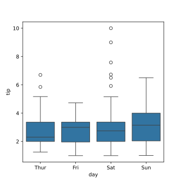

<!-- gid:20250217T151136 -->
[[TIP("이 노트에 대하여")]]
Org Babel에서 Python 코드 블록을 다루는 핵심 문서를 가져와 세션과 실행 흐름까지 정리한다. 주피터와 비교하면서 바벨 기반 작업법을 이해하는 데 유용한 노트다.
[[/TIP]]

<!-- provenance:source:start -->
[[TIP("원본·최신본")]]
이 페이지는 한국어 검색과 읽기를 위한 WikiDocs 미러입니다. [원본·최신본은 가든](https://notes.junghanacs.com/notes/20250217T151136/)에 있습니다. 최신 수정 내용·백링크·태그·히스토리·댓글·출처 정보는 원본 가든에서 확인하세요.

- 작성: `2025-02-17T15:11:00+09:00`
- 최근 수정: `2025-02-17T15:11:00+09:00`
[[/TIP]]
<!-- provenance:source:end -->

[TOC]

## 관련메타

-   [바벨](https://wikidocs.net/380803)

## BIBLIOGRAPHY

- “Bzg/Worg - Org Community-Driven Documentation - Sourcehut Git.” n.d. Accessed February 17, 2025. [https://git.sr.ht/~bzg/worg](https://git.sr.ht/~bzg/worg).
- “Python Source Code Blocks in Org Mode Worg.” 2024. 2024. [https://orgmode.org/worg/org-contrib/babel/languages/ob-doc-python.html](https://orgmode.org/worg/org-contrib/babel/languages/ob-doc-python.html).

## History

-   [2025-07-17 Thu 18:00] 바벨 관련
-   [2025-02-17 Mon 15:11] worg에서 통재로 가져옴. 이 문서를 다루면 세션까지 다 커버가 된다. 이맥스에서 파이썬 콰르토는 기대하기 어렵다.
-   [ob-jupyter 조직모드 바벨 파이썬 주피터](https://wikidocs.net/381236) 주피터를 이용할 경우

## [2025-02-17 W07](https://wikidocs.net/380399) 해결 방법은 직접 해보는 것 뿐. 이렇게 하면 된다.

이맥스에 다 준비되어 있다.

이 파일에서 관련 테스트를 했었다.

## 관련링크

### worg 온갖 문서는 다 여기 있다

(“Bzg/Worg - Org Community-Driven Documentation - Sourcehut Git” n.d.) <https://git.sr.ht/~bzg/worg>

### <span class="org-todo done DONT">DONT</span> Replacing Jupyter Notebook with Org Mode

### Python Source Code Blocks in Org Mode

(“Python Source Code Blocks in Org Mode Worg” 2024)

공식문서에서 끝나야 한다.

## Introduction

Python is a high-level, readable, interpreted language which can be used for many common computing tasks. It runs on most modern operating systems. Python source code blocks are fully supported in Org Mode with a wide variety of Python-specific header arguments.

Python source code blocks in Org Mode can be used to define functions, filter and analyze data, create graphics and figures, and produce reproducible research papers.

## Requirements and Setup

Python source code blocks in Org Mode require a working python installation. Python is included in Mac OS X and often in Gnu/Linux, and is easily available for Windows. Python installers are located at the [Python download site](http://www.python.org/download/).

Org Mode supports graphical output for LaTeX and HTML documents using [Matplotlib](http://matplotlib.org/).

```shell
sudo apt-get install python3-pandas python3-matplotlib python3-plotly
```

-   추가 [이맥스 통합개발환경: 파이썬](https://wikidocs.net/381174)

To configure your emacs org-mode to use python, you'll need to ensure that `org-babel-load-languages` includes an entry for it. Typically, `org-babel-load-languages` will contain many entries. The example below omits other languages.

```emacs-lisp
(org-babel-do-load-languages
 'org-babel-load-languages
 '((python . t)))
```

## Org Mode Features for Python Source Code Blocks

### Header Arguments

#### Language-Specific Header Arguments

언어별 헤더 인수

##### `:results {output, value}`:

Output results come from whatever the python code prints on stdout. Value results are the value of the last expression evaluated in the code block. Value mode is the default (as with other languages).

In value mode you can use the following subtypes:

-   `verbatim`: 축어

value is returned as string. In particular, use this to prevent conversion of lists and tuples to tables.

-   `table`:

(Org 9.7+) Try to convert the result to an Org table. Dicts, numpy arrays, and pandas DataFrames/Series can be returned as tables this way (by default, they are printed verbatim). Note that lists and tuples are already converted to table by default (use `verbatim` to prevent that).

-   `pp`:

value is pretty-printed by python using `pprint.pformat(%s)`, then inserted

##### `:results graphics file {output, value}`:

(Org 9.7+) save graphics with matplotlib. The behavior depends on whether value or output results are used. For value results, the last line should return a matplotlib Figure object to plot. For output results, the current figure (as returned by `pyplot.gcf()`) is cleared before evaluation, and then plotted afterwards. Specify the file to save the results to with `:file`.

(Org 9.7 이상)에서 matplotlib로 그래픽을 저장합니다. 동작은 value 또는 output을 사용하는지 여부에 따라 달라집니다. value 결과의 경우, 마지막 줄은 플롯할 matplotlib 그림 객체를 반환해야 합니다. output 결과의 경우, 현재 그림(`pyplot.gcf()` 에서 반환된 값)은 평가 전에 지워진 다음 나중에 플롯됩니다. 결과를 저장할 파일을 `:file` 로 지정합니다.

##### `:return`:

Appends a `return` statement to the end of the code block. Only when result-type is value, and not in session mode.

##### `:python`: Name of the command for executing Python code.

#### Common Header Arguments

-   `:session [name]`: default is no session.
-   `:var data=data-table`: Variables can be passed into python from org-mode tables as scalars or lists. See the org-mode manual for more details.
-   `:exports {code, results, both, none}`: Standard babel option for what to export.
-   `:file`: Filename to save results to (e.g. for `graphics`).

### Sessions

Session mode is fully supported in python, including named sessions. In session mode, each block is run in the same long-running python interactive interpreter session. You can have multiple sessions, all independent.

Sessions can be used to define functions, set up variables, and share code between source blocks.

### Return values

Session and non-session modes handle return values slightly differently.

In non-session mode, the python code block will be wrapped in a function, so to return a value (in `:results value` mode) you have to use a `return` statement. In session mode, the last statement's value will be returned if it is a top-level expression; you should <span class="underline">not</span> use a `return` statement.

#### Non-session mode example

```python
def foo(x):
  if x>0:
    return x+1

  else:
    return x-1

return foo(5)
```

,#+RESULTS:

```text
6
```

```python
def foo(x):
    if x>0:
        return x+1
    else:
        return x-1

return foo(5)
```

```text
6
```

#### Session mode example

```python
def foo(x):
  if x>0:
    return x+1
  else:
    return x-1

foo(1)
```

,#+RESULTS:

```text
2
```

A limitation of session-mode return values is that the final statement must be a top-level expression, otherwise nothing is returned.

For example, the code block below doesn't return anything, because the final expression is an indented if/else block, not a top-level expression:

```python
import random
if random.randint(0,10) % 2 == 0:
    "even"
else:
    "odd"
```

```text
None
```

,#+RESULTS:

To return the value of an indented block, assign the value to a variable, and return that variable as the final top-level expression:

```python
import random
if random.randint(0,10) % 2 == 0:
    ret = "even"
else:
    ret = "odd"
ret
```

```text
odd
```

,#+RESULTS:

```text
even
```

### Graphics 그래픽스

#### <span class="org-todo done DONT">DONT</span> Manual plotting with Org 9.6 and earlier

#### <span class="org-todo todo TODO">TODO</span> Automatic plotting in Org 9.7+

Starting in Org 9.7, ob-python can automatically use matplotlib to save graphics results, using the header arg `:results graphics file`. The behavior depends on whether value or output results are used. For value results, the last line should return a matplotlib Figure object to plot. For output results, the current figure (as returned by `pyplot.gcf()`) is cleared before evaluation, and then plotted afterwards.

Org 9.7부터, ob-python은 헤더 인자 `:results graphics file` 을 활용해 자동으로 matplotlib을 사용한 그래픽 결과물을 저장할 수 있습니다. 동작은 value 또는 output 결과를 사용하는지에 따라 달라집니다. value 결과의 경우, 마지막 줄은 플롯할 matplotlib 그림 `객체` 를 반환해야 합니다. output 결과의 경우, 현재 그림(`pyplot.gcf()` 에서 반환된 값)은 평가 전에 지워진 다음 나중에 플롯됩니다.

Here is an example using output results:

```python
import matplotlib.pyplot as plt
import seaborn as sns
plt.figure(figsize=(5, 5))
tips = sns.load_dataset("tips")
sns.boxplot(x="day", y="tip", data=tips)
```



And here is the same example using value results:

```python
import matplotlib.pyplot as plt
import seaborn as sns
plt.figure(figsize=(5, 5))
tips = sns.load_dataset("tips")
sns.boxplot(x="day", y="tip", data=tips)
return plt.gcf()
```


### Tables

By default, lists and tuples are converted to Org tables automatically:

```text
#+begin_src python
  return [1,2,3]
#+end_src

#+RESULTS:
| 1 | 2 | 3 |
```

You can suppress the table conversion with `:results verbatim`.

```text
#+begin_src python :results verbatim
  return [1,2,3]
#+end_src

#+RESULTS:
: [1, 2, 3]
```

Most other objects are printed as string by default, but starting in Org 9.7, you can specify `:results table` to tell Org to try and convert the result to table. In particular, this works for dicts, numpy arrays, and pandas DataFrames/Series:

```text
#+begin_src python :results table
  return {"a": 1, "b": 2}
#+end_src

#+RESULTS:
| a | 1 |
| b | 2 |

#+begin_src python :results table
  import pandas as pd
  import numpy as np

  return pd.DataFrame(np.array([[1,2,3],[4,5,6]]),
                      columns=['a','b','c'])
#+end_src

#+RESULTS:
|   | a | b | c |
|---+---+---+---|
| 0 | 1 | 2 | 3 |
| 1 | 4 | 5 | 6 |
```

### Noweb

Noweb syntax allows references between code blocks. One situation where this is useful is when you have some boilerplate code you need to repeat across many code blocks, and want to hide during export.

Below are examples of how this can be useful for returning matplotlib figures and pandas dataframes, in Org versions 9.6 or earlier (note that Org 9.7 adds built-in support for matplotlib graphics and pandas dataframes, so noweb isn't necessary for those cases anymore).

#### Plotting

Prior to Org 9.7, returning a plot from a ob-python block requires saving the figure to a file and returning the filename. In the example below, we extract this to a separate block that can be referred to by other code blocks. The `:noweb strip-export` header argument means to allow noweb syntax, but to hide the inserted code during export.

```org
#+name: savefig
#+begin_src python :var figname="plot.svg" width=5 height=5 :exports none
  return f"""plt.savefig('{figname}', width={width}, height={height})
  '{figname}'"""
#+end_src

#+header: :noweb strip-export
#+begin_src python :results value file link :session :exports both
  import matplotlib, numpy
  import matplotlib.pyplot as plt
  fig=plt.figure(figsize=(4,2))
  x=numpy.linspace(-15,15)
  plt.plot(numpy.sin(x)/x)
  fig.tight_layout()
  <<savefig(figname="plot.png", width=10, height=5)>>
#+end_src
```

#### Pandas dataframes

In the below example, we use the external [tabulate](https://pypi.org/project/tabulate/) package to convert a pandas Dataframe into org-mode format, but wrap it in a noweb block so we can hide the conversion during export.

```org
#+name: pd2org
#+begin_src python :var df="df" :exports none
  return f"return tabulate({df}, headers={df}.columns, tablefmt='orgtbl')"
#+end_src

#+header: :prologue from tabulate import tabulate
#+header: :noweb strip-export
#+begin_src python :results value raw :exports both
  import pandas as pd
  df = pd.DataFrame({
      "a": [1,2,3],
      "b": [4,5,6]
  })
  <<pd2org("df")>>
#+end_src

#+RESULTS:
|   | a | b |
|---+---+---|
| 0 | 1 | 4 |
| 1 | 2 | 5 |
| 2 | 3 | 6 |
```

## Additional examples

### Hello World!

```python
print("Hello, world!")
```

```text
Hello, world!
```

,#+RESULTS:

```text
Hello, world!
```

### Inline calling:

```text
Two plus two equals src_python{return(2+2)}
```

when exported, e.g. to HTML or LaTeX/PDF, becomes:

```text
Two plus two equals 4
```

### Extracting data from an org-mode table

<a id="table--data-table"></a>

| a | 1 |
|---|---|
| b | 2 |
| c | 3 |

```python
# Return row specified by val.
# In non-session mode, use return to return results.
return(data[val])
```

|   |   |
|---|---|
| b | 2 |

,#+RESULTS:

|   |   |
|---|---|
| b | 2 |

## 2024-12-11

### <span class="org-todo todo TODO">TODO</span> [SUM]:

@user sympy를 조직모드에서 호출하는 방법?

@assistant SymPy를 Org-mode에서 호출하려면, Emacs에서 Python 코드를 실행할 수 있는 방법을 사용해야 합니다. 다음은 그 방법입니다:

1.  **Python 코드 블록 사용**:
    -   Org-mode에서는 `#+BEGIN_SRC` 와 `#+END_SRC` 사이에 Python 코드를 작성할 수 있습니다.

<!--listend-->

```python
from sympy import *

x = symbols('x')
f = x**2 + 1
plot(f)
```

1.  **Python 코드 블록 실행**:
    -   작성한 코드 블록을 실행하려면, 커서를 코드 블록 안에 두고 `C-c C-c` (또는 `M-x org-babel-execute-src-block`)를 누릅니다.

2.  **결과 보기**:
    -   코드가 실행되면, 그 결과가 바로 아래에 나타납니다.

3.  **SymPy 설치 확인**:
    -   SymPy가 설치되어 있는지 확인하세요. 없다면, Emacs 내에서 `M-x shell` 을 실행한 후 `pip install sympy` 명령어로 설치할 수 있습니다.

4.  **Org-mode 설정**:
    
    -   Org-mode에서 Python 코드 블록을 실행하려면, `org-babel-load-languages` 설정이 필요합니다. `.emacs` 또는 `init.el` 파일에 다음 코드를 추가하세요:
    
    <!--listend-->
    
    ```elisp
    (org-babel-do-load-languages
     'org-babel-load-languages
     '((python . t)))
    ```

이렇게 하면 Org-mode에서 SymPy를 사용하여 수학적 계산을 쉽게 수행할 수 있습니다.

## using var

<a id="code-snippet--python-add"></a>
```python
a + b
```

```text
3
```

## python - sympy

```python
from sympy import *
```

```python
import matplotlib.pyplot as plt
import seaborn as sns
plt.figure(figsize=(5, 5))
tips = sns.load_dataset("tips")
sns.boxplot(x="day", y="tip", data=tips)
```

Two plus two equals <span class="inline-src language-python" data-lang="python">`return(2+2)`</span>
