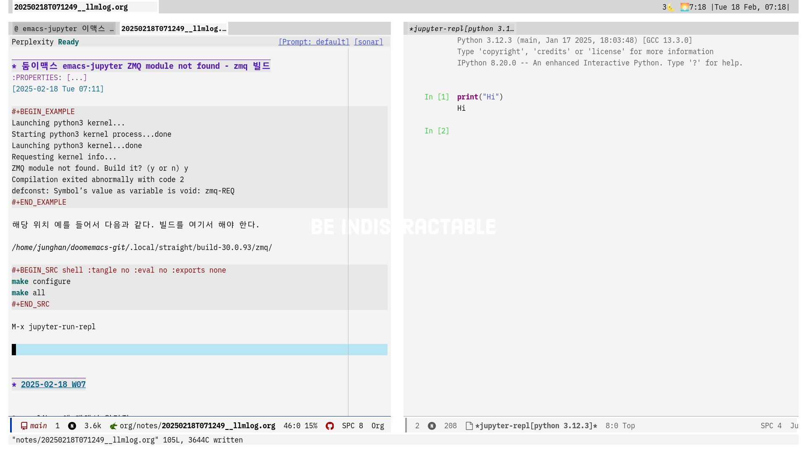

<!-- gid:20250218T071249 -->
[TOC]

[[TIP("이 노트에 대하여")]]
ZeroMQ가 비동기 메시지 커널로서 Jupyter와 Emacs 연동에 어떤 역할을 하는지 정리한다. 파이썬 커널 실행과 빌드 문제를 이해하는 기술적 바탕 노트다.
[[/TIP]]

## BIBLIOGRAPHY

  “Zeromq/Libzmq.” 2025. [https://github.com/zeromq/libzmq](https://github.com/zeromq/libzmq).

## History

-   [2025-02-18 Tue 07:12] 빌드하라고 따로 뺀다.

## zeromq/libzmq :2025

(“Zeromq/Libzmq” 2025)

-   ZeroMQ core engine in C++, implements ZMTP/3.1

The ZeroMQ lightweight messaging kernel is a library which extends the standard socket interfaces with features traditionally provided by specialised messaging middleware products. ZeroMQ sockets provide an abstraction of asynchronous message queues, multiple messaging patterns, message filtering (subscriptions), seamless access to multiple transport protocols and more.

## 둠이맥스 emacs-jupyter ZMQ module not found - zmq 빌드

[2025-02-18 Tue 07:11]

```text
Launching python3 kernel...
Starting python3 kernel process...done
Launching python3 kernel...done
Requesting kernel info...
ZMQ module not found. Build it? (y or n) y
Compilation exited abnormally with code 2
defconst: Symbol’s value as variable is void: zmq-REQ
```

해당 위치 예를 들어서 다음과 같다. 빌드를 여기서 해야 한다.

_home/junghan/doomemacs-git_.local/straight/build-30.0.93/zmq/

```shell
make configure
make all
```

```text
M-x jupyter-run-repl
```

이제 된다.

### 스크린샷

[2025-02-18 Tue 07:19] 

## [2025-02-18 W07](https://wikidocs.net/380399)

@user libzmq에 대해서 알려줘

@assistant **\*libzmq** 는 분산 및 동시성 응용 프로그램에서 사용되는 고성능 비동기 메시징 라이브러리입니다. 이 라이브러리는 **ZeroMQ** 의 핵심 엔진으로, C++98과 일부 C++11 요소를 사용하여 작성되었습니다. libzmq는 다양한 플랫폼에서 사용할 수 있으며, TCP, in-process, inter-process, multicast, WebSocket 등의 전송 방식을 지원합니다.

### 주요 특징

-   **메시지 패턴**: pub/sub, request/reply, client/server 등 다양한 메시지 패턴을 지원합니다.
-   **비동기 처리**: 메시지를 비동기적으로 처리하여 애플리케이션의 성능을 향상시킵니다.
-   **브로커 없음**: 전용 메시지 브로커 없이 동작이 가능합니다.
-   **軽量성**: 메모리 사용량이 적어 임베디드 시스템에도 적합합니다.

### 설치 방법

-   **Linux**: DEB, RPM 패키지를 통해 설치 가능합니다.
-   **Mac OS X**: Homebrew를 사용하여 설치할 수 있습니다.
-   **Windows**: vcpkg 패키지 매니저를 통해 설치할 수 있습니다.

libzmq는 다양한 프로그래밍 언어로 지원되며, 오픈소스 소프트웨어로 개발되었습니다[1][2].

Citations: [1] <https://velog.io/@chy0428/zeroMQ-Introduction> [2] <https://github.com/zeromq/libzmq> [3] <http://wiki.pchero21.com/index.php/Libzmq_Chapter_1_-_Basics> [4] <https://help.rc.ufl.edu/doc/LIBZMQ> [5] <http://wiki.pchero21.com/index.php/Libzmq_Chapter_2_-_Sockets_and_Patterns>

@user emacs-jupyter 패키지에서 zmq를 사용하는 이유는?

@assistant **\*emacs-jupyter 패키지** 에서 **ZeroMQ (ZMQ)** 를 사용하는 이유는 주로 **Jupyter 커널과의 통신** 을 위해입니다. Jupyter는 ZMQ를 통해 커널과 클라이언트 간의 메시지를 전달하며, emacs-jupyter 패키지는 이 기능을 활용하여 Emacs 내에서 Jupyter 커널과 상호작용할 수 있도록 합니다. 이를 통해 REPL 및 org-mode 통합과 같은 기능을 제공합니다[1][2][5].

ZMQ는 비동기 메시징을 지원하여, Emacs와 Jupyter 커널 간의 효율적인 데이터 교환을 가능하게 합니다. 또한, emacs-zmq 패키지와 함께 사용되어 Emacs가 Jupyter 커널과 직접 통신할 수 있도록 합니다[5].

Citations: [1] <https://kitchingroup.cheme.cmu.edu/blog/2017/07/12/Zeromq-bindings-for-Emacs-via-dynamic-modules/> [2] <https://discourse.julialang.org/t/jupyter-integration-with-emacs/21496> [3] <https://necromuralist.github.io/posts/emacs-jupyter/> [4] <https://discourse.jupyter.org/t/jupyter-notebook-zmq-message-arrived-on-closed-channel-error/17869> [5] <https://github.com/emacs-jupyter/jupyter>

@user zeromq는 무엇인가

@assistant **\*ZeroMQ (ZMQ)** 는 분산 및 동시성 애플리케이션에서 사용되는 고성능 비동기 메시징 라이브러리입니다. 이 라이브러리는 소켓 통신을 기반으로 하며, 다양한 전송 방식(TCP, in-process, inter-process, multicast, WebSocket 등)을 지원합니다. ZeroMQ는 전용 메시지 브로커 없이 동작할 수 있으며, **zero broker**, **zero latency**, **zero cost**, **zero administration** 라는 특징을 가지고 있습니다[1][2][3].

ZeroMQ는 여러 가지 메시지 패턴을 지원하며, 대표적인 패턴으로는 **Request-Reply**, **Pub-Sub**, **Pipeline** 등이 있습니다[4]. 이러한 특성 덕분에 ZeroMQ는 다양한 프로그래밍 언어와 플랫폼에서 사용할 수 있으며, 확장성과 모듈화가 용이합니다[3][4].

Citations: [1] <https://grace7040.tistory.com/167> [2] <https://ko.wikipedia.org/wiki/ZeroMQ> [3] <https://grepper.tistory.com/162> [4] <https://hyojabal.tistory.com/7> [5] <http://pchero21.com/?p=3306>

@user
