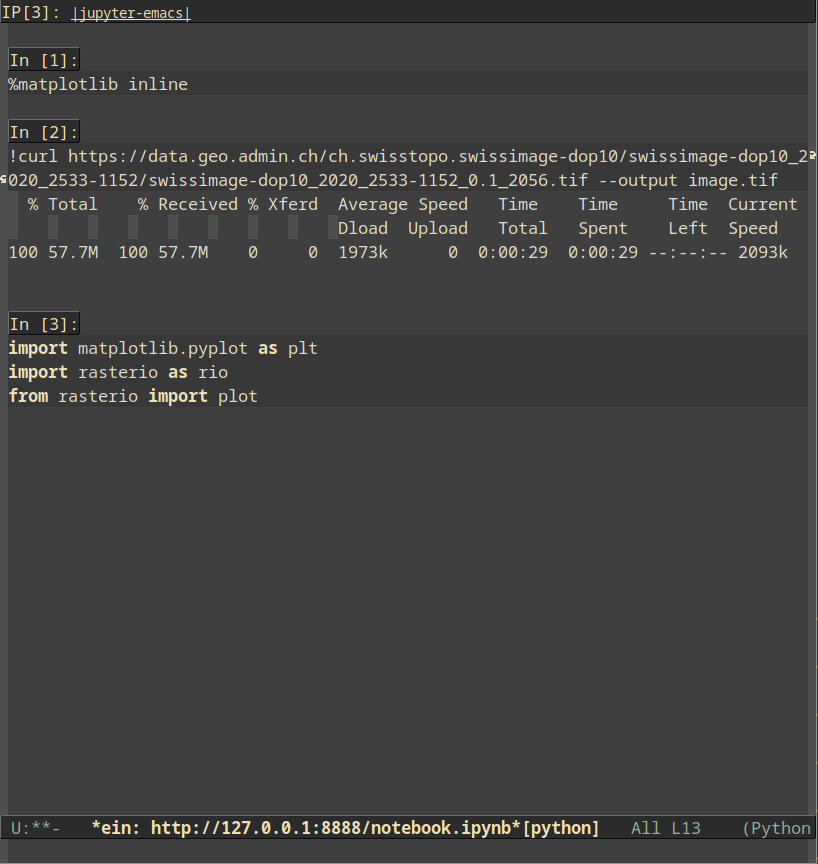
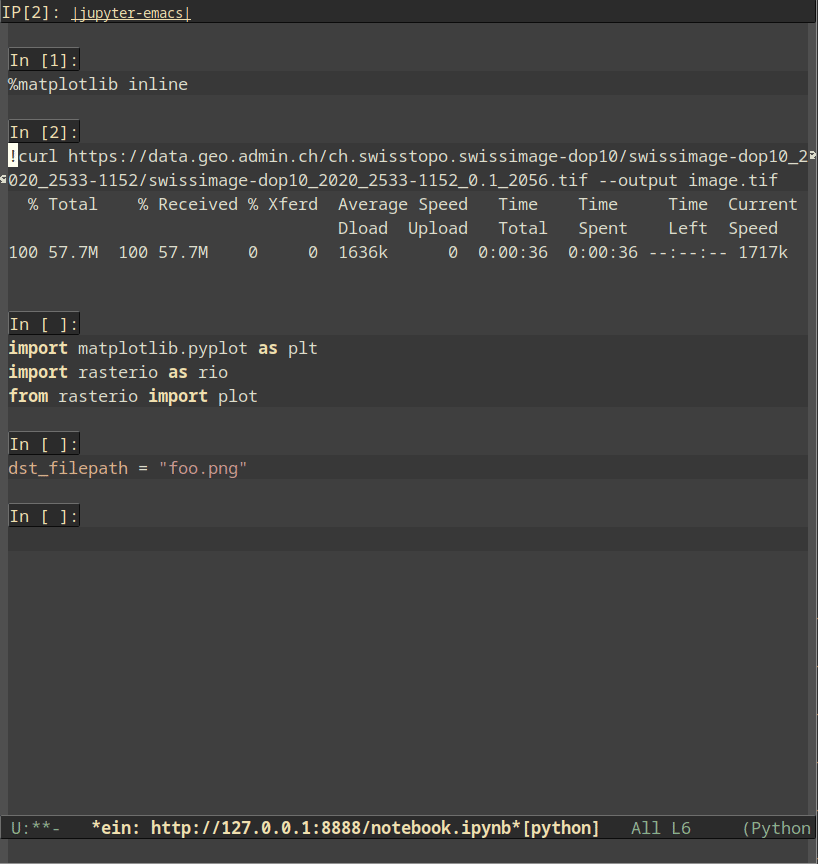
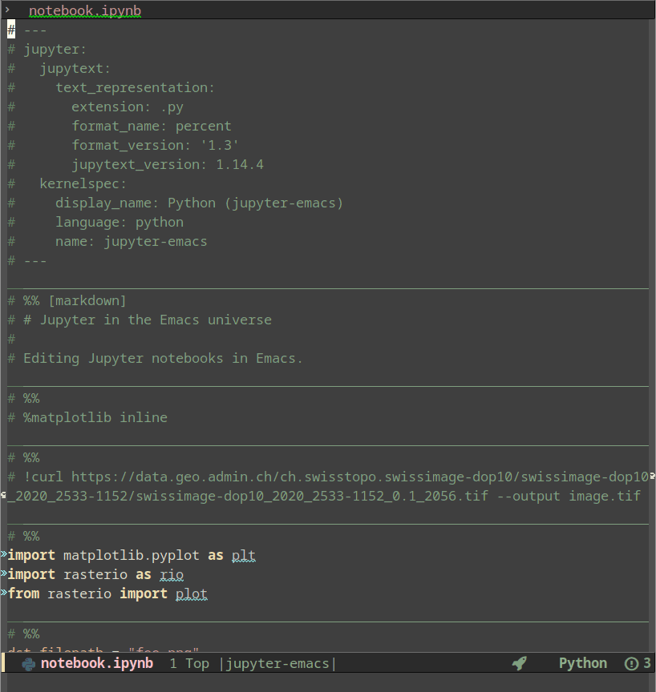
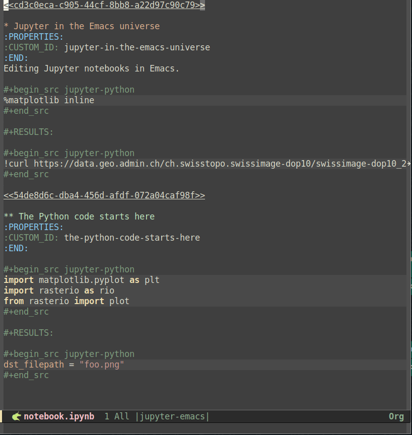
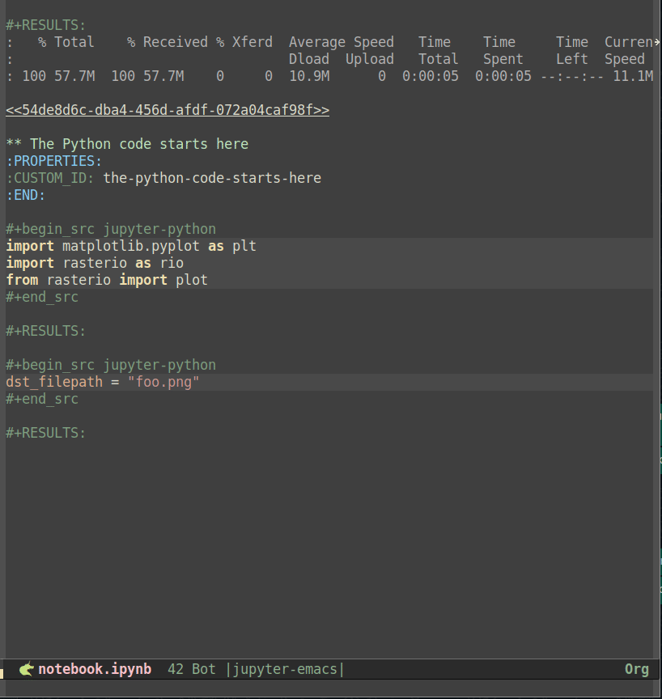

<!-- gid:20250218T151435 -->
[[TIP("이 노트에 대하여")]]
snakemacs가 conda와 mamba를 중심으로 어떤 Python/주피터 환경을 제공하는지 살핀다. 복잡하지만 배울 점이 많은 스타터키트 사례를 읽어 보는 노트다.
[[/TIP]]

<!-- provenance:source:start -->
[[TIP("원본·최신본")]]
이 페이지는 한국어 검색과 읽기를 위한 WikiDocs 미러입니다. [원본·최신본은 가든](https://notes.junghanacs.com/notes/20250218T151435/)에 있습니다. 최신 수정 내용·백링크·태그·히스토리·댓글·출처 정보는 원본 가든에서 확인하세요.

- 작성: `2025-02-18T15:14:00+09:00`
- 최근 수정: `2025-02-18T15:14:00+09:00`
[[/TIP]]
<!-- provenance:source:end -->

[TOC]

## BIBLIOGRAPHY

- Bosch, Martí, and martibosch. 2023. “Jupyter in the Emacs Universe.” May 24, 2023. [https://martibosch.github.io/jupyter-emacs-universe/](https://martibosch.github.io/jupyter-emacs-universe/).
- “Martibosch/Snakemacs: Emacs28 Setup for Python with Conda/Mamba.” 2024. [https://github.com/martibosch/snakemacs](https://github.com/martibosch/snakemacs).

## 관련노트

-   [notes/ 힣: doomemacs-config 간결 실용 심플 텍스트 도구 닷파일: 이맥스 스타터키트 '2024-09-15 2025-03-15](https://wikidocs.net/381314)
-   [notes/ jkitchin/scimax 이맥스 스타터키트 - 파이썬 주피터 '2025-02-18 2025-02-18](https://wikidocs.net/381538)

-   [파이썬 관리자 conda-mamba 패키지 venv-uv 가상환경](https://wikidocs.net/381532)

## History

-   [2025-02-18 Tue 15:14] 콘다 맘마 이건 뭐냐

## martibosch/snakemacs: emacs28 setup for Python with conda/mamba

(“Martibosch/Snakemacs: Emacs28 Setup for Python with Conda/Mamba” 2024)

-   Bosch, Martí
-   emacs28 setup for Python with conda/mamba

## <span class="org-todo done DONE">DONE</span> "Jupyter in the Emacs universe" Bosch, Martí and martibosch

-   (Bosch and martibosch 2023)

-   [2025-02-19 Wed 21:40] 아무래도 너무 말이 많아. 복잡해서 못써.
-   [2025-02-27 Thu 06:28] 아니야. 어마어마한 글이다.

## Jupyter in the Emacs universe | Martí Bosch

Emacs 세계관의 주피터

Wednesday. May 24, 2023 - 32 mins

The Emacs configurations used to reproduce the screencasts are availabe at [github.com/martibosch/snakemacs](https://github.com/martibosch/snakemacs), under dedicated branches named [ein](https://github.com/martibosch/snakemacs/tree/ein), [code-cells-py](https://github.com/martibosch/snakemacs/tree/code-cells-py) and [code-cells-org](https://github.com/martibosch/snakemacs/tree/code-cells-org) respectively (in order of appearance in this blog post). The example notebook with the conda environment required to execute it is available at [github.com/martibosch/jupyter-emacs-post](https://github.com/martibosch/jupyter-emacs-post).

### Jupyter in the Emacs universe

Emacs 세계관의 주피터

> -   2012: The IPython team released the **IPython Notebook**, and the world has never been the same<br />
> -   2012: IPython 팀이 **IPython Notebook 을 출시하고 세상이 완전히 달라졌습니다.**
> 
> -- Jake Vanderplas1<br />
> 
> -   제이크 밴더플라스1

Whether you use Jupyter notebooks or not, it seems hard to disagree with the quote above. I actually did not know that the name "Jupyter" is a reference to the three programming languages to which the IPython notebook was extended in 2014, i.e., Julia, Python and R - again, thank you Wikipedia. By 2018, more than 100 languages were already supported, and quoting Lorena Barba, "For data scientists, Jupyter has emerged as a de facto standard"2. In 2021, Jupyter Notebooks voted by Nature readers as the third software codes that had biggest impact in their work (after the Fortran compiler and the Fast Fourier transform)3.<br /> Jupyter 노트북을 사용하시든 아니든, 위의 인용문에 동의하기는 어려울 것 같습니다. 사실 저는 'Jupyter'라는 이름이 2014년에 IPython 노트북이 확장된 세 가지 프로그래밍 언어, 즉 Julia, Python, R을 가리키는 말이라는 사실을 몰랐습니다(다시 한 번 위키백과에 감사드립니다). 2018년에는 이미 100개 이상의 언어가 지원되었으며, "데이터 과학자들에게 Jupyter 는 사실상 표준으로 부상했다"2라는 Lorena Barba 의 말을 인용해 볼 수 있습니다. 2021년에 네이처 독자들이 선정한 작업에 가장 큰 영향을 미친 세 번째 소프트웨어 코드로(포트란 컴파일러와 패스트 푸리에 변환에 이어)3로 Jupyter Notebook 이 선정되었습니다.

Unlike Nature and Wikipedia, I would break down Jupyter notebooks into three components (instead of two): the user interface (UI) to edit code and text, the kernel that executes the code and the underlying JSON file format with the ".ipynb" extension into which notebooks are saved and shared. Altogether, the first two components are not much of a novelty since they essentially constitue a read--eval--print loop (REPL) environment, which were developed in the 1960s4. In my view, the novelty is more about how the first two occur within a document-like notebook file editing experience which allows not only to write code cells, but also to move, execute and delete them as desired until the overall look of the notebook is considered satisfactory. At this point, one can save and export the notebook, obtaining a visually-appealing document mixing code, documentation and results, which collectively tells a story, aka, a /literate computational narrative/5.<br /> Nature 나 Wikipedia 와 달리, 저는 Jupyter 노트북을 코드와 텍스트를 편집하는 사용자 인터페이스(UI), 코드를 실행하는 커널, 노트북이 저장되고 공유되는 확장자가 ".ipynb"인 기본 JSON 파일 형식의 세 가지 구성 요소(두 가지가 아닌)로 나누고 싶습니다. 처음 두 구성 요소는 본질적으로 1960년대에 개발된 읽기-평가-출력 루프(REPL) 환경을 구성하기 때문에 그다지 새롭지 않습니다4. 제가 보기에 참신함은 문서와 같은 노트북 파일 편집 환경에서 코드 셀을 작성할 수 있을 뿐만 아니라 노트북의 전체적인 모양이 만족스러워질 때까지 원하는 대로 이동, 실행, 삭제할 수 있다는 점에 더 있습니다. 이 시점에서 노트북을 저장하고 내보내면 코드, 문서, 결과가 혼합된 시각적으로 매력적인 문서를 얻을 수 있으며, 이를 종합하여 스토리를 전달하는 일명 /컴퓨팅 내러티브/5가 됩니다.

However, this editing freedom comes at a non-negligible cost, i.e., the risk of exporting an inconsistent computational pipeline after moving and deleting cells that have been executed (potentially several times). As a matter of fact, in 2019, a study collected a corpus of ~1.16M notebooks from GitHub and found that only 3.17% could be executed providing the same results. Many experienced programmers have raised warnings about how notebooks obscure the state, which can be especially dangerous for beginners6. Additionally, the JSON-based ipynb format of vanilla Jupyter notebooks poses many challenges when it comes to version control, practically requiring you to use external tools such as [Jupytext](https://github.com/mwouts/jupytext) and [nbdime](https://github.com/jupyter/nbdime) to prosper in the face of adversity. But I think that in any case, it is fair to say that, _if used properly_, Jupyter notebooks are a very powerful tool.<br /> 하지만 이러한 편집의 자유에는 무시할 수 없는 비용, 즉 실행된 셀을 이동하고 삭제한 후 일관되지 않은 계산 파이프라인을 내보낼 수 있는 위험(잠재적으로 여러 번)이 따릅니다. 실제로 2019년에 한 연구에 따르면 GitHub 에서 약 116만 개의 노트북을 수집한 결과 3.17%만이 동일한 결과를 제공하는 것으로 나타났습니다. 많은 숙련된 프로그래머들이 노트북이 상태를 가리는 방식에 대해 경고를 제기했으며, 이는 초보자에게 특히 위험할 수 있습니다6. 또한 바닐라 Jupyter 노트북의 JSON 기반 ipynb 형식은 버전 관리와 관련하여 많은 문제를 야기하며, 실제로 [Jupytext](https://github.com/mwouts/jupytext) 및 [nbdime](https://github.com/jupyter/nbdime)과 같은 외부 도구를 사용해야 역경에 맞서 번영할 수 있습니다. 하지만 어쨌든 _올바르게 사용한다면_ 주피터 노트북은 매우 강력한 도구라고 말할 수 있다고 생각합니다.

Let us now go back to the first of the three components of notebooks outlined above, namely the interface to edit notebooks. The Project Jupyter provides two options, both in the form of a web application: the classic Jupyter Notebook and JupyterLab, with the latter providing a more fully-featured integrated development environment (IDE) to edit notebooks and other text files, run consoles and manage files. Additionally, many other options have emerged in view of the popularity of Jupyter noteebooks, both web-based (e.g., Google Colab, Azure Machine Learning, GitHub Codespaces, DeepNote...) and client-based (e.g., VSCode, PyCharm, DataSpell...). Nevertheless, for Emacs users such as myself, these are hardly viable options, even when using extensions to emulate Emacs key bindings. Therefore, the goal of this post is to explore which Emacs configurations provide the best Jupyter-like experience.<br /> 이제 위에서 설명한 노트북의 세 가지 구성 요소 중 첫 번째 요소, 즉 노트북 편집 인터페이스로 돌아가 보겠습니다. 프로젝트 주피터는 웹 애플리케이션 형태의 두 가지 옵션, 즉 클래식 Jupyter Notebook 과 JupyterLab 을 제공하며, 후자는 노트북과 기타 텍스트 파일 편집, 콘솔 실행, 파일 관리를 위한 보다 완벽한 기능의 통합 개발 환경(IDE)을 제공합니다. 또한, 웹 기반(예: Google Colab, Azure 머신 러닝, GitHub 코드스페이스, DeepNote...)과 클라이언트 기반(예: VSCode, PyCharm, DataSpell...)의 Jupyter 노트북의 인기로 인해 다른 많은 옵션이 등장했습니다. 하지만 저와 같은 Emacs 사용자에게는 확장 프로그램을 사용하여 Emacs 키 바인딩을 에뮬레이트하는 경우에도 이러한 옵션이 거의 실행 가능하지 않습니다. 따라서 이 글의 목표는 어떤 Emacs 구성이 가장 Jupyter 와 유사한 환경을 제공하는지 살펴보는 것입니다.

### Desired features

Before we go any further, it is worth noting that this post is inevitably _highly opinionanted_, or in other words, influenced by the way in which I use Jupyter notebooks, which is twofold. First, like most users, I use notebook to interactively explore, e.g., a dataset, a library or the like. As the notebook code becomes more mature, I may manually move it to Python modules or scripts. Such a development process can lead to both Python libraries or data science repositories. This brings me to the second way in which I use notebooks, namely to _tell a story_, which can either be the documentation or user guide for a Python library as well as the computational pipeline to reproduce the results of an academic article.<br /> 더 진행하기 전에 이 글은 필연적으로 <span class="underline">의견이 많이 반영되어 있다는 점, 다시 말해 제가 Jupyter 노트북을 사용하는 방식에 두 가지 영향을 받았다는 점을 말씀드리고 싶습니다. 첫째, 대부분의 사용자와 마찬가지로 저는 노트북을 사용해 데이터 세트, 라이브러리 등을 대화식으로 탐색합니다. 노트북 코드가 더 성숙해지면 수동으로 Python 모듈이나 스크립트로 옮길 수도 있습니다. 이러한 개발 프로세스는 Python 라이브러리 또는 데이터 과학 리포지토리로 이어질 수 있습니다. 제가 노트북을 사용하는 두 번째 방법, 즉 /tell a story</span> 에 대해 설명하자면, 이는 Python 라이브러리의 설명서나 사용자 가이드가 될 수도 있고 학술 논문의 결과를 재현하는 계산 파이프라인이 될 수도 있습니다./

Based on what has been said so far, the main desired features, in no particular order, are the following:<br /> 지금까지 말씀드린 내용을 바탕으로 특별한 순서 없이 원하는 주요 기능은 다음과 같습니다:

-   **Beyond (Python) code**: mixing **Python** (or another programming another language), **markdown** and **inline plots** can constitute a great recipe to create _literate computational narratives_, so it is important to ensure that the Emacs setup supports them - otherwise there is practically no reason to use a hardly human-readable JSON-based format instead of plain text ".py" files.<br /> **(파이썬) 코드 너머**: (또는 다른 언어 프로그래밍), **마크다운** 및 **인라인 플롯** 을 혼합하면 <span class="underline">문어체 계산 내러티브</span> 를 만드는 훌륭한 레시피가 될 수 있습니다, 그렇지 않으면 일반 텍스트 대신 사람이 거의 읽을 수 없는 JSON 기반 형식을 사용할 이유가 거의 없으므로 Emacs 설정이 이를 지원하는지 확인하는 것이 중요합니다.py” 파일을 사용할 이유가 없습니다.
-   **Proper version control _with the possibility to include cell outputs_**: following the previous point, I am convinced that Jupyter notebooks would not have been this successful if web platforms such as GitHub or GitLab did not offer a rich rendering of notebook files, as reading them directly in the browser can be a very convenient way to navigate _computational narratives_ such as tutorials, computational pipelines to reproduce an academic paper or the like. From this perspective, it is essential that the version-controlled notebooks _can_ include the cell outputs - I emphasize the _can_, because in some use cases, it may be better to strip out the cell outputs to reduce file sizes and to ease version control, yet it is important that the option to include the outputs exists.<br /> **적절한 버전 관리 _셀 출력을 포함할 수 있는 가능성_**: 앞의 지적에 이어, 브라우저에서 직접 노트북 파일을 읽는 것은 튜토리얼, 학술 논문 등을 재현하기 위한 계산 파이프라인 등과 같은 <span class="underline">컴퓨팅 내러티브</span> 를 탐색하는 매우 편리한 방법이 될 수 있으므로 GitHub 나 GitLab 과 같은 웹 플랫폼이 풍부한 렌더링을 제공하지 않았다면 Jupyter 노트북이 이렇게 성공하지 못했을 것이라고 확신합니다. 이러한 관점에서 볼 때, 버전 제어 노트북 <span class="underline">can</span> 에는 셀 출력이 포함되어 있어야 합니다. <span class="underline">can</span> 을 강조하는 이유는 일부 사용 사례에서는 파일 크기를 줄이고 버전 관리를 쉽게 하기 위해 셀 출력을 제거하는 것이 더 좋을 수도 있지만 출력을 포함하는 옵션이 존재하는 것이 중요하기 때문입니다.
-   **IDE features (environment-aware and notebook-wide)**: as highlighted in the introduction, the out-of-order editing and execution of notebooks can dangerously obscure the state, which can be prone to errors and elusive results. Features provided by IDEs such as completion, documentation, on-the-fly syntax checking, navigation, refactoring and the like can help prevent many of these issues. In Emacs, there are several options to provide these IDE features7 - the two main challenges are to ensure that IDE features are aware of the Python environment used in each Emacs buffer, and notebook-wide, i.e., using information (such as imports and variables) defined not only in the cell being edited but in all the notebook cells.<br /> **IDE 기능(환경 인식 및 노트북 전체)**: 서론에서 강조했듯이, 노트북의 편집과 실행이 순서를 벗어나면 상태가 위험할 정도로 모호해져 오류가 발생하기 쉽고 결과를 파악하기 어려울 수 있습니다. 완성, 문서화, 즉석 구문 검사, 탐색, 리팩터링 등과 같은 IDE 에서 제공하는 기능은 이러한 문제를 방지하는 데 도움이 될 수 있습니다. Emacs 에서는 이러한 IDE 기능을 제공하는 몇 가지 옵션이 있습니다7 - 두 가지 주요 과제는 IDE 기능이 각 Emacs 버퍼에서 사용되는 Python 환경을 인식하고 노트북 전체, 즉 편집 중인 셀뿐만 아니라 모든 노트북 셀에 정의된 정보(가져오기 및 변수 등)를 사용하도록 하는 것입니다.

### Overview of Emacs configurations for Jupyter notebooks

Jupyter 노트북용 Emacs 구성 개요

The following sections assume an overall setup in which multiple virtual Python environments coexist in the same computer. To this end, my configuration8 uses conda (or more precisely, its _much faster_ reimplementation named [mamba](https://github.com/mamba-org/mamba)), with automatic detection and activation of the right conda environment for a buffer using [conda.el](https://github.com/necaris/conda.el). Then, Jupyter interacts with conda environments using the [ipykernel](https://github.com/ipython/ipykernel) package9.<br />

다음 섹션에서는 동일한 컴퓨터에 여러 가상 파이썬 환경이 공존하는 전체 설정을 가정합니다. 이를 위해, 제 구성8에서는 conda(또는 더 정확하게는 [mamba](https://github.com/mamba-org/mamba)라는 _much faster_ 재구현을 사용하여 버퍼에 적합한 conda 환경을 자동 감지 및 활성화하고, [conda 를 사용합니다.el](https://github.com/necaris/conda.el). 그런 다음, Jupyter 는 [ipykernel](https://github.com/ipython/ipykernel) 패키지9를 사용하여 conda 환경과 상호 작용합니다.

Although I believe that conda features major advantages over other virtual environment and package managers10, it should be possible to achieve an analogous setup using alternative tools (e.g., virtualenv and pip11). Similarly, my configuration uses [pyright](https://github.com/microsoft/pyright) (which actually [can be installed using conda](https://anaconda.org/conda-forge/pyright))12, a language server protocol (LSP) to obtain IDE features, but feel free to use another tool (e.g., [eglot](https://github.com/joaotavora/eglot)) if you prefer.<br />

다른 가상 환경 및 패키지 관리자10에 비해 conda 가 큰 장점이 있다고 생각하지만, 대체 도구(예: virtualenv 및 pip11를 사용하여 유사한 설정을 수행할 수 있어야 합니다.) 마찬가지로, 내 구성은 [pyright](https://github.com/microsoft/pyright)(실제로는 [콘다를 사용하여 설치할 수 있음)](https://anaconda.org/conda-forge/pyright)[12](https://martibosch.github.io/jupyter-emacs-universe/#fn:snakemacs-caveat), 언어 서버 프로토콜(LSP)을 사용하여 IDE 기능을 얻지만 다른 도구를 자유롭게 사용할 수 있습니다(예를 들어, [eglot](https://github.com/joaotavora/eglot))을 사용해도 됩니다.

Let us now finally move on to experiencing Jupyter notebooks in Emacs.<br /> 이제 드디어 Emacs 에서 Jupyter 노트북을 경험해 보겠습니다.

#### EIN

The first option is [Emacs IPython Notebook (EIN)](https://github.com/millejoh/emacs-ipython-notebook). Using it [requires very little Emacs configuration](https://github.com/martibosch/snakemacs/tree/ein) and is quite straightforward: we need to launch a jupyter notebook server (e.g., by running `jupyter notebook` in a shell or running `M-x ein:run` in Emacs), then run `M-x ein:login`. Then, we can either open an existing notebook or select a kernel and create a new notebook. The key bindigns are very convenient and provide a very jupyter-like experience: `C-c C-a` and `C-c C-b` respectively create cells above and below the current cell, cells can be moved up and down using `M-<up>` and `M-<down>`, `C-c C-c` executes the current cell, `C-c C-w` copies the current cell and `C-c C-y` yanks it, and other bindings allow executing all cells, restarting the kernel and many more. Additionally, you can easily mix Python with markdown, IPython magics, inline plots and shell commands.<br /> 첫 번째 옵션은 [Emacs IPython 노트북(EIN)](https://github.com/millejoh/emacs-ipython-notebook)입니다. 이 옵션을 사용하면 [Emacs 구성이 거의 필요하지 않으며 매우 간단합니다, 셸에서 `jupyter notebook` 를 실행하거나 Emacs 에서 `M-x ein:run` 를 실행하여), `M-x ein:login` 으로 실행하면 됩니다. 그런 다음 기존 노트북을 열거나 커널을 선택해 새 노트북을 만들 수 있습니다. 키 바인딩은 매우 편리하고 주피터와 매우 유사한 경험을 제공합니다: `C-c C-a` 와 `C-c C-b` 는 각각 현재 셀의 위와 아래에 셀을 만들고, `M-<up>` 와 `M-<down>` 를 사용해 위 아래로 이동시킬 수 있습니다, `C-c C-c` 는 현재 셀을 실행하고, `C-c C-w` 는 현재 셀을 복사하고, `C-c C-y` 는 셀을 잡아당기는 등 다른 바인딩을 사용하면 모든 셀을 실행하고 커널을 다시 시작하는 등의 다양한 작업을 수행할 수 있습니다. 또한 Python 과 마크다운, IPython 매직, 인라인 플롯, 셸 명령을 쉽게 혼합할 수 있습니다.](https://github.com/martibosch/snakemacs/tree/ein)



Creating a new notebook for a specific Jupyter kernel is also quite straight-forward, i.e., the `ein:notebooklist` buffer lets you select an option among the existing kernels, and then you just need to click the `[New Notebook]` button.<br /> 특정 Jupyter 커널을 위한 새 노트북을 만드는 것도 매우 간단합니다. 즉, `ein:notebooklist` 버퍼에서 기존 커널 중에서 옵션을 선택한 다음 `[새 노트북]` 버튼을 클릭하기만 하면 됩니다.

While EIN provides an Emacs interface to emulate the web-based Jupyter notebook with its major advantages (i.e., cell organization, markdown rendering, inline results and plots...), such a resemblance comes at the cost of raising several important issues that require careful consideration. First, the "undo" command only works within a given cell, leading to unintuitive undo behaviors when moving accross cells13. Furthermore, a critical aspect to consider is that there is no "undo" for cell deletion, which can easily prompt one to very strongly regret certain typing mistakes. Similarly, [Emacs auto-saving and file recovery features](https://www.gnu.org/software/emacs/manual/html_node/emacs/Auto-Save.html) do not apply to "ipynb" files edited with EIN, so you can easily lose valuable work if your computer crashes.<br /> EIN 은 셀 구성, 마크다운 렌더링, 인라인 결과 및 플롯 등 웹 기반 Jupyter 노트북의 주요 장점들을 에뮬레이트하는 Emacs 인터페이스를 제공하지만, 이러한 유사성 때문에 신중한 고려가 필요한 몇 가지 중요한 문제가 발생하게 되는 대가를 치르게 됩니다. 첫째, '실행 취소' 명령은 지정된 셀 내에서만 작동하므로 셀 간에 이동할 때 직관적이지 않은 실행 취소 동작이 발생합니다13. 또한 셀 삭제에 대한 '실행 취소' 기능이 없기 때문에 입력 실수를 매우 강하게 후회할 수 있다는 점도 고려해야 할 중요한 측면입니다. 마찬가지로, [Emacs 자동 저장 및 파일 복구 기능](https://www.gnu.org/software/emacs/manual/html_node/emacs/Auto-Save.html)은 EIN 으로 편집한 'ipynb' 파일에는 적용되지 않으므로 컴퓨터가 충돌하는 경우 소중한 작업을 쉽게 잃어버릴 수 있습니다.

Finally, IDE features in EIN are provided using [elpy](https://github.com/jorgenschaefer/elpy), which provides notebook-wide completion, navigation and documentation, and can be environment aware by using `pyvenv-activate` or `pyvenv-workon`. However, based on my experience (and other users have reported similarly), the main issue with elpy is that [the background elpy process](https://elpy.readthedocs.io/en/latest/concepts.html#the-rpc-process) quickly ends up consiming an entire CPU and provides very slow responses. See a minimal example of how completions and documentation easily become excessively slow:<br /> 마지막으로, 노트북 전체의 완성, 탐색 및 문서화를 제공하는 [elpy](https://github.com/jorgenschaefer/elpy)를 사용하여 EIN 의 IDE 기능을 제공하며, `pyvenv-activate` 또는 `pyvenv-workon` 를 사용하여 환경을 인식할 수 있습니다. 그러나 제 경험에 따르면(그리고 다른 사용자들도 비슷한 보고를 한 바 있습니다) elpy 의 주요 문제는 [백그라운드 elpy 프로세스가 전체 CPU 를 빠르게 소모하고 매우 느린 응답을 제공한다는 것입니다. 완료 및 문서화가 얼마나 쉽게 지나치게 느려지는지 보여주는 최소한의 예를 참조하세요:](https://elpy.readthedocs.io/en/latest/concepts.html#the-rpc-process)



Moreover, as of May 2023, elpy is unmantained, which I hope that prompts the EIN developers to switch to a LSP client or another package to provide IDE features.<br /> 또한 2023년 5월부터 elpy 는 유지 관리되지 않으므로 EIN 개발자가 LSP 클라이언트 또는 다른 패키지로 전환하여 IDE 기능을 제공하도록 유도할 수 있기를 바랍니다.

#### code-cells and emacs-jupyter : 코드 셀 및 이맥스-주피터

Emacs 가 Jupyter 커널과 상호 작용할 수 있도록 하는 또 다른 주목할 만한 옵션은 [emacs-jupyter](https://github.com/nnicandro/emacs-jupyter) 패키지입니다. EIN 과의 가장 큰 차이점은 emacs-jupyter 가 노트북 편집을 위한 그래픽 UI 를 제공하지 않는다는 점입니다. 대신, Emacs 내에서 Jupyter 커널과의 기본 상호 작용만 제공하므로 사용자가 노트북 편집 인터페이스를 더 자유롭게 선택할 수 있습니다.

The most straight-forward way to use emacs-jupyter is to use the `M-x jupyter-run-repl` command to run a REPL using a specific Jupyter kernel, open a ".py" file (or whichever language extension corresponds to the Jupyter kernel), write Python code and send the desired lines, regions or the whole buffer to the REPL. While many developers may be perfectly happy with such an approach, it does not represent any major conceptual change with respect to the initial design of the REPL environments in the 1960s. Therefore, it is missing two of the main strengths of Jupyter notebooks, i.e., the organizational compartmentalization provided by notebook cells and the _storytelling_ ability of the exported notebook file, mixing programming code, markdown and inline plots.<br />

emacs-jupyter 를 사용하는 가장 간단한 방법은 `M-x jupyter-run-repl` 명령을 사용하여 특정 Jupyter 커널을 사용하여 REPL 을 실행하고 ".py" 파일(또는 Jupyter 커널에 해당하는 언어 확장자)을 열고 Python 코드를 작성하여 원하는 줄, 영역 또는 전체 버퍼를 REPL 로 전송하는 것입니다. 많은 개발자가 이러한 접근 방식에 완벽하게 만족할 수도 있지만, 1960년대에 REPL 환경의 초기 설계와 관련하여 큰 개념적 변화를 나타내지는 않습니다. 따라서 노트북 셀이 제공하는 조직적 구획화와 내보낸 노트북 파일의 스토리텔링 기능, 프로그래밍 코드, 마크다운, 인라인 플롯의 혼합 등 Jupyter 노트북의 주요 강점 중 두 가지가 빠져 있습니다.

In order to emulate the cell-like organization of Jupyter notebooks, [code-cells](https://github.com/astoff/code-cells.el) provides a lightweight mode to read, edit and write ".ipynb" files. To that end, it first converts the JSON-based ".ipynb" file to a plain-text script representation, in which certain Python comment syntax is interpreted as cell boundaries. By default, such a conversion is performed by Jupytext (which needs to be installed separately), but it can easily be configured to use any other command (e.g., pandoc) by customizing the `code-cells-convert-ipynb-style`. In fact, it is also possible to convert ".ipynb" files to another format such as markdown or [org](https://orgmode.org/), and then edit them in the associated Emacs mode.<br />

Jupyter 노트북의 셀과 같은 구성을 에뮬레이션하기 위해 [code-cells](https://github.com/astoff/code-cells.el)는 ".ipynb" 파일을 읽고, 편집하고, 쓸 수 있는 경량 모드를 제공합니다. 이를 위해 먼저 JSON 기반 ".ipynb" 파일을 일반 텍스트 스크립트 표현으로 변환하고, 여기서 특정 Python 주석 구문이 셀 경계로 해석됩니다. 기본적으로 이러한 변환은 Jupytext(별도로 설치해야 함)에 의해 수행되지만, `code-cells-convert-ipynb-style` 을 사용자 지정하여 다른 명령(예: pandoc)을 사용하도록 쉽게 구성할 수 있습니다. 또한 ".ipynb" 파일을 마크다운이나 [org 와 같은 다른 형식으로 변환한 다음 연결된 Emacs 모드에서 편집할 수도 있습니다.](https://orgmode.org/)

##### Notebooks as Python scripts Python 스크립트로서의 노트북

When opening an existing notebook using the default settings, it is automatically converted to a Python script, with line comments of the form `# %%` defining cell boundaries. Additionally, the converted file begins with a YAML-like header block enclosed by two comment lines of the form `# ---`, which includes notebook metadata such as the kernel information as well as Jupytext format and version information. In order to execute cells, we can run `M-x jupyter-repl-associate-buffer` to associate the buffer to an existing emacs-jupyter REPL or create a new one choosing the appropriate Jupyter kernel. Cells with shell commands and IPython magics can be commented, which avoids syntax checking errors and allows the other IDE features to work properly14. An associated caveat is that such cells have to be uncommented before they can be evaluated by emacs-jupyter - otherwise we are just evaluating Python comments and thus seeing no effect whatsoever15. The following screencast illustrates how a notebook can be edited as Python script and its cells can be executed interactively using emacs-jupyter:<br />

기본 설정을 사용해 기존 노트북을 열면 셀 경계를 정의하는 `# %%` 형식의 줄 주석과 함께 Python 스크립트로 자동 변환됩니다. 또한, 변환된 파일은 커널 정보와 같은 노트북 메타데이터와 Jupytext 형식 및 버전 정보를 포함하는 `# ---` 형식의 주석 두 줄로 둘러싸인 YAML 과 유사한 헤더 블록으로 시작됩니다. 셀을 실행하기 위해 `M-x jupyter-repl-associate-buffer` 를 실행해 버퍼를 기존 emacs-jupyter REPL 에 연결하거나 적절한 Jupyter 커널을 선택해 새로 만들 수 있습니다. 셸 명령과 IPython 매직이 있는 셀에 주석을 달 수 있으므로 구문 검사 오류를 방지하고 다른 IDE 기능이 제대로 작동할 수 있습니다14. 관련 주의 사항은 이러한 셀은 주석을 제거해야 emacs-jupyter 에서 평가할 수 있다는 것입니다. 그렇지 않으면 Python 주석만 평가하므로 아무런 효과가 없습니다15. 다음 스크린캐스트는 노트북을 Python 스크립트로 편집하고 그 셀을 emacs-jupyter 를 사용해 대화형으로 실행하는 방법을 보여 줍니다:



The fact that we are editing a Python file-like buffer has several key advantages when compared to the web-like interface of EIN, i.e., IDE features work fast and other basic features such as undo, auto saving and recovery work as in any regular Emacs file. However, in my view, notebooks are displayed more nicely in EIN: there is no need for a YAML-like header block16, cells feel more demarcated, markdown cells can be properly rendered instead of appearing as Python comments and most importantly, cell outputs (including plots) appear within the same notebook buffer. The latter brings me to the main shortcoming of this approach: as of May 2023, it is not possible to include the cell outputs in script representations of Jupyter notebooks17. As discussed in the introduction, this can be a crucial deficiency as it disables one of the major strengths of Jupyter notebooks, namely their _storytelling_ ability. Without displaying cell outputs, notebooks are no longer such a suitable medium for tutorials, documentation or supporting materials of an academic article. Nonetheless, the combination of code-cells, Jupytext and emacs-jupyter can be very well suited to use cases where cell outputs can be ommited.<br />

파이썬 파일과 유사한 버퍼를 편집한다는 사실은 웹과 유사한 인터페이스의 EIN 과 비교할 때 몇 가지 주요 장점이 있습니다. 즉, IDE 기능이 빠르게 작동하고 실행 취소, 자동 저장 및 복구와 같은 기타 기본 기능이 일반 Emacs 파일에서처럼 작동한다는 점입니다. 하지만 제가 보기에 노트북은 EIN 에서 더 멋지게 표시됩니다. YAML 과 같은 헤더 블록16이 필요 없고, 셀이 더 구분된 느낌이 들고, 마크다운 셀이 Python 주석으로 표시되는 대신 제대로 렌더링되며 가장 중요한 것은 셀 출력(플롯 포함)이 동일한 노트북 버퍼 내에 나타난다는 점입니다. 후자는 이 접근 방식의 가장 큰 단점으로, 2023년 5월 현재 Jupyter 노트북의 스크립트 표현에 셀 출력을 포함할 수 없습니다17. 서론에서 설명했듯이, 이는 Jupyter 노트북의 주요 강점 중 하나인 _스토리텔링 기능을 비활성화하기 때문에 치명적인 결함이 될 수 있습니다. 셀 출력을 표시하지 않는 노트북은 더 이상 튜토리얼, 문서 또는 학술 논문의 보조 자료로 적합한 매체가 아닙니다. 그럼에도 불구하고 코드-셀, Jupytext, emacs-jupyter 의 조합은 셀 출력을 생략할 수 있는 사용 사례에 매우 적합할 수 있습니다._

Finally, [the configuration provided for this section of the post](https://github.com/martibosch/snakemacs/tree/code-cells-py) includes a couple of changes. First, I have found the default key bindings (all prefixed with `C-c %`) rather impractical, so the cell navigation, moving and execution key bindings are redefined to mimic EIN. Secondly, unlike EIN, code-cells and Jupytext do not provide any command to create a new notebook (with its metadata), so the configuration includes a function named `my/new-notebook`, which takes the new notebook file path and the desired Jupyter kernel as arguments.<br />

마지막으로, 이 글의 이 섹션에 제공된 구성에는 몇 가지 변경 사항이 있습니다. 첫째, 기본 키 바인딩(모두 `C-c %` 로 접두사가 붙는)이 다소 비실용적이라는 것을 발견하여 셀 탐색, 이동 및 실행 키 바인딩을 EIN 을 모방하도록 재정의했습니다. 둘째, EIN 과 달리 코드 셀과 Jupytext 는 새 노트북(메타데이터 포함)을 만드는 명령을 제공하지 않기 때문에 새 노트북 파일 경로와 원하는 Jupyter 커널을 인수로 받는 `my/new-notebook` 라는 함수가 구성에 포함되어 있습니다.

##### Notebooks as org files  조직 파일로서의 노트북

이름에서 알 수 있듯이, [org mode](https://orgmode.org/)는 처음에는 노트와 작업을 정리하기 위해 Emacs 로 만들어졌습니다. 하지만 가벼운 마크업 언어로 시작한 것이 훨씬 더 강력한 시스템으로 빠르게 발전했는데, 특히 사용자가 조직 파일 내에 [소스코드 블록](https://orgmode.org/worg/org-contrib/babel/)을 포함하고 실행할 수 있는 조직 모드의 기능인 18 덕분에 더욱 강력해졌죠. 사실, 같은 파일에서 여러 프로그래밍 언어를 사용할 수 있고 더 풍부하고 유연한 내보내기 기능을 제공한다는 점에서 org 와 Babel 이 상당한 상위 기능을 제공한다고 볼 수 있습니다.

It is actually [very easy to configure code-cells to automatically convert notebooks to org files and edit them accordingly](https://github.com/martibosch/snakemacs/tree/code-cells-org) - provided that pandoc is installed, `code-cells-convert-ipynb-style`:<br />

실제로 코드 셀을 구성해 노트북을 자동으로 조직 파일로 변환하고 그에 따라 편집하는 것은 매우 쉽습니다. `code-cells-convert-ipynb-style` - pandoc 이 설치되어 있다면요:

When opening the example notebook using the above configuration, the resulting org buffer converts Jupyter cells to [org code blocks](https://orgmode.org/manual/Structure-of-Code-Blocks.html) with the `jupyter-python` language identifier, with the markdown cells which are translated to [org syntax](https://orgmode.org/worg/org-syntax.html) (which start with a line of the form `<<a0c84e00>>` that corresponds to the Jupyter cell id). Like when editing notebooks as Python scripts, we need a running emacs-jupyter REPL to evaluate code blocks. However, to execute `jupyter-python` blocks in org mode, we also need [a session](https://orgmode.org/org.html#Using-sessions), which is started by the Jupyter kernel and maintains the state, e.g., including any variables or objects that have been defined so that they can be shared between code blocks. Sessions can be defined using the `session` [header argument](https://orgmode.org/org.html#Using-Header-Arguments), e.g.:<br />

By default, `emacs-jupyter` uses the kernel associated with the currently active environment (see a dedicated section about this in the introduction above), yet this can be overridden by setting the `:kernel` header argument. Additionally, it is most certainly desirable to set the `:async` header argument to `yes` to allow asynchronous execution of code-blocks - otherwise the buffer will be completely stalled until the code execution is completed. Altogether, an example code block looks as follows:<br />

While this highlights another advantage of org over Jupyter, namely the ability to use multiple languages and sessions in a single file, having to set these header arguments in each code block is quite verbose when only a single session and language is required - which surely corresponds to most use cases. Luckily, such a repetition can easily be avoided by setting the `header-args` property at the beginning of the file19:<br />

```text
#+PROPERTY: header-args:jupyter-python :session foo :kernel jupyter-emacs
#+PROPERTY: header-args:jupyter-python+ :async yes
```

so that all `jupyter-python` src blocks include the defined header arguments implicitly. Note that although it is beyond the scope of this post, it is further possible to set the `session` property to use remote kernels and much more20. In any case, once the session and the kernel have been properly configured, code blocks can be executed using the `C-c C-c` key bindings. The screencast below shows how the example notebook can be set up and executed as an org file buffer:<br /> 를 추가하여 모든 `jupyter-python` src 블록에 정의된 헤더 인수가 암시적으로 포함되도록 합니다. 이 글의 범위를 벗어나지만 원격 커널 등을 사용하도록 `session` 속성을 설정하는 것도 가능합니다20. 어떤 경우든 세션과 커널이 올바르게 구성되면 `C-c C-c` 키 바인딩을 사용하여 코드 블록을 실행할 수 있습니다. 아래 스크린캐스트는 예제 노트북을 조직 파일 버퍼로 설정하고 실행하는 방법을 보여줍니다:



Likewise notebooks as Python scripts, org files are plain text, so the basic Emacs undo, auto saving and recovery work out of the box. Additionally, code blocks feel more demarcated than comment-delimited cells in Python scripts, and results can be displayed inline, including images - to that end, run `org-toggle-inline-images` (by default bound to `C-c C-x C-v`) after a code block producing an image has been executed21. Regarding key bindings, new code blocks (and other kinds of [org mode blocks](https://orgmode.org/org.html#Blocks-1)) can be inserted using the `org-insert-structure-template` command, by default bound to `C-c C-,`, and [Babel provides a series of useful functions bound to the `C-c C-v` prefix](https://orgmode.org/org.html#Key-bindings-and-Useful-Functions) that facilitate navigating to the next or previous code block (using `C-c C-v n` or `C-c C-v p` respectively) as well as to execute all code blocks in the buffer (bound to `C-c C-v b`). Even though I find these key bindings to be less handy than its counterparts in EIN and code-cells, this is understandable as org mode provides much more features and flexibility. Following the screencast above, the one below displays how code blocks can be edited and executed:<br /> 노트북과 마찬가지로 Python 스크립트와 마찬가지로 조직 파일은 일반 텍스트이므로 기본적인 Emacs 실행 취소, 자동 저장, 복구 기능이 바로 작동합니다. 또한, 코드 블록은 Python 스크립트의 주석으로 구분된 셀보다 구분된 느낌이 더 강하며, 이미지를 포함해 결과를 인라인으로 표시할 수 있습니다, 이미지를 생성하는 코드 블록이 실행된 후 `org-toggle-inline-images=(기본적으로 =C-c C-x C-v` 에 바인딩됨)를 실행21하세요. 키 바인딩과 관련하여 새 코드 블록(및 다른 종류의 [org 모드 블록](https://orgmode.org/org.html#Blocks-1))은 기본적으로 `org-insert-structure-template` 명령을 사용하여 삽입할 수 있으며, `C-c C-,` 에 바인딩되어 있습니다, 그리고 [Babel 은 다음 또는 이전 코드 블록으로 쉽게 이동할 수 있도록 `C-c C-v` 접두사에 바인딩된 일련의 유용한 기능을 제공합니다(`C-c C-v n` 또는 `C-c C-v p` 각각 사용) 및 버퍼의 모든 코드 블록을 실행(`C-c C-v b` 에 바인딩)할 수 있도록 합니다. 이러한 키 바인딩은 EIN 및 코드 셀의 바인딩보다 덜 편리하지만, 조직 모드가 훨씬 더 많은 기능과 유연성을 제공하므로 이해할 수 있습니다. 위의 스크린캐스트에 이어 아래 스크린캐스트는 코드 블록을 편집하고 실행하는 방법을 보여줍니다:](https://orgmode.org/org.html#Key-bindings-and-Useful-Functions)



In my view, the main issue of using org to emulate Jupyter is related to how code blocks are edited. First, in order to get proper indentation and IDE features, code blocks must be edited in a separate buffer by using the `org-edit-special` command, by default bound to `C-c '`. But besides the inconvenience of having to use multiple buffers22 (especially in small screens), separate code editing buffers have a major drawback, i.e., they make getting proper IDE features excessively intricate (besides [the default inspection and completion provided by emacs-jupyter](https://github.com/emacs-jupyter/jupyter#what-does-this-package-do)). In fact, even after asking around in Reddit and GitHub issues I have not managed to achieve it23.<br /> 제가 보기에 org 를 사용하여 Jupyter 를 에뮬레이트할 때 가장 큰 문제는 코드 블록을 편집하는 방법과 관련이 있습니다. 첫째, 적절한 들여쓰기 및 IDE 기능을 사용하려면 기본적으로 `C-c '` 에 바인딩된 `org-edit-special` 명령을 사용하여 별도의 버퍼에서 코드 블록을 편집해야 합니다. 그러나 별도의 코드 편집 버퍼는 여러 개의 버퍼를 사용해야 하는 불편함 외에도(특히 작은 화면에서) 적절한 IDE 기능을 사용하기가 지나치게 복잡해진다는 큰 단점이 있습니다([이맥스-jupyter 에서 제공하는 기본 검사 및 완성 기능 외에는 말이죠). 실제로 Reddit 과 GitHub 이슈에서 물어본 후에도](https://github.com/emacs-jupyter/jupyter#what-does-this-package-do)[23](https://martibosch.github.io/jupyter-emacs-universe/#fn:org-ide-features)에 도달하지 못했습니다.

Finally, even though pandoc [supports round-trip conversion from org to ipynb since version 2.19.2](https://pandoc.org/releases.html#pandoc-2.19.2-2022-08-22) (the org propertiy definitions at the start of the file are lost, but this is a minor detail), results from code blocks are ommited, hence the converted ".ipynb" files do not include cell outputs24.<br /> 마지막으로, pandoc [버전 2.19.2부터 org 에서 ipynb 로의 왕복 변환을 지원하지만(파일 시작 부분의 org 속성 정의가 손실되지만 이는 사소한 세부 사항임), 코드 블록의 결과가 생략되므로 변환된 ".ipynb" 파일에는 셀 출력이 포함되지 않습니다](https://pandoc.org/releases.html#pandoc-2.19.2-2022-08-22)[24](https://martibosch.github.io/jupyter-emacs-universe/#fn:org-ipynb-outputs).

Overall, org is nothing but adaptable so if you are comfortable tweaking your Emacs configuration, it is likely possible to suit org to your needs. In my experience, my inability to obtain proper notebook-wide IDE features when editing code is too much of a drawback.<br /> 전반적으로 조직은 적응력이 뛰어나므로 Emacs 구성을 조정하는 데 익숙하다면 조직을 필요에 맞게 조정할 수 있을 것입니다. 제 경험상 코드를 편집할 때 노트북 전체에 걸친 IDE 기능을 제대로 사용할 수 없다는 점이 너무 큰 단점이었습니다.

##### A final note on polymode : 폴리모드에 대한 마지막 참고 사항

Before wrapping up, it is worth noting that many of the problems in getting proper edition of Python code in org files is because the Python major mode is not active by default in org buffers, which makes sense because code blocks can be in many languages. Nonetheless, there exist libraries to support multiple major modes in a single buffer in Emacs - a notable example is [polymode](https://github.com/polymode/polymode). It is possible to use code-cells with Jupytext or pandoc, transform notebooks to a plain-text representation such as markdown and then open them in a single polymode buffer so that fenced code blocks with a language identifier, e.g.:<br />

마무리하기 전에, 조직 파일에서 파이썬 코드의 올바른 버전을 얻는 데 있어 많은 문제가 발생하는 이유는 코드 블록이 여러 언어로 존재할 수 있기 때문에 조직 버퍼에서 기본적으로 파이썬 메이저 모드가 활성화되어 있지 않기 때문입니다. 그럼에도 불구하고 Emacs 에는 단일 버퍼에서 여러 주요 모드를 지원하는 라이브러리가 존재하며, 대표적인 예로 [polymode](https://github.com/polymode/polymode)가 있습니다. Jupytext 또는 pandoc 과 함께 코드 셀을 사용하고, 노트북을 마크다운과 같은 일반 텍스트 표현으로 변환한 다음 단일 폴리모드 버퍼에서 열어서 언어 식별자가 있는 코드 블록을 펜싱할 수 있습니다:

````text
```python
print("Here is some Python code")
```
````

can be edited in the language-specific major mode and sent to a running REPL. Nevertheless, doing so requires non-trival configuration based on a thorough understanding of [how polymode works](https://polymode.github.io/concepts/). Like with org mode, I have searched through blogs, GitHub and Reddit and I not been able to find any working configuration to make polymode work properly with emacs-jupyter or LSP25.<br />

를 언어별 메이저 모드에서 편집하여 실행 중인 REPL 로 전송할 수 있습니다. 하지만 그렇게 하려면 &lt;데이터-dl-uid="0"&gt;폴리모드 작동 방식에 대한 철저한 이해를 바탕으로 한 간단한 설정이 필요합니다. 조직 모드와 마찬가지로 블로그, GitHub, Reddit 등을 검색해 보았지만 emacs-jupyter 또는 LSP25에서 폴리모드가 제대로 작동하는 구성을 찾지 못했습니다.

### Conclusion

As one would expect, the choice of an appropriate setup largely depends on the use case. The key points to consider from the configurations reviewed in this post are summarized below.<br />

예상대로 적절한 설정의 선택은 사용 사례에 따라 크게 달라집니다. 이 게시물에서 검토한 구성에서 고려해야 할 핵심 사항은 아래에 요약되어 있습니다.

#### TL;DR

##### Use **EIN** if you:

-   want an interface as close as possible to Jupyter notebook and Jupyterlab, with a _nice notebook display with code, rendered markdown and results_<br /> 코드, 렌더링된 마크다운 및 결과가 포함된 멋진 노트북 디스플레이와 함께 가능한 한 Jupyter 노트북 및 Jupyterlab 에 가까운 인터페이스를 원합니다.
-   want a _simple Emacs setup_ that works out of the box but is inevitable _less customizable_<br /> 바로 작동하지만 사용자 지정이 불가능한 <span class="underline">단순한 Emacs 설정이 필요한 경우 <span class="underline">사용자 지정이 불가피한 경우</span></span>
-   do not mind _slow IDE features_ (e.g., completion, documentation...)<br /> 느린 IDE 기능(예: 완성, 문서화...)에 신경 쓰지 마세요.
-   are going to _be (very) careful_ not to mistakenly delete cells and save your notebooks constantly<br /> 실수로 셀을 삭제하고 노트북을 계속 저장하지 않도록 (매우) 주의하세요.

##### Use **notebooks as Python scripts** (i.e., **code-cells** interacting with an **emacs-jupyter** kernel, with notebooks converted to Python scripts with **Jupytext**) if you:\\\\

**노트북을 Python 스크립트로 사용하세요(즉, \*코드 셀이 \*emacs-jupyter** 커널과 상호작용하는 경우, **Jupytext 를 사용해 Python 스크립트로 변환된 노트북이 있는 경우):\*\*\*\***

-   want all the _advantages of working with plain text files_ (i.e., fast IDE features, undo, autosave...)<br /> 일반 텍스트 파일 작업의 모든 장점(예: 빠른 IDE 기능, 실행 취소, 자동 저장...)을 원합니다.
-   do not mind a _lightweight_ emulation of the Jupyter notebook experience, with _outputs in separate buffers, lesser-demarcated cells and without rendered markdown_<br /> 별도의 버퍼, 경계가 적은 셀, 렌더링된 마크다운이 없는 _출력을 사용하는 Jupyter 노트북 환경의 /라이트웨이트_ 에뮬레이션을 사용해도 괜찮습니다./

##### Use **notebooks as org files** (i.e., **org-mode** interacting with one or serveral **emacs-jupyter** kernels, with notebooks converted to org files with **pandoc**) if you:\\\\

**노트북을 org 파일로 사용하세요(즉, \*org-mode** 가 하나 또는 서버의 **emacs-jupyter\*** 커널과 상호작용하고, 노트북이 **pandoc 을 사용해 org 파일로 변환되는 경우):\*\***

-   want a _highly versatile and custumizable_ setup that largely _supersedes the features offered by Juptyer_ (e.g., multiple kernels in the same file, checklists, agenda, calendar...), while keeping the _advantages of working with plain text files_<br /> 일반 텍스트 파일 작업의 장점(예: 동일한 파일에 여러 커널, 체크리스트, 일정, 캘린더 등)은 유지하면서 <span class="underline">Juptyer 가 제공하는 기능을 대체하는 <span class="underline">다양하고 커스터마이징이 가능한 설정을 원합니다.</span></span>
-   are comfortable with _hacky Emacs configurations_ and do not mind a _steep learning curve_ (e.g., lots of metadata involved such as properties or header arguments, complex key bindings...)<br /> <span class="underline">해킹된 Emacs 구성에 익숙하고 <span class="underline">가파른 학습 곡선(예: 속성 또는 헤더 인수와 같은 많은 메타데이터, 복잡한 키 바인딩...)에 신경 쓰지 않는 사람입니다.</span></span>

#### Final (personal) thoughts : 최종 (개인적인) 생각

After much experimentation, my preference leans towards a setup where notebooks are by default edited as Python scripts (with code-cells, emacs-jupyter and jupytext as reviewed above), mainly because I find that the advantages of working with a plain-text file (i.e., fast IDE features, undo, autosave...) outweight the better notebook representation offered by EIN.<br />

많은 실험 끝에, 저는 노트북이 기본적으로 Python 스크립트로 편집되는 설정(위에서 검토한 코드 셀, emacs-jupyter, jupytext 사용)을 선호하는데, 이는 일반 텍스트 파일로 작업할 때의 장점(빠른 IDE 기능, 실행 취소, 자동 저장 등)이 EIN 에서 제공하는 더 나은 노트북 표현보다 더 크다는 사실을 알게 되었기 때문입니다.

In my experience, the cell-centric feel provided by EIN and org-mode (as well as in Jupyter and Jupyterlab) _ease_ the conceptual organization of code in a way that is not matched in code-cells, but this is merely a UI aspect that could be easily improved. On the other hand, I find the inability of the "notebooks as Python scripts" approach to include inline inputs17 to be a bit more troublesome, especially since it prevents including outputs in version control - again, hampering the _storytelling ability_ of Jupyter notebooks. The latter is why my setup keeps the possibility of editing notebooks with EIN by running `M-x ein:run` or `M-x ein:login` and opening the notebooks from the EIN menu. I find this useful once the content of the notebook is solid and I just want to review it (e.g., follow its story, visualize outputs inline, proofread markdown...) before commiting it to version control. Actually, I often perform this stage in the browser so that I can see exactly what the notebook will look like in GitHub.<br />

Finally, I have never needed to use more than one programming language or Jupyter kernel within the same file, therefore I have felt overwhelmed by org mode. But again, your needs may be different - in any case, I hope that this post provides a thorough and helpful overview of the strengths and weaknesses of each approach to write Jupyter notebooks within Emacs.<br />
