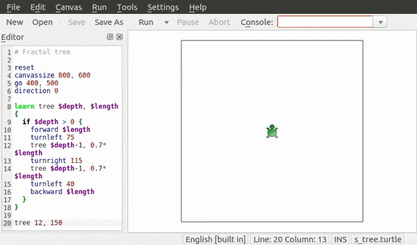
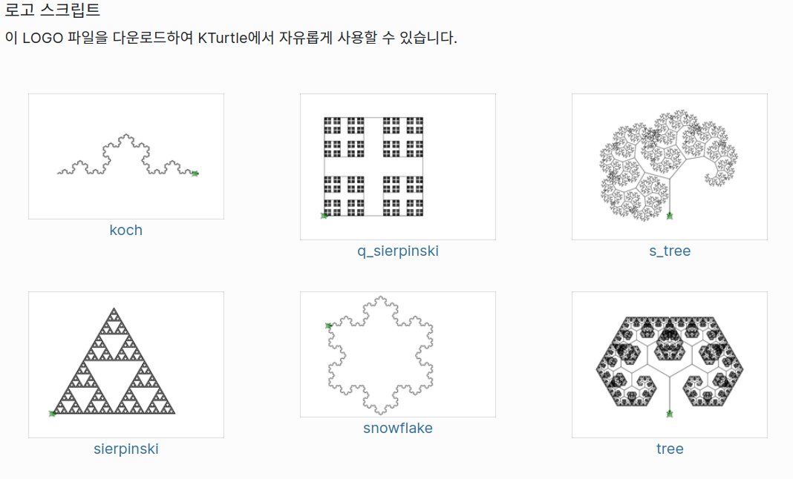
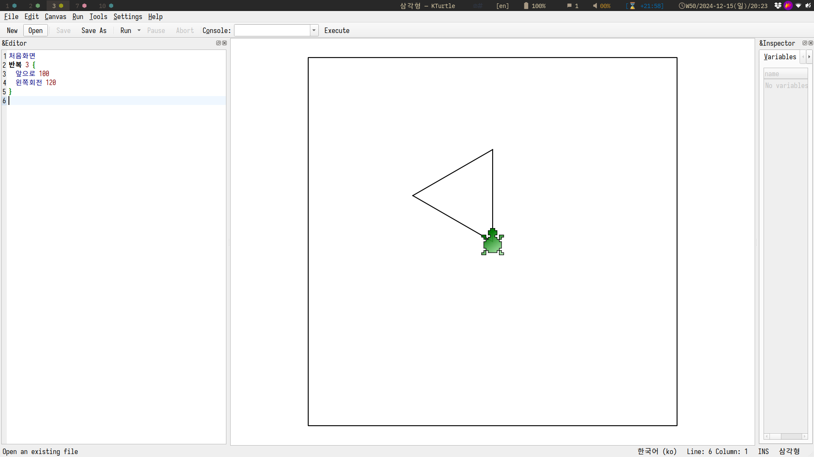

<!-- gid:20250219T100218 -->
[TOC]

[[TIP("이 노트에 대하여")]]
KTurtle이 왜 어린 학생들에게 기하학과 프로그래밍 입문 도구로 훌륭한지 정리한다. 로고 계열의 거북이 교육을 한글 환경에서 직관적으로 구현하는 장점이 잘 드러난다.
[[/TIP]]

## BIBLIOGRAPHY

## History

-   [2026-02-15 Sun 21:15] 교육 말일세 이거 어떻게 할 것인가?
-   [2025-02-19 Wed 10:02] 기록. 이건 정말 훌륭하다. [모음 오픈소스 교육 KDE 우분투](https://wikidocs.net/381444)의 일부

## 관련노트

-   [힣: 수학: 기하학 접근 - 거북이 로고 (스틸웰 펜로즈 페퍼트 민코프스키)](https://wikidocs.net/381428)
-   [스크래치 - 어린이 코딩 교육](https://wikidocs.net/380716)

## kturtle 완벽한 녀석

[2024-12-15 Sun 19:30]

```shell
sudo apt-get install kturtle

```

개발 환경이니까 다 한거다.

KTurtle의 목표는 가능한 한 쉽고 접근하기 쉬운 프로그래밍을 만드는 것입니다. 따라서 어린 학생들에게 수학, 기하학 및 프로그래밍의 기초를 가르치기에 적합한 교육용 도구입니다.

KTurtle은 프로그래밍을 익힐 수 있는 교육용 프로그래밍 환경입니다. 사용자 인터페이스 내에서 모든 프로그래밍을 할 수 있습니다. 프로그래밍 언어는 로고(Logo)를 기반으로 하는 TurtleScript입니다. 모든 명령어와 메시지는 사용자의 언어로 번역됩니다. KTurtle은 직관적인 구문 강조, 간단한 오류 메시지, 쉽게 그릴 수 있는 통합된 캔버스, 내장 도움말, 느린 이동 및 단계별 실행을 지원합니다.

영어로 할 필요가 없다. 직관적이다.

코드 파일명은? turtle 그냥 텍스트지뭐.

### kturtle 예제 GIF



### 복잡한 예제

[KTurtle - KDE 앱 - apps.kde.org](https://apps.kde.org/ko/kturtle/)



### 한글코딩: 삼각형



```nil
처음화면
반복 3 {
  앞으로 100
  왼쪽회전 120
}
```

다른 한글 코드

```text
처음화면
펜올림
앞으로 50
펜내림

반복 4 {
  범위 $x = 1 부터 100 {
    앞으로 10
    오른쪽회전 100 - $x
  }
}
```

### <span class="org-todo done DONT">DONT</span> ucblogo

```text

➜ sudo apt-cache search ucblogo
qlogo - Language using turtle graphics famous for teaching kids
ucblogo - dialect of lisp using turtle graphics famous for teaching kids
~ via  v20.14.0 via 🐍 v3.12.3

```
