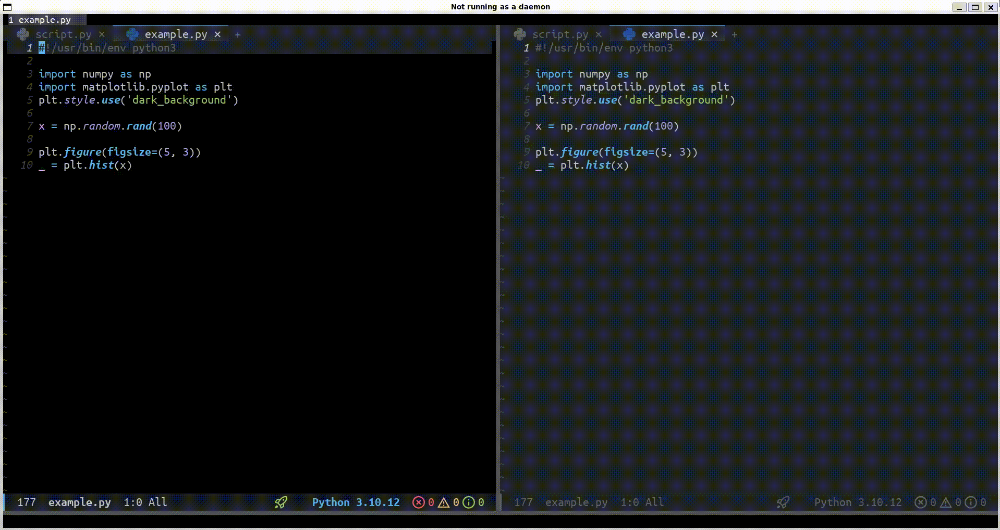
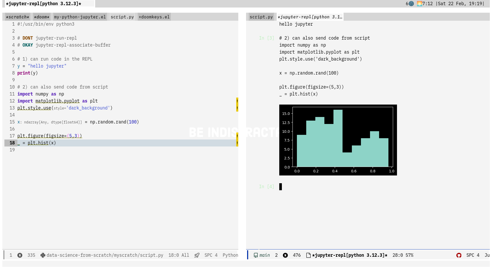

<!-- gid:20250221T192910 -->
[TOC]

[[TIP("이 노트에 대하여")]]
emacs-jupyter를 통해 Org 코드 블록이나 편집 버퍼를 Jupyter REPL로 보내는 흐름을 정리한다. 파이썬 실험과 literate programming을 연결하는 핵심 실무 노트다.
[[/TIP]]

## BIBLIOGRAPHY

  “Emacs-Jupyter/Jupyter: An Interface to Communicate with Jupyter Kernels.” n.d. Accessed February 22, 2025. [https://github.com/emacs-jupyter/jupyter/pull/573](https://github.com/emacs-jupyter/jupyter/pull/573).
  “How Can I Send My Output to the Repl · Issue #403 · Emacs-Jupyter/Jupyter.” n.d. Accessed February 22, 2025. [https://github.com/emacs-jupyter/jupyter/issues/403](https://github.com/emacs-jupyter/jupyter/issues/403).
  “Junghan0611/Emacs-Jupyter.” 2025. [https://github.com/junghan0611/emacs-jupyter](https://github.com/junghan0611/emacs-jupyter).
  “Jupyter-Current-Client and Org-Mode Code Blocks · Issue #266 · Emacs-Jupyter/Jupyter.” n.d. Accessed February 21, 2025. [https://github.com/emacs-jupyter/jupyter/issues/266](https://github.com/emacs-jupyter/jupyter/issues/266).

## History

-   [2025-02-21 Fri 19:29] 이 걸로 끝낸다.

## [emacs-jupyter/ob-jupyter 조직모드 바벨 파이썬 주피터 매뉴얼](https://wikidocs.net/381236)

이걸 확인해야 한다.

## emacs-jupyter/jupyter: An interface to communicate with Jupyter kernels.

(“Emacs-Jupyter/Jupyter: An Interface to Communicate with Jupyter Kernels.” n.d.)

## junghan0611/emacs-jupyter - 포크 - 패치

(“Junghan0611/Emacs-Jupyter” 2025)

-   Han, Jung
-   An interface to communicate with Jupyter kernels.
-   2025

### jupyter-current-client and org-mode code blocks · Issue #266 · emacs-jupyter/jupyter

(“Jupyter-Current-Client and Org-Mode Code Blocks · Issue #266 · Emacs-Jupyter/Jupyter” n.d.)

-   Consider a code block: #+BEGIN\\_SRC jupyter-R :session r :results output :async yes print("Hello World!") #+END\\_SRC Using org-edit-special (usually assigned to C-’) opens the code block in a buffer,...

### How can I send my output to the REPL · Issue #403 · emacs-jupyter/jupyter

(“How Can I Send My Output to the Repl · Issue #403 · Emacs-Jupyter/Jupyter” n.d.)

## [2025-02-21 W07](https://wikidocs.net/380399) org 주피터 코드 블록

@user 조직모드에서 ob-python을 이용해서 코드블록을 내보내기 할 때 repl 버퍼로 results를 보내는 방법을 찾아줘

@assistant 조직모드에서 `ob-python` 을 사용하여 코드 블록을 내보내고 결과를 REPL 버퍼로 보내기 위해서는 다음 단계를 따르세요:

1.  **org-mode 설정**: `org-babel-python-command` 변수를 설정하여 Python 코드를 실행할 명령어를 지정합니다. 기본적으로 `python` 명령어를 사용합니다.

2.  **코드 블록 실행**: `C-c C-c` 를 눌러 코드 블록을 실행합니다. 결과는 기본적으로 버퍼에 출력됩니다.

3.  **REPL 버퍼로 결과 보내기**: 결과를 REPL 버퍼로 보내기 위해서는 `ob-python` 이 제공하는 기능을 직접적으로 사용하는 방법은 없지만, `org-babel` 의 결과를 수동으로 복사하여 REPL 버퍼에 붙여넣을 수 있습니다.

4.  **자동화 스크립트 작성**: 자동화가 필요하다면, Emacs Lisp 함수를 작성하여 결과를 자동으로 REPL 버퍼로 전송할 수 있습니다. 이 방법은 복잡하지만, 특정한 요구사항에 맞게 구현할 수 있습니다.

이 과정에서 `ob-python` 은 Python 코드를 실행하고 결과를 제공하는 데 사용되며, 결과를 REPL 버퍼로 직접 보내기 위한 내장 기능은 제공되지 않습니다. 따라서 수동으로 복사하거나, 자동화 스크립트를 작성해야 합니다.

Citations: [1] <https://blog.naver.com/jodi999/222088290630?viewType=pc> [2] <https://docs.python.org/ko/3.12/reference/executionmodel.html> [3] <https://codewith.mu/en/tutorials/1.2/repl>

@user

@assistant 조직모드에서 `ob-python` 을 사용하여 코드 블록을 실행하고 결과를 REPL 버퍼로 보내기 위해서는 다음 단계를 따르세요:

1.  **org-mode 설정**: `ob-python` 을 사용하기 위해 org-mode가 설치되어 있어야 합니다. org-mode가 설치되어 있지 않다면, Emacs 패키지 매니저를 통해 설치하세요.

2.  **코드 블록 설정**: org 파일에서 코드 블록을 정의합니다. 예를 들어:
    ```org
    #+BEGIN_SRC python
    print("Hello, World!")
    ```
    \#+end_src

3.  **코드 블록 실행 및 결과 출력**: 코드 블록 위에서 `C-c C-c` 를 눌러 실행합니다. 결과는 org 파일에 삽입됩니다.

4.  **REPL 버퍼로 결과 전송**: org-mode에서 직접 REPL 버퍼로 결과를 전송하는 기능은 기본적으로 제공되지 않습니다. 그러나 `ob-python` 의 결과를 복사하여 Python REPL 버퍼에 붙여넣을 수 있습니다.
    -   **Python REPL 시작**: Emacs에서 `M-x python` 을 입력하여 Python REPL을 시작합니다.
    -   **결과 복사 및 붙여넣기**: org 파일에서 결과를 복사하고, Python REPL 버퍼에 붙여넣어 실행할 수 있습니다.

이 방법은 직접적인 결과 전송이 아니라, 결과를 수동으로 복사하여 붙여넣는 방식입니다. org-mode에서 직접 REPL로 결과를 전송하는 기능은 현재 제공되지 않습니다.

만약 더 자동화된 방법이 필요하다면, Emacs Lisp 함수를 작성하여 결과를 자동으로 복사하고 붙여넣는 스크립트를 만들 수 있습니다. 그러나 이는 기본적으로 제공되는 기능이 아닙니다.

Citations: [1] <https://blog.naver.com/jodi999/222088290630?viewType=pc> [2] <https://docs.python.org/ko/3.12/reference/executionmodel.html> [3] <https://codewith.mu/en/tutorials/1.2/repl>

@user 혹시 emacs-jupyter를 이용 할 경우 코드블록을 repl 버퍼로 보내는 방법은?

@assistant Emacs에서 `emacs-jupyter` 패키지를 사용하여 코드 블록을 REPL 버퍼로 보내는 방법은 다음과 같습니다:

1.  **emacs-jupyter 설치**: `M-x package-install` 명령어로 `jupyter` 패키지를 설치합니다[4].

2.  **Jupyter REPL 시작**: `M-x jupyter-run-repl` 명령어로 Python 커널을 시작합니다[5].

3.  **코드 블록 설정**: org 파일에서 코드 블록을 정의하고, `:session` 파라미터를 설정하여 Jupyter 커널과 연결합니다[1][2].
    ```org
    #+BEGIN_SRC jupyter-python :session hello
    print("Hello, World!")
    ```
    \#+end_src

4.  **코드 블록 실행 및 REPL 연동**:
    -   `C-c C-c` 로 코드 블록을 실행하면 결과는 org 파일에 삽입됩니다.
    -   `M-x jupyter-repl-associate-buffer` 명령어로 현재 버퍼를 REPL과 연동할 수 있습니다[3][4].

5.  **코드 전송**: `jupyter-eval-line-or-region` 명령어를 사용하여 특정 코드 줄이나 영역을 REPL로 전송할 수 있습니다. 이를 위해 `jupyter-org-with-src-block-client` 함수를 사용하여 클라이언트를 설정할 수 있습니다[3].

이 방법은 Jupyter 커널을 사용하여 코드 블록을 실행하고 결과를 REPL 버퍼로 전송하는 데 유용합니다.

Citations: [1] <https://sqrtminusone.xyz/posts/2021-05-01-org-python/> [2] <https://github.com/emacs-jupyter/jupyter> [3] <https://github.com/nnicandro/emacs-jupyter/issues/266> [4] <https://discourse.julialang.org/t/jupyter-integration-with-emacs/21496> [5] <https://martibosch.github.io/jupyter-emacs-universe/>

## [2025-02-21 W07](https://wikidocs.net/380399) jupyter 패키지 활용

@user 이맥스 주피터 패키지에서 eval 한 결과가 jupyter-repl 버퍼로 전달이 안되고 jupyter-output이라고 버퍼가 별도로 생성 되거든 확인해 볼 만한 부분을 찾아줘

@assistant 이맥스에서 주피터 패키지를 사용할 때 결과가 `jupyter-repl` 버퍼로 전달되지 않고 `jupyter-output` 버퍼가 별도로 생성되는 문제를 해결하려면 다음 몇 가지를 확인해 볼 수 있습니다:

1.  **설정 확인**: `jupyter-repl-echo-eval-p` 변수가 `t` 로 설정되어 있는지 확인하세요. 이 변수는 평가된 코드가 REPL 버퍼에 기록되는지 여부를 결정합니다. 설정이 `nil` 이면 코드 결과가 별도의 출력 버퍼로 전달될 수 있습니다.

2.  **버퍼 연관성**: 현재 버퍼가 `jupyter-repl-interaction-mode` 로 설정되어 있는지 확인하세요. 이 모드가 활성화되어 있으면 코드를 평가할 때 결과가 REPL 버퍼로 전달되어야 합니다.

3.  **출력 설정**: 주피터의 출력 설정이 올바르게 구성되어 있는지 확인하세요. 특정 MIME 타입의 출력이 제대로 처리되고 있는지 확인해 보세요.

4.  **버퍼 자동 생성**: 주피터 패키지의 버전이나 설정에 따라 자동으로 출력 버퍼가 생성될 수 있습니다. 이 경우, 패키지의 최신 버전을 사용하고 있는지 확인하세요.

이러한 설정과 모드를 확인하여 문제를 해결할 수 있을 것입니다.

Citations: [1] <https://github.com/emacs-jupyter/jupyter> [2] <https://discourse.jupyter.org/t/jupyter-notebook-compiling-the-code-but-not-displaying-the-output/9898> [3] <https://qtconsole.readthedocs.io> [4] <https://discourse.jupyter.org/t/help-my-jupyter-notebook-is-not-showing-any-outputs/8122> [5] <https://github.com/jkitchin/scimax/blob/master/scimax-jupyter.el>

@user

## 스크린샷 주피터 레플 연동

[2025-02-22 Sat 19:20]

이게 진짜다.



다음 코드가 필요하다.

```elisp
(setq jupyter-repl-echo-eval-p t) ; default nil
```

### 따라한 스크린샷

~/sync/code/junghan0611/data-science-from-scratch/myscratch/script.py



### 근데 주피터 레플에 컬러가 없는가!

[2025-02-22 Sat 19:23]

중요한 것은 아니니

## [주피터 파이썬 - 리눅스 qtconsole::jupyter/qtconsole](https://wikidocs.net/381548.md#h-134d3bb6-730f-4a0a-880c-2a4050d08991/)

[2025-02-22 Sat 19:24]

주피터 이 녀석
