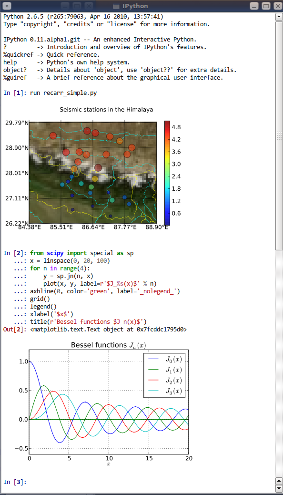

<!-- gid:20250222T190241 -->
[TOC]

[[TIP("이 노트에 대하여")]]
터미널보다 풍부한 GUI 기능을 가진 Jupyter QtConsole의 역할과 설치 흐름을 적어 둔다. 이맥스 밖에서 주피터 커널을 다루는 가벼운 그래픽 콘솔 대안을 보여 준다.
[[/TIP]]

## BIBLIOGRAPHY

  “Jupyter/Qtconsole.” 2025. [https://github.com/jupyter/qtconsole](https://github.com/jupyter/qtconsole).

## 관련메타

-   [파이썬](https://wikidocs.net/380610)

## History

-   [2025-06-03 Tue 11:50] conda로는 설치 안될 것 같은데?
-   [2025-02-22 Sat 19:02] 다른 것 말고 주피터 그 자체. 이맥스 빼고

## jupyter/qtconsole

(“Jupyter/Qtconsole” 2025)

-   Jupyter Qt Console

Windows tests Macos tests Linux tests Coverage Status Documentation Status Google Group

A rich Qt-based console for working with Jupyter kernels, supporting rich media output, session export, and more.

The Qtconsole is a very lightweight application that largely feels like a terminal, but provides a number of enhancements only possible in a GUI, such as inline figures, proper multiline editing with syntax highlighting, graphical calltips, and more.

## 2025 APT에서 설치 및 이맥스 연동

[2025-02-22 Sat 19:02]

### 주피터 설치 관련 APT 사용

```shell
sudo apt-get install jupyter
jupyter kernelspec list

sudo apt-get install jupyter-qtconsole
```

### 스크린샷



### 이맥스 연동

```elisp

(defun my/jupyter-qtconsole ()
  "Open Jupyter QtConsole, connected to a Jupyter kernel"
  (interactive)
  (start-process "jupyter-qtconsole" nil "setsid" "jupyter" "qtconsole" "--existing"
                 (file-name-nondirectory (my/select-jupyter-kernel))))

```
