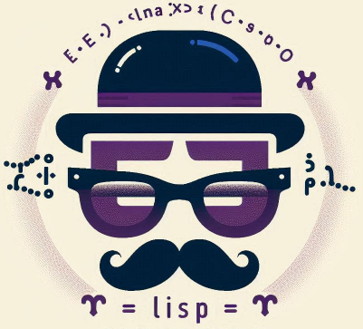

<!-- gid:20250223T114721 -->
[TOC]

[[TIP("이 노트에 대하여")]]
텍스트와 이맥스, 디스코드 감성을 묶어 작은 놀이터 같은 커뮤니티를 만들려는 발상을 담는다. 로고와 분위기, 사람들의 모임 방식을 함께 상상하는 실험적 노트다.
[[/TIP]]

## BIBLIOGRAPHY

  “나만의 이맥스 로고를 하나 만들려는데, 주제는 이맥스 힙스터거든 하나 만들어 줄래.” n.d. Accessed February 23, 2025. [https://www.perplexity.ai/search/namanyi-imaegseu-rogoreul-hana-381E9PWsRoKRDvlokUqr8A](https://www.perplexity.ai/search/namanyi-imaegseu-rogoreul-hana-381E9PWsRoKRDvlokUqr8A).

## 관련노트

-   [유리알유희 오늘날 바라본다면](https://notes.junghanacs.com/notes/20250305T105307/)를 위한 놀이터
-   [서브스택](https://notes.junghanacs.com/meta/20230716T041900/)

## History

-   [2025-02-23 Sun 11:47] 힙한 공간을 하나 만들었다. 텍스트 힙스터다. 초대장은 여기 있다. <https://discord.gg/H9xKabZX> DONE 소통: 디스코드 서브스택 - 커뮤니티와 포스팅 [2024-12-28 Sat 11:46] [샘리치: 클로저 수학 물리 시스템](https://notes.junghanacs.com/bib/20241110T121513/)와 유사한 소통 시스템을 만드는게 어떤가? 문득 생각했다. 여전히 여기에 대해서는 고민이다.

## 로고 이미지

### 결과물

그럭저럭

### 나만의 이맥스 로고를 하나 만들려는데, 주제는 이맥스 힙스터거든 하나 만들어 줄래

(“나만의 이맥스 로고를 하나 만들려는데, 주제는 이맥스 힙스터거든 하나 만들어 줄래” n.d.)

-   이맥스 힙스터 테마의 로고를 만들어 드리겠습니다. 이맥스의 클래식한 느낌과 힙스터 스타일을 결합한 독특한 로고를 제안해 드리겠습니다. 기본 요소: 이맥스의 상징적인 ’E’ 문자 힙스터 요소: 빈티지 안경, 콧수염, 보울러 모자 색상: 보라색과 파란색 (힙스터 테마의 색상) 폰트:...

#### 이맥스 힙스터 테마의 로고를 만들어 드리겠습니다. 이맥스의 클래식한 느낌과 힙스터 스타일을 결합한 독특한 로고를 제안해 드리겠습니다.

##### 로고 디자인 컨셉

-   기본 요소: 이맥스의 상징적인 'E' 문자
-   힙스터 요소: 빈티지 안경, 콧수염, 보울러 모자
-   색상: 보라색과 파란색 (힙스터 테마의 색상)[1] - 폰트: 세리프체 (클래식한 느낌을 위해) 로고 설명 1. 이맥스의 'E'를 중앙에 크게 배치합니다. 2. 'E' 위에 보울러 모자를 씌웁니다. 3. 'E'의 가로 획 중간에 빈티지 안경을 걸칩니다. 4. 'E'의 아래쪽에 콧수염을 그립니다. 5. 전체 로고를 괄호 ()로 감싸 이맥스의 리스프 문법을 연상시킵니다[2]. 6. 로고 아래에 "Emacs Hipster"라는 텍스트를 세리프체로 작성합니다. 색상 구성 - 주 색상: 보라색 (8A4D76) - 보조 색상: 파란색 (4A90E2) - 배경: 흰색 또는 연한 크림색 이 로고는 이맥스의 전통적인 이미지와 힙스터 문화의 유쾌함을 결합하여, 클래식하면서도 현대적인 느낌을 줍니다. 또한 괄호를 사용함으로써 프로그래밍 언어의 특성을 반영하고 있습니다[2]. 이 디자인은 Canva나 Adobe Express와 같은 온라인 로고 제작 도구를 사용하여 쉽게 만들 수 있습니다[5][6]. 더 전문적인 결과물을 원하신다면 Adobe Illustrator나 Affinity Designer와 같은 벡터 그래픽 소프트웨어를 사용하는 것도 좋은 방법입니다[10]. Citations: [1] <https://emacsthemes.com/themes/hipster-theme.html> [2] <https://emacs.meta.stackexchange.com/questions/402/emacs-site-design-with-an-updated-logo-and-colors> [3] <https://www.designevo.com/create/logos/hipster.html> [4] <https://octet.design/journal/logo-design-tools/> [5] <https://www.andacademy.com/resources/blog/graphic-design/best-logo-design-software/> [6] <https://www.logomaker.com> [7] <https://github.com/jmhammond/emacs-icon/> [8] <https://www.brandcrowd.com/maker/tag/hipster> [9] <https://www.shopify.com/tools/logo-maker> [10] <https://www.upwork.com/resources/best-logo-design-software> [11] <https://www.onlinelogomaker.com> [12] <https://www.canva.com/create/logos/> [13] <https://www.designcrowd.com/logo-design-gallery/descriptive/trendy/hipster-logos> [14] <https://99designs.com/inspiration/designs/geeky> [15] <https://darrinhenein.com/blog/emacs-icon/> [16] <https://www.freepik.com/free-photos-vectors/hipster-logo> [17] <https://www.reddit.com/r/emacs/comments/gxgv5t/i_made_a_light_emacs_theme_it_is_probably_bit_out/> [18] <https://www.reddit.com/r/emacs/comments/12vxxdl/fancy_emacs_logos/> [19] <https://99designs.com/inspiration/logos/hipster> [20] <https://www.redbubble.com/shop/emacs+logo> [21] <https://dribbble.com/search/emacs> [22] <https://www.pinterest.com/bukhalova/hipster-logos/> [23] <https://news.ycombinator.com/item?id=17703866> [24] <https://protesilaos.com/emacs/logos> [25] <https://logo.com> [26] <https://looka.com/logo-maker/> [27] <https://www.techradar.com/best/best-logo-designer> [28] <https://www.brandcrowd.com/logo-maker> [29] <https://www.adobe.com/express/create/logo> [30] <https://www.adobe.com/creativecloud/tools/logo-software.html> [31] <https://www.designhill.com/tools/logo-maker> [32] <https://www.creativebloq.com/buying-guides/best-logo-designer> [33] <https://www.ionos.com/digitalguide/websites/web-design/logo-design-software/> [34] <https://www.fiverr.com/logo-maker> [35] <https://www.reddit.com/r/logodesign/comments/11hyq9r/what_program_do_you_guys_use_to_design_your_logos/> [36] <https://www.designevo.com> [37] <https://www.ee.torontomu.ca/~elf/emacs/logo/logo.html> [38] <https://notes.justin.vc/config> [39] <https://emacs.meta.stackexchange.com/questions/396/community-site-design-ideas-input-needed> [40] <https://www.cyberlink.com/blog/photo-editing-best-software/1607/free-logo-maker-software> [2025-02-23 W07](https://notes.junghanacs.com/journal/20250217T000000/)

@user 텍스트힙스터라는 단어가 있는가? 어떤 느낌인가?

@assistant "텍스트힙스터"라는 단어는 공식적으로 사용되는 것은 아니지만, "텍스트힙"이라는 신조어는 "글자"를 뜻하는 '텍스트'와 "멋있다"라는 의미의 '힙하다'를 합쳐 만든 것으로, 독서를 멋지다고 여기는 문화를 의미합니다[2][3][4]. 이 용어는 MZ세대 사이에서 독서를 힙한 문화로 여기는 현상을 설명하며, SNS에서 독서 경험을 공유하는 것이 유행하고 있습니다. 따라서 "텍스트힙스터"라는 용어는 이러한 문화를 따르는 사람들을 비공식적으로 지칭할 수 있을 것입니다.

"텍스트힙스터"라는 단어는 공식적으로 사용되지 않지만, "텍스트힙" 문화를 따르는 사람들을 의미할 수 있습니다. 이들은 독서를 멋지다고 여기는 젊은 세대로, 독서를 통해 자신을 표현하고 기록하는 것을 중요하게 여깁니다.

Citations: [1] <https://ko.wikipedia.org/wiki/%ED%9E%99%EC%8A%A4%ED%84%B0> [2] <https://www.sedaily.com/NewsView/2DAHKBTQQS> [3] <https://www.slj.co.kr/bbs/board.php?bo_table=special&wr_id=662> [4] <https://adure.net/contents/detail/%ED%9E%99%EC%8A%A4%ED%84%B0%EB%9D%BC%EB%A9%B4-%EB%8F%85%EC%84%9C%EB%8A%94-%EA%B8%B0%EB%B3%B8%EC%9D%B4%EC%A3%A0-%ED%85%8D%EC%8A%A4%ED%8A%B8%ED%9E%99--390> [5] <https://blog.naver.com/PostView.naver?blogId=kiyeon34&logNo=222514212904&categoryNo=1&proxyReferer=&noTrackingCode=true>

@user
