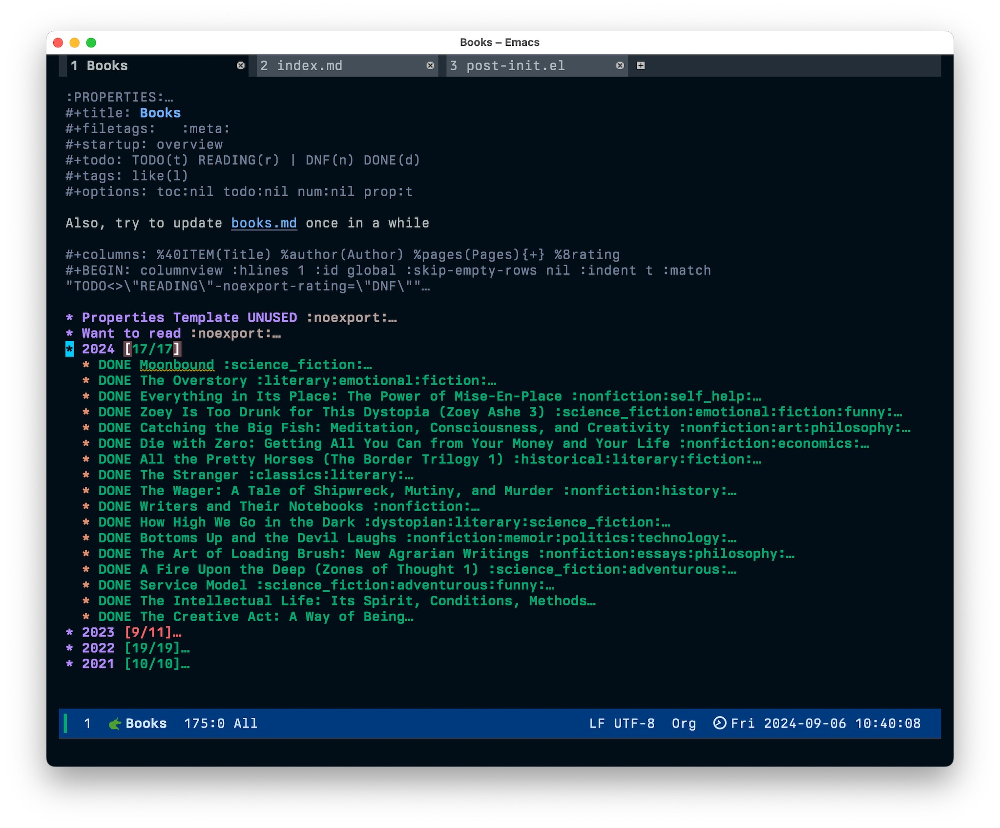
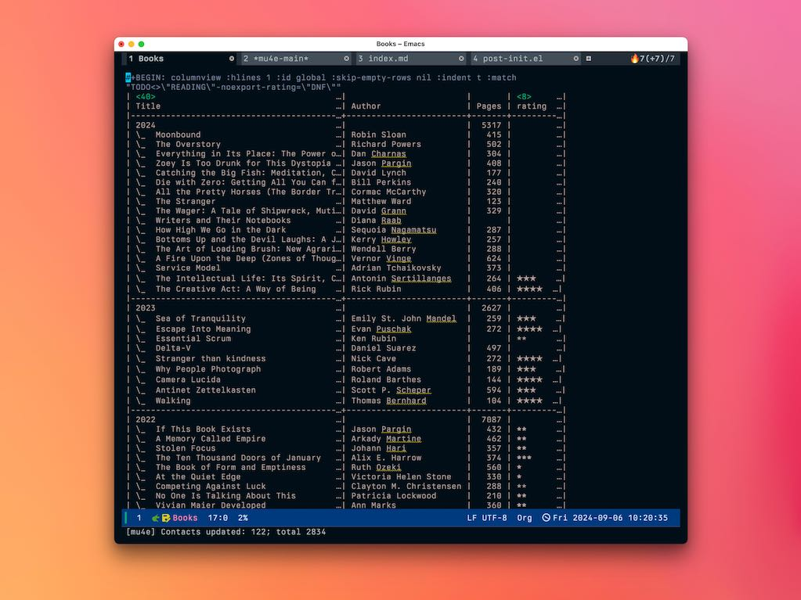

<!-- gid:20250309T194056 -->
[TOC]

[[TIP("이 노트에 대하여")]]
org-books를 이용해 책 목록과 독서 상태를 Emacs 안에서 관리하는 가능성을 살핀다. 읽기 기록과 서지 관리의 접점을 찾으려는 독서 워크플로우 노트다.
[[/TIP]]

## BIBLIOGRAPHY

  Jack Baty. 2024. “Books.Org Redo with Org-Books.” September 6, 2024. [https://baty.net/posts/2024/09/books-org-redo/](https://baty.net/posts/2024/09/books-org-redo/).
  “Jackbaty/Books - Justfile.” 2025. [https://github.com/jackbaty/Books](https://github.com/jackbaty/Books).
  “Junghan0611/Org-Books.” 2025. [https://github.com/junghan0611/org-books](https://github.com/junghan0611/org-books).

## 관련노트

-   [LLM: 독서 goodreads, storygraph reading-list](https://notes.junghanacs.com/bib/20250309T175203/)

## History

-   [2025-03-09 Sun 19:40] 도서관리의 새로운 방안을 잡아내었다.

## Books.org redo

(Jack Baty 2024)

-   Jack Baty
-   For a couple of years, I kept my~reading list in an Org-mode file. I found it a bit tedious, and the only thing I did about that was to stop doing it. I mean, I always seem to be on the verge of abandoning Emacs anyway, right? Well, I’
-   2024

<!--listend-->

```elisp
(setq org-books-file "~/Documents/Notes/Denote/20230406T053322--books__meta.org"))
```

That’s fine, but doesn’t show much information other than a short title. That’s where Org’s Column View comes in. Column view shows a summary of a set of headings in a customizable view. The setup for mine is this:

이 방법도 괜찮지만 짧은 제목 외에는 많은 정보를 표시하지 않습니다. 그래서 Org 의 열 보기가 등장합니다. 열 보기는 사용자 지정 가능한 보기에 제목 집합의 요약을 표시합니다. 제 설정은 다음과 같습니다:

This sets columns, widths, titles, and even a total of the number of pages (via the {+} flag). Then, I have a block which generates and saves the column view for me. Here’s that block.

이렇게 하면 열, 너비, 제목, 총 페이지 수까지 설정할 수 있습니다({+} 플래그를 통해). 그런 다음 열 보기를 생성하고 저장하는 블록이 있습니다. 여기 그 블록이 있습니다.

| Title | Author | Pages | rating |
|-------|--------|-------|--------|

### 북관리



### The rendered book table from column view

The rendered book table from column view 열 보기에서 렌더링된 북 테이블



## junghan0611/org-books

(“Junghan0611/Org-Books” 2025)

-   

-   Han, Jung
-   Reading list management with org mode
-   2025

## jackbaty/Books - justfile

(“Jackbaty/Books - Justfile” 2025)

-   Jack Baty
-   A list of books I've read
-   2025
    
    책 목록 마크다운 랜더링
