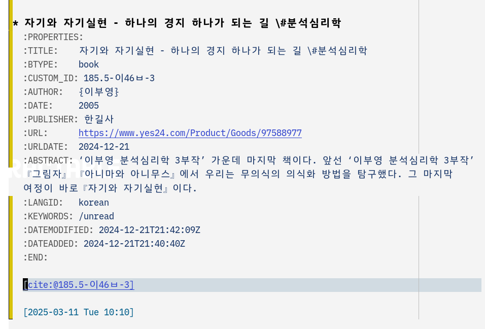

<!-- gid:20250309T232807 -->
[[TIP("이 노트에 대하여")]]
조테로와 citar, org-mode를 엮어 읽을 목록을 관리하는 실제 코드와 아이디어를 담는다. 서지와 독서 흐름을 텍스트 도구로 연결하려는 실전 노트다.
[[/TIP]]

<!-- provenance:source:start -->
[[TIP("원본·최신본")]]
이 페이지는 한국어 검색과 읽기를 위한 WikiDocs 미러입니다. [원본·최신본은 가든](https://notes.junghanacs.com/notes/20250309T232807/)에 있습니다. 최신 수정 내용·백링크·태그·히스토리·댓글·출처 정보는 원본 가든에서 확인하세요.

- 작성: `2025-03-09T23:28:00+09:00`
- 최근 수정: `2025-03-09T00:00:00+09:00`
[[/TIP]]
<!-- provenance:source:end -->

[TOC]

## BIBLIOGRAPHY

- “Joostkremers/Ebib.” 2025. [https://github.com/joostkremers/ebib](https://github.com/joostkremers/ebib).

## Related Notes

-   [org-books 도서목록관리 이맥스](https://wikidocs.net/381577) 이게 필요 없을 것 같아

## History

-   [2025-03-09 Sun 23:28] [조테로](https://wikidocs.net/380563)를 사용하니까 여기 맞춰서 필요한 기능을 만들었다. 이렇게 해야 깔끔하다.

## [2025-03-09 W09](https://wikidocs.net/380402)

@user 이맥스에서 bib파일에 있는 엔트리를 파싱해서 리딩 리스트를 관리하는 방법

@assistant 이맥스에서 BibTeX 파일을 파싱하고 관리하는 방법에 대해 설명드리겠습니다:

1.  BibTeX 모드 사용
2.  .bib 파일을 열면 자동으로 BibTeX 모드가 활성화됩니다.
3.  이 모드에서는 엔트리 추가, 편집, 정렬 등의 기능을 제공합니다.

4.  Citar 패키지 활용
5.  BibTeX 파일을 파싱하고 관리하는 데 유용한 기능을 제공합니다.
6.  설정 예시:

<!--listend-->

```elisp
(use-package citar
  :custom (citar-bibliography '("~/bib/references.bib")))
```

1.  엔트리 추가
2.  `C-c C-b` 로 새 엔트리 추가
3.  템플릿을 사용해 필수 필드 입력

4.  엔트리 검색 및 필터링
5.  `M-x citar-open` 으로 엔트리 검색
6.  저자, 제목 등으로 필터링 가능

7.  리딩 리스트 관리
8.  org-mode 파일에 읽을 논문 목록 작성
9.  Citar를 사용해 인용 삽입 (`C-c C-r`)

10. 파일 연결
11. PDF 파일 경로 설정으로 원문 열기 가능

12. 노트 연결
13. org-roam 등과 연동해 각 엔트리에 노트 작성

14. 자동 정렬 및 정리
15. `bibtex-sort-buffer` 로 엔트리 정렬
16. `bibtex-clean-entry` 로 엔트리 정리

이런 방식으로 BibTeX 파일을 효율적으로 관리하고 리딩 리스트를 유지할 수 있습니다.

-   Citations: [1] <https://workbench.edamyrepo.com/2019/12/03/bibtex-%EC%84%A4%EC%A0%95%EC%82%AC%ED%95%AD-elsarticle/> [2] <https://blog.naver.com/southbeast/223384871785> [3] <https://joostkremers.github.io/ebib/ebib-manual.html> [5] <https://main--junghanacs.netlify.app/docs/ews/20250111t111347/> [6] <https://forestunit.tistory.com/123> [7] <https://github.com/joostkremers/parsebib> [8] <https://lucidmanager.org/productivity/emacs-bibtex-mode/> [9] <https://github.com/emacs-citar/citar> [10] <https://www.erichgrunewald.com/posts/emacs-lisp-functions-for-easy-bib-te-x-insertions/> [11] <http://gerd-neugebauer.de/software/TeX/BibTool/bibtool.pdf> [12] <https://nhigham.com/2016/01/06/managing-bibtex-files-with-emacs/> [13] <https://forums.zotero.org/discussion/69767/errors-importing-bibtex-bib-files/p2> [14] <https://github.com/emacs-citar/citar/issues/834>

@user 다음과 같이 동작하는 함수를 만들어줄래? citar에서 선택한 엔트리를 활용해서 reading-list 관리를 하려고해.

citar-insert-bibtex -&gt; org-bibtex-read -&gt; org-bibtex-write

@assistant 네, 요청하신 기능을 구현하는 함수를 만들어 드리겠습니다. 이 함수는 Citar를 사용하여 BibTeX 엔트리를 선택하고, 이를 org-mode의 reading list 형식으로 변환하여 지정된 파일에 추가합니다.

```elisp
(defun my/citar-to-reading-list ()
  "Insert selected Citar entry as an org-mode heading in a reading list file."
  (interactive)

  (let* ((entry (citar-select-ref))
         (key (car entry))
         (reading-list-file (my/org-reading-file)))
    (when key
      (with-temp-buffer
        ;; BibTeX 엔트리를 버퍼에 삽입
        (citar--insert-bibtex key)
        ;; org-bibtex 형식으로 변환
        (org-bibtex-read)
        ;; 변환된 내용을 reading list 파일에 추가
        (with-current-buffer (find-file-noselect reading-list-file)
          (goto-char (point-max))
          (insert "\n")
          (org-bibtex-write)
          (save-buffer)))
      (message "Entry added to reading list: %s" key))))

;; 키 바인딩 설정 (선택사항)
(global-set-key (kbd "C-c r") 'my/citar-to-reading-list)
```

이 함수의 동작 방식은 다음과 같습니다:

1.  `citar-select-ref` 를 사용하여 사용자가 BibTeX 엔트리를 선택하도록 합니다.
2.  선택된 엔트리의 키를 사용하여 `citar-insert-bibtex` 로 BibTeX 형식의 데이터를 임시 버퍼에 삽입합니다.
3.  `org-bibtex-read` 를 사용하여 BibTeX 데이터를 org-mode 형식으로 변환합니다.
4.  지정된 reading list 파일을 열고, `org-bibtex-write` 를 사용하여 변환된 org-mode 형식의 데이터를 파일 끝에 추가합니다.

사용 방법:

1.  이 코드를 Emacs 설정 파일에 추가합니다.
2.  `reading-list-file` 변수를 여러분의 reading list 파일 경로로 수정합니다.
3.  Emacs를 재시작하거나 설정을 다시 로드합니다.
4.  `M-x my/citar-to-reading-list` 를 실행하거나, 설정한 키 바인딩(예: `C-c r`)을 사용하여 함수를 실행합니다.
5.  Citar 인터페이스에서 원하는 엔트리를 선택합니다.
6.  선택한 엔트리가 reading list 파일에 org-mode 형식으로 추가됩니다.

이 함수를 사용하면 Citar에서 선택한 BibTeX 엔트리를 쉽게 org-mode 형식의 reading list로 관리할 수 있습니다.

-   Citations: [1] <https://github.com/emacs-citar/citar> [2] <https://org-roam.discourse.group/t/guide-bibliography-system-with-org-roam-bibtex-and-org-noter-integration/3293> [3] <https://www.bibtex.com/e/entry-types/> [4] <http://gewhere.github.io/org-bibtex> [5] <https://github.com/orgs/emacs-citar/discussions/564> [6] <https://github.com/jkitchin/org-ref/blob/master/org-ref.org> [7] <https://kristofferbalintona.me/posts/202206141852/> [8] <https://github.com/jkitchin/org-ref> [9] <https://www.youtube.com/watch?v=KS9GvK7cvmo> [10] <https://www.bibtex.org> [11] <https://vxlabs.com/2017/02/20/from-org-file-with-local-bibtex-to-latex-and-pdf/>

@user org-mode에서 프로퍼티 중에 특정 값

## [2025-03-11 Tue 10:13] 현재 버전 동작 방식

```elisp

(progn
  ;; use embark with at-point
  ;; (setq citar-at-point-function 'embark-act) ; citar-dwim
  ;; add beref entry for bookends
  ;; (setq citar-additional-fields '("url"))

  (defun my/citar-org-to-reading-list (citekeys)
    "Insert bibliographic entry associated with the CITEKEYS."
    (interactive (list (citar-select-refs)))
    (dolist (citekey citekeys)
      (my/citar--org-to-reading-list citekey)))

  (defun my/citar--org-to-reading-list (citekey)
    "Insert the bibtex entry for CITEKEY at point."

    (let* ((key citekey)
           (reading-list-file (my/org-reading-file)))
      (when key
        (with-temp-buffer
          ;; BibTeX 엔트리를 버퍼에 삽입
          (citar--insert-bibtex citekey)
          ;; org-bibtex 형식으로 변환
          (org-bibtex-read)
          ;; 변환된 내용을 reading list 파일에 추가
          (with-current-buffer (find-file-noselect reading-list-file)
            (goto-char (point-max))
            (insert "\n")
            (org-bibtex-write)
            (insert "\n")
            (insert (format "[cite:@%s]" citekey))
            (insert "\n")

            (save-buffer)))
        (message "Entry added to reading list: %s" key))))
  )

;; Documentation
;; Non-nil means export contents of properties drawers.

;; When t, all properties are exported.  This may also be a list of
;; properties to export, as strings.

;; This option can also be set with the OPTIONS keyword,
;; e.g. "prop:t".

;; This variable was added, or its default value changed, in Org version
;; 8.3.

;; Demos
;; [Add]
```

이렇게 구현한 코드는 citur 인터페이스를 활용하여 bib 파일의 정보를 아래와 같이 넣는다.

처음에는 ebib (“Joostkremers/Ebib” 2025)를 고민해봤다. 실제 비슷하게 관리도 가능하다. 근데 citar 인터페이스를 안쓸 필요가 있는가?!

그래서 기본 citar 인터페이스로 만들었다. 어짜피 내부에서 ol-bibtex.el 를 사용해야 한다. 빌트인이다.

여러개를 한번에 넣을 수도 있다.



아예 bib 파일을 싹 가져오려면? 그냥

`org-bibtex-import-from-file` 를 사용하는게 좋을 것이다. 너무 많으면 감당 안되니까 그냥 하나씩

### 그 다음에 org-books을 이용한 읽기와 별점 그리고 내보내기

,#+OPTIONS: prop:("MY-RATING" "YEAR" "ABSTRACT" "DATEADDED")

근데 별점이 필요한가?!
