<!-- gid:20250313T105007 -->
[TOC]

[[TIP("이 노트에 대하여")]] 디지털가든과 RSS, 링크드인, 브런치 같은 여러 채널을 걸쳐 자신을 찾는 사람에게 보내는 조용한 공지문이다. 공개 글쓰기와 존재의 신호를 함께 다루는 어쏠로그다. [[/TIP]] 관련메타 - [ 어쏠로지](https://wikidocs.net/380570)
-   [전체상 큰그림 총체 총아 모든것 집합체](https://wikidocs.net/380810)
-   [데이터시각화 도표 그래프 동적 대시보드 비주얼](https://wikidocs.net/380806)

## History

-   [2025-06-17 Tue 10:11] 이 노트를 만지다 보니 중요하네 - [2025-06-14 Sat 18:55] 스레드에서 페디버스로. RSS 등록 - [2025-06-14 Sat 18:54] 브런치 또 떨어졌다. 안녕. 예스24 서버 문제 - [2025-03-13 Thu 10:50] 티스토리에 기가 막히게 적어 놨지. 옮겨라 - (“아무도 읽지 않는 공지 - 그를 찾아 떠나자” 2025) 불완전한 앎의 전체상 - 어쏠로지의 구현체 - 힣's 디지털가든 (Junghan n.d.) - [2025-06-14 Sat 19:05] 편집하지 말고 그냥 날것 그대로 전체상을 보여다오! 네 여기있습니다. 어쏠로지. 모두가저자다. 지금 나우! - [2025-03-13 Thu 10:50] 화장실에서 스마트폰으로 무엇을 합니까? 저는 이곳을 찾습니다. 과연 가능한 말입니까? 네. 그렇습니다. 이건 반칙이다. 옐로카드. 저의 오늘에서 연결 된 전체를 가져가십시오. 이것 뿐 입니다. 이대로 만족 합니다. 내일의 걱정은 내일 하겠습니다. - Today <https://notes.junghanacs.com/today> - RSS <https://notes.junghanacs.com/index.xml> 스크린샷 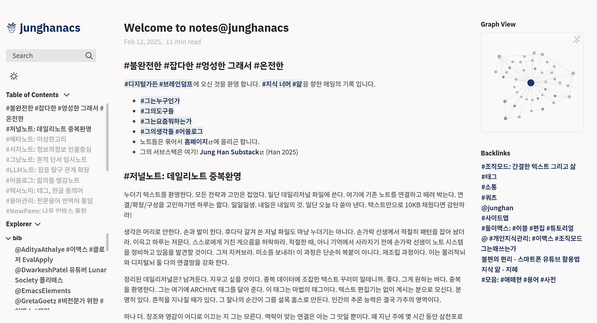 홈페이지: 재현 가능한 동적 대시보드 - 메타 양식 -코드 문서 (junghanacs 2024) <https://junghanacs.com/> - [2025-06-14 Sat 19:04] 바빠서 홈페이지는 기능 검증만 함. 올해 바꿔야지 - [2025-03-13 Thu 10:50] 다이나믹 온라인 퍼블리싱 시스템으로 대규모 변경 할 예정. 출판의 미래를 담아. 살짝 예고하자면 Quarto로 갈꺼야(이미 만들어놓았다 - 첨부) 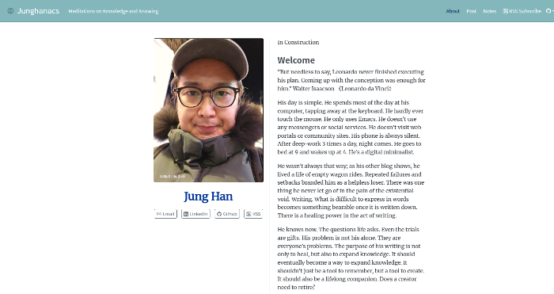 RSS 뉴스피드 뉴스레터 - 저의 페디버스 라이브 소식 RSS <https://fosstodon.org/junghanacs.rss> - 디지털가든 새로운 노트 RSS <https://notes.junghanacs.com/index.xml> 소셜네트워크 `NEW` 페디버스 마스토돈 포스토돈 <https://fosstodon.org/junghanacs> 쓰레드 인스타그램 Threads Instagram (“Threads의 Junghanacs(Junghanacs)님” 2024) <https://www.threads.net/junghanacs> 스레드에서 페디버스 계정을 등록하세요. <https://www.threads.com/fediverse_profile/junghanacsfosstodon.org> 물론, 스레드 자제 계정도 있습니다. <https://www.threads.net/junghanacs> 인스타그램에는 짤을 올립니다. 도구 짤 <https://www.instagram.com/junghanacs/> 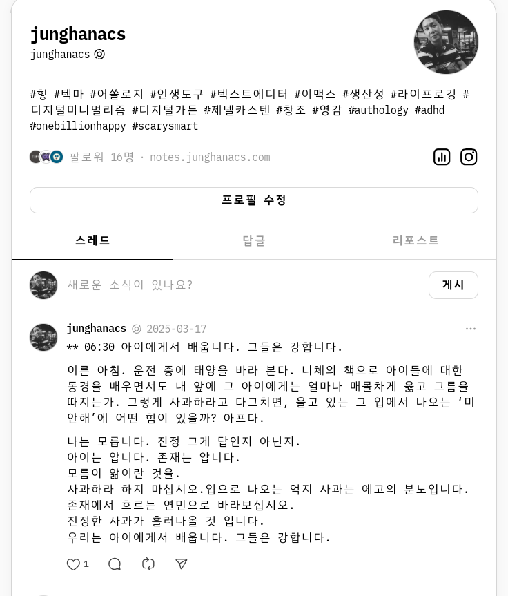 `링크드인` 학계 산업계 지인 인맥 (Junghan Kim n.d.) <https://www.linkedin.com/in/junghan-kim-1489a4306/> - [2025-06-14 Sat 18:56] 구직 했으나 끝이 아닙니다. 찾아주세요! - [2025-03-13 Thu 10:50] 구직 중 구직 중이나 자기 하고 푼 이야기만 싹 발라 놓은 듯. 세상은 넓다! 그의 진심어린 이야기들이 끌린다면 찾아주세요! `깃허브` GITHUB 중독자는 나쁘지 않은 것 같기도 - [2025-06-14 Sat 18:59] 일면식도 없는 깃허브의 고수들의 흔적 탐험 - [2025-03-13 Thu 10:50] 세상에 근사한 지식 노트 관리 리포를 찾아 헤매인다. 오직! 이맥스 인공지능 지식관리 뿐. 지구는 둥글며 세상은 넓다는 것을 깨닫게 해준 곳. 세상에는 비슷한 고민하는 사람이 분명 있다. 그것도 많다는 것. 이맥스 긱들이 세상에 얼마나 될까? 1000명은 확인했다. 일일이 다 찾아서 들어가 봤으니까! github/junghan0611 (“Github/Junghan0611 Your Stars” n.d.) <https://github.com/junghan0611> 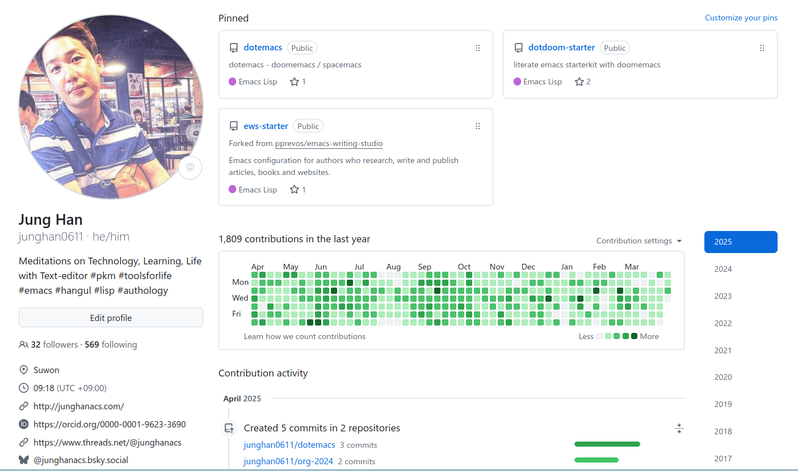 github/junghanacs (“Github/Junghanacs - Github Overview” n.d.) <https://github.com/junghanacs> 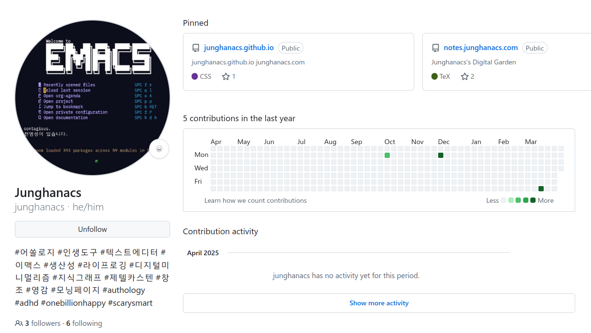 예스24 사락 `독서노트` 전자책 메모는 자동으로 여기에 (junghanacs n.d.-d) junghanacs의 사락 독서모임 독서노트 마치 사락이란 독서 메모 감옥에 갇혀 있다. <https://sarak.yes24.com/blog/junghanacs> 사락 스크린샷 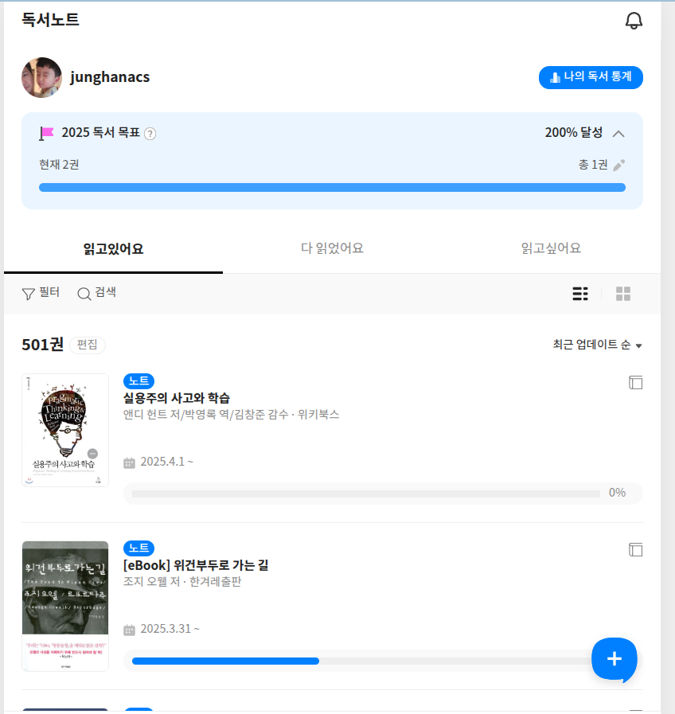 독서모임 개설 [힣: 사락 독서 모임 - 책과 삶](https://wikidocs.net/381666)

## 조테로 온라인 서재 - 한국십진분류 활용. 나름 엄선 된 컬렉션

(김정한, n.d.)

그가 조테로 가지고 노는거 보면 그에게 빠진다. 이건 반칙이다.

<https://www.zotero.org/groups/5570207/junghanacs/library>

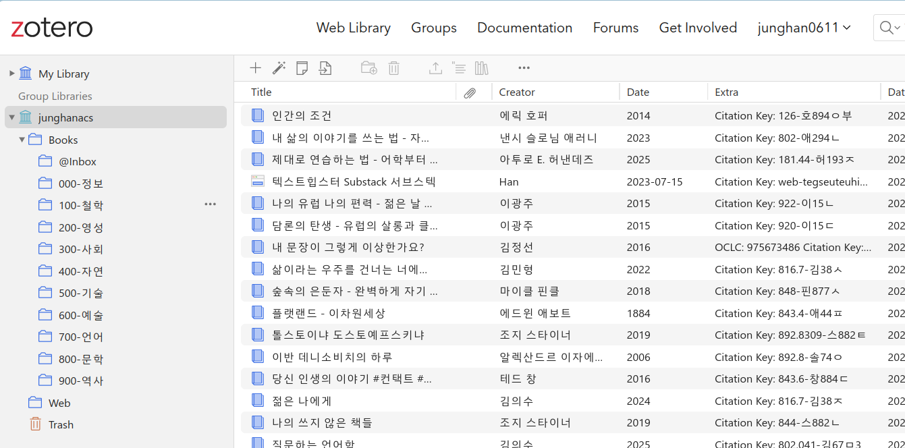

## #모음: 그 밖에 이것 저것 전체 링크

(“Junghanacs - Allmylinks” 2025)

그 외에 링크 더 많은데 지면 관계상 줄임 여기 더 있음

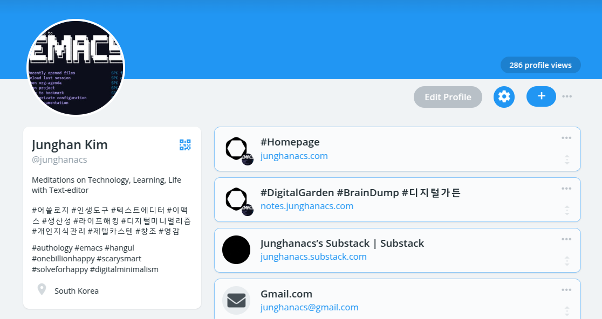

<https://allmylinks.com/junghanacs>

## BIBLIOGRAPHY

  김정한. n.d. “조테로 그룹 라이브러리 Junghanacs.” [https://www.zotero.org/groups/5570207/junghanacs/library](https://www.zotero.org/groups/5570207/junghanacs/library).
  “아무도 읽지 않는 공지 - 그를 찾아 떠나자.” 2025. March 11, 2025. [https://living-with-adhd.tistory.com/notice/258](https://living-with-adhd.tistory.com/notice/258).
  “Github/Junghan0611 Your Stars.” n.d. Accessed November 15, 2024. [https://github.com/junghan0611?tab=stars](https://github.com/junghan0611?tab=stars).
  “Github/Junghanacs - Github Overview.” n.d. Accessed April 1, 2025. [https://github.com/junghanacs](https://github.com/junghanacs).
  Junghan. n.d. “Home: Digital Garden🏡.” Accessed April 1, 2025. [https://notes.junghanacs.com/](https://notes.junghanacs.com/).
  junghanacs. 2024. “Authology@Junghanacs.” 2024. [https://www.junghanacs.com/](https://www.junghanacs.com/).
  ———. n.d.-a. “불타는심장의 브런치스토리.” Accessed September 22, 2024. [https://brunch.co.kr/@16d108993bd8479](https://brunch.co.kr/@16d108993bd8479).
  ———. n.d.-b. “어쏠로지 라이프 : 네이버 블로그.” Accessed September 22, 2024. [https://blog.naver.com/junghanacs](https://blog.naver.com/junghanacs).
  ———. n.d.-c. “성인 Adhd와 함께 하는 삶 : 티스토리.” Accessed September 22, 2024. [https://living-with-adhd.tistory.com](https://living-with-adhd.tistory.com).
  ———. n.d.-d. “Junghanacs의 사락 #독서모임 #독서노트.” Accessed November 21, 2024. [https://sarak.yes24.com/blog/junghanacs](https://sarak.yes24.com/blog/junghanacs).
  “Junghanacs - Allmylinks.” 2025. 2025. [https://allmylinks.com/junghanacs](https://allmylinks.com/junghanacs).
  Junghan Kim. n.d. “Junghan Kim.” Accessed January 16, 2025. [https://www.linkedin.com/in/junghan-kim-1489a4306/](https://www.linkedin.com/in/junghan-kim-1489a4306/).
  “Threads의 Junghanacs(@Junghanacs)님.” 2024. September 18, 2024. [https://www.threads.net/@junghanacs](https://www.threads.net/@junghanacs).

## 현재 조금 조용한 곳

### 블루스카이

-   [2025-06-14 Sat 19:19] 한국에서 사용하긴 용도가 적절치 않아보임

<https://bsky.app/profile/junghanacs.bsky.social>

### 엑스(트위터)

-   [2025-06-14 Sat 19:18] 광고가 너무 많아서...

<https://x.com/junghanacs>

### 티스토리

(junghanacs n.d.-c)

성인 ADHD와 함께 하는 삶 영끌해서 진리를 따라. 돈 따라 살 생각은 내려 놓고, 의미있는 삶!에 대한 탐구를 시작하게 해준 이곳! ADHD가 선물이었음을 자각하게 해준 곳. 옛날글은 다 내려야 하지만 그냥 추억으로 남아. 참고로 찬물 목욕 안하구요. 영양제는 오메가3. 멀티 비타민 드문드문 먹어요.

<https://living-with-adhd.tistory.com/>

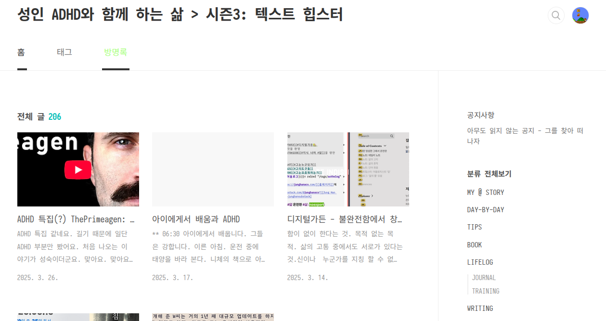

### 네이버 블로그: 어쏠로지 라이프 : 네이버 블로그

(junghanacs n.d.-b)

아무도 찾지 않기에 글을 더 퍼날라야 한다! 본인이 포털에 안들어간지 몇 년 되서 거참 네이버에 글쓰기가 미안하다.  근데 알아두어야 할 게 있어. 네이버 블로그야. 편집기 그렇게 딱딱하게 해놓으면 어떻하니. 복붙하기 힘들게!

<https://blog.naver.com/junghanacs>

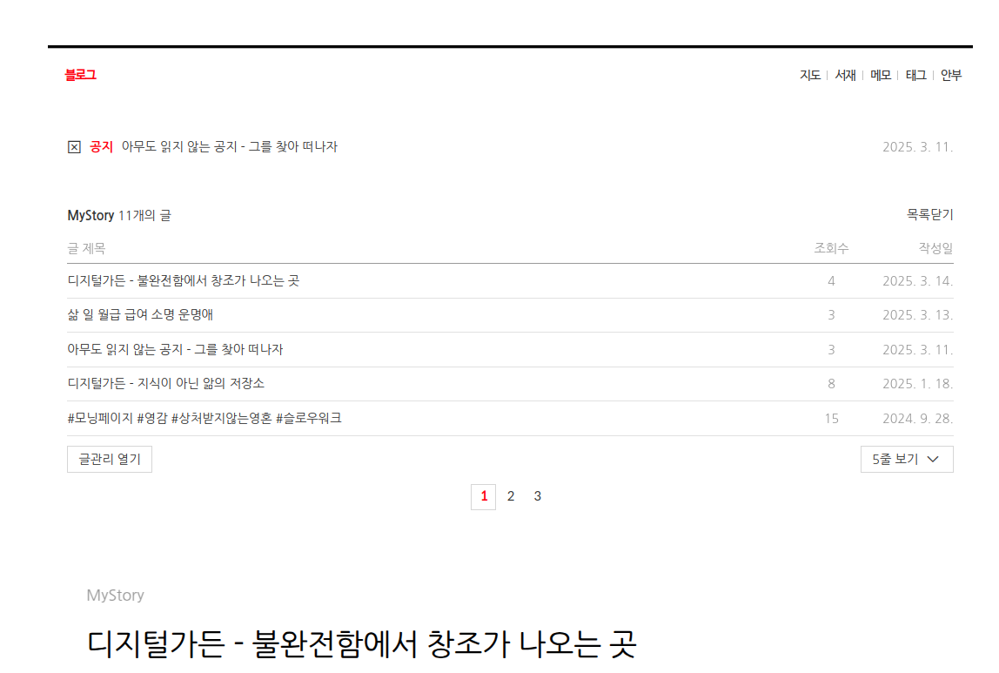

## 아카이브

### 카카오 브런치

-   [#카카오 브런치 스토리 작가 - 연재하기]

카카오 브런치는 없다. 한번 신청했다가 혼났다(ADHD스럽게 과한 말이 나온다). 섭섭했다. 그럼에도 사랑한다 브런치야. 다시 신청 하려고 하는데 꾸준히 글을 남긴 곳을 보여달라는데 그런 곳이 마땅치 않아.

#### 불타는심장의 브런치스토리

(junghanacs n.d.-a)

-   junghanacs
-   어쏠로지 라이프: 인생 도구
    
    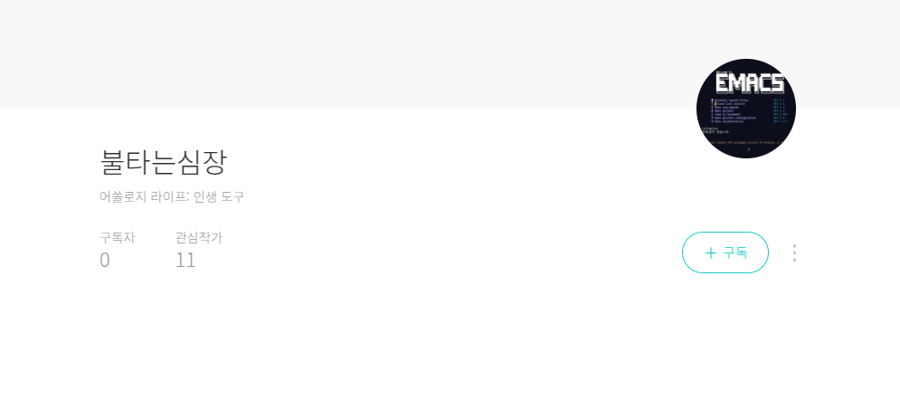

### DONT 아무도 안 읽음을 즐긴다 - 데일리 저널이 담기는 곳 - 서브스택

### 뉴스레터 - 텍스트 힙스터를 위한 가이드 - 서브스택

## DONE 20250614T181721-follow-fosstodon-on-threads

![[../images/20250614T181721-follow-fosstodon-on-threads.png|320]]
